# Раздел II: Архитектура и основные принципы работы


*Упрощённая блок-схема основных функциональных устройств БЭСМ-6*


*Стойка управления БЭСМ-6 с блоками функциональных устройств*

---

## 2.1. Общая структура: конвейерная архитектура

### 2.1.1. Принцип «водопровода»

БЭСМ-6 стала одной из первых в мире ЭВМ, реализовавших **конвейерную (конвейерную) архитектуру** — принцип, при котором выполнение команды разбивается на несколько последовательных этапов, и различные этапы разных команд выполняются параллельно. Этот принцип, известный сегодня как RISC-конвейер, был реализован в БЭСМ-6 за два десятилетия до появления первых коммерческих RISC-процессоров.

В БЭСМ-6 было реализовано **5 специализированных функциональных устройств**, работающих параллельно:

1. **Устройство управления (УУ)** — выборка команд, дешифрация, формирование адресов;
2. **Устройство выборки (УВ)** — обращение к оперативной памяти для чтения операндов;
3. **Арифметическое устройство аддитивное (АУ-А)** — сложение, вычитание, логические операции;
4. **Арифметическое устройство мультипликативное (АУ-М)** — умножение, деление, сдвиги;
5. **Устройство записи (УЗ)** — запись результатов в оперативную память.


*Схема конвейерной обработки: 5 ступеней выполняются параллельно для разных команд*

Каждое устройство имело собственный **входной буфер** (FIFO) на несколько команд, что позволяло сглаживать неравномерность загрузки. УУ выбирало команды из памяти с опережением и распределяло их по буферам исполнительных устройств.

### 2.1.2. Специализация функциональных устройств

Ключевая особенность архитектуры БЭСМ-6 — **жёсткая специализация** функциональных устройств. Каждое устройство может выполнять только определённый набор операций:

| Устройство | Выполняемые операции | Время выполнения | Размер буфера |
|------------|---------------------|------------------|---------------|
| УУ (управление) | Выборка, дешифрация, модификация адреса | 1 такт (100 нс) | 4 команды |
| УВ (выборка) | Чтение из ОЗУ | 2 такта (200 нс) | 2 команды |
| АУ-А (аддитивное) | Сложение, вычитание, логические операции | 1-2 такта | 2 команды |
| АУ-М (мультипликативное) | Умножение, деление, сдвиги | 4-12 тактов | 1 команда |
| УЗ (запись) | Запись в ОЗУ | 2 такта (200 нс) | 2 команды |

Такая специализация позволяла достичь высокой производительности: при оптимальной организации программы конвейер выдавал результат практически каждый такт. Пиковая производительность составляла **до 1 млн операций/с** (1 MFLOPS), что было выдающимся показателем для середины 1960-х годов.

### 2.1.3. Конфликты в конвейере и их разрешение

Как и в современных процессорах, в конвейере БЭСМ-6 возникали конфликты трёх типов:

#### Конфликты по данным (Data Hazards)

Возникают, когда следующая команда использует результат предыдущей, но он ещё не готов. В БЭСМ-6 не было аппаратного пересылания данных (forwarding), поэтому программист должен был явно вставлять «холостые» команды или переставлять команды местами.

**Пример конфликта по данным:**
```asm
СЧ    X         * A := X (загрузка — 2 такта)
СЛ    Y         * A := A + Y (конфликт! X ещё не загружен)
```

**Решение:** вставка независимой команды между ними:
```asm
СЧ    X         * A := X
УИА   М20       * установка индекс-регистра (независимая операция)
СЛ    Y         * A := A + Y (X уже загружен)
```

#### Конфликты по управлению (Control Hazards)

Возникают при условных переходах — конвейер уже выбрал следующие команды, но переход может их аннулировать. В БЭСМ-6 использовалась **аппаратная блокировка конвейера** на время вычисления адреса перехода, что приводило к потере 2-3 тактов.

#### Конфликты по ресурсам (Structural Hazards)

Возникают, когда два устройства пытаются одновременно обратиться к памяти. Для их разрешения использовалось **расслоение памяти** (4 независимых банка) и арбитраж доступа.

### 2.1.4. Тактирование и синхронизация

БЭСМ-6 работала на тактовой частоте **10 МГц** (период такта 100 нс). Синхронизация осуществлялась центральным генератором тактовых импульсов, который распределял синхросигналы по всем стойкам машины. Из-за большой физической длины кабелей (до 15 метров между стойками) синхронизация представляла серьёзную инженерную задачу — требовалось компенсировать задержки распространения сигналов.

---

## 2.2. Система памяти

### 2.2.1. Иерархическая структура памяти

Память БЭСМ-6 была организована иерархически, что обеспечивало баланс между скоростью, объёмом и стоимостью:


*Иерархия запоминающих устройств БЭСМ-6: от сверхбыстрых регистров до магнитных лент*

**Полная иерархия памяти БЭСМ-6:**

| Уровень | Тип | Ёмкость | Время доступа | Технология |
|---------|-----|---------|---------------|------------|
| L0 | Регистры процессора (A, Y, R, C, K) | 5 × 48 бит | 0.1 мкс | Триггеры на транзисторах |
| L1 | Индекс-регистры (I₀–I₁₅) | 16 × 15 бит | 0.1 мкс | Триггеры на транзисторах |
| L2 | Ассоциативная память (кэш) | 16 × 48 бит | 0.2 мкс | Быстрые триггеры |
| L3 | Оперативная память (ОЗУ) | 16K–64K × 48 бит | 2 мкс | Ферритовые сердечники |
| L4 | Магнитные барабаны (НМБ) | 50K–500K слов | 10–20 мс | Магнитное покрытие |
| L5 | Магнитные диски (НМД) | 5–50 Мбайт | 30–100 мс | Магнитные пластины |
| L6 | Магнитные ленты (НМЛ) | до 50 Мбайт/катушка | секунды–минуты | Магнитная лента |


*Плата ферритовой оперативной памяти БЭСМ-6 — матрица ферритовых сердечников*

### 2.2.2. Оперативная память (ОЗУ)

Оперативная память БЭСМ-6 строилась на **ферритовых сердечниках** (ферритовая память). Основные характеристики:

- **Разрядность**: 48 бит + 1 бит контроля чётности;
- **Ёмкость**: от 16K до 64K 48-битных слов (в разных модификациях);
- **Время цикла**: 2 мкс (чтение или запись);
- **Расслоение (interleaving)**: память делилась на 4 независимых модуля (банка), что позволяло одновременно выполнять до 4 обращений.

**Принцип расслоения**: последовательные ячейки памяти располагались в разных банках:

| Адрес (дес.) | Адрес (восьм.) | Банк | Смещение в банке |
|-------------|----------------|------|------------------|
| 0 | 00000 | 0 | 00000 |
| 1 | 00001 | 1 | 00001 |
| 2 | 00002 | 2 | 00002 |
| 3 | 00003 | 3 | 00003 |
| 4 | 00004 | 0 | 00004 |
| 5 | 00005 | 1 | 00005 |
| ... | ... | ... | ... |

Это позволяло конвейеру обращаться к памяти практически каждый такт, не дожидаясь завершения цикла предыдущего обращения. Если программа обращалась к последовательным адресам, каждый банк успевал завершить цикл (2 мкс) до следующего обращения к нему.

**Временная диаграмма работы расслоения (Mermaid):**

```mermaid
gantt
    title Расслоение памяти БЭСМ-6 — временная диаграмма
    dateFormat  SSS
    axisFormat %L
    Банк 0 :a0, 000, 2
    Банк 0 :a1, 004, 2
    Банк 1 :b0, 001, 2
    Банк 1 :b1, 005, 2
    Банк 2 :c0, 002, 2
    Банк 2 :c1, 006, 2
    Банк 3 :d0, 003, 2
    Банк 3 :d1, 007, 2
```



*Каждый банк выполняет чтение за 2 такта (200 нс). Благодаря сдвигу стартовых моментов, конвейер может обращаться к памяти каждый такт.*

Каждый банк имел собственный дешифратор адреса, усилители чтения и записи. Физически банки размещались на отдельных платах в стойке памяти.

### 2.2.3. Виртуальная (математическая) память

БЭСМ-6 была одной из первых ЭВМ, реализовавших **виртуальную память** (в советской терминологии — «математическая память»). Механизм работал следующим образом:

- Программа оперировала **виртуальными адресами** (15-битными);
- Аппаратный блок преобразования адресов (БПА) транслировал их в **физические адреса**;
- Преобразование выполнялось с помощью **страничной организации**: виртуальное адресное пространство делилось на страницы по 64 слова;
- Каждой странице сопоставлялся **регистр преобразования адреса (РПА)**, хранящий номер физической страницы.

**Детальный алгоритм преобразования виртуального адреса:**

1. 15-битный виртуальный адрес делится на две части:
   - **Номер виртуальной страницы** (старшие 9 бит, разряды 14–6) — 512 возможных страниц;
   - **Смещение внутри страницы** (младшие 6 бит, разряды 5–0) — 64 слова на страницу.
2. Номер виртуальной страницы используется как индекс в таблице РПА (512 регистров).
3. РПА содержит:
   - **Номер физической страницы** (9 бит);
   - **Признак присутствия** (1 бит) — находится ли страница в ОЗУ;
   - **Признак модификации** (1 бит) — была ли страница изменена;
   - **Признак обращения** (1 бит) — было ли обращение к странице.
4. Если страница присутствует в ОЗУ, физический адрес формируется как `(номер_физ_страницы << 6) | смещение`.
5. Если страница отсутствует — возникает прерывание «отсутствие страницы», и ОС загружает её с диска или барабана.

**Пример преобразования:**
```
Виртуальный адрес: 01234 (восьмеричный)
  = 000 001 010 011 100 (двоичный)
  Номер страницы: 000001010 = 012 (восьмеричный) = 10 (десятичный)
  Смещение: 011100 = 34 (восьмеричный) = 28 (десятичный)

РПА[10] = { физ_страница = 037, присутствует = да }

Физический адрес = (037 << 6) | 034 = 03700 | 034 = 03734 (восьмеричный)
```

### 2.2.4. Ассоциативная память (сверхбыстрые регистры)

Для ускорения доступа к часто используемым данным в БЭСМ-6 использовалась **ассоциативная память** (в современной терминологии — кэш). Она представляла собой набор из 16 сверхбыстрых регистров, каждый из которых мог хранить:

- **Адрес** (тег) — виртуальный адрес слова (15 бит);
- **Данные** — 48-битное значение;
- **Признак занятости** (1 бит).

Обращение к ассоциативной памяти выполнялось за 0.2 мкс — в 10 раз быстрее, чем к основной ОЗУ. Если требуемое слово находилось в ассоциативной памяти (cache hit), обращение к ОЗУ не производилось.

**Алгоритм работы ассоциативной памяти:**

1. При каждом обращении к памяти виртуальный адрес одновременно подаётся на ассоциативную память и на БПА.
2. Ассоциативная память сравнивает адрес со всеми 16 тегами параллельно (ассоциативный поиск).
3. Если совпадение найдено (hit) — данные из соответствующего регистра выдаются за 0.2 мкс.
4. Если совпадения нет (miss) — данные читаются из ОЗУ (2 мкс) и, если есть свободный регистр, кэшируются.

**Эффективность:** при правильной организации программы ассоциативная память обеспечивала hit rate до 80-90%, что давало значительный прирост производительности.

---

## 2.3. Система прерываний и режимы работы

### 2.3.1. Режимы пользователя и супервизора

БЭСМ-6 поддерживала **два режима работы**:

- **Режим пользователя** — ограниченный набор команд, запрет на прямую работу с периферией;
- **Режим супервизора** — полный доступ ко всем ресурсам, выполнение привилегированных команд.

Переключение между режимами осуществлялось через **систему прерываний** и **экстракоды** (программные прерывания). В режиме пользователя были запрещены следующие операции:
- Команда `рег` (обращение к специальным регистрам);
- Команда `увв` (управление вводом-выводом);
- Изменение регистра C (базовый адрес) и регистра границы;
- Изменение таблицы РПА (страничное преобразование).

### 2.3.2. Система прерываний

Система прерываний БЭСМ-6 включала следующие типы:

| Тип прерывания | Причина | Обработка | Приоритет |
|----------------|---------|-----------|-----------|
| Внешнее | Сигнал от периферийного устройства | Переход к подпрограмме обработки | 1 (высший) |
| Внутреннее | Ошибка (деление на ноль, переполнение) | Аварийное завершение или коррекция | 2 |
| Программное | Экстракод (системный вызов) | Переход в режим супервизора | 3 |
| По вводу-выводу | Завершение операции ввода-вывода | Продолжение выполнения программы | 4 |

**Механизм обработки прерывания:**

1. Устройство выставляет сигнал прерывания на шину.
2. УУ завершает текущую команду и сохраняет контекст:
   - Счётчик команд K → стек прерываний;
   - Регистр режима R → стек прерываний;
   - Регистр C (базовый) → стек прерываний.
3. УУ определяет вектор прерывания (адрес обработчика).
4. Производится переключение в режим супервизора.
5. Управление передаётся обработчику прерывания.
6. После завершения обработки выполняется инструкция возврата, восстанавливающая контекст.

**Векторная таблица прерываний** располагалась в фиксированных ячейках памяти (адреса 00000–00037 в восьмеричной системе). Каждому типу прерывания соответствовал свой вектор — адрес обработчика.

### 2.3.3. Защита памяти

Защита памяти в БЭСМ-6 реализовывалась на аппаратном уровне:

- Каждой программе выделялась **зона памяти**, задаваемая базовым регистром C и регистром границы;
- Попытка обращения за пределы выделенной зоны вызывала прерывание;
- В режиме пользователя запрещалось изменять регистры защиты.

**Механизм проверки защиты:**

1. При каждом обращении к памяти исполнительный адрес сравнивается с регистром границы.
2. Если адрес ≥ границы — генерируется прерывание «нарушение защиты».
3. Если адрес < границы — к адресу прибавляется базовый регистр C, формируя физический адрес.

Этот механизм позволял реализовать **релокацию программ** — загрузку в произвольную область памяти без модификации кода.

---

## 2.4. Элементная база и конструкция (ТЭЗы)

### 2.4.1. Транзисторно-диодная логика

БЭСМ-6 была построена на **дискретных полупроводниковых элементах** — транзисторах и диодах. Интегральные микросхемы в то время ещё не были доступны. Основные характеристики элементной базы:

- **Транзисторы**: германиевые (типа П-401, П-402, П-403);
- **Диоды**: кремниевые (типа Д-219, Д-220);
- **Логические элементы**: диодно-транзисторная логика (ДТЛ);
- **Тактовая частота**: 10 МГц (период такта 100 нс).

**Базовые логические элементы ДТЛ:**

| Элемент | Состав | Задержка | Применение |
|---------|--------|----------|------------|
| 2И-НЕ | 2 диода + транзистор | ~30 нс | Универсальный логический элемент |
| 3И-НЕ | 3 диода + транзистор | ~35 нс | Расширенная логика |
| Триггер RS | 2 × 2И-НЕ | ~50 нс | Хранение бита |
| Триггер D | 6 × 2И-НЕ | ~80 нс | Регистры и счётчики |

### 2.4.2. Типовые Элементы Замены (ТЭЗы)

Конструктивно БЭСМ-6 была выполнена в виде **ТЭЗов** — Типовых Элементов Замены. Каждый ТЭЗ представлял собой печатную плату размером примерно 130×80 мм с установленными на ней электронными компонентами.


*Типовой элемент замены (ТЭЗ) БЭСМ-6 с транзисторно-диодными логическими элементами*


*Стойка БЭСМ-6 с установленными ТЭЗами — вид на монтажное пространство*

**Характеристики ТЭЗов:**

| Параметр | Значение |
|----------|----------|
| Размер платы | 130×80 мм |
| Количество транзисторов | 10-30 шт. |
| Количество диодов | 20-60 шт. |
| Количество резисторов | 30-80 шт. |
| Разъём | 2×22 контакта |
| Потребляемая мощность | 2-5 Вт |
| Масса | ~150 г |

**Каталог основных типов ТЭЗов (всего ~200 типов):**

| Тип ТЭЗа | Назначение | Количество в БЭСМ-6 |
|----------|------------|-------------------|
| ТЭЗ-1 | Логический элемент 2И-НЕ | ~2000 |
| ТЭЗ-2 | Логический элемент 3И-НЕ | ~500 |
| ТЭЗ-3 | RS-триггер | ~1000 |
| ТЭЗ-4 | D-триггер | ~800 |
| ТЭЗ-5 | Усилитель сигнала | ~400 |
| ТЭЗ-6 | Формирователь импульсов | ~300 |
| ТЭЗ-7 | Счётчик | ~200 |
| ТЭЗ-8 | Регистр | ~300 |
| ТЭЗ-9 | Дешифратор | ~150 |
| ТЭЗ-10 | Сумматор | ~100 |

Всего в БЭСМ-6 использовалось около **200 типов ТЭЗов**, общее количество — **несколько тысяч штук**. Каждый ТЭЗ имел уникальный номер и цветовую маркировку для облегчения идентификации и замены.

### 2.4.3. Компоновка и охлаждение

БЭСМ-6 размещалась в нескольких металлических шкафах (стойках):

- **Стойка управления** — устройство управления и арифметические устройства;
- **Стойка памяти** — оперативная память и блоки преобразования адресов;
- **Стойки периферии** — контроллеры внешних устройств.

**Габариты и вес:**

| Стойка | Размеры (В×Ш×Г) | Вес |
|--------|-----------------|-----|
| Стойка управления | 200×80×80 см | ~500 кг |
| Стойка памяти | 200×80×80 см | ~400 кг |
| Стойка периферии | 200×80×80 см | ~300 кг |
| Пульт оператора | 120×150×80 см | ~200 кг |

Общее энергопотребление машины составляло около **30-40 кВт**. Для отвода тепла использовалось принудительное воздушное охлаждение:

- **Вентиляторы**: осевые, диаметр 300 мм, 2-3 на стойку;
- **Воздушный поток**: ~5000 м³/ч на стойку;
- **Температура внутри стоек**: 35-45°C при комнатной температуре 20°C;
- **Система фильтрации**: сменные фильтры на воздухозаборниках.

Для особо теплонагруженных элементов (выходные усилители, мощные транзисторы) использовались индивидуальные радиаторы.

### 2.4.4. Система электропитания

БЭСМ-6 требовала стабилизированного электропитания:

| Напряжение | Назначение | Ток |
|------------|------------|-----|
| +5 В | Логические элементы (транзисторы) | ~200 А |
| +12 В | Промежуточные усилители | ~50 А |
| -12 В | Смещение для транзисторов | ~20 А |
| +24 В | Реле и индикаторы | ~10 А |
| ~220 В | Вентиляторы | ~15 А |

Питание осуществлялось от специальных выпрямителей и стабилизаторов, размещённых в отдельных шкафах. Для обеспечения бесперебойной работы использовались мотор-генераторы, сглаживающие перепады напряжения в сети.

---

## Ключевые выводы раздела

1. БЭСМ-6 использовала конвейерную архитектуру с 5 специализированными функциональными устройствами, работающими параллельно, что обеспечивало пиковую производительность до 1 MFLOPS.
2. Система памяти была иерархической: сверхбыстрые регистры (L0-L1) → ассоциативная память (L2, 0.2 мкс) → расслоённое ОЗУ на ферритовых сердечниках (L3, 2 мкс) → внешние ЗУ (L4-L6).
3. БЭСМ-6 одной из первых в мире реализовала виртуальную память с аппаратным преобразованием адресов через страничную организацию (512 страниц по 64 слова).
4. Машина поддерживала два режима работы (пользователь/супервизор) с аппаратной защитой памяти через базовый регистр C и регистр границы.
5. Система прерываний включала 4 типа с векторной обработкой и 8 уровнями приоритета.
6. Конструктивно БЭСМ-6 была выполнена на ТЭЗах — типовых элементах замены на дискретных полупроводниках (~200 типов, несколько тысяч штук).
7. Энергопотребление составляло 30-40 кВт, охлаждение — принудительное воздушное с системой фильтрации.

---

**Далее:** [Раздел III: Программная модель и система команд](03-instruction-set.md)