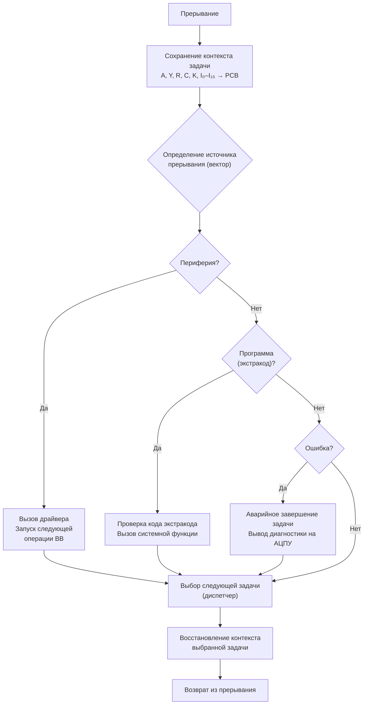
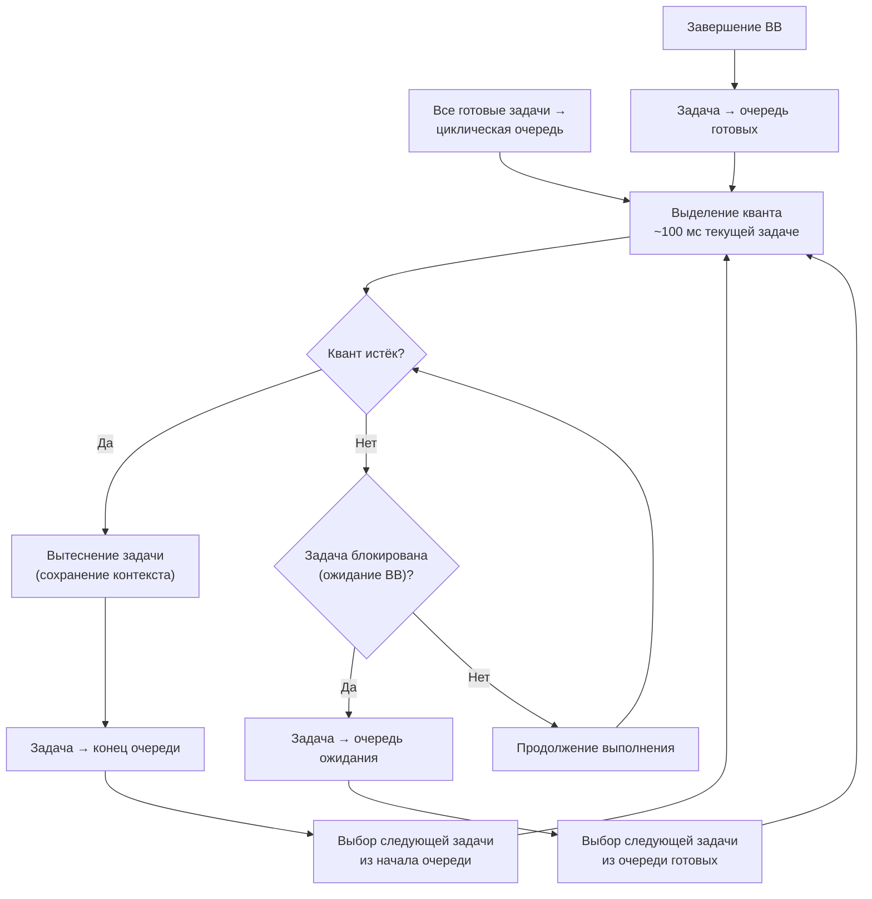
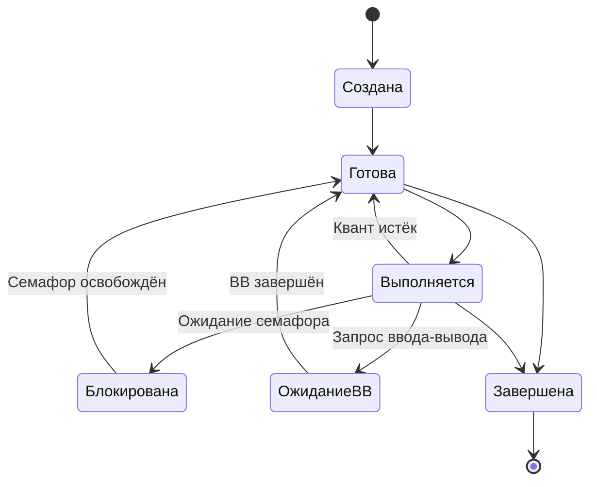
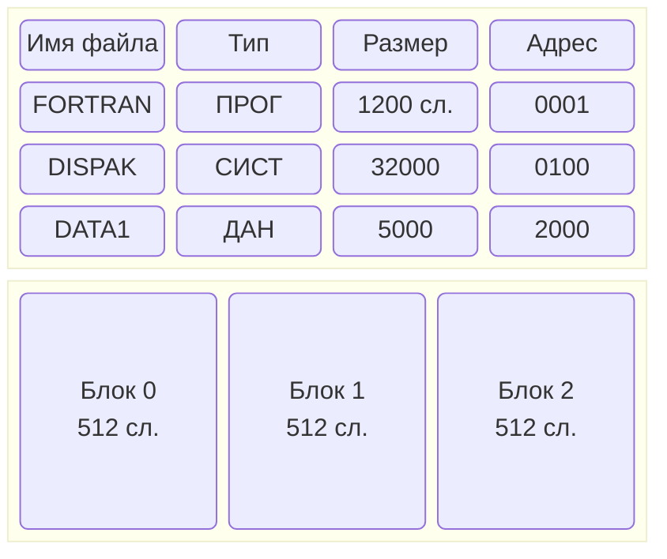
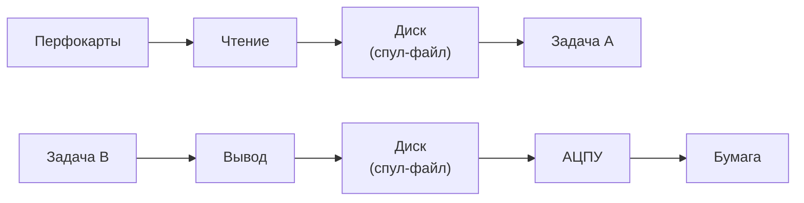
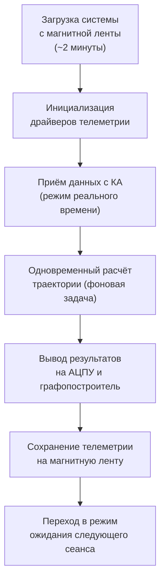

# Раздел V: Операционные системы


*Загрузочная магнитная лента операционной системы ДИСПАК для БЭСМ-6*


*Терминал оператора системы ДИСПАК — диалоговый режим работы*

---

## 5.1. Мониторная система «Дубна»

### 5.1.1. Исторический контекст

Мониторная система **«Дубна»** была разработана в Объединённом институте ядерных исследований (ОИЯИ, г. Дубна) в конце 1960-х годов. Она стала первой операционной системой для БЭСМ-6 и заложила основы для последующих разработок.

### 5.1.2. Основные характеристики

| Характеристика | Описание |
|----------------|----------|
| Тип | Мониторная система (пакетный режим) |
| Разработчик | ОИЯИ (Дубна) |
| Год выпуска | 1968 |
| Режимы работы | Пакетный |
| Управление заданиями | JCL (Job Control Language) |
| Файловая система | Ленточная (магнитные ленты) |

### 5.1.3. Архитектура «Дубны»

Система «Дубна» состояла из следующих компонентов:

- **Монитор** — управляющая программа, загружаемая в память при старте системы;
- **Диспетчер заданий** — чтение и интерпретация управляющих карт;
- **Подсистема ввода-вывода** — драйверы периферийных устройств;
- **Загрузчик** — загрузка программ с магнитных лент и перфокарт.

**Пример JCL для системы «Дубна»:**

```
* ЗАДАНИЕ: ТРАНСЛЯЦИЯ ФОРТРАН-ПРОГРАММЫ
ЗАДАЧА FTN
  ТРАНСЛЯТОР=ФОРТРАН-ДУБНА
  ВХОД=ПЕРФОЛЕНТА
  ВЫХОД=МЛ(1)
  ПУСК
КОНЕЦ
```

### 5.1.4. Ограничения «Дубны»

- Отсутствие разделения времени;
- Нет защиты памяти между задачами;
- Примитивная файловая система;
- Отсутствие диалогового режима.

Несмотря на эти ограничения, «Дубна» успешно эксплуатировалась в ОИЯИ и ряде других организаций до середины 1970-х годов.

---

## 5.2. Операционная система ДИСПАК

### 5.2.1. История создания

**ДИСПАК** (Диспетчер пакетов) — наиболее распространённая и функционально развитая операционная система для БЭСМ-6. Разработана в Институте прикладной математики (ИПМ) АН СССР под руководством Л.Н. Королёва.

| Дата | Событие |
|------|---------|
| 1970 г. | Начало разработки |
| 1972 г. | Первая рабочая версия |
| 1974 г. | Версия 2.0 — поддержка мультипрограммирования |
| 1976 г. | Версия 3.0 — файловая система на дисках |
| 1980 г. | Версия 4.0 — поддержка диалогового режима |
| 1985 г. | Последняя версия — стабильная и наиболее функциональная |

### 5.2.2. Архитектура ДИСПАК

ДИСПАК имела модульную архитектуру, включающую следующие основные компоненты:


#### Супервизор

Супервизор — ядро операционной системы, работающее в привилегированном режиме. Функции:

- Обработка прерываний (внешних, внутренних, программных);
- Переключение контекста задач;
- Управление памятью (выделение и освобождение страниц);
- Диспетчеризация процессов.

**Алгоритм обработки прерывания в супервизоре:**



#### Диспетчер задач

Диспетчер задач реализовывал:

- **Мультипрограммирование** — одновременное выполнение до 4 задач;
- **Планирование** — алгоритм циклического планирования (round-robin);
- **Синхронизацию** — семафоры и события;
- **Управление приоритетами** — до 8 уровней приоритета.

**Алгоритм циклического планирования (Round-Robin):**



**Состояния задачи в ДИСПАК:**



#### Файловая система

Файловая система ДИСПАК поддерживала:

- **Ленточные файлы** — последовательные файлы на магнитных лентах;
- **Дисковые файлы** — прямого доступа на магнитных дисках (в версиях 3.0+);
- **Иерархическую структуру** — каталоги и подкаталоги;
- **Защиту файлов** — права доступа (чтение, запись, выполнение).

**Структура дискового файла в ДИСПАК:**



### 5.2.3. Управление заданиями (JCL)

ДИСПАК использовала язык управления заданиями (JCL) для описания последовательности действий.

**Пример JCL — трансляция и выполнение Фортрана:**

```jcl
* ЗАДАНИЕ: ТРАНСЛЯЦИЯ И ВЫПОЛНЕНИЕ ФОРТРАН-ПРОГРАММЫ
ЗАДАЧА ТРАНСЛЯЦИЯ
  ФАЙЛ ИСХОДНИК=ПЕРФОЛЕНТА
  ФАЙЛ ОБЪЕКТ=МЛ(1)
  ТРАНСЛЯТОР ФОРТРАН-ДУБНА
  ВЫПОЛНИТЬ
КОНЕЦ

ЗАДАЧА ВЫПОЛНЕНИЕ
  ФАЙЛ ОБЪЕКТ=МЛ(1)
  ФАЙЛ РЕЗУЛЬТАТ=АЦПУ
  ЗАГРУЗЧИК
  ВЫПОЛНИТЬ
КОНЕЦ
```

**Пример JCL — пакетная обработка данных:**

```jcl
* ЗАДАНИЕ: ОБРАБОТКА ЭКСПЕРИМЕНТАЛЬНЫХ ДАННЫХ
ЗАДАЧА ПОДГОТОВКА
  ФАЙЛ ИСХОДНЫЕ=ПЕРФОЛЕНТА
  ФАЙЛ ПРОМЕЖУТОЧНЫЕ=МЛ(2)
  ПРОГРАММА PREPROC
  ВЫПОЛНИТЬ
КОНЕЦ

ЗАДАЧА РАСЧЁТ
  ФАЙЛ ПРОМЕЖУТОЧНЫЕ=МЛ(2)
  ФАЙЛ РЕЗУЛЬТАТЫ=МЛ(3)
  ПРОГРАММА CALC
  ВЫПОЛНИТЬ
КОНЕЦ

ЗАДАЧА ВЫВОД
  ФАЙЛ РЕЗУЛЬТАТЫ=МЛ(3)
  ФАЙЛ ОТЧЁТ=АЦПУ
  ПРОГРАММА REPORT
  ВЫПОЛНИТЬ
КОНЕЦ
```

### 5.2.4. Подсистема ввода-вывода

Подсистема ввода-вывода ДИСПАК обеспечивала:

- **Буферизацию** — для выравнивания скоростей устройств;
- **Спулинг** — одновременный ввод/вывод с выполнением задач;
- **Драйверы устройств** — модульная система драйверов для всех типов периферии;
- **Асинхронный ввод-вывод** — с использованием системы прерываний.

**Схема работы спулинга в ДИСПАК:**



### 5.2.5. Средства отладки и загрузки

ДИСПАК включала развитые средства отладки:

- **Символический отладчик** — пошаговое выполнение, просмотр регистров;
- **Дамп памяти** — вывод содержимого памяти на АЦПУ;
- **Трассировка** — запись последовательности выполненных команд;
- **Монитор** — наблюдение за выполнением программы в реальном времени.

**Команды отладчика ДИСПАК:**

| Команда | Описание |
|---------|----------|
| `ЗАГРУЗКА <имя>` | Загрузить программу |
| `ПУСК [адрес]` | Начать выполнение |
| `ТОЧКА <адрес>` | Установить точку останова |
| `СНЯТЬ <адрес>` | Снять точку останова |
| `ШАГ` | Выполнить одну команду |
| `РЕГИСТРЫ` | Показать содержимое регистров |
| `ДАМП <адрес> <длина>` | Вывести дамп памяти |
| `ПРОДОЛЖИТЬ` | Продолжить выполнение |
| `ТРАССА <адрес>` | Включить трассировку |
| `ВЫХОД` | Выйти из отладчика |

---

## 5.3. Сравнение с другими ОС

### 5.3.1. Системы ИПМ АН СССР

Помимо ДИСПАК, в ИПМ АН СССР были разработаны и другие операционные системы:

| Система | Год | Особенности |
|---------|-----|-------------|
| ИПМ-1 | 1969 | Экспериментальная, однозадачная |
| ИПМ-2 | 1971 | Мультипрограммная, 2 задачи |
| ИПМ-3 | 1973 | Поддержка диалогового режима |
| ДИСПАК | 1972+ | Наиболее полная и стабильная |

### 5.3.2. Сравнительная таблица ОС для БЭСМ-6

| Характеристика | Дубна | ДИСПАК | ИПМ-2 |
|----------------|-------|---------|-------|
| Мультипрограммирование | Нет | Да (до 4 задач) | Да (2 задачи) |
| Защита памяти | Нет | Да | Частичная |
| Файловая система | Ленточная | Ленточная + дисковая | Ленточная |
| Диалоговый режим | Нет | Да (с версии 4.0) | Нет |
| Символический отладчик | Нет | Да | Ограниченный |
| Поддержка Фортрана | Да | Да | Да |
| Поддержка Алгола | Да | Да | Да |
| Размер ядра (слов) | ~2000 | ~8000 | ~4000 |
| Требуемая память | 16K слов | 32K слов | 16K слов |

---

## 5.4. Роль ДИСПАК в космических программах

ДИСПАК играла ключевую роль в советской космической программе:

- **Обработка телеметрии** — приём и обработка данных с космических аппаратов;
- **Баллистические расчёты** — расчёт траекторий полёта и коррекций;
- **Управление полётами** — расчёт команд управления для ЦУПа;
- **Моделирование** — имитация полётных ситуаций для тренировки экипажей.

**Типовой сеанс работы ДИСПАК в ЦУПе:**



Надёжность ДИСПАК была настолько высокой, что система продолжала использоваться в ЦУПе даже после появления более современных ЭВМ. Известны случаи непрерывной работы ДИСПАК в течение нескольких недель без единого сбоя.

---

## Ключевые выводы раздела

1. Первой ОС для БЭСМ-6 была мониторная система «Дубна» (1968), работавшая в пакетном режиме.
2. ДИСПАК — наиболее развитая ОС для БЭСМ-6, поддерживавшая мультипрограммирование (до 4 задач), файловую систему, диалоговый режим и средства отладки.
3. ДИСПАК имела модульную архитектуру: супервизор, диспетчер задач, файловая система, подсистема ввода-вывода.
4. Система использовала язык управления заданиями (JCL) для описания последовательности работ с поддержкой многошаговых заданий.
5. Диспетчер задач реализовывал циклическое планирование (round-robin) с квантом ~100 мс и 8 уровнями приоритета.
6. ДИСПАК играла ключевую роль в советской космической программе, обеспечивая обработку телеметрии и баллистические расчёты.

---

**Далее:** [Раздел VI: Периферийные устройства и ввод-вывод](06-peripherals.md)