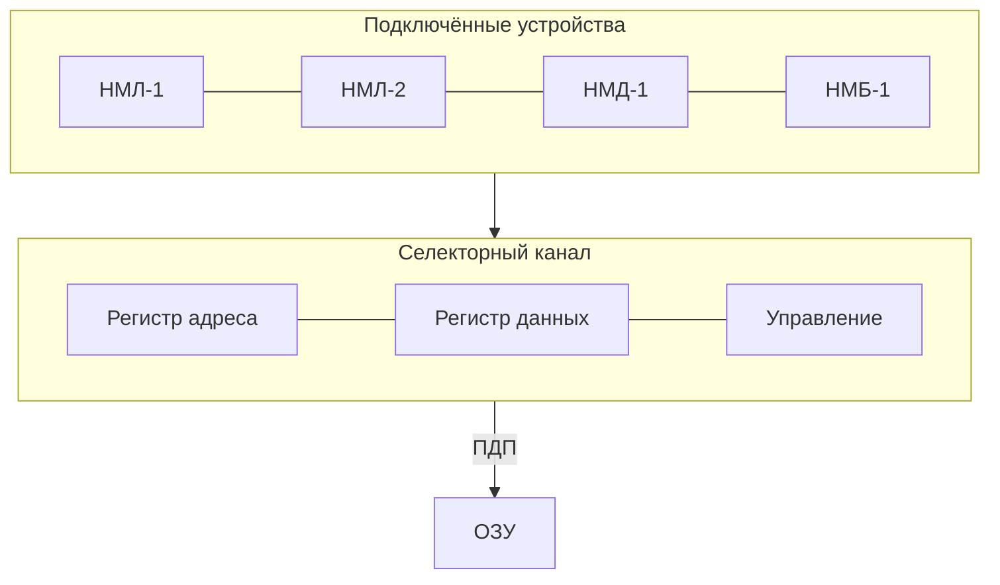
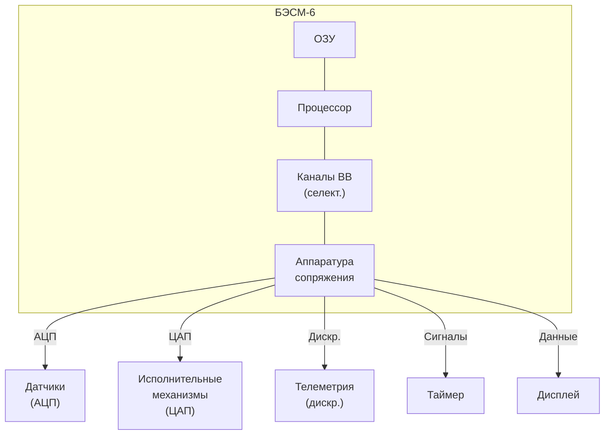

# Раздел VI: Периферийные устройства и ввод-вывод


*Стойки периферийного оборудования БЭСМ-6 — накопители и устройства ввода-вывода*


*Накопитель на магнитной ленте НМЛ-67 — основное устройство долговременного хранения данных*

---

## 6.1. Внешние запоминающие устройства

### 6.1.1. Накопители на магнитных лентах (НМЛ)

Магнитные ленты были основным средством долговременного хранения данных и программ в БЭСМ-6.

**Характеристики типового НМЛ для БЭСМ-6:**

| Параметр | Значение |
|----------|----------|
| Тип | НМЛ-67, НМЛ-70 |
| Ширина ленты | 12,7 мм (0,5 дюйма) |
| Дорожек | 8 (7 данных + 1 контрольная) |
| Плотность записи | 8-32 бит/мм |
| Скорость ленты | 2 м/с |
| Ёмкость катушки | до 50 Мбайт |
| Скорость передачи | до 64 Кбайт/с |
| Время разгона/торможения | ~5 мс |
| Межблочный промежуток | 15-20 мм |

**Режимы работы НМЛ:**

- **Непрерывный** — последовательное чтение/запись всего файла;
- **Старт-стопный** — чтение/запись отдельных блоков с остановками между ними;
- **Поисковый** — позиционирование на заданный блок.

Магнитные ленты использовались для:
- Хранения операционной системы (загрузочная лента);
- Хранения библиотек программ и трансляторов;
- Архивации данных;
- Обмена данными между вычислительными центрами.

### 6.1.2. Накопители на магнитных дисках (НМД)

Магнитные диски появились на БЭСМ-6 в середине 1970-х годов и обеспечили возможность прямого доступа к данным.

**Характеристики НМД для БЭСМ-6:**

| Параметр | Значение |
|----------|----------|
| Тип | НМД-50, НМД-100 |
| Количество поверхностей | 10-20 |
| Количество дорожек на поверхность | 200-400 |
| Ёмкость | 5-50 Мбайт |
| Время доступа (среднее) | 30-100 мс |
| Скорость передачи | до 200 Кбайт/с |
| Скорость вращения | 2400 об/мин |

**Структура дискового накопителя:**


*Схема пакета магнитных дисков НМД-50: пластины, дорожки, блок магнитных головок*

Диски позволили реализовать:
- Файловую систему прямого доступа;
- Быструю загрузку программ;
- Подкачку страниц виртуальной памяти.

### 6.1.3. Накопители на магнитных барабанах (НМБ)

Магнитные барабаны занимали промежуточное положение между ОЗУ и дисками по скорости доступа.

**Характеристики НМБ:**

| Параметр | Значение |
|----------|----------|
| Тип | НМБ-50 |
| Ёмкость | 50-500 Кслов |
| Количество дорожек | 100-200 |
| Время доступа (среднее) | 10-20 мс |
| Скорость передачи | до 500 Кбайт/с |
| Скорость вращения | 6000 об/мин |

Барабаны использовались для:
- Хранения наиболее часто используемых системных программ;
- Буферизации данных при вводе-выводе;
- Реализации свопинга (подкачки) в ранних версиях ОС.

---


*Устройство ввода с перфокарт ПВ-80 — основной способ ввода программ*


*Алфавитно-цифровое печатающее устройство (АЦПУ) — вывод результатов на бумагу*

---

## 6.2. Устройства ввода-вывода

### 6.2.1. Перфокарточные устройства

Перфокарты были основным средством ввода программ и данных.

**Характеристики:**

| Устройство | Назначение | Скорость |
|------------|------------|----------|
| ПВ-80 | Ввод с перфокарт | 80 карт/мин |
| ПВ-200 | Ввод с перфокарт | 200 карт/мин |
| ПЛ-80 | Вывод на перфокарты | 80 карт/мин |

Формат перфокарты: 80 колонок, 12 строк (стандарт IBM). Каждая колонка кодировала один символ в коде ДКОИ (двоичный код обработки информации).

### 6.2.2. Перфоленточные устройства

Перфолента использовалась для ввода-вывода небольших объёмов данных и программ.

**Характеристики:**

| Параметр | Значение |
|----------|----------|
| Тип | ПЛ-150, ПЛ-500 |
| Дорожек | 5 или 8 |
| Скорость ввода | 150-500 символов/с |
| Скорость вывода | 50-100 символов/с |
| Длина ленты в рулоне | до 300 м |

### 6.2.3. Алфавитно-цифровые печатающие устройства (АЦПУ)

АЦПУ были основным средством вывода результатов.

**Характеристики АЦПУ:**

| Параметр | Значение |
|----------|----------|
| Тип | АЦПУ-128, АЦПУ-256 |
| Скорость печати | 300-600 строк/мин |
| Количество символов в строке | 128 или 256 |
| Набор символов | Русские и латинские буквы, цифры, спецзнаки |
| Механизм печати | Молотковый (ударный) |
| Количество копий | до 4 (через копирку) |

### 6.2.4. Графопостроители

Графопостроители использовались для вывода графической информации:

- Двухкоординатные плоттеры (формат А1-А0);
- Шаг: 0.1-0.2 мм;
- Скорость: 50-200 мм/с;
- Тип пера: капиллярный (тушь) или шариковый.

### 6.2.5. Видеотерминалы и дисплеи

В поздних модификациях БЭСМ-6 появились видеотерминалы:

- **ВТ-340** — алфавитно-цифровой терминал (24 строки × 80 символов);
- **Дисплей Д-1** — графический дисплей (векторный, разрешение 1024×1024).

---

## 6.3. Организация каналов ввода-вывода

### 6.3.1. Селекторные и мультиплексный каналы

Ввод-вывод в БЭСМ-6 организовывался через специализированные каналы:

| Тип канала | Количество | Назначение |
|------------|------------|------------|
| Селекторный | 4 | Быстрые устройства (НМЛ, НМД, НМБ) |
| Мультиплексный | 1 | Медленные устройства (перфокарты, АЦПУ, терминалы) |

**Селекторный канал** обеспечивал:
- Подключение одного быстрого устройства в каждый момент времени;
- Скорость передачи до 500 Кбайт/с;
- Прямой доступ к памяти (ПДП).

**Мультиплексный канал** обеспечивал:
- Одновременное обслуживание до 16 медленных устройств;
- Разделение времени канала между устройствами;
- Скорость передачи до 10 Кбайт/с на устройство.

**Структура селекторного канала:**



### 6.3.2. Программно-управляемый обмен

Помимо канального обмена, БЭСМ-6 поддерживала программно-управляемый ввод-вывод:

1. Программа проверяет готовность устройства (команда `увв`);
2. Если устройство готово — выполняет передачу слова;
3. Если не готово — ожидает или переключается на другую задачу.

**Пример программно-управляемого вывода на АЦПУ:**

```asm
* ВЫВОД СЛОВА НА АЦПУ
OUT     УВВ   =0         * ПРОВЕРКА ГОТОВНОСТИ АЦПУ
        РЖ    =0         * АНАЛИЗ ПРИЗНАКОВ
        ПБ    OUT        * ЕСЛИ НЕ ГОТОВ, ПОВТОРИТЬ
        ЗЧ    PRDATA     * ЗАПИСЬ ДАННЫХ В РЕГИСТР АЦПУ
        УВВ   =1         * ЗАПУСК ПЕЧАТИ
        ...
PRDATA  ПАМ   1          * РЕГИСТР ДАННЫХ АЦПУ
```

Этот метод использовался для:
- Работы с нестандартными устройствами;
- Отладки драйверов;
- Систем реального времени.

### 6.3.3. Система прерываний ввода-вывода

Система прерываний БЭСМ-6 поддерживала:

- **Векторные прерывания** — каждое устройство имело свой вектор;
- **Приоритеты** — 8 уровней приоритета;
- **Маскирование** — возможность запрета отдельных прерываний.

**Таблица векторов прерываний:**

| Вектор | Устройство | Приоритет | Адрес обработчика |
|:------:|:-----------|:---------:|:-----------------:|
| 0 | Таймер | 0 (высший) | 00010 |
| 1 | НМЛ-1 | 1 | 00012 |
| 2 | НМЛ-2 | 1 | 00014 |
| 3 | НМД-1 | 1 | 00016 |
| 4 | НМБ-1 | 1 | 00020 |
| 5 | АЦПУ | 2 | 00022 |
| 6 | ПВ-80 | 3 | 00024 |
| 7 | ПЛ-150 | 3 | 00026 |
| 8 | Терминал | 4 | 00030 |
| 9 | Графопостроитель | 4 | 00032 |
| 10-15 | Резерв | — | 00034-00046 |

### 6.3.4. Архитектура драйверов устройств

Драйверы устройств в ДИСПАК имели стандартизированную структуру:


**Протокол передачи данных через канал:**

1. ОС формирует блок управления вводом-выводом (БУВВ), содержащий:
   - Тип операции (чтение/запись/позиционирование);
   - Адрес устройства;
   - Адрес буфера в ОЗУ;
   - Размер передаваемых данных.
2. БУВВ передаётся в канал через команду `увв`.
3. Канал выполняет операцию независимо от процессора (режим ПДП).
4. По завершении операции канал генерирует прерывание.
5. Обработчик прерывания анализирует результат и уведомляет задачу.

---

## 6.4. Системы реального времени и связь с объектами

### 6.4.1. Аппаратура сопряжения

Для подключения БЭСМ-6 к объектам управления использовалась специальная аппаратура сопряжения:

- **АЦП** (аналого-цифровые преобразователи) — для ввода аналоговых сигналов;
- **ЦАП** (цифро-аналоговые преобразователи) — для вывода управляющих сигналов;
- **Дискретный ввод-вывод** — для приёма и выдачи дискретных сигналов;
- **Таймеры реального времени** — для синхронизации с внешними процессами.

**Характеристики аппаратуры сопряжения:**

| Устройство | Параметры | Назначение |
|------------|-----------|------------|
| АЦП-12 | 12 бит, 8 каналов, 10 кГц | Ввод аналоговых сигналов |
| АЦП-14 | 14 бит, 4 канала, 1 кГц | Прецизионные измерения |
| ЦАП-10 | 10 бит, 4 канала | Вывод управляющих сигналов |
| УДС-32 | 32 дискретных входа/выхода | Дискретные сигналы |
| ТС-1 | 6 таймеров, 1 мкс–1 с | Синхронизация |

### 6.4.2. Примеры использования в реальном времени

БЭСМ-6 использовалась в системах реального времени:

- **Центр управления полётами (ЦУП)** — обработка телеметрии, расчёт команд управления;
- **Ядерные реакторы** — мониторинг параметров, управление режимами;
- **Метрологические станции** — сбор и обработка данных с измерительных приборов;
- **Испытательные стенды** — управление испытаниями авиационной и ракетной техники.

**Типовая конфигурация системы реального времени на базе БЭСМ-6:**



---

## Ключевые выводы раздела

1. Внешние ЗУ БЭСМ-6 включали магнитные ленты (основное хранилище, до 50 Мбайт), магнитные диски (прямой доступ, 5-50 Мбайт) и магнитные барабаны (быстрый доступ, 10-20 мс).
2. Устройства ввода-вывода включали перфокарты (ПВ-80/200), перфоленты (ПЛ-150/500), АЦПУ (300-600 строк/мин), графопостроители и видеотерминалы.
3. Ввод-вывод организовывался через селекторные (быстрые устройства, до 500 Кбайт/с) и мультиплексный (медленные устройства, до 16 устройств) каналы.
4. Система прерываний ввода-вывода поддерживала векторные прерывания с 8 уровнями приоритета и маскированием.
5. Драйверы устройств имели стандартизированную архитектуру с блоками управления вводом-выводом (БУВВ).
6. БЭСМ-6 использовалась в системах реального времени через специальную аппаратуру сопряжения (АЦП, ЦАП, дискретный ввод-вывод, таймеры).

---

**Далее:** [Раздел VII: Процесс программирования и отладки](07-programming.md)