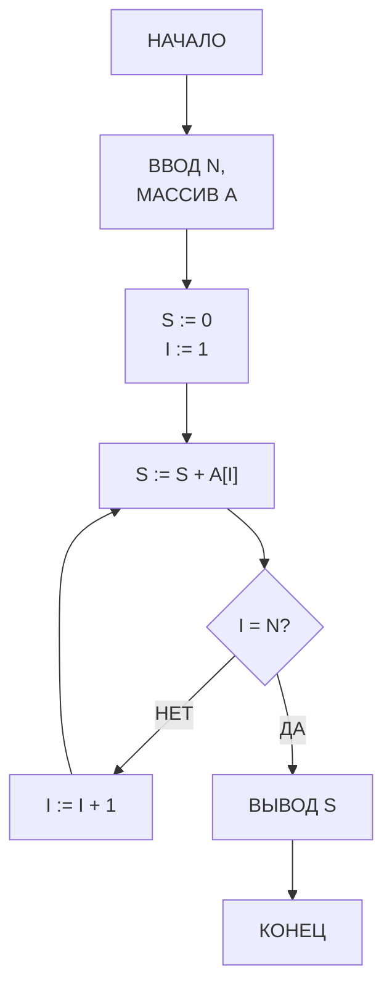
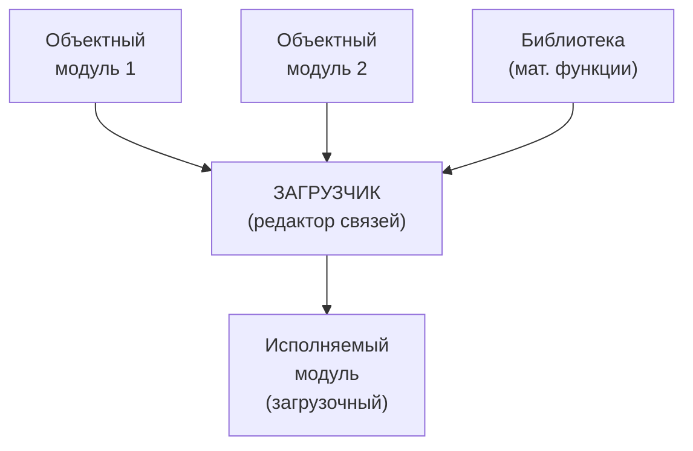

# Раздел VII: Процесс программирования и отладки


*Программист за пультом БЭСМ-6 — работа в диалоговом режиме*


*Колода перфокарт с программой — основной носитель исходного кода*

---

## 7.1. Жизненный цикл программы

### 7.1.1. Этапы разработки

Типичный процесс создания программы для БЭСМ-6 включал следующие этапы:


### 7.1.2. Разработка алгоритма

Программист разрабатывал алгоритм решения задачи. На этом этапе использовались:

- **Блок-схемы** — графическое представление алгоритма;
- **Псевдокод** — неформальное описание на естественном языке;
- **Математические методы** — выбор численных методов решения.

**Пример блок-схемы алгоритма (Mermaid):**



### 7.1.3. Написание кода

Код писался на одном из доступных языков:

- **Ассемблер (БЕМШ/МАДЛЕН)** — для системного программирования и задач, критичных к производительности;
- **Фортран** — для научных и инженерных расчётов;
- **Алгол-60** — для алгоритмических задач;
- **Автокод** — для задач среднего уровня.

Исходный код набивался на **перфокартах** (80 колонок, 12 строк) с помощью клавишных перфораторов. Каждая строка программы — одна перфокарта. Типичная программа занимала от нескольких десятков до нескольких тысяч перфокарт.

**Процесс набивки перфокарт:**

1. Программист писал программу на бланке (специальный формуляр);
2. Оператор ПВ (перфораторщица) набивала текст на перфокартах с помощью клавишного перфоратора;
3. Готовая колода перфокарт передавалась на верификацию (контрольный набор на верификаторе);
4. После верификации колода поступала на ввод в ЭВМ.

### 7.1.4. Трансляция

Процесс трансляции включал:

1. **Чтение исходного кода** — с перфокарт или магнитной ленты;
2. **Лексический и синтаксический анализ**;
3. **Генерация объектного кода** — машинные команды БЭСМ-6;
4. **Вывод листинга** — на АЦПУ (с указанием ошибок).

Трансляция могла занимать от нескольких минут до нескольких часов в зависимости от размера программы. При обнаружении ошибок программист исправлял перфокарты и повторял трансляцию.

**Типичный листинг трансляции:**

```
ТРАНСЛЯТОР ФОРТРАН-ДУБНА  ВЕРСИЯ 3.2
ИСХОДНЫЙ ФАЙЛ: ПРОГРАММА.FTN

СТРОКА   ИСХОДНЫЙ ТЕКСТ                         ОШИБКИ
  1      PROGRAM SUMMA
  2      DIMENSION A(100)
  3      READ 1, N, (A(I), I=1,N)
  4  1   FORMAT (I5/(F10.5))
  5      S = 0.0
  6      DO 2 I = 1, N
  7  2   S = S + A(I)
  8      PRINT 3, S
  9  3   FORMAT (10X, 'СУММА = ', F15.5)
 10      STOP
 11      END

ТАБЛИЦА ИМЁН:
  A       МАССИВ  REAL  РАЗМЕР 100
  N       ПЕРЕМ   INTEGER
  S       ПЕМР    REAL
  I       ПЕРЕМ   INTEGER

ОБЪЕКТНЫЙ КОД: 120 СЛОВ
ТРАНСЛЯЦИЯ ЗАВЕРШЕНА БЕЗ ОШИБОК
```

### 7.1.5. Компоновка (редактирование связей)

После трансляции объектные модули компоновались в исполняемую программу:

- **Разрешение внешних ссылок** — связывание вызовов подпрограмм;
- **Подключение библиотек** — математических и системных;
- **Перемещение адресов** — настройка адресов под конкретную загрузку.

**Схема компоновки:**



### 7.1.6. Выполнение

Программа загружалась в память и запускалась. В зависимости от режима работы:

- **Пакетный режим** — программа выполняется без вмешательства оператора;
- **Диалоговый режим** — оператор может вмешиваться в процесс выполнения.

---


*Распечатка дампа памяти БЭСМ-6 на АЦПУ — восьмеричное представление содержимого ячеек*

---

## 7.2. Средства отладки

### 7.2.1. Мониторы

Монитор — программа, позволяющая наблюдать за выполнением другой программы. Основные возможности:

- **Пошаговое выполнение** — выполнение по одной команде;
- **Точки останова** — остановка при достижении заданного адреса;
- **Просмотр регистров** — отображение содержимого A, Y, индекс-регистров;
- **Просмотр памяти** — дамп содержимого ячеек памяти.

### 7.2.2. Символические отладчики

Более развитые средства отладки предоставляли символические отладчики:

- Работа с символическими именами (метками);
- Вычисление выражений;
- Условные точки останова;
- Трассировка вызовов подпрограмм.

**Пример сеанса отладки:**

```
* ЗАПУСК ОТЛАДЧИКА
ОТЛ: ЗАГРУЗКА ПРОГРАММЫ SUMMA
ОТЛ: ТОЧКА ОСТАНОВА LOOP+2
ОТЛ: ПУСК
     (программа выполняется до LOOP+2)
ОТЛ: РЕГИСТРЫ
     A = 0.314159E+01
     Y = 0.000000E+00
     I1 = 0005
     K = 001234
ОТЛ: ПРОДОЛЖИТЬ
     (выполнение продолжается)
```

**Пример условной точки останова:**

```
ОТЛ: ТОЧКА LOOP+2, ЕСЛИ I1=0
     (останов только когда счётчик цикла обнулился)
ОТЛ: ПУСК
     (программа выполняется до LOOP+2 при I1=0)
ОТЛ: РЕГИСТРЫ
     A = 0.100000E+02
     I1 = 0000
ОТЛ: ДАМП SUM, 1
     SUM = 0.385000E+02
```

### 7.2.3. Дампы памяти

Дамп памяти — распечатка содержимого указанной области памяти:

- **Аварийный дамп** — автоматическая распечатка при аварийном останове;
- **Выборочный дамп** — по запросу программиста;
- **Формат дампа** — восьмеричные или шестнадцатеричные значения.

**Пример аварийного дампа:**

```
АВАРИЙНЫЙ ОСТАНОВ: ПЕРЕПОЛНЕНИЕ
СЧЁТЧИК КОМАНД: 001234
РЕГИСТР РЕЖИМА: 000010 (ПЕРЕПОЛНЕНИЕ)

ДАМП ПАМЯТИ (000000-000037):
000000: 042010000000  004012001000  030100012345  000000000000
000010: 025020000000  017030000000  000000000000  000000000000
000020: 000000000000  000000000000  000000000000  000000000000
000030: 000000000000  000000000000  000000000000  000000000000

РЕГИСТРЫ:
A = 0.999999E+99  (ПЕРЕПОЛНЕНИЕ)
Y = 0.000000E+00
I1 = 0010  I2 = 0020  I3 = 0000
```

### 7.2.4. Трассировка

Трассировка — запись последовательности выполненных команд:

- **Полная трассировка** — запись каждой команды (очень медленно);
- **Выборочная трассировка** — запись только команд по заданным адресам;
- **Трассировка обращений к памяти** — запись всех обращений к определённым ячейкам.

**Пример вывода трассировки:**

```
ТРАССИРОВКА: ПРОГРАММА SUMMA
001000: СЧ   ARRAY     A := 0.100000E+01
001001: СЛ   =0        A := 0.100000E+01
001002: ВЧ   ARRAY+1   A := 0.100000E+01 - 0.200000E+01 = -0.100000E+01
001003: РЖ   =0        РЕЖИМ: ЗНАК=1
001004: ПБ   NEXT      ПЕРЕХОД
...
```

---

## 7.3. Особенности и оптимизация

### 7.3.1. Учёт конвейерной архитектуры

Для достижения максимальной производительности программист должен был учитывать особенности конвейера:

- **Избегать конфликтов по данным** — не использовать результат команды сразу же;
- **Планировать команды** — располагать независимые команды рядом;
- **Использовать длинные адреса** — для уменьшения времени дешифрации.

**Пример оптимизации:**

```asm
* НЕОПТИМИЗИРОВАННЫЙ КОД (конфликт по данным)
        СЧ    X         * A := X
        СЛ    Y         * A := A + Y (ожидание загрузки X)
        ЗЧ    Z         * Z := A

* ОПТИМИЗИРОВАННЫЙ КОД (нет конфликта)
        СЧ    X         * A := X
        УИА   М20       * установка индекс-регистра (независимая команда)
        СЛ    Y         * A := A + Y (X уже загружен)
        ЗЧ    Z         * Z := A
```

**Измерение производительности до и после оптимизации:**

| Версия | Тактов | Время (нс) | Ускорение |
|:-------|:------:|:----------:|:---------:|
| Неоптимизированная | 8 | 800 | 1.0× |
| Оптимизированная | 5 | 500 | 1.6× |

### 7.3.2. Использование индекс-регистров

16 индекс-регистров БЭСМ-6 позволяли эффективно реализовывать:

- **Циклы** — один регистр как счётчик, другой как указатель;
- **Обработку массивов** — последовательный перебор элементов;
- **Табличные переходы** — косвенная адресация.

**Рекомендации по использованию индекс-регистров:**

1. Использовать регистры I0–I7 для общих целей;
2. I8–I15 резервировать для системных нужд;
3. Минимизировать переключения индекс-регистров внутри циклов.

**Пример эффективного использования индекс-регистров:**

```asm
* ОБРАБОТКА ДВУХ МАССИВОВ (I₁ — счётчик, I₂ — указатель на A, I₃ — указатель на B)
        УИА   М20       * I₁ := N (счётчик)
        УИА   М21       * I₂ := адрес A
        УИА   М22       * I₃ := адрес B
LOOP    СЧ    (М21)     * A := A[I₂]
        СЛ    (М22)     * A := A + B[I₃]
        ЗЧ    (М21)     * A[I₂] := A
        ПИ    М21,М21   * I₂ := I₂ + 1
        ПИ    М22,М22   * I₃ := I₃ + 1
        ЦИКЛ  LOOP      * I₁--; if I₁≠0 goto LOOP
```

### 7.3.3. Использование расслоения памяти

Расслоение памяти (4 банка) позволяло ускорить доступ к данным:

- **Размещать массивы** с шагом, кратным 4 (для равномерной загрузки банков);
- **Чередовать данные и код** — код в одних банках, данные в других;
- **Избегать конфликтов банков** — не обращаться к одному банку дважды подряд.

**Пример размещения данных для оптимального доступа:**

```asm
* НЕОПТИМАЛЬНОЕ РАЗМЕЩЕНИЕ (все данные в одном банке)
A       ПАМ   100       * банк 0
B       ПАМ   100       * банк 0 (конфликт с A)
C       ПАМ   100       * банк 0 (конфликт)

* ОПТИМАЛЬНОЕ РАЗМЕЩЕНИЕ (данные в разных банках)
A       ПАМ   100       * банк 0
        ПАМ   100       * пропуск (выравнивание)
B       ПАМ   100       * банк 2
        ПАМ   100       * пропуск
C       ПАМ   100       * банк 0 (уже свободен)
```

### 7.3.4. Динамическая оптимизация с использованием ассоциативной памяти

Ассоциативная память (16 сверхбыстрых регистров) могла использоваться для:

- **Хранения часто используемых переменных** — вручную или автоматически;
- **Кэширования результатов** — для повторного использования;
- **Быстрого доступа к элементам стека** — при рекурсивных вызовах.

**Стратегия использования ассоциативной памяти:**

1. Размещать в ассоциативной памяти переменные, к которым происходит наиболее частое обращение (счётчики циклов, указатели, часто используемые константы).
2. Избегать частой смены данных в ассоциативной памяти — это приводит к промахам (cache miss).
3. При работе с массивами — обрабатывать элементы последовательно, чтобы использовать пространственную локальность.

---

## 7.4. Примеры программ

### 7.4.1. Программа «Hello, World!» на ассемблере БЕМШ

```asm
* ПРОГРАММА ВЫВОДА СООБЩЕНИЯ
        ЭК     60        * ВЫЗОВ СИСТЕМНОЙ ПРОЦЕДУРЫ ВЫВОДА
        ПАМ     1        * АДРЕС СТРОКИ
        СТРОКА 'HELLO, WORLD!'
        ОСТ              * ОСТАНОВ
```

### 7.4.2. Вычисление факториала на Madlen

```asm
* ВЫЧИСЛЕНИЕ N! (ФАКТОРИАЛ)
        VTM    N, М20    * M20 := N (СЧЁТЧИК)
        XTA    =1.0      * A := 1.0
LOOP    A*X    =1.0,М20  * A := A * M20
        VLM    LOOP      * ЦИКЛ: M20--, ПЕРЕХОД ЕСЛИ M20≠0
        ATX    RESULT    * СОХРАНЕНИЕ РЕЗУЛЬТАТА
        STOP
N       EQU    10        * N = 10
RESULT  BSS    1         * РЕЗУЛЬТАТ
```

### 7.4.3. Обработка массива на Фортране

```fortran
      FUNCTION SUM(A, N)
      DIMENSION A(100)
      S = 0.0
      DO 1 I = 1, N
1     S = S + A(I)
      SUM = S
      RETURN
      END
```

### 7.4.4. Сортировка методом «пузырька» на БЕМШ

```asm
* СОРТИРОВКА МАССИВА МЕТОДОМ ПУЗЫРЬКА
* ВХОД: I₁ = N (РАЗМЕР МАССИВА)
*       I₂ = АДРЕС МАССИВА A
SORT    УИА   М20       * I₁ := N (ВНЕШНИЙ ЦИКЛ)
OUTER   ПИ    М21,М20   * I₂ := I₁ (ВНУТРЕННИЙ ЦИКЛ)
        УИА   М22       * I₃ := АДРЕС A
INNER   СЧ    (М22)     * A := A[I₃]
        ВЧ    1(М22)    * A := A[I₃] - A[I₃+1]
        РЖ    =0        * ПРОВЕРКА ЗНАКА
        ПБ    NOSWAP    * ЕСЛИ A[I₃] ≤ A[I₃+1], НЕ МЕНЯТЬ
        СЧ    (М22)     * ОБМЕН A[I₃] И A[I₃+1]
        ЗЧ    TEMP
        СЧ    1(М22)
        ЗЧ    (М22)
        СЧ    TEMP
        ЗЧ    1(М22)
NOSWAP  ПИ    М23,М23   * I₃ := I₃ + 1
        ПИНМ  INNER     * I₂--; ЕСЛИ I₂≠0, ПРОДОЛЖИТЬ
        ЦИКЛ  OUTER     * I₁--; ЕСЛИ I₁≠0, ПРОДОЛЖИТЬ
        ОСТ
TEMP    ПАМ   1
```

---

## Ключевые выводы раздела

1. Жизненный цикл программы включал разработку алгоритма, написание кода на перфокартах, трансляцию, компоновку, выполнение и отладку.
2. Средства отладки включали мониторы, символические отладчики, дампы памяти и трассировку с условными точками останова.
3. Оптимизация для БЭСМ-6 требовала учёта конвейерной архитектуры (избегание конфликтов по данным), эффективного использования 16 индекс-регистров и расслоения памяти (4 банка).
4. Ассоциативная память (сверхбыстрые регистры) могла использоваться для динамической оптимизации с учётом пространственной локальности.
5. Правильная оптимизация могла дать ускорение до 1.6× на типовых участках кода.

---

**Далее:** [Раздел VIII: Примеры практического применения и наследие](08-legacy.md)