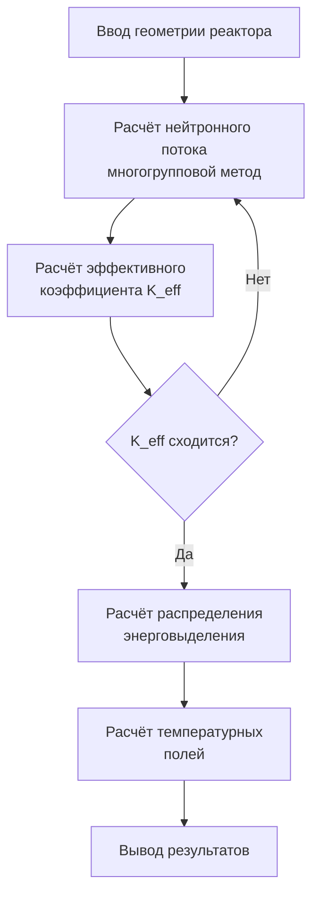
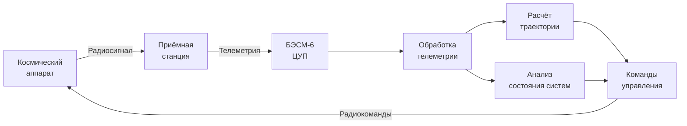
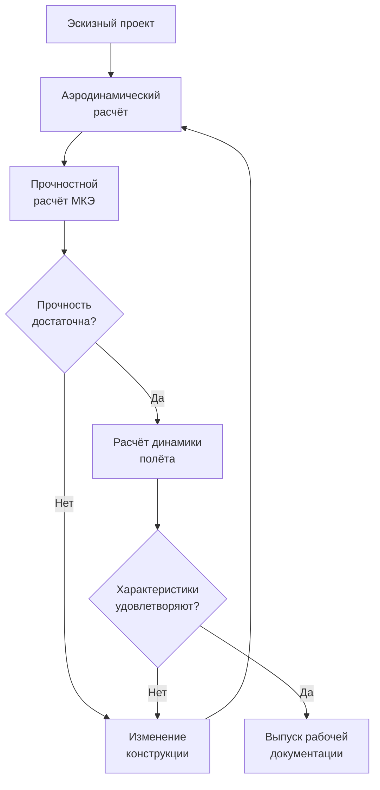
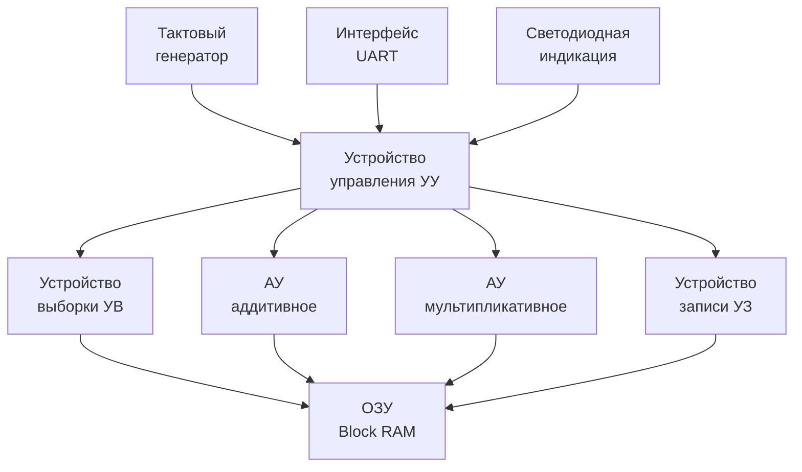
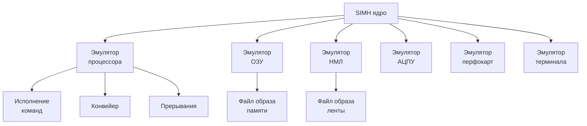

# Раздел VIII: Примеры практического применения и наследие


*БЭСМ-6 в Центре управления полётами — обработка телеметрии космических аппаратов*


*Проект МЭСМ-6 — реконструкция процессора БЭСМ-6 на ПЛИС (FPGA)*

---

## 8.1. Научные и оборонные задачи

### 8.1.1. Ядерная физика

БЭСМ-6 сыграла ключевую роль в советской ядерной программе:

- **Расчёт ядерных реакторов** — моделирование нейтронно-физических процессов, многогрупповой метод решения уравнения переноса нейтронов;
- **Моделирование ядерных взрывов** — гидродинамические расчёты, уравнение состояния;
- **Обработка экспериментальных данных** — с ядерных установок и ускорителей;
- **Расчёт защиты от радиации** — метод Монте-Карло.

Для этих задач использовались специализированные пакеты программ:
- **ПРИЗМА** — расчёт реакторов;
- **МОНТЕ-КАРЛО** — моделирование переноса излучения;
- **ДИНАМИКА** — расчёт нестационарных процессов.

**Типовой расчёт ядерного реактора на БЭСМ-6:**



### 8.1.2. Космические исследования

БЭСМ-6 была основной вычислительной машиной советской космической программы:

- **Баллистические расчёты** — расчёт траекторий выведения, коррекций, посадки;
- **Обработка телеметрии** — приём и обработка данных с космических аппаратов;
- **Управление полётами** — расчёт команд для ЦУПа;
- **Моделирование** — имитация полётных ситуаций.

**Конкретные миссии, в которых использовалась БЭСМ-6:**

| Миссия | Год | Задача | Результат |
|--------|-----|--------|-----------|
| «Луна-9» | 1966 | Расчёт траектории мягкой посадки | Первая мягкая посадка на Луну |
| «Союз-Аполлон» | 1975 | Расчёты стыковки | Первая международная стыковка |
| «Венера-9» | 1975 | Расчёт траектории к Венере | Первые снимки поверхности Венеры |
| «Энергия-Буран» | 1988 | Аэродинамические расчёты | Автоматическая посадка Бурана |

**Схема обработки телеметрии в ЦУПе:**



### 8.1.3. Проектирование авиации и ракет

БЭСМ-6 использовалась в авиа- и ракетостроении:

- **Аэродинамические расчёты** — обтекание профилей, распределение давления;
- **Прочностные расчёты** — метод конечных элементов, расчёт напряжений;
- **Динамика полёта** — устойчивость и управляемость;
- **Оптимизация конструкции** — минимизация массы при заданной прочности.

**Типовой цикл проектирования с использованием БЭСМ-6:**



---

## 8.2. Гражданское применение

### 8.2.1. Прогнозирование в экономике

БЭСМ-6 использовалась для экономического прогнозирования:

- **Модели межотраслевого баланса** — расчёт «затраты-выпуск»;
- **Оптимизационные задачи** — линейное и нелинейное программирование;
- **Прогнозирование урожайности** — статистические модели.

### 8.2.2. Экологические исследования

- **Моделирование распространения загрязнений** — атмосферная диффузия;
- **Расчёт течений** — гидродинамика рек и водоёмов;
- **Прогноз погоды** — численные модели атмосферы.

### 8.2.3. Обработка данных в научных центрах

БЭСМ-6 была основой вычислительных центров:

- **ВЦ АН СССР** — центральный вычислительный центр Академии наук;
- **ВЦ СО АН СССР** (Новосибирск) — сибирское отделение;
- **ОИЯИ** (Дубна) — обработка данных с ускорителей;
- **ИПМ АН СССР** — прикладная математика.

---

## 8.3. Наследие и современные проекты

### 8.3.1. БЭСМ-6 как культурное явление

БЭСМ-6 оставила глубокий след в советской и российской культуре:

- **Школа программистов** — на БЭСМ-6 выросло целое поколение выдающихся специалистов;
- **Научная школа** — архитектурные решения изучались в университетах;
- **Ностальгия** — сообщества энтузиастов, сохраняющих память о машине.

### 8.3.2. Проект МЭСМ-6: реконструкция на ПЛИС

**МЭСМ-6** — проект реконструкции процессора БЭСМ-6 на программируемых логических интегральных схемах (ПЛИС, FPGA).

**Характеристики проекта:**

| Параметр | Описание |
|----------|----------|
| Разработчик | Группа энтузиастов (GitHub) |
| Цель | Полная реконструкция процессора БЭСМ-6 |
| Базис | ПЛИС Xilinx/Altera |
| Состояние | Рабочий прототип, выполнение команд |
| Совместимость | Полная совместимость с оригиналом |

**Архитектура проекта МЭСМ-6:**



Проект включает:
- VHDL/Verilog-описание всех функциональных устройств;
- Реализацию конвейера;
- Поддержку всех 50 команд;
- Интерфейс для подключения периферии.


*Эмулятор SIMH БЭСМ-6 — загрузка операционной системы ДИСПАК*

### 8.3.3. Современные эмуляторы и симуляторы

Для БЭСМ-6 существует несколько эмуляторов:

| Эмулятор | Платформа | Особенности |
|----------|-----------|-------------|
| **SIMH** | Кроссплатформенный | Наиболее полный, включает ДИСПАК |
| **besm6-emu** | Linux/Windows | Эмуляция на уровне команд |
| **MESM6** | FPGA | Аппаратная реконструкция |

**SIMH** — наиболее популярный эмулятор. Он позволяет:

- Загружать и выполнять оригинальные программы;
- Работать с ДИСПАК и другими ОС;
- Подключать эмулированные периферийные устройства;
- Использовать отладчик.

**Архитектура эмулятора SIMH для БЭСМ-6:**



**Пример запуска БЭСМ-6 в SIMH:**

```bash
$ simh-besm6
BESM-6 simulator V4.0
sim> load dispak.tape
sim> run
ДИСПАК 4.0 ГОТОВ
*ЗАДАЧА: ВЫЧИСЛЕНИЕ
  ФАЙЛ ПРОГРАММА=ПЕРФОЛЕНТА
  ВЫПОЛНИТЬ
...
```

### 8.3.4. Сообщества и ресурсы

Сегодня БЭСМ-6 продолжает жить в сообществах энтузиастов:

- **[besm6.org](https://besm6.org)** — портал, посвящённый БЭСМ-6;
- **[Computer-museum.ru](https://www.computer-museum.ru)** — виртуальный музей;
- **[GitHub — MESM6](https://github.com)** — проект реконструкции на ПЛИС;
- **[Форум RSDN](https://rsdn.org)** — обсуждения и архив материалов.

### 8.3.5. Сохранение программного наследия

Усилия по сохранению программного обеспечения БЭСМ-6 включают:

- **Оцифровка магнитных лент** — перенос содержимого оригинальных лент в файлы-образы;
- **Архивирование документации** — сканирование технических описаний, руководств, листингов;
- **Восстановление исходных кодов** — реконструкция программ по сохранившимся листингам;
- **Запуск в эмуляторах** — обеспечение работоспособности исторического ПО в современных системах.

---

## 8.4. Заключение

БЭСМ-6 — это не просто ЭВМ. Это символ целой эпохи в развитии советской вычислительной техники. Созданная в середине 1960-х годов, она на два десятилетия стала основной вычислительной платформой для самых ответственных задач — от ядерной физики до космических полётов.

**Почему БЭСМ-6 важна сегодня:**

1. **Архитектурные инновации** — конвейер, виртуальная память, ассоциативная память — опередили своё время и стали стандартом для современных процессоров.
2. **Программное наследие** — операционные системы, трансляторы, библиотеки — заложили основы советского системного программирования.
3. **Школа** — на БЭСМ-6 выросло поколение программистов и инженеров, создавших последующие поколения ЭВМ.
4. **Современные проекты** — эмуляторы и реконструкции на ПЛИС позволяют сохранить и изучить это наследие.

БЭСМ-6 остаётся ярким примером того, как талантливый коллектив разработчиков может создать машину, опережающую своё время, даже в условиях ограниченных ресурсов и технологических возможностей.

---

*Конец учебника.*

**В начало:** [Титульная страница и оглавление](README.md)