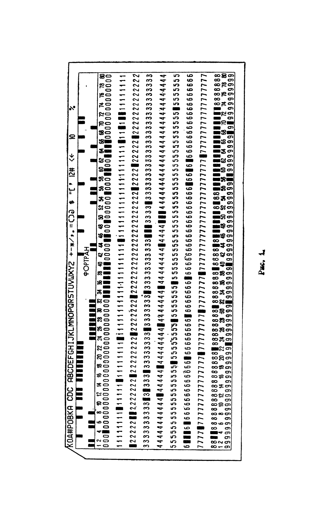
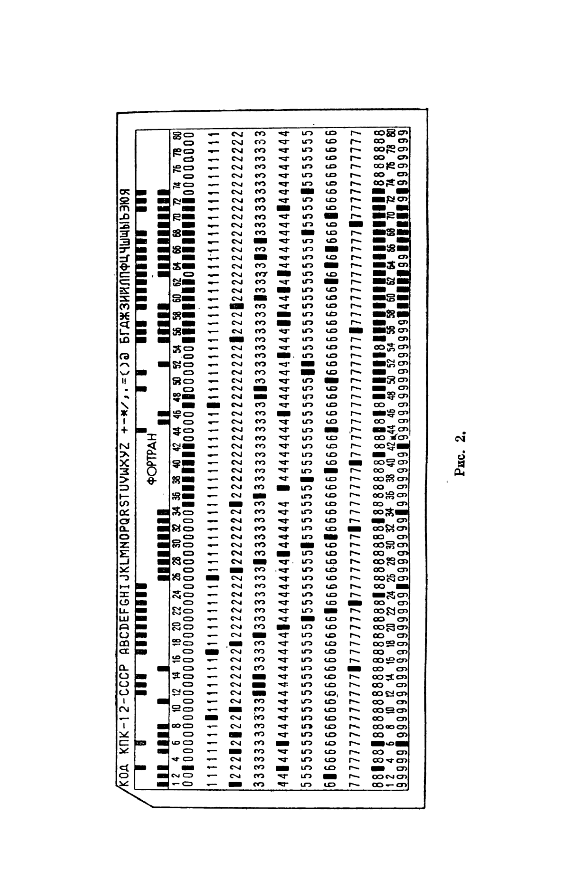
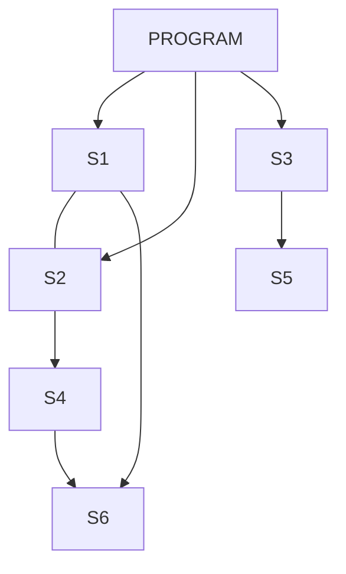

# Глава II. Язык фортран в системе «Дубна»

[Оглавление](README.md)

<a id="section-9"></a>

## § 9. Фортран как язык программирования

Фортран принадлежит к числу наиболее распространенных языков программирования высокого уровня. Языки подобного типа принято называть машинно независимыми или проблемно ориентированными. Первое из этих названий подчеркивает независимость данного языка от конкретной ЭВМ. Второе название означает, что этот язык в основном предназначен для решения задач определенного типа.

Область применения фортрана — это в первую очередь задачи научно-технического характера. Такие задачи характеризуются достаточно большим количеством вычислительных операций (в основном арифметических) на единицу вводимой информации.

Название языка фортран (FORTRAN) происходит от английских слов FORmula TRANslation — перевод формул. Тем самым подчеркивается предпочтительная область применения этого языка — задачи, связанные с расчетами по формулам. Однако фортран можно успешно использовать и для решения задач иного характера, например, экономических.

Рассмотрим главные особенности фортрана как языка программирования.

Прежде всего отметим принцип автономности. Он состоит в том, что программа на фортране строится из автономных, независимо составляемых и транслируемых частей, называемых подпрограммами. Каждую подпрограмму можно автономно отладить и записать в библиотеку программ в оттранслированном виде.

Использование библиотечных программ значительно упрощает процесс составления и отладки больших программ.

Другой важной особенностью фортрана является так называемый принцип умолчания. Суть его в том, что в фортране разрешается не описывать многие объекты. Например, можно не описывать тип переменной величины. В этом случае переменной будет приписан тип вещественный или целый в зависимости от первой буквы ее наименования (см. § 13).

Следующей особенностью фортрана является развитый аппарат ввода-вывода информации в виде, удобном для использования. Это позволяет, например, выдавать на печать готовые документы: таблицы, гистограммы, графики.
Отметим, наконец, что текст программы на фортране легко читается, т. е. по фортранной записи нетрудно понять смысл алгоритма.

В процессе развития фортрана возникло несколько версий этого языка.

Здесь описывается версия фортрана для БЭСМ-6, известная под названием фортран-Дубна [41]. Эта версия близка к версии фортран-IV (см. [15]) и к стандарту языка фортран [40].

<a id="section-10"></a>

## § 10. Запись программы на фортране. Операторы фортрана

Запись программы на фортране имеет вид текста, состоящего из отдельных символов. Множество символов, используемых в данном языке, обычно называют алфавитом этого языка.

Алфавит фортрана состоит из следующих символов:

1) 26 прописных букв латинского алфавита от А до Z,

2) 10 цифр от 0 до 9,

3) 10 специальных символов:

| Символ | Значение |
| --- | --- |
| `+` | Плюс |
| `-` | Минус |
| `*` | Звездочка |
| `/` | Косая черта |
| `=` | Равно |
| `(` | Левая скобка |
| `)` | Правая скобка |
| `,` | Запятая |
| `.` | Точка |
| `'` | Апостроф |

Транслятор на БЭСМ-6 допускает также использование заглавных букв русского алфавита и символа \$, или <. В комментариях и в текстовых величинах разрешается использовать любые символы, перечисленные в приложении 2.

Программа на фортране, как уже было сказано, состоит из отдельных составных частей — подпрограмм. Каждая подпрограмма является независимой от других подпрограмм в смысле выбора обозначений. Это надо понимать так, что любое обозначение (кроме наименований подпрограмм и общих блоков), принятое в данной подпрограмме, имеет силу только внутри этой подпрограммы и не затрагивает обозначений, принятых в других подпрограммах.

Подпрограмма на фортране состоит из отдельных частей — операторов. Каждый оператор представляет собой некоторый самостоятельный фрагмент подпрограммы. В фортране имеются операторы двух типов — выполняемые и невыполняемые (или декларативные).

Каждый выполняемый оператор определяет некоторую самостоятельную часть всего вычислительного процесса, реализованного в данной подпрограмме. Выполнение этих операторов производится, вообще говоря, в порядке их следования в подпрограмме.

Невыполняемые операторы, в отличие от выполняемых, сообщают транслятору некоторую дополнительную информацию, необходимую для трансляции подпрограммы. При этом порядок расположения невыполняемых операторов по отношению друг к другу может быть произвольным.

Операторы фортрана обычно записывают на специальных бланках. Каждая строка такого бланка содержит 80 позиций и, следовательно, позволяет расположить 80 символов. Для записи операторов не обязательно использовать бланки, но необходимо помнить о том, что каждому символу (буква, цифра, знак, пробел и т. п.) должна соответствовать одна позиция на данной строке.
Такой способ записи операторов фортрана обусловлен тем, что текст каждого оператора будет пробит на стандартной 80-колонной перфокарте (см. рис. 1, 2). При этом каждому символу текста будет поставлена в соответствие определенная колонка перфокарты.





При пробивке перфокарт на устройствах с поколонной кодировкой (типа ЕС-9015, ICL и др.) каждому символу ставится в соответствие определенная комбинация отверстий в данной колонке перфокарты. Сам символ при этом печатается над той же колонкой у верхнего края перфокарты.

Каждый оператор располагается, как правило, на отдельной перфокарте. При этом для размещения оператора отводятся колонки с 7-й по 72-ю включительно (так называемое поле оператора). Для записи «длинных» операторов может не хватить одной перфокарты. В этом случае запись оператора продолжается на последующих перфокартах, у которых в 6-й колонке должен быть указан любой символ, отличный от пробела. Этот символ принято называть признаком продолжения.

Перед началом записи оператора в колонках с 1-й по 5-ю может быть указана метка оператора. Метка оператора — это целое положительное число без знака, не превосходящее 32767. Метка служит для того, чтобы можно было сослаться на данный оператор (например, передать на него управление).

Колонки с 73-й по 80-ю служат для записи комментария. Обычно эти колонки используют для нумерации перфокарт. Комментарий при трансляции не учитывается, однако выдается на печать вместе с текстом подпрограммы.

Важно отметить, что пробелы в записи операторов и меток транслятором не принимаются во внимание. Они удобны для наглядности подпрограммы. С «точки зрения транслятора», записи

`GO TO 20`, `GO TO20`, `GOT O 2 0`, `GOTO20` эквивалентны, но для чтения наиболее удобна первая из приведенных записей.

На одной перфокарте можно располагать несколько операторов. В этом случае они отделяются друг от друга знаком \$ (при пробивке на УПИ используется знак >). После знака \$ нельзя записывать оператор с меткой. Знак \$ нельзя ставить непосредственно после оператора FORMAT. Отметим, что в некоторых версиях фортрана не разрешается располагать несколько операторов на одной перфокарте. Поэтому не рекомендуется без особой необходимости использовать эту возможность.

Кроме операторов, программа может содержать карты-комментарии. Признаком такой карты служит буква С в первой колонке. В колонках с 2-й по 80-ю карты-комментария может быть расположен произвольный текст, содержащий символы ISO (см. приложение 2). Каждая карта-комментарий должна иметь букву С в первой колонке.

Резюмируя сказанное, сформулируем основные

Правила записи операторов фортрана

1. Для размещения операторов фортрана используются колонки перфокарты с 7-й по 72-ю включительно. (В книге операторы фортрана всюду расположены, начиная с седьмой колонки.)

2. Метки операторов располагаются в колонках с 1-й по 5-ю.
3. Колонка 6-я служит для размещения признака продолжения.

4. Колонки с 73-й по 80-ю предназначены для размещения комментария.

5. На одной карте разрешается располагать несколько операторов, отделяемых друг от друга знаком \$ (или ◇).

6. Карта-комментарий начинается с буквы С в первой колонке.

7. Для достижения большей наглядности текста программы при записи операторов и меток можно использовать пробелы.

Приведем примеры записи операторов фортрана. Колонка 6-я выделена вертикальными чертами.

```fortran
      A=1.
   15 CONTINUE
      S=X**2+2.*SIN(X)-
     *15.3*SQRT(X**2+1.)
   10 B=A $ X=A**2+4. $ GO TO 20
```

```fortran
C ЭТО ЗАПИСЬ ОПЕРАТОРОВ ФОРТРАНА
```

<a id="section-11"></a>

## § 11. Типы величин, используемых в фортране

В фортране используются величины следующих типов:

1. Вещественные.
2. Целые.
3. Комплексные.
4. С двойной точностью.
5. Логические.

Разрешается также использовать текстовые (холлеритовские) и восьмеричные величины. Текстовым и восьмеричным величинам должен быть приписан целый тип. Каждая из величин перечисленных типов имеет свое внутреннее представление в машине и строго определенный набор допустимых операций. Для размещения каждой величины вещественного, целого или логического типа отводится по одному машинному слову, а для размещения каждой величины комплексного типа или с двойной точностью — по два машинных слова.

Величина вещественного типа имеет машинное представление в виде нормализованного числа (см. § 2).

Напомним, что диапазон нормализованных чисел (по модулю) на БЭСМ-6 лежит в пределах от $10^{-19}$ до $10^{19}$, а точность машинного представления - до двенадцати десятичных знаков.

Величина целого типа представляется в БЭСМ-6 в ненормализованном виде (см. § 2), с порядком 40 и мантиссой, расположенной в младших разрядах слова. Отсюда следует, что ее модуль может изменяться от $0$ до $2^{40}-1$.

Комплексная величина размещается в двух последовательных машинных словах. В первом из этих слов располагается действительная, а во втором — мнимая часть комплексной величины. Действительная и мнимая части комплексной величины могут рассматриваться отдельно друг от друга как вещественные величины.

Величина с двойной точностью располагается в двух последовательных машинных словах. Мантисса первого машинного слова содержит 40 старших разрядов мантиссы, знак ее соответствует знаку всей 80-разрядной мантиссы. Порядок первого машинного слова содержит 6 младших разрядов порядка. Старший разряд этого слова содержит знак порядка (1 — положительный, 0 — отрицательный). Второе машинное слово содержит 40 младших разрядов мантиссы (с 0 в 41-м разряде) и 6 старших разрядов порядка (с 0 в 48-м разряде). Таким образом, порядок величины с двойной точностью состоит из 12 двоичных разрядов, что соответствует диапазону от $10^{-1232}$ до $10^{1233}$. Мантисса содержит 80 двоичных разрядов, что соответствует 24 десятичным знакам. Отметим, что в случае, когда величина с двойной точностью лежит в диапазоне,

допустимом для величин вещественного типа, первое слово ее машинного представления совпадает с величиной вещественного типа.

Для представления величин логического типа используется младший разряд машинного слова (1 — истина, 0 — ложь).

Текстовые величины располагаются в машинном слове посимвольно, начиная со старших его разрядов. Под каждый символ (включая и пробелы) отводится 8 двоичных разрядов (1 байт), т. е. в каждом машинном слове располагается по 6 символов. Отсюда следует, что текстовая величина может содержать не более 6 символов. Если число символов меньше шести, то при записи в машинном слове справа будет добавлено недостающее число пробелов. Каждый символ представляется в виде восьмиразрядной комбинации 0 или 1 в соответствии с кодом ISO (см. приложение 2).

Восьмеричная величина представляется в машине в виде последовательности из 16 восьмеричных цифр.

Над величинами вещественного, целого, комплексного типов и с двойной точностью можно производить арифметические операции сложения, вычитания, умножения, деления и возведения в степень. В результате получается величина одного из четырех перечисленных типов. Более подробно этот вопрос рассмотрен в § 15. Над величинами рассмотренных четырех типов можно производить также операции отношения (см. § 16), дающие в результате величину логического типа.

Величины логического типа допускают лишь логические операции, дающие в результате величину того же типа.

Над текстовыми величинами можно в принципе производить любые операции, допустимые для величин целого типа. Однако смысл имеют лишь операции сравнения (см. § 16), которые устанавливают, совпадают две данные текстовые величины или нет.

Операции над восьмеричными величинами производятся по тем же правилам, что и над величинами целого типа. Отметим, что в этом случае транслятор не проверяет правильности записи восьмеричной величины, как величины целого типа.

Каждая из величин может быть либо константой, либо переменной (без индексов или с индексами), либо функцией.

Результатом вычислений всегда является некоторое конкретное значение переменной величины. Это значение записывается в определенные ячейки оперативной памяти машины (одну или две — в зависимости от типа величины) и может быть выдано на внешние носители информации: бумажную ленту АЦПУ, перфокарты, магнитную ленту и т. п.

<a id="section-12"></a>

## § 12. Запись констант на фортране

Часть величин, участвующих в вычислительном процессе, не меняет своего значения в ходе его выполнения. Такие величины на фортране называются константами.

Константа может принадлежать к одному из 5 типов, рассмотренных в § 11. В зависимости от типа она может быть представлена на фортране одним или несколькими способами. Отметим, что множество допустимых значений констант (кроме логических) зависит от типа машины.

Наиболее распространенным типом констант являются вещественные константы. Запись констант этого типа на фортране напоминает запись обычных десятичных чисел, содержащих целую и дробную часть. Однако в качестве разделителя целой и дробной части здесь принята не запятая, а точка. Например, десятичное число 3,14 на фортране будет представлено как `3.14`.

Отметим, что десятичная точка является характерным признаком вещественной константы. Например, 1. (единица с точкой) является вещественной константой, а 1 (единица без точки) уже не является вещественной константой.

При записи обычных десятичных чисел часто используется степень числа $10$, например, $3\cdot10^6$, $-2{,}5\cdot10^{-4}$. На фортране предусмотрена возможность аналогичной записи вещественных констант, а именно: в качестве основания степени вместо числа $10$ используется буква `E`, а показатель степени указывается справа от нее. Рассмотренные выше числа на фортране запишутся так: `3.E6`, `-2.5E-4`.

Знак константы записывается перед самой константой, причем знак плюс можно опустить.

Суммируя сказанное, укажем общий вид записи вещественной константы на фортране:

$$
\pm n.m\,\mathrm{E}\pm S
$$

Здесь $n$ обозначает целую часть константы, $m$ — дробную часть, $S$ — показатель степени при 10. Знак плюс перед $n$ и $S$ можно опустить. При отсутствии дробной части допускается запись вида `nE±S`. В записи вещественной константы обязательна десятичная точка либо буква `E` и хотя бы одна цифра в целой или дробной части. Приведем примеры записи вещественных констант на фортране (см. табл. 1).

**Таблица 1**

| Обычная запись числа | Запись соответствующей вещественной константы на фортране |
|---|---|
| $3{,}14159$ | `3.14159` |
| $1975$ | `1975.` |
| $0{,}6985$ | `0.6985` или `.6985` |
| $-1{,}234\cdot10^5$ | `-1.234E5` |
| $0{,}00317\cdot10^{-11}$ | `0.00317E-11` или `.00317E-11` |
| $3\cdot10^6$ | `3.E6` или `3E6` |

Модуль вещественной константы должен находиться в интервале от $10^{-19}$ до $10^{19}$ или равняться нулю. Константы, меньшие по модулю, чем $10^{-19}$, преобразуются транслятором в машинный нуль. Если модуль константы превышает $10^{19}$, то транслятор выдает сигнал об ошибке.

Количество значащих цифр вещественной константы не должно превышать 12. Если константа содержит более 12 десятичных цифр, то лишние цифры справа при трансляции будут заменены нулями.

Целая константа записывается в виде последовательности не более чем 12 десятичных цифр. Перед отрицательной константой ставится знак —. Например, 1975, —805, 32767.

Комплексная константа представляет собой упорядоченную пару вещественных констант, разделенных запятой и заключенных в круглые скобки. Например,

комплексная константа `(3., -12.)` соответствует комплексному числу $3-12i$.

Константа с двойной точностью может состоять не более чем из 24 значащих цифр. Признаком двойной точности служит буква `D`, справа от которой записывается показатель степени при 10. Перед отрицательной константой ставится знак —.

Примеры констант с двойной точностью. Число $e$ с 15 знаками после запятой можно записать так: `2.718281828459045D0`.

Известное «шахматное число» $(2^{64}-1)$ можно записать, например, так: `18446744073.709551615D9`.

Логическая константа может принимать одно из двух значений: `.TRUE.` или `.FALSE.` (истина или ложь).

Текстовая константа может содержать любые символы ISO (см. приложение 2) в количестве не более шести, включая пробелы. Признаком текстовой константы служат стоящие слева символы `nH`, где $n$ — количество символов в константе ($n\leq6$). Например, `3HABC`, `6H CAMAC`. В последнем примере текстовая константа начинается с пробела.

Применяется и другой способ записи текстовых констант. Он состоит в том, что вместо символов `nH` используются апострофы, в которые заключается текстовая константа. Например, приведенные выше текстовые константы можно записать так: `'ABC'` и `' CAMAC'`.

Восьмеричная константа может содержать не более 16 восьмеричных цифр, за которыми следует буква B. Перед отрицательной константой ставится знак —. Например, `377B`, `-17432B`. Если в записи восьмеричной константы содержится более 16 цифр, то транслятором будут отброшены лишние цифры слева.

Отрицательные восьмеричные константы преобразуются транслятором в обратный код, т. е. двоичные единицы заменяются нулями, а нули единицами. Например, восьмеричная константа `-15B` будет представлена в машине так же, как и восьмеричная константа `7777 7777 7777 7762B`

Упражнения 1. Записать на фортране следующие константы:

а) $-1{,}236$; б) $0{,}00015$; в) $1974$; г) $1+2i$; д) $i$; е) $1{,}35\cdot10^{-6}$; ж) $2{,}78\cdot10^{20}$; з) $3{,}141592653589793$; и) $-1{,}16\cdot10^{-25}$.

2. Найти ошибки в записи следующих констант:

а) `1,25`; б) `-5*10**2`; в) `(1,0)`; г) `1.35E20`.

<a id="section-13"></a>

## § 13. Переменные величины

Величина, значение которой может изменяться в ходе выполнения подпрограммы, называется переменной. Для каждой переменной транслятор отводит одну или две ячейки памяти (в зависимости от типа переменной). В каждый конкретный момент времени в этих ячейках содержится текущее значение соответствующей переменной. Это текущее значение сохраняется до тех пор, пока в данную ячейку (или ячейки) не будет занесено новое значение переменной. Новое значение переменной при записи в память «стирает» старое ее значение.

Для того чтобы отличать одни переменные от других, каждой переменной дается определенное наименование, или идентификатор. Идентификатор — это последовательность букв и цифр, начинающаяся с буквы. Переменные могут быть двух видов: простые переменные и переменные с индексами. Обозначение простой переменной состоит только из идентификатора. Переменная с индексами кроме идентификатора имеет еще один, два или три индекса, разделенных запятыми и заключенных в круглые скобки. В качестве переменных с индексами могут использоваться только элементы массивов (см. § 24).

Отметим два важных обстоятельства, связанных с понятием идентификатора.

1. Кроме букв и цифр, идентификатор может содержать произвольное количество пробелов. При этом пробелы транслятором игнорируются, т. е. транслятор «выбрасывает» из идентификаторов все пробелы, оставляя лишь значащие символы. Таким образом, идентификаторы, состоящие из одних и тех же значащих символов (например, `AB` и `A B`), считаются одинаковыми.

2. Общее количество значащих символов в идентификаторе не должно превышать 6. При наличии более 6 значащих символов транслятор «укорачивает» идентификатор до 6 первых значащих символов. В таких случаях выдается предупредительная диагностика и трансляция продолжается с учетом укороченных идентификаторов.

Поясним сказанное примерами. Обозначения `X`, `A12`, `PSI`, `DELTA2`, `ALFAPRIM`, `FORTRAN`, `BESM 6`, `S I G M A` являются идентификаторами. При трансляции пятый и шестой идентификаторы будут «укорочены» до `ALFAPR` и `FORTRA` соответственно, а два последних идентификатора будут «сжаты» до `BESM6` и `SIGMA`.

Приведем примеры обозначений, не являющихся идентификаторами фортрана: `X+PTA`, `5ABC`. В первом случае в состав обозначения входит недопустимый символ `+`, во втором — обозначение начинается с цифры, а не с буквы.

Переменная величина может принадлежать одному из 5 типов, рассмотренных в § 11. Тип — одна из важнейших характеристик переменной, поэтому информация о нем должна быть сообщена транслятору. Тип любой переменной может быть описан операторами описания типа (см. § 21). Если переменная имеет вещественный или целый тип, то его описывать не обязательно: он определяется по первой букве идентификатора.

Если идентификатор переменной начинается с одной из букв

I, J, K, L, M, N, то при отсутствии описания типа переменной будет присвоен целый тип.

Если идентификатор переменной начинается с любой другой буквы, то, при отсутствии описания типа, переменной будет присвоен тип вещественный.

Поскольку тип, который надо присвоить некоторой переменной, чаще всего бывает известен заранее, то в случае, если он вещественный или целый, можно выбрать в качестве первой буквы идентификатора переменной ту, которая соответствует нужному типу. Практика показывает, что значительное большинство подпрограмм не требует иных типов переменных, кроме вещественных и целых. Так что операторы описания типа чаще всего отсутствуют.

Упражнение 3. Какие из следующих обозначений допустимы в качестве идентификаторов и какие недопустимы (объясните почему): а) `DUBNA`; б) `ALGOL60`; в) `PL/1`; г) `SIMULA`; д) `HI**2`; е) `B**2-4.*A*C`; ж) `SQRT`; з) `5KSI`; и) `OMEGA8`.

<a id="section-14"></a>

## § 14. Стандартные математические функции

Фортран позволяет производить вычисления по формулам. Формула же включает в себя числа, буквенные обозначения величин и математические функции.

Аналогами чисел, входящих в состав формул, на фортране являются константы. Аналогами буквенных обозначений служат идентификаторы переменных. Фортранные аналоги математических функций также называются функциями. Они имеют обозначения, очень сходные с обозначениями математических функций. Каждая такая функция имеет свой идентификатор и список аргументов, заключенный в круглые скобки. Например, `F(A,B)`, `F1(T,0.5,X)`.

Каждой функции соответствует определенное значение, полученное в результате ее вычисления при заданных значениях аргументов. Значение функции, как и всякая величина на фортране, принадлежит к одному из 5 типов, описанных в § 11.

Тип значения функции (или тип функции) определяется точно так же, как и тип переменной, т. е. либо по первой букве идентификатора функции, либо с помощью описания (см. § 21). Например, функции, рассмотренные выше, при отсутствии описания их типов будут иметь тип вещественный.

Таким образом, функция в фортране играет почти ту же роль, что и переменная величина, так как она имеет свой идентификатор и свой тип. Однако между переменной и функцией есть известная разница. Она состоит в том, что для хранения каждой переменной отводятся специальные ячейки памяти (одна или две), только для этого и предназначенные. Для хранения же значения каждой функции таких специальных ячеек памяти не отводится. Отсюда следует, что нельзя, например, непосредственно выдать на печать значение функции. Более подробно о функциях будет сказано в § 22 и 23. А пока запомним, что для обозначения функций служат идентификаторы и что каждой функции должен быть приписан определенный тип.

Для наиболее употребительных функций в фортране приняты стандартные обозначения, во многом сходные с их математическими обозначениями. См. табл. 2.

(Символ — обозначает отсутствие соответствующей функции.)

**Таблица 2**

| Математическая запись | $x$ - вещественный | $x$ - комплексный | $x$ - с двойной точностью |
|---|---|---|---|
| $\sqrt{x}$ | `SQRT(X)` | `CSQRT(X)` | `DSQRT(X)` |
| $\lvert x\rvert$ | `ABS(X)` | `CABS(X)` | `DABS(X)` |
| $e^x$ | `EXP(X)` | `CEXP(X)` | `DEXP(X)` |
| $\ln x$ | `ALOG(X)` | `CLOG(X)` | `DLOG(X)` |
| $\lg x$ | `ALOG10(X)` | `CLOG10(X)` | `DLOG10(X)` |
| $\sin x$ | `SIN(X)` | `CSIN(X)` | `DSIN(X)` |
| $\cos x$ | `COS(X)` | `CCOS(X)` | `DCOS(X)` |
| $\arcsin x$ | `ASIN(X)` | - | - |
| $\operatorname{arctg}x$ | `ATAN(X)` | - | `DATAN(X)` |

Тип функции всюду совпадает с типом ее аргумента, кроме функции CABS(Х), имеющей вещественный тип. Отметим, что тип стандартной функции жестко закреплен за нею и его нет необходимости описывать.

Наименования, присвоенные стандартным функциям, нельзя, вообще говоря, использовать для других целей.

<a id="section-15"></a>

## § 15. Арифметические операции и правила их выполнения. Арифметические выражения

Аналогом математической формулы на фортране служит арифметическое выражение. Арифметическое выражение состоит из констант, переменных и функций, соединенных знаками арифметических действий. Для указания порядка выполнения этих действий можно использовать круглые скобки. Константы, переменные и функции, входящие в состав арифметического выражения, могут быть вещественного, целого, комплексного типов и с двойной точностью.

Знаками арифметических действий являются:

| Знак | Действие |
|---|---|
| `+` | Сложение |
| `-` | Вычитание |
| `*` | Умножение |
| `/` | Деление |
| `**` | Возведение в степень |

Примеры. Математические формулы

$$
\begin{gathered}
ax+2\sin^2x-\frac{a}{x+5{,}2}+abc^3,\\[6pt]
x+\frac{1}{2x^2+\dfrac{1}{3x^3+\dfrac{1}{4x^4}}},\\[6pt]
2\cos^3x+3e^x+[ax+b(y+cz)]^3.
\end{gathered}
$$

записывают на фортране следующими арифметическими выражениями:

```fortran
A*X+2.*SIN(X)**2-A/(X+5.2)+A*B*C**3
X+1./(2.*X**2+1./(3.*X**3+1./(4.*X**4)))
2.*COS(X)**3+3.*EXP(X)+(A*X+B*(Y+C*Z))**3
```

Сравнивая запись арифметического выражения на фортране с записью соответствующей математической формулы, можно заметить определенные различия между ними.
Все арифметические выражения записываются в один «этаж». Выражение, соответствующее формуле $\frac{a}{x+5{,}2}$, на фортране записывается с помощью скобок, т. е. как `A/(X+5.2)`, а не `A/X+5.2`. Используются только круглые скобки.

В то же время можно увидеть и много общего между записью математической формулы и соответствующего арифметического выражения на фортране. В обоих случаях операция возведения в степень является старшей по отношению к остальным арифметическим операциям, а операции умножения и деления являются старшими по отношению к операциям сложения и вычитания. Скобки играют в фортранной записи ту же роль, что и в записи математической формулы, т. е. они служат для указания порядка, в котором должны вычисляться отдельные части арифметического выражения.

Примеры. Выражение `A/B*C` соответствует формуле $\frac{a}{b}\cdot c$, но не $\frac{a}{bc}$.

Выражение `A*X+B/C*X+D` соответствует математической записи $ax+\frac{b}{c}x+d$, но не $\frac{ax+b}{cx+d}$.

Формулу $\frac{x}{-y}$ нельзя записать как `X/-Y`, но можно как `X/(-Y)`, либо как `-X/Y`, либо как `(X)/(-Y)`.

Сформулируем теперь основные

Правила записи арифметических выражений

1. В состав арифметических выражений могут входить константы, переменные и функции вещественного, целого, комплексного типов и с двойной точностью. В арифметических выражениях запрещается использовать величины логического типа.

2. Константы, переменные и функции рассмотренных типов являются частными случаями арифметических выражений.

3. Если А — арифметическое выражение, то (А), ((А)) и т. д. также являются арифметическими выражениями.
4. В арифметических выражениях используются знаки арифметических действий `+`, `-`, `*`, `/`, `**` и круглые скобки. Использовать иные знаки действий (например, знаки логических действий) запрещается.

5. Нельзя ставить подряд два знака арифметических действий.

6. После правой скобки, если она не является последней, должны стоять либо правая скобка, либо знак арифметического действия. Между константой и левой скобкой необходим знак арифметического действия.

Поясним последнее правило примерами. В записи `(A*X+B)C` после правой скобки пропущен знак арифметического действия. То же самое можно сказать про записи `5.(A+B)`, `(A*T+3.)(SIN(X)+4.)`, `(A-C)3.2`.

Вычисление значения арифметического выражения производится слева направо с учетом старшинства арифметических операций и круглых скобок. При этом, как уже говорилось, самой старшей является операция возведения в степень, далее идут умножение и деление, имеющие одинаковое старшинство, и, наконец, сложение и вычитание, также одинакового старшинства.

Отметим редко встречающийся случай записи вида `A**B**C`, выполняемой как `(A**B)**C`.

Рассмотрим теперь важный вопрос о том, величины каких типов (из числа допустимых) можно использовать в арифметических выражениях.

Для удобства дальнейшего изложения введем обозначения: R — вещественная величина, I — целая величина, C — комплексная величина, DP — величина с двойной точностью; знак — обозначает недопустимую комбинацию. Таблицы 3 и 4 показывают допустимые сочетания типов для арифметических операций и тип получаемого результата на пересечении соответствующих строки и столбца.

**Таблица 3. Для операций `+`, `-`, `*`, `/`**

| X / Y | R | I | C | DP |
|---|---|---|---|---|
| R | R | R | C | DP |
| I | R | I | C | DP |
| C | C | C | C | — |
| DP | DP | DP | — | DP |

**Таблица 4. Для операции `X**Y`**

| X / Y | R | I | C | DP |
|---|---|---|---|---|
| R | R | R | — | DP |
| I | R | I | — | DP |
| C | — | C | — | — |
| DP | DP | DP | — | DP |

Сформулируем некоторые полезные правила, вытекающие из приведенных таблиц.

1. В одном арифметическом выражении не могут участвовать величины комплексные и с двойной точностью.

2. Показатель степени не может быть комплексной величиной.

3. Комплексные величины можно возводить только в целую степень.

4. Тип результата арифметической операции определяется по принципу старшинства типов величин, участвующих в данной операции. При этом тип вещественный считается старше типа целого, а типы комплексный и с двойной точностью — старше типа вещественного.

5. При делении двух целых величин также получается величина целого типа. При этом дробная часть частного отбрасывается. Например, вычисляя выражение 5* (19/4), получим в результате 20, потому что после деления целого числа 19 на целое число 4 получим целое число 4 (а не 4,75, как в обычной арифметике).

Дадим пояснения к выполнению операции возведения в степень. Если показатель степени является целой величиной, то возведение в степень выполняется как последовательность умножений (с переходом к обратной величине, если показатель отрицательный). Если же показатель степени является величиной вещественной или с двойной точностью, то операция `X**Y` выполняется как `EXP(Y*ALOG(X))` для вещественного показателя или как `DEXP(Y*ALOG(X))` для показателя с двойной точностью. Здесь предполагается, что Х вещественный.

Отсюда следует, что возведение в целую степень может выполняться при любых значениях основания степени (но если показатель степени отрицательный, то основание степени не может равняться нулю). Возведение же в степень вещественного типа или с двойной точностью может выполняться лишь для положительных значений основания степени.

Таким образом, при возведении в целую (в математическом смысле) степень показатель ее лучше записывать как величину целого типа.

Отметим, что в тех случаях, когда возведение в целую или вещественную степень не проходит из-за превышения диапазона представимых чисел, необходимо основание или показатель степени представить как величину с двойной точностью. Например, операция

`12.5**20` на БЭСМ-6 приведет к переполнению. Однако, записав ее в виде `12.5D0**20` или `12.5**20.D0`, получим правильный результат (первая запись предпочтительнее).

Отметим также, что извлечение квадратного корня лучше записывать как `SQRT(X)`, чем `X**0.5` или `X**(1./2.)`. Извлечение корня с помощью SQRT на БЭСМ-6 выполняется примерно в 2,5 раза быстрее и обеспечивает большую точность.

Упражнения. 4. Записать в виде арифметических выражений следующие формулы:

$$
\begin{aligned}
\text{а)}\quad&abc+3\sin x+e^{-x}-\frac{1}{ab+cd},\\
\text{б)}\quad&a+\frac{ad-bc}{a^2+b^2+c^2+d^2},\\
\text{в)}\quad&\lvert ax^2+bx+c\rvert-\frac{a^2}{\lvert x+ax^2\rvert},\\
\text{г)}\quad&3x\sin^2x-5y\cos^3y.
\end{aligned}
$$

5. Указать математические формулы, соответствующие следующим фортранным арифметическим выражениям

```text
а) A*SIN(X)**2+5./(2.+3.*SQRT(X**2+Y**2))
б) 3.*EXP(X)+ALOG(2.*COS(X)**4+3.*X**(1./3.))
в) ABS(X**3+2.*SIN(X)-SQRT(X-2.))
```

6. Определить, являются ли допустимыми для арифметических выражений приведенные ниже записи. В случае допустимой записи определить тип результата. Тип переменной всюду определяется по первой букве ее идентификатора.

```text
а) AX1*2.3E6+(1.,2.5)**3
б) -C+I/(J+1)**(2.+AFT)
в) 2.3D-5+(1.5,-7.)**R
г) (ACT+PSI)**(1.2+(1.3,-2.))
д) A+CSQRT(1.2,3.5)*2.7D0
е) -1.E6+2.5D125/I+2.6**12.D2
ж) SIN(1.5,-2.)+DSQRT(2.)
з) (1.5,7.)**T+1.E6/SIN(X)
и) AC2+35.*DEXP(C+1.D-1)+ATAN(T)
к) ALOG(2.76/T)+C**2/SQRT(F1)/I5
л) I+3*(K+1)
```

<a id="section-16"></a>

## § 16. Логические выражения и выражения отношения

Наряду с арифметическими выражениями в фортране используются логические выражения и выражения отношения.

Логические выражения по структуре аналогичны арифметическим выражениям, т. е. они включают в себя константы, переменные и функции, знаки действий и круглые скобки. Однако, в отличие от арифметических выражений, в логических выражениях допускаются лишь логические величины и знаки логических действий. Знаками логических действий являются:

| Знак | Действие |
| --- | --- |
| `.NOT.` | Логическое отрицание |
| `.AND.` | Логическое умножение |
| `.OR.` | Логическое сложение |

Значением логического выражения может быть лишь «истина» или «ложь». Логические выражения чаще всего используются в логических условных операторах IF (см. § 18).

Результаты логических операций определяются следующим образом:

- `.NOT.L` есть «ложь», если L — «истина»;
- `L1.AND.L2` есть «истина», только если выражения L1 и L2 истинны;
- `L1.OR.L2` есть «ложь», только если L1 и L2 ложны.

Иначе говоря, указанные логические операции эквивалентны операциям логического отрицания, логического умножения и логического сложения, принятым в математической логике.

Старшинство логических операций определяется следующим образом: `.NOT.`, `.AND.`, `.OR.`, т. е. операция `.NOT.` является самой старшей, а операция `.OR.` — самой младшей.

**Основные правила записи логических выражений**

1. Логическая константа, логическая переменная, логическая функция и выражение отношения (см. ниже) являются логическими выражениями.

2. Если L — логическое выражение, то `(L)`, `((L))` и т. д. также являются логическими выражениями.

3. Выражения вида

```text
L1.AND..AND.L2,    L1.OR..AND.L2,
L1.AND..OR.L2,     L1.OR..OR.L2
```

недопустимы, т. е. не допускается двух и более подряд стоящих операций `.AND.` или `.OR.`.

4. Операция `.NOT.` может встречаться в комбинациях с `.AND.` или `.OR.` только таким образом:

```text
.AND..NOT.    .AND.(.NOT.L)
.OR..NOT.     .OR.(.NOT.L)
```

где L — логическое выражение.

5. Многократное повторение операции `.NOT.` допускается только в записи вида

```text
.NOT.(.NOT....(.NOT.L)...).
```

6. Вычисление значения логического выражения производится слева направо с учетом старшинства логических операций и круглых скобок.

Нарушение правил 3–5 диагностируется при трансляции.

Перейдем к описанию выражений отношения.

Выражение отношения имеет форму

$$
q_1\;\text{оп}\;q_2,
$$

где $q_1$ и $q_2$ — арифметические выражения, а оп — один из следующих знаков операций:

| Знак | Отношение |
| --- | --- |
| `.EQ.` | Равно |
| `.NE.` | Не равно |
| `.GT.` | Больше |
| `.GE.` | Больше или равно |
| `.LT.` | Меньше |
| `.LE.` | Меньше или равно |

Значение выражения отношения есть «истина», если значения арифметических выражений $q_1$ и $q_2$ удовлетворяют условию, налагаемому данной операцией отношения.

Например, выражение `1.LE.2` всегда истинно, а выражение `X**2+Y**2.LT.0.` всегда ложно (X и Y — не комплексные величины).

Сформулируем **правила записи и вычисления выражений отношения**.

1. Выражения вида

$$
q_1\;\text{оп}\;q_2\;\text{оп}\;q_3
$$

не допустимы.

2. Допускаются выражения вида

$$
\begin{gathered}
q_1\;\text{оп}\;q_2\;\text{.AND.}\;q_3\;\text{оп}\;q_4,\\
q_1\;\text{оп}\;q_2\;\text{.OR.}\;q_3\;\text{оп}\;q_4.
\end{gathered}
$$

3. В состав выражений отношения не могут входить комплексные арифметические выражения.

4. Вычисление выражения отношения производится слева направо. При этом записи вида

$$
q_1\;\text{оп}\;q_2,\quad q_1\;\text{оп}\;(q_2),\quad
(q_1)\;\text{оп}\;q_2,\quad(q_1)\;\text{оп}\;(q_2)
$$

эквивалентны.

5. При вычислении выражения отношения операции выполняются в порядке старшинства таким образом: сначала арифметические операции, затем операции отношения и затем логические операции. Например, запись

```fortran
A+2.*B.GT.0..AND.X+Y.LT.5.
```

не требует круглых скобок.

**Примеры.** 1. Выражение отношения

```fortran
(X.GE.0..AND.X.LE.1.).AND.(Y.GE.0..AND.Y.LE.1.)
```

истинно, если точка с координатами (X, Y) принадлежит единичному квадрату с вершинами в точках (0,0), (0,1), (1,0), (1,1), и ложно в противном случае.

2. Выражение отношения

```fortran
(X**2+Y**2).LT.4
```

истинно для всех точек (X, Y), лежащих внутри круга радиуса 2 с центром в начале координат.

Приведенные примеры показывают удобство использования выражений отношения для проверки различных условий, налагаемых на значения арифметических выражений. Выражения отношения чаще всего применяются в логических условных операторах IF (см. § 18), позволяющих производить разветвления в зависимости от истинности или ложности выражений отношения.

Операции отношения заменяются транслятором на вычитание с последующим сравнением разности с нулем.

Например, при вычислении значения выражения `ABS(X-Y).GT.1.` производится вычисление величины `ABS(X-Y)-1.`, и если ее значение больше нуля, то исходному выражению приписывается значение «истина».

Исключение составляют операции `.EQ.` и `.NE.` для целых величин. В этих случаях производится не вычитание, а поразрядное сравнение соответствующих машинных слов. Целые величины считаются равными (т. е. операция `.EQ.` дает значение «истина»), если сравниваемые машинные слова совпадают во всех 48 разрядах. Это позволяет сравнивать между собой текстовые и восьмеричные величины.

3. Выражение

```fortran
3HEND.EQ.4HEND*
```

ложно, так как не все разряды машинных представлений текстовых констант, стоящих в левой и правой части, совпадают.

4. Выражение `1.EQ.1.` истинно (разность $1-1=0$). Однако те же константы 1 и 1., записанные как восьмеричные, уже не совпадают, т. е. выражение

```text
6400 0000 0000 0001B.EQ.4050 0000 0000 0000B
```

ложно.

В заключение рассмотрим несколько записей, не допустимых в качестве выражений отношения.

5. Запись `A.LT.(B.AND.C)` недопустима, так как `(B.AND.C)` есть логическое выражение, которое не может сравниваться по операции отношения.

6. Запись `A.AND..NOT.B.GT.C` недопустима, так как `.NOT.B` есть логическое выражение.

**Упражнение 7.** Определить, являются ли допустимыми приведенные ниже записи. Тип переменной всюду определяется первой буквой ее идентификатора.

```text
а) A.EQ.B.AND.C.NE..TRUE,
б) A.OR.1..GT.B
в) A**2+B**2.GT.C+1,
г) 3HABC.EQ.N1
д) L.AND.M.GT.C
е) ABS(C)+SIN(X+1.).GT.B15.AND.F
ж) A.GT.5..AND.(B.LT.3.)
з) (X+Y).GT.(AC**2+F).AND.(B.EQ.1.)
```

<a id="section-17"></a>

## § 17. Оператор присваивания

В процессе выполнения подпрограммы происходит вычисление значений различных арифметических и логических выражений, а также выражений отношения. Значение каждого такого выражения может быть записано в определенное место машинной памяти. Для записи значения выражения в память машины служит специальный оператор, именуемый оператором присваивания. Общий вид записи этого оператора 

```fortran
A=E
```

Здесь А — переменная (простая или с индексами), E — выражение, = — знак присваивания.

В зависимости от типа выражения Е различают арифметический и логический операторы присваивания. В правой части арифметического оператора присваивания может стоять любое арифметическое выражение и, в частности, константа, переменная или функция любого типа, кроме логического. Слева же может стоять лишь переменная любого типа, кроме логического.

Приведем примеры.

```fortran
A=2.+X**2
Z2T=ABS(X**2-Y**2)+SIN(FI)
A=1.
C=A
A=A+1.
A=A**2+1./A
```

Запись `A=A+1.` означает, что к текущему значению переменной А, хранящемуся в некоторой ячейке памяти, прибавляется константа 1. и результат помещается в ту же ячейку памяти. Тем самым текущее значение переменной величины А увеличилось на 1.

Оператор `A=A**2+1./A` присваивает переменной А новое значение, полученное из прежнего ее значения в результате вычисления арифметического выражения, написанного справа.

Таким образом, оператор присваивания, внешне напоминающий запись математического равенства, вызывает определенное действие, состоящее в том, что значение выражения, стоящего справа, записывается в определенное место машинной памяти, предназначенное для хранения текущего значения некоторой переменной величины, стоящей слева от знака =. При этом прежнее значение переменной величины «стирается».

Рассмотрим теперь вопрос о преобразовании типа результата в случаях, когда тип переменной в левой части арифметического оператора присваивания не совпадает с типом арифметического выражения в правой его части.

Таблица показывает, как происходит преобразование типа арифметического выражения в процессе выполнения арифметического оператора присваивания

`A=E`.

**Таблица 5. Допустимые присваивания**

| A / E | R | I | C | DP |
|---|---|---|---|---|
| R | R | R | R | R |
| I | I | I | I | I |
| C | C | C | C | — |
| DP | DP | DP | — | DP |

Примеры

1. `I=R`. Здесь производится вычисление целой части R с последующим преобразованием ее в величину целого типа (денормализация) и запись в ячейку памяти, отведенную для переменной I.

2. `R=DP`. Значение первого машинного слова переменной DP записывается в ячейку памяти, отведенную для R, при условии, что DP не выходит за диапазон значений, допустимых для величин вещественного типа. В противном случае преобразование невозможно и выдается сигнал об ошибке. Например, присваивание `R=1.D40` невозможно, так как значение константы в правой части выходит за диапазон, допустимый для вещественных величин.

3. `C=R`. Значение R присваивается действительной части С, мнимая часть С полагается равной нулю.

Например, в результате выполнения оператора `C=1.E3` комплексная величина С получит значение, равное комплексной константе (1.E3,0.).

4. `DP=R`. Значение R присваивается первому машинному слову DP (главной части). Второе машинное слово полагается равным нулю.

5. `R=I`. Производится преобразование целой величины в вещественную (нормализация) с последующей записью ее в ячейку памяти, отведенную для R.

В том случае, когда тип переменной в левой части совпадает с типом арифметического выражения, происходит лишь запись значения арифметического выражения в нужное место памяти.

Отметим, что многие начинающие пользователи не усматривают большого различия между записями вида

`A=1.` и `A=1`

предпочитая вторую из них первой (из-за того, что не надо ставить «лишнюю» точку). В результате, конечно, все получается правильно, т. е. переменной А будет присвоено значение вещественной константы `1.`, однако на БЭСМ-6 время выполнения второго оператора будет примерно в 10 раз превышать время выполнения первого оператора. Привыкая к тому, что транслятор все равно «исправит» запись вида А = 1, такой пользователь почти наверняка напишет аналогичную вещь в операторе DATA (см. § 25), в котором транслятор уже не будет ничего «исправлять» (!).

Таким образом, если переменной присваивается значение константы, то тип константы лучше выбирать тот же самый, что и у переменной в левой части оператора присваивания.

Логический оператор присваивания используется значительно реже арифметического оператора присваивания. Здесь не возникает вопроса о преобразовании типа результата, так как в левой части логического оператора присваивания допускаются лишь переменные логического типа, а в правой части могут быть лишь логическое выражение или выражение отношения, принимающие значения также логического типа.

Упражнение 8. Определить, какие из приведенных записей являются допустимыми для операторов присваивания. Во всех записях тип переменной определяется по первой букве ее идентификатора.

```text
а) A=I*T+(SIN(A*X+B)+.TRUE.)
б) F=1.D7/(A+I**0.3)
```

в) `FI**2=PSI**2-THETA**2`

```text
г) SIN(X)=A*COS(FI)
д) 1.E7=A+C**2/SIN(ALFA+BETA)
е) PRINT=GO TO*IF
```

<a id="section-18"></a>

## § 18. Операторы условного перехода. Операторы GO TO и CONTINUE

Прежде чем приступить к описанию указанных в заголовке операторов, рассмотрим две задачи.

Задача 1. Написать программу вычисления величины

$$
\operatorname{sgn}x=\begin{cases}-1,&x<0,\\0,&x=0,\\1,&x>0.\end{cases}
$$

Специфика данной задачи состоит в том, что в зависимости от значения х должен быть выполнен один и только один из следующих трех операторов присваивания:

```fortran
SGNX=-1.
SGNX=0.
SGNX=1.
```

Таким образом, сначала необходимо, в зависимости от значения х, определить, который из этих трех операторов надо выполнить. Затем надо обойти выполнение двух остальных операторов присваивания. Напомним, что присваивание переменной величине нового значения «стирает» ее старое значение. Мы запишем сначала одно из возможных решений задачи 1, а затем дадим пояснения *).

```fortran
IF (X) 5,8,13
    5 SGNX=-1.
      GO TO 15
    8 SGNX=0.
      GO TO 15
   13 SGNX=1.
   15 CONTINUE
```

Оператор IF производит условный переход, или условную передачу управления по следующему правилу:

1) если Х < 0, то происходит переход к выполнению оператора, метка которого указана первой (в нашем случае это оператор с меткой 5);

2) если Х = 0, то происходит переход к выполнению оператора, метка которого указана второй (в нашем случае это оператор с меткой 8);

3) если Х > 0, то происходит переход к оператору с меткой, которая указана последней в списке меток (в нашем случае это оператор с меткой 13).

Итак, после выполнения оператора IF произойдет переход к выполнению одного из трех операторов, метки которых написаны в данном операторе IF. Этот переход будет зависеть от некоторого условия, а именно от значения величины Х, написанной в скобках. Проследим за дальнейшим ходом вычислений. Пусть $X<0$ и, следовательно, мы попали на оператор с меткой 5. После его выполнения переменной SGNX будет присвоено нужное значение, а именно —1. Если теперь не предпринять никаких мер, то подпрограмма будет выполняться дальше и придет к оператору с меткой 8, написанному ниже. Но этот оператор не должен выполняться, так как он «испортит» верное значение переменной SGNX. Для того чтобы это предотвратить, и написан оператор GO TO 15

который осуществляет безусловный переход на оператор с меткой 15, обходя тем самым те операторы, которые не должны быть выполнены. В случае, когда Х = 0, будет выполнен оператор с меткой 8, после чего произойдет переход к оператору с меткой 15, обходя оператор с меткой 13. В случае $X>0$ оператор IF

*) В печатном оригинале операторы расположены в два столбца.

передаст управление на оператор с меткой 13, после выполнения которого будет выполнен оператор с меткой 15.

Оператор с меткой 15 должен обозначать продолжение выполнения подпрограммы. Иначе говоря, это должен быть оператор, который не выполнял бы никаких действий, но к которому можно было бы приписать метку. Таким оператором, который не выполняет никаких действий, а служит лишь носителем метки, и является оператор

```fortran
CONTINUE
```

Рассмотренный пример иллюстрирует применение оператора IF для организации разветвлений. При этом число ветвей в программе не превосходит трех.

Итак, в процессе решения задачи 1 мы познакомились с тремя новыми операторами фортрана: IF, GO TO, CONTINUE. С их помощью мы решим следующую задачу.

Задача 2. Вычислить сумму

$$
S=1+\frac12+\frac13+\cdots+\frac{1}{1000000}.
$$

На первый взгляд кажется, что для решения этой задачи не требуется никаких операторов, кроме оператора присваивания. Достаточно написать всего лишь один оператор

```text
S=1.+1./2.+1./3.+...+1./1000000.
```

Здесь многоточие означает, что в записи оператора отсутствуют 999996 слагаемых, которые в реальной программе должны быть указаны. Несложный расчет показывает, что для записи этого оператора потребуется около $10^7$ символов. Ясно, что такое «тривиальное» решение задачи не годится. Посмотрим, как можно представить процесс вычисления суммы S. Для этого надо вычислить очередное слагаемое и прибавить его к имеющейся неполной сумме. Затем надо вычислить следующее слагаемое и снова прибавить его к текущему значению суммы и т. д. Процесс вычисления суммы будет закончен после прибавления последнего, миллионного по счету слагаемого. Запишем рассмотренный вычислительный процесс

```fortran
      IF (A-1000000.) 1,2,2
    2 CONTINUE
```

Как видим, сначала переменным S и A присваиваются исходные (в данном случае нулевые) значения. В дальнейшем S будет означать текущее значение суммы, а А— текущее значение знаменателя, равное номеру соответствующего слагаемого. В процессе вычисления суммы будет происходить увеличение текущего номера слагаемого на 1 с последующим добавлением соответствующего слагаемого к текущему значению суммы. После добавления очередного слагаемого производится проверка окончания процесса вычисления суммы с помощью оператора IF.

Обратим внимание на важную особенность написанной последовательности операторов. Здесь происходит возврат к выполнению одних и тех же операторов, пока значение переменной А остается меньше 1000000. Участок подпрограммы, состоящий из трех операторов, выполняется миллион раз. Такие многократно повторяющиеся последовательности операторов называются циклами. Итак, цикл — это группа операторов, которые выполняются многократно путем возврата от последнего оператора этой группы к ее первому оператору.

Дадим теперь более точное описание введенных в этом параграфе операторов.

1. Арифметический оператор IF имеет вид

```text
IF (A) n1,n2,n3
```

Здесь A — арифметическое выражение (не комплексное), а $n_1,n_2,n_3$ — метки операторов. Арифметический оператор IF вычисляет значение арифметического выражения A, а затем передает управление согласно следующим правилам:

- если $A<0$, то — оператору с меткой $n_1$;
- если $A=0$, то — оператору с меткой $n_2$;
- если $A>0$, то — оператору с меткой $n_3$.

Среди меток $n_1,n_2,n_3$ могут быть одинаковые. В дальнейшем вместо «арифметический оператор IF» мы часто будем кратко говорить «оператор IF». Приведем примеры операторов IF.

```text
а) IF (B**2-4.*A*C) 12,7,18
б) IF (3.D2+DSIN(X*2.*3.14159D0)) 101,15,15
в) IF ((1.+CABS(X+(1.3,2.5)))/12.6D4) 9,11,12
```

Отметим, что на БЭСМ-6 в случае использования в операторе IF комплексного арифметического выражения происходит проверка его действительной части согласно правилам выполнения этого оператора. При этом никакой диагностики не выдается.

2. Оператор перехода GO TO. Этот оператор имеет вид GO TO n

Здесь $n$ — метка оператора, на который происходит переход (или передача управления). Другими словами, после выполнения оператора GO TO будет выполняться оператор с меткой $n$.

3. Оператор CONTINUE. Этот оператор не выполняет никаких действий и служит лишь носителем метки. Запрещается записывать CONTINUE без метки. Допускается запись подряд нескольких операторов CONTINUE с разными метками. В этом случае их метки считаются эквивалентными, т. е. переход на любую из них означает одно и то же. Исключение составляют те операторы CONTINUE, которыми оканчиваются циклы DO (см. § 20).

4. Логический оператор IF. Рассмотрим теперь другую разновидность оператора IF, так называемый логический оператор IF, или условный логический оператор перехода. Он имеет вид

```text
IF (L) S
```

Здесь L — логическое выражение, а S — любой оператор, кроме DO (см. § 20) или другого логического IF. Выполнение данного оператора производится следующим образом:

- если L истинно, то выполняется оператор S;
- если L ложно, то выполняется оператор, следующий за этим логическим оператором IF.

Проиллюстрируем применение логического оператора IF на решении двух предыдущих задач. Решение первой задачи:

```fortran
      SGNX=-1.
      IF (X.LT.0.) GO TO 15
      SGNX=0.
      IF (X.EQ.0.) GO TO 15
      SGNX=1.
   15 CONTINUE
```

А вот более краткое решение этой задачи:

```fortran
SGNX=-1.
IF (X.EQ.0.) SGNX=0.
IF (X.GT.0) SGNF=1.
```

Решение второй задачи с помощью логического IF можно представить так:

```fortran
      S=0.
      A=0.
    1 A=A+1.
      S=S+1./A
      IF (A.LT.1.E6) GO TO 1
```

Как видим, запись решения обеих задач с помощью логического оператора IF получилась короче и проще, чем с помощью арифметического оператора IF. Однако такое решение не всегда самое экономное.

Приведем примеры логических операторов IF.

```text
а) IF (A.EQ.B.AND.X**2+Y**2.GT.3) C=1.
б) IF (Z+SIN(X+5.).GT.1..AND.T.LT.2.) GOTO10
в) IF (A.GT.(1.5D20-DEXP(1.7D3))) A=A+1.
```

Как видно из примеров, в логическом операторе IF чаще всего используются выражения отношения.

Упражнения. Вычислить значения следующих вещественных величин, используя арифметический или логический оператор IF. Значения вещественных величин х и у предполагаются заданными.

$$
9.\quad z=\begin{cases}\sqrt{x-2},&x\geq2,\\\dfrac1x+\sin(x+3),&x<2\ \text{и}\ x\ne0,\\0,&x=0.\end{cases}
$$

$$
10.\quad t=\begin{cases}\sqrt{x^2-2x+3},&x^2-2x+3\geq0,\\\dfrac{1}{x^2+1},&x^2-2x+3<0.\end{cases}
$$

$$
11.\quad S=1-\frac12+\frac13-\frac14+\cdots+\frac{1}{99999}.
$$

$$
12.\quad w=1+\frac12+\frac13-\frac14-\frac15+\frac16+\frac17-\frac18-\frac19+\cdots\pm\frac{1}{100000}.
$$

Здесь вместо ± надо поставить правильный знак.

$$
13.\quad f=\begin{cases}\max(x,y+5),&x>y,\\\min(x+1,y^2,3),&x\leq y.\end{cases}
$$

<a id="section-19"></a>

## § 19. Операторы перехода: вычисляемый GO TO и GO TO по предписанию. Оператор ASSIGN

Мы уже познакомились с двумя видами условных операторов IF и простейшим оператором перехода GO TO. Эти операторы позволяют управлять порядком выполнения операторов в подпрограмме. В частности, они позволяют выполнять разветвления и организовывать циклы.

Теперь мы познакомимся еще с двумя разновидностями операторов перехода, которые предназначены в основном для организации разветвлений. Как мы уже знаем, разветвление в подпрограмме может быть выполнено посредством арифметического или логического оператора IF. В первом случае число ветвей не превосходит трех, во втором случае — двух. Но иногда возникает необходимость организации разветвления более чем на 3 ветви. Такое разветвление может быть организовано посредством нескольких операторов IF (арифметических или логических). Однако для организации таких разветвлений в фортране предусмотрен более удобный оператор, который называется вычисляемый GO TO.

Вычисляемый GO TO имеет вид

$$
\mathrm{GO\ TO}\ (n_1,n_2,\ldots,n_m),i
$$

Здесь $n_1,n_2,\ldots,n_m$ — метки операторов, $i$ — простая целая переменная (переключатель). Вычисляемый GO TO осуществляет переход на оператор с меткой $n_i$. Таким образом, значение переключателя $i$ определяет порядковый номер метки в списке, заключенном в скобки ($1\leq i\leq63$).

Пример.

```fortran
GO TO (15,18,102,7,18,3),ISW
```

Этот оператор осуществляет переход на оператор с меткой 15, если ISW=1, 18, если ISW=2, …, 3, если ISW=6.

Значение переключателя $i$ должно быть определено до его использования в данном операторе GO TO. При этом должно выполняться условие $1\leq i\leq m$, где $m$ — число меток в списке оператора GO TO. В противном случае правильная работа программы не гарантируется, хотя диагностика и не выдается.

Как показывает практика, наиболее частая ошибка при использовании вычисляемого GO TO состоит в том, что значение переключателя $i$ оказывается равным 0. Это чаще всего обусловлено тем, что отсутствует оператор, определяющий значение переключателя $i$. В этом случае происходит зацикливание программы, т. е. программа не может выйти из цикла. Отметим, что зацикливание не может быть обнаружено средствами машины.

Итак, вычисляемый GO TO обычно применяется для организации разветвлений в случаях, когда число ветвей более 3. Пусть, например, требуется вычислить значение величины $f$, определяемой по следующему правилу:

$$
f=\begin{cases}1,&n=1,\\n+5,&n=2,\\n^2+2n+4,&n=3,\\-1,&n=4,\\1,&n=5.\end{cases}
$$

Требуемое вычисление можно осуществить, например, следующим образом:

```fortran
      GO TO (21,2,35,17,21),N
   21 F=1.
      GO TO 30
    2 F=N+5.
      GO TO 30
   35 F=N**2+
     *2.*N+4.
      GO TO 30
   17 F=-1.
   30 CONTINUE
```

Предполагается, что значение N уже определено и условие $1\leq N\leq5$ выполнено.

Как видно из последнего примера, вычисляемый GO TO производит разветвление, а каждая ветвь оканчивается оператором безусловного перехода GO TO, производящим выход на основную ветвь программы.

Перейдем к рассмотрению оператора GO TO по предписанию. Этот оператор имеет вид

$$
\mathrm{GO\ TO}\ m,(n_1,n_2,\ldots,n_k)
$$

Здесь $n_1,n_2,\ldots,n_k$ — метки операторов, а $m$ — простая целая переменная-переключатель. Данный оператор передает управление оператору с меткой $n_i=m$. Переключатель $m$ в явном виде определяет метку оператора, на который происходит передача управления.

Для определения значения переключателя $m$ служит специальный оператор, иногда называемый оператором присваивания метки. Этот оператор имеет вид

```text
ASSIGN s TO m
```

Здесь $n$ — одна из меток, на которую будет сделан переход в операторе GO TO по предписанию; $m$ — переключатель, являющийся простой целой переменной.

Пример.

```fortran
      GO TO MET,(16,36,7,55)
```

Данный оператор осуществляет переход по одной из меток списка. Значение этой метки должно быть заранее определено оператором ASSIGN, например,

```fortran
ASSIGN 7 TO MET
```

В этом случае будет осуществлен переход на оператор с меткой 7.

Обращаем внимание читателя на то, что оператор ASSIGN служит лишь для определения значений целых переменных, предназначенных исключительно для использования в операторах GO TO по предписанию.

Оператор GO TO по предписанию можно использовать для организации разветвлений подобно вычисляемому GO TO. Этот оператор удобно применять для организации возврата на нужный участок подпрограммы после выполнения одной из ветвей подпрограммы. Такая ситуация возникает, например, в случаях, когда некоторый участок подпрограммы желательно использовать в нескольких местах этой подпрограммы.

Пусть, например, нам необходимо вычислить величину $\operatorname{sign}x$ (см. § 18) в трех разных местах подпрограммы. Это можно сделать, например, так:

```fortran
      ASSIGN 15 TO L
      GO TO 7
   15 CONTINUE
      ...
      ASSIGN 83 TO L
      GO TO 7
   83 CONTINUE
      ...
      ASSIGN 42 TO L
      GO TO 7
   42 CONTINUE
      ...
    7 CONTINUE
      SGNX=-1.
      IF (X.EQ.0.) SGNX=0.
      IF (X.GT.0.) SGNX=1.
      GO TO L,(15,83,42)
```

Здесь многоточия означают, что на этом месте могут быть расположены некоторые операторы. Обратим внимание на организацию вычислительного процесса в рассмотренном примере. Сначала с помощью оператора ASSIGN определяется метка, на которую нужно будет возвратиться. Затем происходит безусловный переход на нужный участок подпрограммы, который заканчивается оператором GO TO по предписанию. Таким образом, сначала обеспечивается возврат на нужную метку, а затем производится безусловный переход на участок подпрограммы, возврат из которого уже заранее предписан.

Отметим важное правило, состоящее в том, что переключатель $m$ в операторе GO TO по предписанию не может быть формальным параметром (см. § 26).

Если переключатель $m$ будет определен не оператором ASSIGN, а, например, оператором присваивания, то никакой диагностики при трансляции выдано не будет. Однако при счете это обычно приводит к потере управления с «порчей» памяти и в конце концов к аварийному останову.

Упражнение 14. Определить ошибки, допущенные в приводимых ниже примерах. Указать наиболее вероятные последствия этих ошибок. Предполагается, что все нужные метки в подпрограмме имеются.

```text
а) N=6
   GO TO (15,18,15,7),N
б) LM=20
   GO TO LM,(20,18,36,1)
в) ASSIGN 16 TO ISW
   GO TO (16,15,38,22),ISW
г) ASSIGN 7 TO JT
   GO TO JT,(8,11,17,35,17)
```

<a id="section-20"></a>

## § 20. Оператор DO

В § 18 было рассмотрено понятие цикла и выяснено его важное значение при составлении подпрограмм. Было выяснено также, что для организации циклов могут быть использованы операторы IF и оператор GO TO. Однако в фортране предусмотрен более удобный способ организации циклов с помощью специального оператора DO.

Оператор DO имеет вид

```text
DO n i=m1,m2,m3
```

Здесь $n$ — метка последнего оператора цикла; $i$ — простая целая переменная, называемая переменной (или параметром) цикла; $m_1$ — начальное значение, присваиваемое $i$; $m_2$ — наибольшее значение переменной $i$; $m_3$ — величина, прибавляемая к $i$ после каждого оборота цикла (шаг). Величины $m_1,m_2,m_3$ могут быть целыми константами без знака или простыми целыми переменными и принимать значения, большие 0.

Если $m_3$ опущено, то оно считается равным 1, т. е. запись `DO n i=m1,m2` эквивалентна записи

```text
DO n i=m1,m2,1
```

Оператор DO, оператор с меткой $n$ и все операторы между ними составляют цикл DO. В некоторых случаях используется форма записи циклов без DO (см. §§ 25 и 28).

Операторы цикла DO выполняются сначала при значении $i=m_1$, затем при $i=m_1+m_3$, затем при $i=m_1+2m_3$ и т. д. до тех пор, пока $i\leq m_2$.

Операторы цикла должны выполняться хотя бы один раз, т. е. должно быть $m_1\leq m_2$. После выполнения цикла DO значение переменной $i$ не определено.

Пример 1. Написать программу вычисления суммы 11

$$
S=1+\frac12+\frac13+\cdots+\frac{1}{1000000}.
$$

с помощью цикла DO. Решение.

```fortran
S=0.
      N=1000000
      DO 1 I=1,N
    1 S=S+1./I
```

Здесь цикл состоит всего из двух операторов. Сначала цикл выполнится при [=41, затем при 1=2, [=3 и т. д. до тех пор, пока значение | не достигнет М№=1000000. По окончаний цикла управление будет передано оператору, написанному после оператора с меткой 1. O6- ратим внимание читателя на то, что запись вида

```fortran
DO 1 I=1,1000000
```

на БЭСМ-6 не прошла бы, так как константы, участвующие в операторе ПО, на БЭСМ-6 не могут превосходить 216=1, т.е. 32767. На других ЭВМ также имеются подобные ограничения, свои для каждой машины.

Пример 2. Написать программу вычисления суммы

$$
\begin{aligned}
S={}&1+\frac12+\frac13+\cdots+\frac1{1000}+\frac1{2001}+\frac1{2002}+\cdots\\
&+\frac1{3000}+\frac1{4001}+\frac1{4002}+\cdots+\frac1{5000}+\cdots+\frac1{100001}\\
&+\frac1{100002}+\cdots+\frac1{101000}.
\end{aligned}
$$

Решение. Эта сумма состоит из 51 группы слагаемых, по 1000 слагаемых в каждой группе. Каждая группа начинается со слагаемого вида 1/[2(п— —1).1000-Е1], а оканчивается слагаемым вида 1 /[(2п— 1). . 1000], где п=1,2,..., 51. Для решения надо, очевидно, повторить 51 раз цикл вычисления суммы из 1000 слагаемых. Таким образом, придется написать два цикла; один — внешний — на 51 оборот и другой — внутренний — на 1000 оборотов. Запишем сначала решение задачи, а затем дадим пояснения.

```fortran
S=0.
      DO 10 N=1,51
      IMIN=2*(N-1)*1000+1
      IMAX=IMIN+999
      DO 1 I=IMIN,IMAX
    1 S=S+1./I
   10 CONTINUE
```

В нашем решении внешний цикл управляется переменной №, принимающей значения от 1 до 514 с шагом 1. Внутренний цикл с шагом 1 организован по переменной [, пределы изменения которой зависят от М и вычисляются перед входом во внутренний цикл. После выполнения внутреннего цикла, прибавляющего к имеющейся сумме очередную группу из 1000 слагаемых, происходит выход_во внешний цикл. В результате выполнения всего цикла к начальному значению суммы, равному 0, будет последовательно прибавлено 51000 слагаемых, что даст в итоге значение искомой суммы.

Обратим внимание на последний оператор внешнего цикла — CONTINUE. Здесь он понадобился для окончания записи внешнего цикла, так как после выхода из внутреннего цикла во внешнем цикле ничего делать не надо, а требуется лишь закончить его запись. Отметим, что в этом случае оператор CONTINUE уже не является «пустым» оператором, так как ему соответствуют определенные машинные команды, осуществляющие контроль окончания выполнения цикла. Отметим также, что можно было бы совместить последние операторы внешнего и внутреннего циклов. Для этого надо вместо

```fortran
DO 10 N=1,51
```

написать

```fortran
DO 1 N=1,51
```

и при этом убрать оператор CONTINUE.

Итак, одни циклы DO могут быть расположены внутри других, внешних, циклов DO. В таких случаях говорят, что внутренний цикл DO вложен во внешний цикл DO. А внешний цикл DO, содержащий внутренние циклы DO, называется гнездом DO. Ha BOCM-6 максимально допустимое число вложений циклов DO друг в друга равно 50.

При написании вложенных циклов DO (или гнезд DO) должно соблюдаться следующее правило.

Последний оператор внутреннего цикла DO должен либо предшествовать последнему оператору внешнего цикла DO, либо в крайнем случае совпадать с ним. Если при этом последние операторы внутреннего и внешнего циклов совпадают, то передача управления в конец цикла означает передачу управления в конец внутреннего цикла DO.
Таким образом, вложенные циклы DO напоминают «матрешек», вложенных друг в друга. При этом внутренняя и внешняя матрешки могут иметь общее донышко.

Пример 3 многократного вложения циклов DO. Рассмотрим популярную задачу о «счастливых» билетах на городском транспорте. Шестизначный номер такого билета считается «счастливым», если сумма трех первых его цифр равна сумме трех последних цифр. Например, номер 486594 — «счастливый». Итак решим следующую задачу.

Найти число «счастливых» билетов с номерами от 000000 до 999999 включительно.

Решение. Для решения задачи надо перебрать все шестизначные номера, т. е. написать один внешний цикл DO и 5 вложенных друг в друга внутренних ОО. Число оборотов каждого цикла равно числу возможных цифр, т. е. 10. Общее число комбинаций цифр будет равно 10%, причем все комбинации будут различны.

По правилам записи операторов DO нельзя изменять значение параметра цикла от 0 до 9, как требуется по условию задачи. Поэтому значение параметра каждого цикла изменяется от 4 до 10.

Итак, получаем решение поставленной задачи:

```fortran
      NC=0
      DO 1 I=1,10
      DO 1 J=1,10
      DO 1 K=1,10
      DO 1 L=1,10
      DO 1 M=1,10
      DO 1 N=1,10
      IF (I+J+K.EQ.L+M+N)
     *NC=NC+1
    1 CONTINUE
```

Здесь 1, Г, К, [.,, М, М обозначают увеличенные на единицу цифры номеров билетов. Признаком «счастливого» билета является равенство

$$
I+J+K=L+M+N,
$$

при выполнении которого счетчик числа таких билетов NC увеличивается каждый раз на единицу.

Полное решение этой задачи (т. е. оформленное в виде программы с распечаткой результата) приведено в [29] (стр. 53, задача 47).

У читателя, быть может, возник вопрос: а нельзя ли в последнем примере окончить все циклы логическим оператором ГЁ, т. е. приписать метку 1 этому оператору и заодно убрать оператор CONTINUE? Такая возможность разрешается, т. е. цикл может оканчиваться логическим оператором IF.

В нашем примере в случае истинности логического выражения, написанного внутри скобок, будет выполнен оператор №С=МС--1, а в случае ложности этого выражения будет продолжено выполнение цикла.

Однако существуют ограничения на последний оператор цикла DO. Цикл РО не может оканчиваться арифметическим оператором IF, операторами GO TO, другим оператором DO, операторами RETURN или STOP (см. § 27). Во всех указанных случаях цикл DO надо оканчивать оператором CONTINUE.

Как видим, оператор DO налагает определенные ограничения на порядок расположения операторов внутри цикла. Это практически единственный случай, когда порядок расположения выполняемых операторов является существенным с точки зрения самого языка фортран. Вне цикла DO правила языка фортран не налагают ограничений на порядок следования выполняемых операторов.

Рассмотрим теперь некоторые правила, связанные с входом в цикл DO и с выходом из него.

Первый вход в цикл DO должен быть выполнен обязательно через оператор DO или, как говорят, через «голову». Например, запись

```fortran
      GO TO 10
      DO 5 I=1,120,3
      ...
   10 CONTINUE
      ...
    5 CONTINUE
```

недопустима, так как происходит передача управления внутрь цикла DO, минуя его «голову».

Однако изнутри цикла ПО разрешается выход на любой внешний участок подпрограммы. При необходимости оттуда можно возвратиться внутрь данного цикла DO или другого цикла DO, содержащего данный. Например, запись

```fortran
      DO 5 I=1,100
      ...
      DO 3 J=1,100
      ...
      GO TO 15
      ...
   20 CONTINUE
    3 CONTINUE
      ...
    5 CONTINUE
      ...
   15 CONTINUE
      ...
      GO TO 20
```

вполне допустима.

Для правильного выполнения цикла DO необходимо также, чтобы параметр этого цикла не переопределялся внутри цикла. В частности, внутри данного цикла DO не может содержаться другой цикл DO, использующий тот жё самый параметр цикла.

Например, недопустимой является запись вида

```fortran
      DO 1 I=1,10
      ...
      DO 2 I=5,130,6
    2 CONTINUE
      ...
    1 CONTINUE
```

В заключение кратко сформулируем

Основные правила записи циклов DO

1. Цикл DO начинается оператором

```text
DO n i=m1,m2,m3
```

где $n$ — метка последнего оператора цикла; $i$ — простая целая переменная; $m_1,m_2,m_3$ — целые константы без знака или простые целые переменные. Если $m_3=1$, то в записи оператора DO $m_3$ можно опустить вместе с предшествующей запятой.

2. Цикл DO может оканчиваться любым оператором, кроме арифметического оператора IF, операторов GO TO, DO, RETURN или STOP. В этих случаях удобно оканчивать цикл оператором CONTINUE с меткой.

3. Внутренний цикл DO не может оканчиваться оператором, расположенным после оператора, которым оканчивается внешний цикл DO. Допускается окончание нескольких вложенных друг в друга циклов DO одним и тем же оператором.

4. Внутри цикла DO не допускается переопределения величин $i,m_1,m_2,m_3$. В частности, цикл DO, расположенный внутри данного, не может использовать $i$ в качестве переменной цикла.

5. Не разрешается входить внутрь цикла DO, минуя оператор DO. Однако можно выйти изнутри цикла DO и при необходимости возвратиться либо внутрь того же цикла, либо внутрь другого цикла DO, содержащего данный.

Упражнения. 15. Найти ошибки в записях циклов DO, приводимых ниже. Предполагается, что внутри циклов могут быть расположены некоторые выполняемые операторы

```text
а) DO 1 I=1,N+1,2.
 1 CONTINUE

б) DO 2 I=5,N,
 2 A=1.

в) DO 3 I=1,
  *100,5
 3 GO TO 5

г) DO 4 I=1,100
   DO 5 K=1,200
 4 CONTINUE
 5 CONTINUE

д) DO 6 I=5,500,6
   DO 6 I=2,150
 6 CONTINUE

е) GO TO 100
   DO 7 I=1,N
100 CONTINUE
 7 CONTINUE

ж) DO 8 J=1,K
   J=J+1
 8 CONTINUE

з) DO 9 I=1,10
 9 DO 10 J=1,20
10 CONTINUE
```

Записать программы вычисления сумм. Знак ± означает, что надо определить, который из знаков + или − следует поставить.

$$
16.\quad S=1+\frac12-\frac13+\frac14-\frac15+\cdots+\frac1{10000}.
$$

$$
17.\quad S=1+\frac12-\frac13-\frac14+\frac15-\frac16-\frac17+\cdots\pm\frac1{10000}.
$$

Здесь чередуется одно слагаемое со знаком + и два слагаемых со знаком —.

$$
18.\quad S=1+\frac12-\frac13-\frac14+\frac15+\frac16+\frac17-\frac18-\frac19-\frac1{10}-\frac1{11}+\cdots+\frac1{10000}.
$$

Здесь сумма состоит из групп слагаемых: одно слагаемое с +, два слагаемых с —, три слагаемых с +, четыре слагаемых с — и т. д. Последняя группа слагаемых может быть неполной.

$$
19.\quad S=1+\frac12+\frac13+\frac15+\frac18+\cdots+\frac1n.
$$

Здесь каждый знаменатель, начиная с третьего, равен сумме двух предыдущих знаменателей (последовательность Фибоначчи). Суммирование производится до тех пор, пока $n\leq10^9$.

20. Составить программу вычисления члена последовательности $a_n$, $n=1000$, если

$$
a_1=1,\qquad a_{n+1}=a_n+\frac{1}{a_n^2}\quad\text{при }n\geq1.
$$

21. Составить программу вычисления числа $e$, используя разложение в ряд

$$
e=1+\frac1{1!}+\frac1{2!}+\cdots+\frac1{n!}+\cdots.
$$

Ряд оборвать на слагаемом, которое не превосходит $10^{-10}$.

<a id="section-21"></a>

## § 21. Массивы переменных. Операторы описания типа

До сих пор мы имели дело с простыми переменными, т. е. с такими переменными, каждая из которых обозначалась собственным идентификатором, отличным от идентификаторов других переменных.

Теперь мы рассмотрим переменные другого вида. Начнем с задачи, которая позволит понять смысл и назначение нового вида переменных.

Пример 1. Дано 1000 чисел $a_1,a_2,\ldots,a_{1000}$. Составить программу вычисления их среднего арифметического

$$
S=\frac{a_1+a_2+\cdots+a_{1000}}{1000}.
$$

Решение. Если решать эту задачу уже рассмотренными средствами фортрана, то надо каждое из чисел $a_1,a_2,\ldots,a_{1000}$ обозначить собственным идентификатором, например A1, A2, …, A1000. Затем придется написать громадный оператор, вычисляющий нужную величину. Такой способ неприемлем. Мы сделаем так, что каждая величина будет иметь свой номер, который в процессе счета можно увеличивать на 1, перебирая все числа. Это реализуется путем введения массива переменных.

Массив переменных — это упорядоченная совокупность переменных, имеющих один и тот же идентификатор и отличающихся друг от друга номером, или индексом, написанным в скобках. Тип массива определяется аналогично типу простой переменной. Применительно к нашей задаче мы можем объединить переменные АД, А2,..., А1000 в массив, который назовем, например, А. Тогда каждая из указанных переменных будет обозначаться как А (4), А. (2),..., А (1000). После этого задача решается просто;

```fortran
      S=0.
      DO 1 I=1,1000
    1 S=S+A(I)
      S=S/1000.
```

Здесь внутри цикла производится прибавление к текущему значению суммы очередного слагаемого, являющегося элементом массива А с индексом [. Этот индекс изменяется от 1 до 1000, позволяя тем самым просуммировать все величины А (1), А (2),..., А (1000), а затем вычислить их среднее арифметическое.

Каждой переменной величине соответствуют, как мы знаем, одна или две ячейки памяти машины. Всякий раз, когда в подпрограмме встречается новый идентификатор переменной, транслятор отводит для размещения соответствующей переменной (в зависимости от ее типа) одну или две ячейки памяти. Если производится объединение определенного количества переменных в массив, то для размещения его в памяти транслятор должен отвести надлежащее число ячеек, расположенных подряд. Для этого необходимо сообщить транслятору длину массива, т. е. количество переменных в нем. Это делается с помощью оператора описания массивов DIMENSION. Например, чтобы описать массив А, состоящий из 1000 переменных величин, надо написать оператор

```fortran
DIMENSION A(1000)
```

Оператор DIMENSION, описывающий массив, является невыполняемым оператором (см. § 10). Он должен предшествовать любому выполняемому оператору подпрограммы.

Итак, описание одномерного массива имеет вид

```fortran
DIMENSION A(N)
```

где N — целая константа без знака или простая целая переменная. В одном операторе DIMENSION можно описать несколько массивов, разделенных запятыми.

Величины, указанные в скобках после наименований массивов, определяют максимальные значения индексов для элементов соответствующих массивов. Эти величины называются размерностями массивов.

Замечание. — Массивы, размерности которых являются переменными, допускаются только в подпрограммах типа FUNCTION или SUBROUTINE (см.

§ 22 и 24), и притом лишь в качестве формальных параметров.
Пример 2. Дано 1000 чисел  $a_1,a_2,\ldots,a_{1000}$. Составить программу вычисления величин

$$
S_1=\frac{a_1+\cdots+a_{100}}{100},\quad S_2=\frac{a_{101}+\cdots+a_{200}}{100},\quad\ldots,\quad S_{10}=\frac{a_{901}+\cdots+a_{1000}}{100}.
$$

т. е. надо вычислить средние арифметические для каждой группы из 100 чисел.

Решение. Сначала необходимо описать два массива: один длины 1000 для размещения переменных А, другой длины 10 для размещения переменных S. Затем надо написать два цикла: внутренний, вычисляющий значение среднего арифметического очередных ста слагаемых, и внешний, повторяющий эту процедуру 10 раз. Решение примера 2 можно записать, например, так:

```fortran
      DIMENSION A(1000),S(10)
      DO 10 I=1,10
      S(I)=0.
      J1=100*(I-1)+1
      J2=J1+99
      DO 1 J=J1,J2
    1 S(I)=S(I)+A(J)
   10 S(I)=S(I)/100.
```

В процессе вычисления средних арифметических нам пришлось перед входом во внутренний цикл каждый раз вычислять значения нижнего и верхнего пределов изменения его индекса J. Было бы значительно удобнее, если бы можно было представить массив А как 10 подмассивов по 100 величин в каждом. Тогда индекс I внешнего цикла указывал бы номер подмассива, а индекс J внутреннего цикла — номер элемента в данном подмассиве.

Такая организация массива в фортране допустима и реализуется путем описания этого массива как двумерного.

Массив А в примере 2 можно описать так:

```fortran
DIMENSION A(100,10)
```

Тогда решение задачи примет вид

```fortran
      DIMENSION A(100,10),
     *S(10)
      DO 10 I=1,10
      S(I)=0.
      DO 1 J=1,100
    1 S(I)=S(I)+
     +A(J,I)
   10 S(I)=S(I)/100.
```

Массив А (100, 10) состоит из 100 строк и 10 столбцов. При сквозной нумерации элементов от 1 до 1000 элементы двумерного массива А располагаются по столбцам (а не по строкам). Элементы первого столбца будут иметь номера с 1 по 100, элементы второго столбца — с 101 по 200 и т. д.

Итак, на фортране можно описывать двумерные массивы. Описание каждого двумерного массива имеет вид

```fortran
DIMENSION A(M,N)
```

Здесь M и N — целые константы без знака или простые целые переменные (см. замечание в § 21), причем M обозначает число строк, а N — число столбцов. Элементы двумерного массива располагаются по столбцам. Например, элементы `A(2,3)` расположены в памяти в порядке `A(1,1)`, `A(2,1)`, `A(1,2)`, `A(2,2)`, `A(1,3)`, `A(2,3)`. В версии фортрана для БЭСМ-6 разрешается описывать одномерные, двумерные и трехмерные массивы. Описание трехмерного массива имеет вид

```fortran
DIMENSION A(M,N,K)
```

Здесь M, N и K — целые константы без знака или простые целые переменные (см. замечание в § 21). M обозначает число строк, N — число столбцов и K — число этажей. Трехмерный массив можно представить как прямоугольный параллелепипед из $MNK$ кубиков. Они образуют K этажей, на каждом из которых уложены в прямоугольник с M строками и N столбцами.

Нумерация этажей идет сверху вниз. Элементы первого этажа образуют двумерный массив размером (M,N), расположенный по столбцам. Им соответствуют номера

$$
1,2,\ldots,M;\quad M+1,\ldots,2M;\quad\ldots;\quad M(N-1)+1,\ldots,MN.
$$

Далее располагаются элементы второго, третьего и т. д. этажей, — также по столбцам. Последними располагаются элементы К-го этажа, имеющие номера

$$
MN(K-1)+1,\ldots,MN(K-1)+M;\quad\ldots;\quad MN(K-1)+M(N-1)+1,\ldots,MNK.
$$

Мы рассмотрели описание одномерных, двумерных и трехмерных массивов. Каждому элементу такого массива соответствуют один, два или три индекса, однозначно определяющие положение этого элемента в массиве. Например, если описан массив

```fortran
DIMENSION X(10,7,3),
```

то элемент $X(K,N,L)$ расположен в $K$-й строке и $N$-м столбце $L$-го этажа. При этом должны, конечно, выполняться неравенства $1\leq K\leq10$, $1\leq N\leq7$, $1\leq L\leq3$.

Значения индексов у элементов массива могут быть не только целыми константами или простыми целыми переменными, но и арифметическими выражениями, принимающими значения целого типа.

Стандартной формой записи индекса является одна из следующих форм:

`c*I+d`, `I+d`, `c*I`, `I`, `c`.

Здесь c и d — целые константы без знака, I — простая целая переменная, `*` — знак умножения.

В некоторых версиях фортрана допускается только стандартная форма записи индексов. В фортране на БЭСМ-6 разрешается любая форма индексов, лишь бы значение индекса было величиной целого типа. Например, можно написать оператор

```fortran
A(K(I)+I)=0.
```

конечно, при условии, что описаны массивы А и К. Однако в неявных циклах (см. § 28) допускается только стандартная форма записи индексов.

Отметим важное обстоятельство, связанное с использованием дву- и трехмерных массивов. Мы можем обозначить элементы этих массивов как переменные с меньшим числом индексов. Можно, например, для обозначения элемента двумерного массива использовать один индекс, соответствующий порядковому номеру данного элемента в массиве.

Пусть, например, вам требуется просуммировать все элементы двумерного массива А (10, 20). Это можно сделать так:

```fortran
      DIMENSION A(10,20)
      S=0.
      DO 1 I=1,10
      DO 1 J=1,20
    1 S=S+A(I,J)
```

Однако можно предложить более простое решение, которое записывается короче и выполняется быстрее:

```fortran
      DIMENSION A(10,20)
      S=0.
      DO 1 I=1,200
    1 S=S+A(I)
```

Аналогично, элементы трехмерного массива, описанного оператором

```fortran
DIMENSION A(10,6,15)
```

можно использовать как элементы двумерного массива A(60, 15) или одномерного — А (900).

Сформулируем кратко основные

Правила описания массивов и использования их в подпрограмме

1. В версии фортрана для БЭСМ-6 разрешается использовать одномерные, двумерные и трехмерные массивы.

2. Каждый массив должен быть описан. Описание массива может быть сделано оператором вида

```text
DIMENSION A1,A2,...,An
```

Здесь идентификаторы переменных $A_i$ ($i=1,2,\ldots,n$) могут иметь одну, две или три размерности, заключенные в скобки и разделенные запятыми. Размерности могут быть целыми константами без знака или простыми целыми переменными (см. замечание в § 21). DIMENSION — невыполняемый оператор; он располагается до первого выполняемого оператора.

3. Тип массива определяется аналогично типу простой переменной. Тип каждого элемента массива должен совпадать с типом массива.

4. Разрешается использовать элементы трехмерного массива как переменные с двумя индексами или с одним индексом, а элементы двумерного массива — как переменные с одним индексом. В фортране IV это не так.

5. В подпрограмме может находиться любое число операторов DIMENSION. Порядок их взаимного расположения может быть произвольным.

6. Длина массива равна произведению размерностей, написанных в скобках после идентификатора этого массива. Длина массива — это количество его элементов (но не машинных слов!).

7. Если элемент массива указан без индексов, то считается, что указан первый элемент массива. Это верно для всех операторов, кроме операторов ввода-вывода (см. § 28).

Перейдем к операторам описания типа. Эти операторы предназначены для того, чтобы указать тип переменной, массива или функции. В § 11 было выяснено, что каждой величине должен быть приписан один из 5 типов: вещественный, целый, комплексный, с двойной точностью, логический. В случае, если величина является вещественной или целой, тип ее описывать не обязательно: при отсутствии описания он будет определяться по первой букве ее идентификатора. Однако таким способом нельзя определить типы комплексный, с двойной точностью и логический. Кроме того, может случиться, что идентификатор, обозначающий величину вещественного или целого типа, начинается не с той буквы, которая нужна для правильного указания типа. Во всех таких случаях возникает необходимость описания типа с помощью соответствующего оператора. Описание типа переменной, массива или функции производится одним из операторов вида

```text
REAL R1,R2,...,Rn
INTEGER I1,I2,...,In
COMPLEX C1,C2,...,Cn
DOUBLE PRECISION DP1,DP2,...,DPn
LOGICAL L1,L2,...,Ln
```

Здесь в списках указываются идентификаторы описываемых переменных, массивов или функций. При этом идентификаторы массивов могут быть указаны с размерностями или без них. Если идентификатор массива указан без размерностей, то массив должен быть описан одним из операторов DIMENSION или COMMON (см. § 25). Если же массив описан вместе с размерностями, то он уже не может быть описан оператором DIMENSION, а в операторе COMMON можно указать лишь его наименование без размерностей.

Рассмотрим несколько примеров.

```fortran
REAL A,K12(7,6),PSI(18),NOT
DIMENSION NOT(3,5,8)
```

Здесь оператором REAL описаны простая вещественная переменная А и вещественные массивы K12, PSI, NOT. При этом размерности массивов K12 и PSI указаны непосредственно в операторе REAL, а размерности массива NOT описаны в операторе DIMENSION. Порядок расположения операторов REAL и DIMENSION не существен. 2. Операторы

```fortran
DIMENSION ARG(7)
COMPLEX NT(18,2),ARG,FIT,ELLA
```

описывают комплексные массивы NT и ARG и простые комплексные переменные FIT и ELLA. 3. Операторы

```fortran
DOUBLE PRECISION AS(39),GM(52),AR
LOGICAL NEFE(42),RTS,TBH,HART
```

описывают массивы и простые переменные с двойной точностью и логические.

В приведенных примерах идентификаторы без размерностей могут быть и наименованиями функций.

В заключение сформулируем основные

Правила записи операторов описания типа

1. Оператор описания типа является невыполняемым оператором. Он должен находиться среди невыполняемых операторов, предшествующих первому выполняемому оператору данной подпрограммы.

2. Каждый идентификатор может быть описан не более чем в одном операторе описания типа.

3. Идентификатор, не включенный в оператор описания типа, будет определять целую величину, если первая его буква есть I, J, K, L, M или N. В противном случае он будет определять вещественную величину.

4. Если операторы описания типа и операторы

DIMENSION, COMMON или EQUIVALENCE (см.

§ 25) появляются вместе, то порядок их следования не существен.

Упражнения. 22. Описать целые величины R15, KSI(8), TRP, ANNA (18, 9, 6) и комплексные величины FI, ALLA (3, 6), NIK (42, 3, 7).

23. Найти ошибки в следующих группах операторов:

```text
а) REAL A(15),N,PSI,LT
   DIMENSION A(15),LT(70)

б) COMPLEX ARG,CTA(18),IVP(37)
   REAL ARG(7),NT,PSI,L

в) DIMENSION NP(16,5),TOP(19)
   COMPLEX TOP(19),ASA,NS

г) DOUBLE PRECISION DIV(120),P5
   DIMENSION P5(7),CK(15)
   INTEGER AP,CK(15),P5
```

<a id="section-22"></a>

## § 22. Подпрограмма-функция

В процессе составления подпрограммы на фортране может возникнуть необходимость в вычислении значения некоторой величины, зависящей от других величин. Например, это может быть функция

$$
f(x)=2\sin x+4{,}5xe^{-x^2/2}.
$$

или, скажем, сумма диагональных элементов двумерного массива А, имеющего N строк и N столбцов. В первом случае величина f однозначно зависит от переменной x, во втором случае искомая сумма однозначно определяется массивом А и значением переменной N.

Такие величины в фортране, как и в математике, называются функциями.

Вычисление значения функции можно реализовать в виде некоторого блока внутри подпрограммы. Однако часто бывает удобнее оформить эту вычислительную процедуру в виде самостоятельной подпрограммы, называемой подпрограммой-функцией. Например, вычисление функции f(x) можно оформить так:

```fortran
FUNCTION F(X)
      F=2.*SIN(X)+4.5*X*EXP(-X**2/2.)
      RETURN
      END
```

Здесь FUNCTION — заголовок вычислительной процедуры, реализующей вычисление значения функции F, зависящей от аргумента Х. Далее следует оператор, присваивающий наименованию функции ее значение, являющееся арифметическим выражением, содержащим Х. Затем написан оператор RETURN, обозначающий возврат в ту подпрограмму, из которой данная подпрограмма-функция F была вызвана. Последний оператор END обозначает конец записи подпрограммы-функции.

Покажем теперь, как можно использовать подпрограмму-функцию F. Пусть, например, требуется вычислить величину Y, равную значению функции F при X, равном

`3.+2.*A(I)+ABS(A(I+1)+C/A(2*I))`

Тогда можно присвоить значение указанного арифметического выражения некоторой переменной вещественного типа, скажем, Т и затем написать

```fortran
Y=F(T)
```

Можно, однако, непосредственно указать арифметическое выражение в скобках у функции F:

```fortran
Y=F(3.+2.*A(I)+ABS(A(I+1)+C/A(2*I)))
```

Пусть теперь мы хотим узнать, будет ли значение F при X, равном `5.+D/SQRT(C+EXP(-A/4.))` меньше, равно или более 3. и в зависимости от этого разветвиться на операторы с метками 15, 37 и 21. Тогда мы можем написать `IF(F(5.+D/SQRT(C+EXP(-A/4.)))-3.) 15,37,21`

Рассмотренные примеры показывают, что функцию можно использовать в арифметических выражениях наравне с константами и переменными. При этом в качестве значений аргументов (в скобках после наименования функции) можно указывать любые арифметические выражения. Это верно для функций вещественного, целого и комплексного типов и функций с двойной точностью. Если функция имеет логический тип, то ее можно использовать в логических выражениях и в выражениях отношения наравне с константами и переменными логического типа.

Величины, от которых зависит значение функции, на фортране называются параметрами данной функции. Параметры, указанные в самой подпрограмме-функции, называются формальными параметрами. В нашем примере функция F имеет один формальный параметр Х. Параметры, указанные при вызове (т. е. использовании) данной подпрограммы-функции, называются фактическими параметрами.

Покажем теперь, как можно оформить вычисление значения суммы диагональных элементов массива А, имеющего N строк и N столбцов. Вот решение этой задачи:

```fortran
FUNCTION SUM(A,N)
      DIMENSION A(N,N)
      S=0.
      DO 1 I=1,N
    1 S=S+A(I,I)
      SUM=S
      RETURN
      END
```

Здесь формальными параметрами являются массив A и переменная N, обозначающая число строк и столбцов этого массива. Обратим внимание на то, что размерности массива А здесь заданы не в виде целых констант (как всюду было ранее), а в виде простых целых переменных. Для размещения элементов массива А, как мы знаем, должен быть отведен участок памяти нужного размера. Здесь размер этого участка памяти заранее не известен, так как значение N может меняться в процессе счета. Таким образом, подпрограмма-функция SUM не может внутри себя отвести под массив А соответствующий участок памяти. Это может быть сделано в подпрограмме, вызывающей данную подпрограмму-функцию SUM. Это утверждение справедливо для всех формальных параметров, а не только для тех из них, которые являются массивами с переменными размерностями (см. § 26).

Пусть нам надо вычислить значение той же функции F, но для комплексных значений параметра Х. Тогда и значение функции F будет, вообще говоря, комплексной величиной. Это обстоятельство должно быть как-то указано в записи подпрограммы-функции F. В фортране предусмотрено два способа определения типа подпрограммы-функции. Первый из них состоит в том, что указатель типа подпрограммы-функции (REAL, INTEGER и т. д.) ставится перед заголовком соответствующей подпрограммы-функции. В нашем случае это означает, что заголовок подпрограммы-функции F примет вид

```fortran
COMPLEX FUNCTION F(X)
```

Другой способ состоит в том, что тип подпрограммы-функции описывается аналогично типу переменной. В случае комплексной подпрограммы-функции F это можно сделать так:

```fortran
FUNCTION F(X)
COMPLEX F
```

С учетом сказанного решение задачи можно записать, например, так:

```fortran
COMPLEX FUNCTION F(X)
      COMPLEX X
      F=2.*CSIN(X)+4.5*X*CEXP(-X**2/2.)
      RETURN
      END
```

В подпрограмме, вызывающей данную подпрограмму-функцию, необходимо ее описать оператором `COMPLEX F`. Кроме того, необходимо предусмотреть, чтобы значение фактического параметра (также описанного оператором COMPLEX) каждый раз было комплексной величиной.

Рассмотрим еще один пример. Даны массивы A(M) и B(N).

Вычислить сумму их максимальных элементов.

Решение. Составим сначала подпрограмму-функцию, вычисляющую максимальный элемент вещественного одномерного массива. Затем составим другую подпрограмму-функцию, вычисляющую сумму максимальных элементов массивов А и В.

```fortran
      FUNCTION AMAX(A,N)
      DIMENSION A(N)
      AM=A(1)
      DO 1 I=2,N
      IF (A(I).GT.AM)
     *AM=A(I)
    1 CONTINUE
      AMAX=AM
      RETURN
      END

      FUNCTION SUMMAX
     =(A,M,B,N)
      DIMENSION A(M),
     =B(N)
      SUMMAX=AMAX
     =(A,M)+AMAX(B,N)
      RETURN
      END
```

Здесь вычислительный процесс организован таким образом, что одна подпрограмма-функция вызывает другую, передавая ей часть своих параметров. Например, массивы А и В передаются подпрограмме-функции SUMMAX извне и затем каждый из них поочередно передается далее, т. е. подпрограмме-функции АМАХ. Таким образом, формальный параметр подпрограммы-функции может служить фактическим параметром при вызове другой подпрограммы-функции.

Рассмотренные примеры позволяют понять механизм передачи информации от одной подпрограммы-функции (или подпрограммы) к другой посредством параметров.

Каждая подпрограмма-функция объявляет список своих формальных параметров. Формальный параметр может быть простой переменной или массивом любого типа, а также наименованием подпрограммы или подпрограммы-функции (см. § 26).

Другая подпрограмма, вызывающая данную подпрограмму-функцию, обязана при вызове ее указать фактические параметры, соответствующие формальным параметрам. При этом должны совпадать количество формальных и фактических параметров, их типы и порядок их следования. Если формальный параметр есть массив, то ему должен соответствовать фактический параметр, также являющийся массивом. Если формальный параметр является простой переменной, то в качестве фактического параметра ему может соответствовать любое выражение (арифметическое, логическое или выражение отношения) того же типа.

Сформулируем в заключение основные

Правила записи подпрограмм-функций

1. Всякая подпрограмма-функция должна начинаться одним из операторов вида

```text
FUNCTION F(P1,P2,...,Pn)
REAL FUNCTION F(P1,P2,...,Pn)
INTEGER FUNCTION F(P1,P2,...,Pn)
COMPLEX FUNCTION F(P1,P2,...,Pn)
DOUBLE PRECISION FUNCTION F(P1,P2,...,Pn)
LOGICAL FUNCTION F(P1,P2,...,Pn)
```

Здесь F — наименование подпрограммы-функции, $P_1,P_2,\ldots,P_n$ — ее формальные параметры ($1\leq n\leq63$).

2. Наименование подпрограммы-функции не может упоминаться в невыполняемых операторах внутри нее, за исключением оператора описания типа.

3. Наименование подпрограммы-функции должно упоминаться внутри нее хотя бы один раз: либо как левая часть оператора присваивания, либо как фактический параметр при вызове другой подпрограммы-функции или подпрограммы. При этом хотя бы один из указанных операторов должен выполняться.

4. Ни один элемент списка формальных параметров не должен упоминаться в операторах COMMON,

EQUIVALENCE или DATA (см. §§ 25 и 26) внутри данной подпрограммы-функции.

5. Если формальный параметр — идентификатор массива, то он должен быть описан в операторе DIMENSION или операторе описания типа внутри подпрограммы-функции.

6. Подпрограмма-функция должна иметь хотя бы один формальный параметр.

7. Внутри подпрограммы-функции должен быть хотя бы один оператор RETURN.

Упражнения. Даны вещественные массивы `A(N,N)` для упр. 24, 25 и `A(M,N)` для упр. 26—29. Составить подпрограммы-функции, вычисляющие следующие величины.

24. Сумму элементов его строки с номером I.

25. Сумму элементов его диагонали, идущей от элемента `A(1,1)` к элементу `A(N,N)`.

26. Номер строки, имеющей максимальную сумму элементов.

27. Сумму элементов строки и столбца, на пересечении которых расположен максимальный элемент массива А.

28. Сумму попарных произведений соответственных элементов строк с номерами I и J (скалярное произведение строк).

29. Сумму квадратов элементов массива А, удовлетворяющих условию $X<A(K,L)<Y$, где X и Y — заданные числа.

<a id="section-23"></a>

## § 23. Функции-операторы

Для вычисления значения величины, однозначно зависящей от параметров, можно, как мы видели, составить соответствующую подпрограмму-функцию. Однако это не всегда удобно, так как наименование подпрограммы-функции и ее тип жестко закреплены за ней. Список формальных параметров подпрограммы-функции также не может быть изменен извне. Было бы желательно иметь возможность при определенных условиях менять наименование функции, ее тип и список ее формальных параметров, не изменяя ее содержания. Такая возможность реализуется в фортране посредством функций-операторов.

Функция-оператор аналогична подпрограмме-функции, с той лишь разницей, что сама функция-оператор располагается внутри подпрограммы. При этом необходимо выполнение условия, что запись функции-оператора должна состоять из одного оператора. Покажем на примере функции

$$
f(x)=2\sin x+4{,}5xe^{-x^2/2},
$$

уже рассмотренной в § 22, как оформляется запись функции-оператора. Эта запись является фортранной копией математической записи данной функции:

```fortran
F(X)=2.*SIN(X)+4.5*X*EXP(-X**2/2.)
```

Таким образом, запись функции-оператора представляет собой оператор присваивания, в левой части которого указывается наименование функции вместе со списком ее формальных параметров, а в правой части — выражение, определяющее значение данной функции. Это выражение может быть арифметическим или логическим выражением, либо выражением отношения. Формальными параметрами функции-оператора могут быть лишь простые переменные. В правой части функции-оператора не должно быть переменных с индексами. Важно отметить, что наименования формальных параметров функции-оператора могут использоваться в подпрограмме и для обозначения других объектов.

Функции-операторы должны быть расположены в подпрограмме до первого выполняемого оператора, но после всех невыполняемых операторов типа COMMON, DIMENSION и др. В правой части функции-оператора могут быть указаны любые допустимые константы и простые переменные, а также подпрограммы-функции и ранее определенные функции-операторы.

Вызов функции-оператора аналогичен вызову подпрограммы-функции. Фактические параметры могут содержать любые выражения, соответствующие по типу формальным параметрам данной функции-оператора.

Функции-операторы, в отличие от подпрограмм-функций, являются внутренними объектами данной подпрограммы. Их иногда называют внутренними функциями, в отличие от внешних функций, представляющих собой подпрограммы-функции. Это означает, что данная функция-оператор может быть использована лишь в той подпрограмме, в которой она указана. Это означает также, что в случае совпадения наименования функции-оператора с наименованием подпрограммы-функции будет вызвана функция-оператор.

Правила записи функции-оператора

1. Функция-оператор имеет вид

```text
F(P1,P2,...,Pn)=E
```

Здесь F — наименование функции-оператора, $P_i$ — формальные параметры, E — выражение (арифметическое, логическое или выражение отношения). При этом $1\leq n\leq63$.

2. Наименование функции-оператора не должно упоминаться в операторах COMMON, DIMENSION,

EQUIVALENCE, DATA и EXTERNAL. Тип функции-оператора может быть описан в операторе описания типа аналогично описанию типа переменной.

3. Формальные параметры должны быть простыми переменными.

4. Выражение Е не должно содержать переменных с индексами, но может содержать обращения к любым подпрограммам-функциям и ранее определенным функциям-операторам.

5. Все функции-операторы должны быть расположены перед первым выполняемым оператором подпрограммы, но после всех невыполняемых операторов

(COMMON, DIMENSION и др.).

6. При совпадении наименования функции-оператора с наименованием подпрограммы-функции будет вызвана функция-оператор.

Упражнения. Определить, можно ли оформить в виде функции-оператора следующие вычислительные процедуры. Если да, то записать соответствующие функции-операторы.

30. Вычисление значения функции

$$
\begin{aligned}
\text{а)}\quad&f(x,y)=3\sin(x+y)+2{,}5e^{-\sqrt{x^2+y^2}};\\
\text{б)}\quad&f(x)=\begin{cases}3\sqrt{x^2-1},&\lvert x\rvert\geq1,\\0,&\lvert x\rvert<1.\end{cases}
\end{aligned}
$$

в) `F(X)=X*SIN(X)+A(I,J)`, где A — двумерный массив.

31. Вычисление максимального элемента массива А (100).

32. Вычисление суммы элементов массива Х (10, 20).

<a id="section-24"></a>

## § 24. Подпрограмма (SUBROUTINE)

В § 22 мы рассмотрели один из возможных способов оформления вычислительной процедуры в виде подпрограммы-функции. Здесь мы рассмотрим другой, более универсальный, способ оформления вычислительной процедуры в виде подпрограммы (SUBROUTINE). В этом параграфе слово «подпрограмма» будет означать подпрограмму типа SUBROUTINE.

Пример. Вычислить значение функции

$$
f(x)=5\sin x+2e^{-x^2}.
$$

Решение. Вычисление $f(x)$ в виде подпрограммы-функции можно представить так:

```fortran
FUNCTION F(X)
      F=5.*SIN(X)+2.*EXP(-X**2)
      RETURN
      END
```

Оформим теперь вычисление $f(x)$ в виде подпрограммы

```fortran
SUBROUTINE SF(X,F)
      F=5.*SIN(X)+2.*EXP(-X**2)
      RETURN
      END
```

Отличие подпрограммы от подпрограммы-функции состоит в заголовке, а также в том, что значение вычисляемой величины не присваивается наименованию подпрограммы. В данном случае для обозначения вычисляемой величины потребовался дополнительный формальный параметр F.

Можно, однако, вместо формальных параметров использовать общие блоки (см. § 25), описав в этих блоках любую из переменных X или F, или обе эти величины. Например, нашу подпрограмму можно записать таким образом:

```fortran
SUBROUTINE SF
      COMMON/T/X,F
      F=5.*SIN(X)+2.*EXP(-X**2)
      RETURN
      END
```

Здесь оператор COMMON (см. § 25) описывает общий блок T, содержащий переменные X и F, являющиеся общими для нескольких подпрограмм.

Как видно из рассмотренных примеров, в подпрограмме по сравнению с подпрограммой-функцией отсутствуют многие ограничения на форму представления величин в виде формальных параметров или элементов общих блоков. В частности, допускается подпрограмма без параметров.

Для того чтобы использовать некоторую подпрограмму, необходимо написать оператор вызова этой подпрограммы, имеющий вид

`CALL S` или `CALL S(P1,P2,...,Pn)`

Здесь S — наименование подпрограммы, $P_i$ — фактические параметры, причем $1\leq n\leq63$.

Оператор CALL передает управление подпрограмме, которая будет выполняться до тех пор, пока в ней не встретится оператор RETURN. По окончании выполнения подпрограммы управление будет передано первому оператору вызывающей подпрограммы, написанному вслед за оператором CALL. Однако, если оператор CALL является последним оператором в цикле DO, то после возврата из подпрограммы продолжится выполнение цикла.

Правила записи подпрограмм во многом аналогичны правилам записи подпрограмм-функций. Ниже мы приведем лишь те правила, которые отличны от соответствующих правил для подпрограмм-функций.

1. Запись подпрограммы начинается с оператора вида

`SUBROUTINE S` или `SUBROUTINE S(P1,P2,...,Pn)`

где S — наименование подпрограммы, а $P_i$ — ее формальные параметры ($1\leq i\leq63$).

CALL.

3. Вызов подпрограммы производится оператором вида

`CALL S` или `CALL S(P1,P2,...,Pn)`

где S — наименование подпрограммы, $P_i$ — фактические параметры ($1\leq i\leq63$).

Упражнения. Составить подпрограммы, реализующие следующие вычислительные процедуры.

33. В двумерном массиве A(M,N) переставить строку, содержащую максимальный элемент массива, со строкой, содержащей минимальный его элемент.

34. В двумерном массиве Х (10, 35) переставить строки в обратном порядке, сохраняя порядок расположения элементов в каждой строке.

35. В двумерном массиве A(N,N) переставить в обратном порядке элементы диагонали, идущей от элемента `A(1,1)` к элементу A(N,N).

36. Умножить матрицу A(N,N) на матрицу `B(N,N)`, получив в результате матрицу `C(N,N)`.

37. В двумерном массиве `A(N,N)` вычислить суммы элементов каждой диагонали, идущей параллельно главной диагонали, т. е. диагонали, соединяющей элемент `A(1,1)` с элементом `A(N,N)`. Результаты поместить в одномерный массив C в таком порядке: `A(N,1)`, затем — сумма элементов диагонали, состоящей из двух элементов `A(N-1,1)` и `A(N,2)`, и т. д. Сумма с номером N содержит элементы главной диагонали. Последняя сумма массива C должна совпадать с элементом `A(1,N)`.

<a id="section-25"></a>

## § 25. Общие блоки. Эквивалентности. Данные

1. Оператор COMMON. Программа на фортране, как уже говорилось, может состоять из отдельных подпрограмм. Эти подпрограммы составляются и транслируются независимо друг от друга. Независимость подпрограмм друг от друга означает, в частности, что все обозначения (т. е. идентификаторы и метки) каждой подпрограммы, кроме наименований подпрограмм и общих блоков (см. ниже), выбираются независимо от обозначений, принятых в других подпрограммах. Это означает также, что каждая подпрограмма будет расположена на своем участке машинной памяти, недоступном для других подпрограмм. Таким образом, подпрограммы как бы изолированы друг от друга.

Однако для совместной работы нескольких подпрограмм необходимо, чтобы определенная информация могла передаваться от одной подпрограммы к другой. В фортране предусмотрено два способа передачи информации от одной подпрограммы к другой: через общие блоки и через аппарат формальных и фактических параметров (см. § 26). Здесь мы опишем первый способ, состоящий во введении так называемых общих блоков, или COMMON-блоков. Рассмотрим конкретный пример, который позволит понять смысл и назначение этих блоков.

Пример 1. Дан массив вещественных чисел $a_1,a_2,\ldots,a_{100}$. Пусть $a_{\max}$ — максимальное, и $a_{\min}$ — минимальное из этих чисел. Вычислить значение функции

$$
f(x,y)=\sin x+(3xy+5y^2)e^{-(x+y)}+\sqrt{x^2+y^2}\quad\text{при }x=a_{\max},\ y=a_{\min}.
$$

Решение. Составим две подпрограммы, первая из которых вычисляет значения $a_{\max}$ и $a_{\min}$, а вторая — значение функции $f(a_{\max},a_{\min})$. Будем предполагать, что массив чисел передается первой подпрограмме из какой-то другой подпрограммы. Кроме того, предположим, что значение функции, вычисленное второй подпрограммой, может понадобиться некоторой третьей подпрограмме для дальнейших вычислений. Таким образом, первая подпрограмма должна получить извне массив чисел $a_1,a_2,\ldots,a_{100}$, отыскать в этом массиве $a_{\max}$ и $a_{\min}$ и передать второй подпрограмме их значения. Вторая подпрограмма должна вычислить $f(a_{\max},a_{\min})$ и передать значение этой функции некоторой третьей подпрограмме.

```fortran
      SUBROUTINE SUB1 $ DIMENSION A(100)
      COMMON /INPUT/ A
      COMMON /RESULT/ AMAX,AMIN
      AMAX=A(1) $ AMIN=A(1)
      DO 2 I=2,100
      IF (A(I).GT.AMAX) AMAX=A(I)
      IF (A(I).LT.AMIN) AMIN=A(I)
    2 CONTINUE $ RETURN $ END
      SUBROUTINE SUB2
      COMMON /RESULT/ X,Y /EXY/ F
      F=SIN(X)+(3.*X*Y+5.*Y**2)*EXP
     *(-(X+Y))+SQRT(X**2+Y**2)
      RETURN $ END
```

Поясним, для чего служат общие блоки в обеих подпрограммах. Начнем с общего блока COMMON /RESULT/.

COMMON — это обозначение оператора фортрана, предназначенного для описания общих блоков.

/RESULT/ — это идентификатор общего блока, заключенный в косые черточки (те же самые, что приняты в фортране для обозначения знака операции деления).

В подпрограмме SUB1 в общем блоке `/RESULT/` описаны переменные AMAX и AMIN, а в подпрограмме SUB2 в том же общем блоке указаны переменные X и Y. По смыслу задачи подпрограмма SUB2 должна вычислить значение функции $f(a_{\max},a_{\min})$. Таким образом, переменная, обозначенная в подпрограмме SUB1 идентификатором AMAX, и переменная, обозначенная в подпрограмме SUB2 через X, должны располагаться в одной и той же ячейке памяти. Иначе говоря, переменным AMAX и X соответствует одна и та же ячейка памяти, обозначенная в разных подпрограммах по-разному. Аналогичное соответствие должно быть и между переменными AMIN и Y.

Таким образом, между величинами, расположенными в одном и том же общем блоке, но описанными в разных подпрограммах, устанавливается взаимно однозначное соответствие. Это соответствие реализуется одним и тем же порядковым номером машинного слова в данном общем блоке.

Например, если первое машинное слово общего блока /RESULT/ в подпрограмме SUB1 соответствует переменной АМАХ, а в подпрограмме SUB2 — переменной Х, то тем самым эти переменные обозначают одно и то же машинное слово.

Если бы в подпрограмме SUB2 было описание

```fortran
COMMON/RESULT/Y,X
```

то установилось бы соответствие: AMAX ↔ Y, AMIN ↔ X. В случае же описания в SUB2

```fortran
COMMON/RESULT/T(2)
```

соответствие выглядело бы так: AMAX ↔ T(1), AMIN ↔ T(2).

В подпрограмме SUB1 есть общий блок /INPUT/, отсутствующий в подпрограмме SUB2. Это означает, что информация из этого общего блока недоступна подпрограмме SUB2. Однако, если в SUB2 или любой другой подпрограмме будет описан общий блок `/INPUT/`, то информацией из этого блока можно будет воспользоваться и в этой подпрограмме.

Иначе обстоит дело с индексной переменной I из подпрограммы SUB1. Эта переменная не описана ни в каком общем блоке, поэтому она недоступна никакой другой подпрограмме.

Такие величины называются внутренними или собственными величинами данной подпрограммы.

Таким образом, каждая подпрограмма может содержать внутренние и общие величины.

Внутренняя величина — это величина, которая может быть использована, вообще говоря, только в данной подпрограмме. Передача внутренних величин другим подпрограммам возможна только через фактические параметры при вызове этих подпрограмм из данной подпрограммы (см. § 26).

Общая величина — это величина, описанная в некотором общем блоке и доступная всем подпрограммам, имеющим описание этого общего блока.

Для описания общих блоков служит оператор

```text
COMMON /c1/ Список1 /c2/ Список2 ... /cn/ Списокn
```

Здесь $c_i$ — идентификатор общего блока. Идентификатор может быть и пустым — в этом случае ему соответствует непомеченный общий блок. Непомеченный блок обозначается либо опусканием идентификатора блока вместе с наклонными черточками, либо двумя наклонными черточками `//` перед списком общего блока. В подпрограмме разрешается описывать не более одного непомеченного общего блока.

Список общего блока составляется из идентификаторов простых переменных и идентификаторов массивов (с размерностями или без них). Если в списке появился идентификатор массива без размерностей, то значения их определяются оператором DIMENSION или оператором описания типа в той же подпрограмме. Если в списке указан массив с размерностями, то в этом случае массив не может быть описан — оператором

DIMENSION.

Примеры записи общих блоков.

```fortran
COMMON /ABC/ A,B(15),T(7,6),ABC
COMMON /A/ A /B/ B(8,6) /TETA/ FI,R,S
COMMON T(7),PSI(8,8),ALFA
COMMON // T(7),PSI(8,8),ALFA
```

Записи двух последних общих блоков эквивалентны. Как видно из примеров, идентификаторы общих блоков могут совпадать с идентификаторами некоторых описываемых в них величин. Операторы

```fortran
COMMON /AB/ A(15),B(7,6),FI,RT
COMPLEX A,FI,T,C(20)
INTEGER B,PSI(15),TETA
DIMENSION FI(10),X(20)
```

описывают общий блок, состоящий из комплексного массива `A(15)`, целого массива `B(7,6)`, комплексного массива `FI(10)` и простой вещественной переменной RT. Кроме того, эти операторы описывают внутренние величины: комплексную переменную T, комплексный массив `C(20)`, целый массив `PSI(15)`, целую переменную TETA и вещественный массив `X(20)`. Рассмотренные операторы можно располагать в произвольном порядке.

Сформулируем теперь

Основные правила записи оператора COMMON

1. COMMON — невыполняемый оператор. Он должен находиться среди невыполняемых операторов, предшествующих первому выполняемому. оператору. В подпрограмме может быть написано любое количество операторов COMMON.

2. Порядок следования операторов COMMON, DIMENSION, EQUIVALENCE (см. ниже) и операторов описания типа не существен.

3. Идентификаторы общих блоков используются только для опознавания блоков в процессе трансляции и загрузки. Поэтому они могут быть использованы в подпрограмме для обозначения других объектов.

4, Идентификатор из одного общего блока не может быть описан в другом общем блоке.

5. Описание массива вместе с размерностями может быть сделано не более чем в одном из операторов COMMON, DIMENSION или операторов описания типа.

6. В подпрограмме идентификатор блока может встречаться не более одного раза. Непомеченный блок может быть только один.

Перейдем теперь к рассмотрению важного вопроса о длине общего блока. Длина общего блока — это количество машинных слов в нем. Она определяется количеством и типом величин, перечисленных в списке данного блока. Определим длину общего блока `/AB/` в последнем из рассмотренных примеров. Этот блок состоит из комплексного массива `A(15)`, целого массива `B(7,6)`, комплексного массива `FI(10)` и вещественной переменной `RT`. Следовательно, длина его составляет $2\cdot15+7\cdot6+2\cdot10+1=93$ машинных слова. Пусть указанный блок описан в некоторой подпрограмме S1. Пусть, далее, другой подпрограмме S2 нужен лишь целый массив `B(7,6)`. Тогда в этой подпрограмме можно сделать, например, такое описание:

```fortran
COMMON /AB/ DUMMY(30),N(7,6)
```

Здесь вещественный массив `DUMMY(30)`, соответствующий комплексному массиву `A(15)`, описан для того, чтобы начало целого массива B совпало с началом массива N. Массив FI и переменная RT подпрограмме S2 не нужны, и поэтому соответствующие им машинные слова в данном блоке не указаны. Тем самым длина блока, описанного в подпрограмме S2, равна не 93, а 72 машинным словам. Такое несоответствие длин общих блоков, описанных в разных подпрограммах, допустимо не всегда (см. § 31). Отметим, что поскольку подпрограммы транслируются независимо друг от друга, транслятор не может обнаружить никаких несоответствий в длинах общих блоков.

Важно отметить, что введение общих блоков позволяет разным подпрограммам использовать один и тот же участок памяти. Поэтому иногда в целях экономии памяти приходится вводить общие блоки, хотя это и не связано с необходимостью обмена информацией между подпрограммами. Более подробно этот вопрос рассмотрен в § 58.

2. Оператор EQUIVALENCE. При составлении подпрограмм иногда может возникнуть ситуация, когда два идентификатора, скажем, А и В, должны обозначать одну и ту же величину. Иначе говоря, идентификаторам А и В должна соответствовать одна и та же ячейка памяти. В этом случае надо указать, что идентификаторы А и В эквивалентны. Это делается


оператором

```fortran
EQUIVALENCE (A,B)
```

Если надо, чтобы идентификатор С был также эквивалентен А и В, то это можно сделать так:

```fortran
EQUIVALENCE (A,B),(A,C)
```

или так:

```fortran
EQUIVALENCE (A,B),(B,C)
```

или, проще, так:

```fortran
EQUIVALENCE (A,B,C)
```

Запишем теперь общий вид оператора эквивалентности:

```text
EQUIVALENCE (A1,B1,...),
           (A2,B2,...),...,(An,Bn,...)
```

Здесь $(A_i,B_i,\ldots)$ — группа эквивалентности двух или более простых переменных или переменных с одним индексом.

Если необходимо включить в оператор EQUIVALENCE переменную с несколькими индексами, то ее следует представить как переменную с одним индексом. При этом переменной `A(I,J,K)` из массива A с размерностями L, M и N соответствует переменная с одним индексом, равным

$$
I+(J-1)L+(K-1)LM.
$$

Например, переменная А (2, 1, 3) из массива А (6, 3, 5) будет представлена как А (38).

Примеры. Операторы

```fortran
DIMENSION A(8,9),B(15)
EQUIVALENCE (A(2),B(5))
```

означают, что в памяти машины совмещены элементы А (2) и В(5). Тем самым А (1) стал эквивалентным В (4), А (3) — эквивалентным В (6) и т. д. Если бы не было оператора эквивалентности, то массивы А и В расположились бы в памяти последовательно и заняли бы вместе 87 машинных слов (в предположении, что оба массива не комплексные и не с двойной точностью). Теперь, при наличии эквивалентности, элементы массива В, начиная с В(4), совместились с элементами более длинного массива А. Элементы же В\(1), B(2) и В(3) оказались за пределами массива А. Таким образом, теперь для размещения обоих массивов потребуется не 87, а всего 75 ячеек памяти. Из сказанного следует, что с помощью эквивалентности можно экономить память, требуемую данной подпрограмме. Более подробно этот вопрос рассмотрен в § 58. Оператор

```fortran
EQUIVALENCE (A(2),B(6)),(A(5),B(1))
```

является ошибочным, так как если А(2) эквивалентно В(6), то отсюда следует, что А(5) эквивалентно B(9), а не В(1).
Рассмотрим теперь вопрос о том, как можно использовать в операторе эквивалентности элементы из общих блоков. При рассмотрении этого вопроса мы должны исходить из того, что каждый общий блок занимает в памяти машины жестко зафиксированное место и «двигать» его уже нельзя. Отсюда следует, что эквивалентность (прямая или косвенная) между элементами общих блоков запрещена.

Если же эквивалентность затрагивает, с одной стороны, элементы из общего блока и, с другой стороны, внутренние величины некоторой подпрограммы, то такая эквивалентность возможна с некоторыми ограничениями. Поясним это примером.

Пусть написаны операторы

```fortran
DIMENSION A(8,9),B(15)
EQUIVALENCE (A(2),B(5))
COMMON /A/ A
```

Как уже было установлено, элементы B(1), В(2) и В(3) массива В расположатся в памяти машины перед началом массива А. Но так как начало массива А совпадает с началом общего блока, то массив В не может быть размещен без изменения начала этого блока. А так как начало общего блока менять нельзя, то такая эквивалентность запрещена.

Пусть теперь заданы операторы

```fortran
DIMENSION A(8,9),B(15)
EQUIVALENCE (A(2),B(5))
```

т. е. теперь массив В находится в общем блоке, а массив А не в общем блоке. Массив А, как более длинный, будет выходить за пределы массива В, но с конца его, а не с начала. В этом случае за счет эквивалентности длина общего блока увеличится на 60 машинных слов. Таким образом, хотя формально описан общий блок длиной 15 слов, фактическая его длина будет 75 машинных слов.

Рассмотрим вопрос об эквивалентности величин различных типов. Здесь никаких дополнительных ограничений не налагается, т. е. в операторе EQUIVALENCE можно записывать величины любых типов. Однако необходимо следить за тем, чтобы в процессе счета всякий раз использовалась величина именно того типа, который был присвоен последним.

Например, если написаны операторы

```fortran
EQUIVALENCE (A,N)
N=1
B=1./A
```

то на БЭСМ-6 будет выдана ошибка по делению на ненормализованное число (см. § 31), так как в ячейке, соответствующей переменной А, оказалась величина целого типа. Сформулируем теперь основные

Правила записи оператора EQUIVALENCE

1. Оператор EQUIVALENCE является невыполняемым оператором. Он должен находиться среди невыполняемых операторов, предшествующих первому выполняемому оператору в подпрограмме.

2. Порядок следования операторов EQUIVALENCE, COMMON, DIMENSION и операторов описания типа не существен.

3. Эквивалентными могут быть массивы и переменные любых типов (без индексов или с одним индексом).

4. Массивы, элементы которых описаны как эквивалентные в операторе EQUIVALENCE, могут удлинить общий блок, но начало блока не должно меняться.

5. В операторе EQUIVALENCE не допускается установление эквивалентности (прямо или косвенно) между элементами общих блоков.

3. Оператор DATA. В ряде случаев возникает необходимость до выполнения подпрограммы занести в некоторые места памяти определенную информацию. Пусть, например, необходимо, чтобы значение переменной A при работе подпрограммы всегда равнялось 1. Это можно сделать, например, оператором присваивания А=1. Однако указанный оператор будет выполняться при каждом входе в подпрограмму, отнимая лишнее время и занимая лишнюю память.

Для занесения в определенные ячейки памяти начальной информации служит оператор DATA. Этот оператор позволяет присваивать переменным (в том числе и переменным из помеченных общих блоков) начальные значения до выполнения программы.

Оператор DATA имеет вид

```text
DATA (A1=список),(A2=список),...,(An=список)
```

Здесь $A_i$ может быть простой переменной, идентификатором массива или переменной с индексом, заданным в виде целой константы. Допускается занесение информации с помощью неявного цикла (см. § 28).

В списке оператора DATA могут быть указаны константы всех 5 типов, а также строки текстовых символов и восьмеричные константы. Строка текстовых символов имеет вид текстовой константы (см. § 12) с той лишь разницей, что здесь допускается запись более 6 символов. Каждая строка заносится в несколько последовательных машинных слов из расчета 6 символов на машинное слово (неполное последнее слово дополняется пробелами). В списке могут быть подсписки, которые можно повторить несколько раз. Каждый такой подсписок заключается в скобки с указанием перед скобками числа его повторений в виде целой константы.

В качестве примера рассмотрим операторы

```fortran
      DIMENSION A(20),B(30)
      DATA (A=1.5,4(32,5.),7(1.),
     *14HFORTRAN BESM-6,2),(B=4(1.)),
     *(B(8)=2(1.5,-1.,3.))
```

В массив `A` заносятся последовательно 20 констант: `1.5, 32, 5., 32, 5., 32, 5., 32, 5., 1., 1., 1., 1., 1., 1., 1., 6HFORTRA, 6HN BESM, 2H-6, 2`. Массив `B` заполняется так: сначала заносят единицы в элементы `B(1)`, `B(2)`, `B(3)`, `B(4)`, затем в элементы, начиная с `B(8)`, заносятся 6 констант: `1.5, -1., 3., 1.5, -1., 3.`. Остальные элементы массива `B` (т. е. с `B(5)` по `B(7)` и с `B(14)` по `B(30)` включительно) не заполняются и их состояние считается неопределенным.

Как видно из примера, оператором `DATA` можно заносить информацию не во все элементы массива, оставляя часть массива незаполненной. Однако в списке оператора DATA не может быть указано больше констант, чем требуется для заполнения массива.

Отметим одно важное свойство оператора DATA. В приведенном примере в вещественный массив А заносятся вещественные, целые и текстовые (т. е. тоже целого типа) константы. Тем самым не все элементы массива А будут иметь тип, соответствующий типу массива.

Однако операции над элементами массива А будут выполняться в расчете на то, что все эти элементы имеют вещественный тип. Например, при выполнении оператора С=1./А(2) будет предполагаться, что в А(2) находится вещественное число. А так как оператором DATA туда занесено целое число 32, то на БЭСМ-6 будет выдана ошибка по делению на нуль (см. § 31).

Таким образом, запись вида

```fortran
DATA (A=1)
```

приведет к тому, что значение переменной А будет иметь не тот тип, который требуется.

В операторе присваивания вида А=1 можно не опасаться за правильность типа значения переменной А: транслятор вставит нужные команды, преобразующие целую константу 1 в вещественную 1. В невыполняемом операторе DATA такого преобразования типа не производится.

Приведем пример использования неявного цикла (§ 28) в операторе DATA

```fortran
DIMENSION A(30)
DATA ((A(I),I=1,30,2)=1.,6(3.14),4(1.3,2.7))
```

Здесь производится занесение информации в элементы массива, индексы которых меняются от 1 до 30 с шагом 2, т. е. заполнение элементов массива А с нечетными индексами.

Кроме рассмотренной формы записи оператора DATA, на БЭСМ-6 допускается запись этого оператора, принятая в версии фортран-IV. Эта запись имеет вид

$$
\mathrm{DATA}\ A_1,\ldots,A_n/I_1*D_1,\ldots,I_k*D_k/,\ A_{n+1},\ldots,A_m/I_{k+1}*D_{k+1},\ldots,I_p*D_p/\ldots
$$

Здесь $A_1,\ldots,A_m$ — простые переменные, переменные с индексами (в этом случае индексы должны быть целыми константами) или идентификаторы массивов; $D_1,\ldots,D_p$ — константы любых типов; $I_1,\ldots,I_p$ — целые константы без знака, указывающие число повторений данной константы при занесении информации. Многоточие справа означает, что список оператора DATA может быть продолжен. Например, запись

```fortran
DIMENSION X(20),Y(10),Z(15)
DATA X,Y/5*2.,25*1.E3/,Z/7*2.5,8*1.E4/
```

эквивалентна записи

```fortran
      DIMENSION X(20),Y(10),Z(15)
      DATA (X=5(2.),15(1.E3)),(Y=10(1.E3)),
     *(Z=7(2.5),8(1.E4))
```

Занесение информации, указанной в операторе DATA, в соответствующие ячейки памяти производится на этапе загрузки подпрограмм в память машины. Это означает, что если несколько подпрограмм заносят информацию в один и тот же элемент помеченного общего блока, то туда будет записана информация, указанная в той подпрограмме, которая будет загружена позже других. Отметим, что процессом загрузки можно управлять с помощью оператора EXTERNAL (см. § 32).

В фортране на БЭСМ-6, как и в фортране-IV, имеется возможность составлять подпрограммы (BLOCK DATA), состоящие только из невыполняемых операторов и предназначенные для занесения информации в общие блоки (см. § 27). Сформулируем

Основные правила записи оператора DATA

1. DATA — невыполняемый оператор. Он должен находиться среди невыполняемых операторов, предшествующих первому выполняемому оператору в подпрограмме.

2. Порядок следования операторов DATA и других невыполняемых операторов не существен.

3. В операторе DATA не могут содержаться массивы переменных размерностей, являющиеся формальными параметрами подпрограммы (см. § 26).

4. Тип засылаемых оператором DATA констант может не соответствовать типу переменных, так как константы засылаются без преобразования их транслятором.

Упражнения. 38. Описать общие блоки, содержащие следующие массивы и переменные. Определить длины этих блоков.

а) Комплексный массив `C(15)`, логическую переменную L, массив с двойной точностью `D(10,6)`, вещественный массив `A(10,7,3)`.

б) Целый массив `B(15,10)`, массив с двойной точностью `F(7,6)`, логический массив `LT(16)`.

в) Вещественный массив `A(7,5)`, логический массив `T(10)`, целый массив `TN(10,6,2)`, целые переменные N, PSI и D.

39. Описать следующие эквивалентности, выяснив при этом их допустимость. Определить суммарную длину массивов с учетом эквивалентности.

а) Элемент вещественного массива А (15, 6) с индексами (2, 4) эквивалентен элементу комплексного массива С (10, 8) с индексами (8, 5). Оба массива не в общем блоке.

б) Элемент массива с двойной точностью `D(16,2,5)` с индексами (5,2,3) эквивалентен элементу целого массива `N(6,70)` с индексами (5,23). Массив D — в общем блоке, массив N — не в общем блоке.

в) Переменная с двойной точностью D эквивалентна элементу комплексного массива `CT(10,6)` с индексами (3,2) и элементу целого массива `N(5,5)` с индексами (2,4). Массив CT — в общем блоке; массив N и переменная D — не в общем блоке.

40. Найти ошибки в следующих записях:

а) COMMON /АВС/ С (12)

```text
а) COMMON /ABC/ C(12)
   DIMENSION R(25)
   EQUIVALENCE (R(8),C(3))

б) DIMENSION A(18,3),B(16,7)
   EQUIVALENCE (A(8,2),B(3,5))

в) DIMENSION A(25),B(18),C(15)
   EQUIVALENCE (A(5),B(7)),(B(10),C(13)),(A,C)

г) COMMON /A/ B(8) /D/ N(15)
   EQUIVALENCE (B(13),N(8))

д) COMMON /T/ X(18)
   DIMENSION R(15),S(28)
   EQUIVALENCE (R(6),S),(S(3),X(4))
```

41. Занести начальные значения с помощью оператора DATA в следующие массивы и переменные:

а) В вещественный массив `A(8,3)`, начиная с элемента с индексами (2,2), — пять раз константу `1.5` и два раза константу `77B`.

б) В массив с двойной точностью `D(18,2)` — три раза константу `2.5D8` и пять раз константу `1.65D4`.

в) В целую переменную Т — константу 15, в вещественный массив МХ (10) — пять раз константу 1.5, два раза константу 3.8, три раза константу — 5.6.

<a id="section-26"></a>

## § 26. Формальные и фактические параметры. Оператор EXTERNAL

При составлении фортранных подпрограмм формальные и фактические параметры играют очень важную роль. Рассмотрим эти понятия более подробно на конкретных примерах.

Пример 1. Пусть имеются три подпрограммы

```fortran
      SUBROUTINE
     *S1
      A=1.
      RETURN
      END

      SUBROUTINE S2
      COMMON /AA/ A
      A=1.
      RETURN
      END

      SUBROUTINE S3(A)
      A=1.
      RETURN
      END
```

На первый взгляд кажется, что все три подпрограммы делают одно и то же — присваивают переменной А значение вещественной константы 1. Однако имеются большие различия в характере переменной А, используемой в каждой из трех подпрограмм.

В первой подпрограмме переменная А является внутренней, или собственной переменной данной подпрограммы. Это означает, что внутри подпрограммы S1 для переменной А отведена ячейка памяти. Эта ячейка является «собственностью» подпрограммы S1. Никакая другая подпрограмма без «согласия» подпрограммы S1 не может изменить содержимого этой ячейки.

Во второй подпрограмме переменная А является элементом общего блока. Это означает, что ячейка памяти, отведенная для размещения переменной А, расположена вне подпрограммы S2. Это означает также, что данная ячейка уже не является «собственностью» подпрограммы S2 и может быть использована любой другой подпрограммой, в которой описан общий блок `/AA/`.

В третьей подпрограмме переменная A является формальным параметром. Это означает, что адрес ячейки памяти, куда будет занесено значение вещественной константы 1., заранее не известен подпрограмме S3 и будет зависеть от способа вызова этой подпрограммы.

Пример 2.

```fortran
      SUBROUTINE S
      CALL S3(B)
      T=2.*B**2
      RETURN
      END
```

В результате в ячейку памяти, отведенную для переменной В, будет занесено значение вещественной константы 1. Иначе говоря, в этом случае формальному параметру А в подпрограмме S3 будет соответствовать фактический параметр В, являющийся собственной переменной подпрограммы S

Пример 3.

```fortran
      SUBROUTINE P1
      DIMENSION A(10,3)
      CALL P2(A(7,2))
      RETURN
      END
      SUBROUTINE P2(X)
      DIMENSION X(10)
      CALL P3(X(3))
      RETURN
      END
      SUBROUTINE P3(T)
      T=1.
      RETURN
      END
```

Выясним, куда будет занесено значение константы 1. Это будет адрес третьего элемента массива Х, первый элемент которого соответствует элементу А(7,2) из массива А(10, 3). Иначе говоря, искомый адрес равен адресу элемента А(7, 2) плюс 2, т. е. адресу элемента А (9, 2).

Таким образом, при вызове одной подпрограммы из другой в качестве фактического параметра передается адрес ячейки памяти, соответствующий этому фактическому параметру. Такой способ передачи информации, когда при передаче ее указывается не адрес самой информации, а адрес ячейки, в которой указан адрес расположения информации, называется косвенной адресацией.

Если некоторая величина является внутренней величиной данной подпрограммы или элементом общего блока, то адресация этой величины будет прямой, т. е. подпрограмме будет известен адрес ячейки памяти, в которой расположена данная величина. Если же величина является формальным параметром, то подпрограмме будет известен только адрес ячейки памяти, в которой находится адрес данной величины. Отсюда следует, что формальный параметр не может быть элементом общего блока.

Рассмотрим еще несколько примеров передачи информации через посредство формальных и фактических параметров.

Пример 4. Пусть имеется подпрограмма

```fortran
      SUBROUTINE INVERT(X,Y)
      Y=1./X
      RETURN
      END
```

Эта подпрограмма вычисляет значение вещественной переменной У, равное 1./Х, где Х — также значение некоторой вещественной переменной. В данном случае указывается адрес некоторой ячейки памяти, содержащей значение исходной величины, и адрес другой ячейки памяти, куда заносится результат. Конкретное содержание этих ячеек памяти определяется в подпрограмме, вызывающей данную подпрограмму. Например, если написан оператор

```fortran
CALL INVERT(2.3+5.*SIN(X),A(1,6))
```

то тем самым будет вычислена обратная величина для арифметического выражения, указанного в качестве первого фактического параметра. Значение этой величины будет присвоено элементу А (1,6).

Пусть теперь мы написали оператор

```fortran
CALL INVERT(2,A)
```

т. е. хотим вычислить величину, обратную целой константе 2. В данном случае нарушено соответствие между типами формального и фактического параметров. В результате на БЭСМ-6 мы получим сообщение об ошибке при делении на ненормализованное число (см. § 31).

Пусть теперь написан оператор

```fortran
CALL INVERT(X,1.)
```

В результате его выполнения будет «испорчена» ячейка, в которой находилась константа 1.

Итак, формальный параметр — это адрес некоторой ячейки памяти, конкретное значение которого определяется в вызывающей подпрограмме.

Важным обстоятельством при использовании формальных параметров является то, что в качестве фактического параметра может быть указано наименование подпрограммы-функции или подпрограммы.

Пример 5. Пусть составлена подпрограмма-функция

```fortran
      FUNCTION AMID(A,B,N,F)
      H=(B-A)/(N-1)
      S=0.
      X=A
      DO 1 I=1,N
      S=S+F(X)
    1 X=X+H
      AMID=S/N
      RETURN
      END
```

Эта подпрограмма-функция производит вычисление среднего арифметического N значений функции `F(X)`, где X принимает значения из отрезка [A,B] с постоянным шагом $H=(B-A)/(N-1)$. Подпрограмма-функция `F(X)` может быть любой, причем наименование ее нам заранее не известно. Требуется только, чтобы это была вещественная функция от одного вещественного параметра. Пусть ее наименование есть POLY и нам надо найти среднее арифметическое 100 ее значений, заданных на отрезке [0.5,2.7] с постоянным шагом. Тогда, казалось бы, достаточно написать оператор

```fortran
Y=AMID(0.5,2.7,100,POLY)
```

Однако здесь не хватает информации о том, что POLY есть наименование подпрограммы-функции или подпрограммы. А если нет этой дополнительной информации, то транслятор отведет для величины POLY одну ячейку памяти и будет считать ее простой вещественной переменной. При вызове подпрограммы-функции AMID адрес этой переменной будет передан в качестве адреса фактического параметра. При выполнении подпрограммы-функции AMID произойдет передача управления по этому адресу, а там вместо начала нужной подпрограммы-функции будет находиться некоторая «посторонняя» величина. Произойдет потеря управления с возможной диагностикой: «контроль команды» (см. § 31).

Для того чтобы отличить наименования подпрограмм-функций и подпрограмм, являющихся фактическими параметрами, от иных типов фактических параметров, необходимо описать эти наименования в операторе

EXTERNAL.

Общий вид этого оператора:

```text
EXTERNAL N1,N2,...,Nk
```

где $N_i$ — наименования подпрограмм-функций и подпрограмм. EXTERNAL — невыполняемый оператор. Он должен располагаться среди других невыполняемых операторов, т. е. до первого выполняемого оператора. Его расположение среди невыполняемых операторов может быть произвольным.

Отметим, что в операторе EXTERNAL можно описывать любые подпрограммы-функции и подпрограммы, а не только те из них, которые будут использоваться в качестве фактических параметров. Отметим также, что если формальный параметр есть подпрограмма-функция, то тип этой подпрограммы-функции определяется по обычному правилу, т. е. либо по первой букве ее наименования (как формального параметра), либо путем описания в операторе описания типа.

Согласование между типом фактически заданной подпрограммы-функции и типом формального параметра, ей соответствующего, должно быть обеспечено пользователем. Точно так же формальному параметру, являющемуся FUNCTION, должен соответствовать фактический параметр FUNCTION, а не SUBROUTINE.

В заключение рассмотрим еще один пример.

Пример 6. Составить подпрограмму-функцию для вычисления значений многочлена степени N с коэффициентами, заданными в массиве А, начиная со старшего.

Решение. Вот одно из возможных решений;

```fortran
      FUNCTION POLYNO(A,N,X)
      DIMENSION A(1)
      P=A(1)
      N1=N+1
      DO 1 I=2,N1
    1 P=P*X+A(I)
      POLYNO=P
      RETURN
      END
```

Поясним описание массива А, содержащего коэффициенты многочлена. Размерность этого массива равна M+1. Однако описание

```fortran
DIMENSION A(N+1)
```

не годится, Так как размерность массива не может быть арифметическим выражением. Описание вида

```fortran
DIMENSION A(M),
```

roe M = N-+1 tpe6yer задания еще одного формального параметра. Можно, конечно, потребовать, чтобы вместо степени многочлена в вызывающей подпрограмме задавалось число его коэффициентов. Однако это не всегда удобно. Поскольку массив А является формальным параметром, то назначение оператора DIMENSION в данном случае сводится к тому, чтобы указать, что А есть массив. Размерность массива можно указать, любой, например, равной 1.

Упражнения. 42. Составить подпрограмму-функцию, вычисляющую сумму минимального и максимального элементов вещественного одномерного массива А, содержащего М элементов.

43. С помощью подпрограммы-функции предыдущего упражнения вычислить:

а) Сумму минимального и максимального элементов массива Х (30)

6) Сумму минимального и максимального элементов массива В (6, 8)

44. Составить подпрограмму (SUBROUTINE либо FUNCTION), вычисляющую значение интеграла на отрезке [А, В] по формуле трапеций с делением отрезка на М равных частей, № > 2. Подпрограмма-функция с одним параметром, вычисляющая значение подынтегральной функции, должна служить ей формальным параметром.

45. С помощью подпрограммы предыдущего упражнения — 22 вычислить значение интеграла от функции е “ на отрезке [0, 1], разделенном на 50 равных частей.

46. Составить подпрограмму вычисления числа сочетаний Из п элементов по fk:

$$
C_n^k=\frac{n(n-1)\cdots(n-k+1)}{k!}.
$$

при заданных п и К. Учесть при этом, что СЁ — целое число (в обычном смысле).

<a id="section-27"></a>

## § 27. Структура фортранной программы. Операторы ENTRY и RETURN

До сих пор мы говорили об отдельных подпрограммах фортранной программы. Теперь рассмотрим программу в целом.

Для того чтобы фортранная программа могла начать работу, необходимо указать ту подпрограмму, с которой начинается работа всей программы. Эта подпрограмма, называемая главной (или головной) подпрограммой, имеет особый заголовок PROGRAM, вслед за которым указывается её наименование. PROGRAM не может иметь формальных параметров. Любая другая подпрограмма (SUBROUTINE или

FUNCTION) может быть вызвана из PROGRAM.

Однако никакая SUBROUTINE или FUNCTION не может вызывать PROGRAM.

С помощью управляющей карты *MAIN (см. § 8) можно объявить главной любую подпрограмму, не имеющую формальных параметров.

Изобразим схематически конкретный пример взаимодействия подпрограмм фортранной программы



Здесь стрелками указаны вызовы подпрограмм (SUBROUTINE или FUNCTION). Из схемы видно, что одна и та же подпрограмма может быть вызвана из разных подпрограмм. Схема фортранной программы должна удовлетворять, однако, двум требованиям:

1) в схеме должна быть главная подпрограмма;

2) в схеме не должно быть циклов, т. е. при любом движении по стрелкам мы должны в итоге попасть на подпрограмму, из которой стрелки уже не выходят.

Сборка программы из подпрограмм производится не на стадии трансляции, а на стадии загрузки. Каждая подпрограмма, которая либо описана в операторе EXTERNAL, либо вызывается из других подпрограмм, будет размещаться в памяти машины с помощью специальной системной программы-загрузчика (см. § 7). При этом разные подпрограммы могут находиться на разных носителях информации (перфокартах, магнитных барабанах, лентах, дисках) и могут быть написаны не только на фортране, но и на других входных языках системы «Дубна» (см. § 8).

Кроме главной подпрограммы и произвольного количества подпрограмм с заголовками SUBROUTINE или FUNCTION, в состав программы могут входить так называемые блоки данных.

Каждый блок данных начинается заголовком подпрограммы

```fortran
BLOCK DATA
```

и заканчивается оператором END. Наименование подпрограммы BLOCK DATA не указывается. В качестве наименования блока данных транслятор выбирает наименование первого COMMON-блока, указанного в этом BLOCK DATA. Внутри блока данных могут быть описаны общие блоки, в которые с помощью операторов DATA занесена начальная информация. Например,

```fortran
      BLOCK DATA
      COMMON /DIM/ A(15),I(10,2)
      DATA A/5*1.E3,2*1.,8*10.2/,I/10*1,10*2/
      END
```

BLOCK DATA в отличие от SUBROUTINE или FUNCTION, не занимает места в памяти машины. При обработке подпрограммы BLOCK DATA загрузчик производит рассылку данных в соответствии с описаниями, в ней указанными.

Опишем еще три вида операторов, используемых в подпрограммах PROGRAM, SUBROUTINE и FUNCTION.

Оператор ENTRY позволяет организовать дополнительный вход в подпрограмму. Он имеет вид `ENTRY S`, где S — наименование входа в данную подпрограмму.

Оператор ENTRY может находиться в любом месте подпрограммы, но только не внутри цикла DO. Он не должен иметь метки. Наименование ENTRY должно быть согласовано с наименованием основного входа по типу заголовка и по списку формальных параметров. Максимальное число входов в подпрограмму (включая основной, задаваемый заголовком) не должно превосходить 20. Обращение к наименованию входа делается по тем же правилам, что и обращение к FUNCTION или SUBROUTINE.

Пример. Пусть имеется подпрограмма-функция

```fortran
      FUNCTION F(X)
      F=SQRT(X+1.)+EXP(-1./X)
      RETURN
      END
```

Здесь вычисляется значение функции, которая не определена при $X<-1$ и при $X=0$. Мы хотим доопределить функцию F для этих значений X, положив ее значение равным нулю. Это можно сделать отдельной подпрограммой-функцией, но удобнее оформить дополнительный вход в подпрограмму-функцию F следующим образом:

```fortran
      FUNCTION F(X)
    1 F=SQRT(X+1.)+EXP(-1./X)
      RETURN
      ENTRY FD
      F=0.
      IF (X.GE.-1..AND.X.NE.0.) GO TO 1
      RETURN
      END
```

Такая составная подпрограмма-функция занимает меньше места в памяти, чем две отдельные подпрограммы-функции.

Использование входа EQ производится так же, как и основного входа F. Например, можно написать оператор

```fortran
Z=FD(2.+5.*SIN(T)-ABS(T+2.))
```

Каждый вход должен заканчиваться выходом в вызывающую подпрограмму. Выход производится с помощью оператора RETURN, уже рассмотренного ранее.

Если начало выполнения программы — это первый выполняемый оператор в PROGRAM, то окончанием работы программы служит либо оператор END главной подпрограммы, либо оператор STOP, расположенный в любой из подпрограмм.
В случае, если задача использует магнитную ленту или диск, работа программы должна обязательно заканчиваться оператором STOP (см. также § 6).

<a id="section-28"></a>

## § 28. Операторы ввода-вывода

Среди операторов фортрана особое место занимают операторы ввода-вывода. Они предназначены для организации обмена информацией между оперативной памятью машины (МОЗУ) и внешними носителями информации.
Ввод информации в память машины может быть произведен либо с перфокарт (или с перфоленты), либо с внешних запоминающих устройств: магнитных лент, барабанов или дисков. Вывод информации можно произвести на широкоформатную печать (АЦПУ), на перфокарты (или на перфоленту), а также на внешние запоминающие устройства. Некоторые современные ЭВМ оборудованы графопостроителями (плоттерами) и экранами типа телевизионных кинескопов (дисплеями), позволяющими выводить информацию в наглядной форме.

Рассмотрим сначала оператор вывода информации на печать, который встречается в подавляющем большинстве задач.

1. Оператор вывода PRINT. Печатающее устройство БЭСМ-6 (АЦПУ-128) производит печать на специальной бумажной ленте, имеющей отверстия по краям. Через каждые 305 мм лента имеет поперечную насечку, разделяющую ее на листы, складывающиеся «гармошкой». На одном листе можно напечатать 66 строк по 128 символов в каждой строке. Переход на новый лист производится либо автоматически после каждых 66 строк, либо программно, по мере необходимости. При желании можно заблокировать листование и печатать сплошным массивом строк (см. § 6).

Чтобы вывести на печать нужные величины, надо указать, что выдать на печать и как печатаемый материал расположить на бумаге.

Пример. Пусть надо выдать на печать значение вещественной переменной А и целой переменной N. Тогда мы можем написать

```fortran
      PRINT 10,A,N
   10 FORMAT(F20.9,I9)
```

Здесь PRINT — наименование оператора вывода информации на печать, 10 — метка оператора FORMAT, определяющего расположение печатаемой информации на бумаге. (Оператор FORMAT рассматривается в § 29).

Выдача информации на печать производится следующим образом. Просматривается список величин в операторе PRINT и одновременно просматривается содержимое соответствующего оператора FORMAT. При этом устанавливается взаимно однозначное соответствие между величинами, выдаваемыми на печать, и так называемыми спецификациями формата.

Рассмотрим более подробно оператор PRINT. Общий вид этого оператора таков:

```text
PRINT n,L
```

Здесь $n$ — метка оператора FORMAT, соответствующего данному оператору PRINT; L — список величин, выдаваемых на печать. Элементы списка разделяются запятыми. В качестве элементов списка могут быть:

1) простые переменные,

2) переменные с индексами,

3) массивы переменных,

4) элементы массивов, определенные с помощью неявного цикла.

Если запись вида

```fortran
DIMENSION A(100)
A=1.
```

означает, что значение константы 1. присваивается первому элементу массива А, то запись вида

```fortran
DIMENSION A(100)
PRINT 20,A
```

означает, что выдается на печать весь массив А. Для выдачи только первого элемента массива А надо написать `PRINT 20,A(1)`

Индексы в списке оператора PRINT могут иметь одну из следующих форм:

`c*I+d`, `I+d`, `c*I`, `I`, `c`. (*)

Здесь c и d — целые константы без знака, I — простая целая переменная, предварительно определенная или определяемая в самом списке оператора PRINT.

Примеры.

```fortran
PRINT 115,A(I),C,T(3,J+1)
PRINT 22,I(K),A(J+1,K+5,7),G(K,1)
```

Рассмотрим теперь элементы списка оператора PRINT, заданные с помощью неявного цикла. Неявный цикл является удобным способом задания определенной последовательности элементов массива. Пусть, например, мы хотим выдать на печать значения простых переменных C, D, K и элементов массива А с нечетными номерами, не превосходящими N. Тогда мы можем написать

```fortran
PRINT 10,C,D,K,(A(I),I=1,N,2)
```

Здесь в скобках указано, что печатаются элементы массива А, номера которых изменяются от 1 до N (или до N−1, если N — четное) с шагом 2. Эта запись во многом напоминает запись цикла DO (потому она и называется неявным циклом).

Общая форма записи одномерного неявного цикла

$$
(A(M),\ I=m_1,m_2,m_3)
$$

Здесь M — индекс элемента массива A, который может иметь одну из форм (*), I — переменная неявного цикла, $m_1,m_2,m_3$ — целые константы без знака или предварительно определенные целые переменные, принимающие положительные значения. Если $m_3$ опущено, то оно полагается равным 1.

Общая форма записи двумерного неявного цикла имеет вид

$$
((A(M_i,M_j),\ I=m_1,m_2,m_3),\ J=n_1,n_2,n_3)
$$

или

$$
((A(M_i,M_j),\ J=n_1,n_2,n_3),\ I=m_1,m_2,m_3)
$$

Здесь $M_i,M_j$ — индексы, зависящие от I и J соответственно и принимающие одну из форм (*); I и J — переменные двумерного неявного цикла; $m_1,m_2,m_3,n_1,n_2,n_3$ — целые константы без знака или целые переменные, принимающие положительное значение.

Выборка элементов из массива А производится так. Сначала выбирается элемент, соответствующий начальным значениям переменных I и J. Затем переменная во внутренних скобках изменяется на величину своего шага, пробегая все значения, согласно записи цикла во внутренних скобках. Затем переменная во внешних скобках изменяется на величину своего шага и снова происходит изменение переменной во внутренних скобках от начального ее значения до конечного. Выполнение двумерного неявного цикла аналогично выполнению двух циклов DO, вложенных друг в друга.

Пусть, например, имеется массив A(M,N), и мы хотим распечатать его по строкам. Тогда мы можем написать

```fortran
PRINT 15,((A(I,J),J=1,N),I=1,M)
```

Для выдачи на печать элементов массива А по столбцам можно написать

```fortran
PRINT 15,((A(I,J),I=1,M),J=1,N)
```

Так как элементы массива А расположены по столбцам, то в этом случае достаточно и более простой записи

```fortran
PRINT 15,A
```

В случае трехмерного неявного цикла в зависимости от порядка следования переменных этого цикла получается 6 возможных вариантов его записи. Мы дадим самую общую форму записи такого неявного цикла:

$$
(((A(M_i,M_j,M_k),\ r_1=m_1,m_2,m_3),\ r_2=n_1,n_2,n_3),\ r_3=p_1,p_2,p_3)
$$

Здесь $M_i,M_j,M_k$ — индексы, зависящие от переменных цикла $I,J,K$; $r_1,r_2,r_3$ — некоторая перестановка индексов $I,J,K$. Величины $m_1,m_2,m_3,n_1,n_2,n_3,p_1,p_2,p_3$ могут быть целыми константами без знака или целыми переменными, принимающими положительные значения. Если $m_3$, $n_3$ или $p_3$ опущены, то они полагаются равными 1. Например, запись вида

```fortran
(((A(I,J,K),K=1,NK),J=1,NJ),I=1,NI)
```

применительно к массиву `A(NI,NJ,NK)` означает, что выборка его из массива `A` производится так:

```text
A(1,1,1), A(1,1,2), ..., A(1,1,NK),
A(1,2,1), A(1,2,2), ...,
A(1,2,NK), ..., A(1,NJ,1), A(1,NJ,2), ...
```

Самым внутренним циклом здесь является цикл по номеру этажа, расположенный в самых внутренних скобках, затем идет цикл по номеру столбца и самым внешним является цикл по номеру строки.

2. Оператор ввода READ. Оператор READ, предназначенный для ввода информации с перфокарт, имеет вид

```text
READ n,L
```

Здесь $n$ — метка оператора FORMAT, определяющего расположение вводимой информации на перфокартах; L — список величин, определяющих ячейки памяти, куда вводится информация. Список READ устроен аналогично списку PRINT. Например, запись

```fortran
      READ 1,A(I),C,T(8,15),J
    1 FORMAT(3F12.4,I10)
```

означает, что информация вводится в ячейки памяти, отведенные для размещения величин А (ТГ), С, Т 68, 15), J. Оператор FORMAT в данном случае определяет способ размещения вводимых чисел на перфокартах.

3. Оператор PUNCH. Оператор PUNCH, используемый сравнительно редко, позволяет выводить информацию на перфокарты с помощью итогового перфоратора. Карты перфорируются в кодировке `CDC` (см. рис. 1). Расположение информации на перфокартах задается оператором FORMAT. Например,

```fortran
      PUNCH 35,A(5),L
   35 FORMAT(F15.4,I6)
```

4. Операторы обмена информацией с внешними запоминающими устройствами. Эти операторы разделяются на две группы: операторы ввода (чтения) и операторы вывода (записи). Для каждого оператора ввода или вывода возможны два варианта — форматный и бесформатный.

Форматный оператор ввода или вывода позволяет при обмене преобразовывать информацию в соответствии со спецификациями формата. Бесформатный оператор ввода или вывода означает обмен информацией в ее машинном (двоичном) представлении. Если информация, записываемая на магнитную ленту, предназначается для использования лишь на той же (или однотипной) машине, то предпочтительнее бесформатный обмен, который выполняется быстрее, чем форматный, и требует меньше места во внешней памяти.

Форматный обмен обычно необходим тогда, когда информация, записанная во внешнюю память на одной ЭВМ, должна быть использована на другой (не однотипной) ЭВМ.

Поскольку магнитофоны имеются на ЭВМ всех типов, а магнитные барабаны или диски далеко не на всех, то рассматриваемые операторы ввода-вывода рассчитаны на работу с магнитной лентой. При наличии на данной ЭВМ магнитных барабанов или дисков можно работать и с этими устройствами. Однако в этом случае структура оператора ввода-вывода не меняется, т. е. пользователь работает как бы с лентой.

Рассмотрим структуру записи информации на магнитную ленту. Каждый массив информации, записанный с помощью одного оператора вывода, образует одну или несколько логических единиц записи. В случае бесформатного оператора вывода образуется только одна логическая единица записи. Она подразделяется на массивы длиной по 24 машинных слова (физические рекорды). При записи к каждому рекорду приформировываются по два служебных слова. В каждую зону МЛ (МД) или в каждый тракт МБ записывается по 39 таких рекордов, состоящих из 26 машинных слов. При этом емкость одной МЛ составляет 512 зон, а емкость одного МБ — 32 тракта.

В процессе записи магнитная лента перематывается в прямом направлении, останавливаясь перед началом участка, предназначенного для размещения следующей логической единицы записи. При чтении (вводе) лента также перематывается в прямом направлении. Возврат ленты производится специальными операторами либо на начало записи, т. е. на начало первой логической единицы записи, либо на одну логическую единицу записи назад.

При чтении должно соблюдаться правило: количество читаемых машинных слов не должно превышать длины логической единицы записи, т. е. количества машинных слов, в нее записанных. Если читается не вся единица записи, а только ее часть, то лента все равно перематывается на начало следующей единицы записи.

Таким образом, при работе операторов ввода-вывода магнитная лента используется как устройство последовательного доступа. Для считывания или записи информации необходимо предварительно установить ленту в нужное положение, т. е. на начало того участка, на котором расположена считываемая информация или на который производится ее запись. Отметим, что для каждой магнитной ленты может быть установлен один из двух режимов использования: запись и чтение или только чтение (см. § 8).

Каждому устройству, с которым производится обмен информацией, присвоен определенный, так называемый логический номер. На БЭСМ-6 магнитофонам (накопителям на магнитных дисках) присвоены логические номера с 1 по 15, магнитному барабану — 16, читающему устройству — 50, печатающему устройству — 51, итоговому перфоратору — 52. На машинах других типов распределение логических номеров устройств может быть иным.

Логический номер означает, что реальное устройство, имеющее данный логический номер, может быть любым из однотипных устройств (например, магнитофонов). Соответствие логических номеров реальным устройствам устанавливается диспетчером, распределяющим эти устройства между параллельно решаемыми задачами (см. § 7). Пользователь должен только знать, что его задача (написанная на фортране) может использовать не более одного АЦПУ, не более одного выводного перфоратора, не более 15 магнитофонов и не более одного магнитного барабана.

Использование накопителей на магнитных дисках вместо магнитофонов организуется путем запроса их в управляющих картах пакета задачи (см. § 8).

5. Бесформатный оператор вывода. Этот оператор имеет вид

```text
WRITE (i) L
```

Здесь $i$ — логический номер устройства вывода, заданный целой константой или простой целой переменной; L — список выводимых величин, имеющий ту же структуру, что и для PRINT. Оператор передает информацию устройству с номером $i$ из мест оперативной памяти, определяемых элементами списка L.

Пример. Оператор

```fortran
WRITE (5) A,R(7,6),(C(I),I=1,20)
```

означает запись на магнитную ленту, установленную на магнитофоне с логическим номером 5 — переменной А, элемента массива В(7,6) и 20 первых элементов массива С. Всего будет записано 22 машинных слова (в предположении, что все элементы списка не типа COMPLEX или DOUBLE PRECISION), которые образуют одну логическую единицу записи на ленте.

6. Форматный оператор вывода. Этот оператор имеет вид

```text
WRITE (i,n) L
```

Здесь $i$ — логический номер устройства вывода; $n$ — метка оператора FORMAT, по которому производится преобразование информации; L — список элементов, подлежащих выводу. Например, операторы

```fortran
      WRITE (NT,20) X,Z,(T(I),I=1,3),A(18)
   20 FORMAT(6E15.8)
```

означают вывод информации на устройство вывода с заранее определенным номером МТ с преобразованием выводимой информации посредством оператора FORMAT с меткой 20.

В данном случае произойдет вывод одной физической единицы записи, которая содержит 144 символа (из них 90 заданы форматом) и соответствует одной логической единице записи. Для магнитной ленты длина физической единицы записи равна 144 символам, т. е. 24 машинным словам. Если $1\leq NT\leq15$, то произойдет запись на МЛ или в файл на МД. При $NT=16$ информация запишется на магнитный барабан. При $NT=51$ произойдет вывод на печать, как по PRINT. Если $NT=52$, то произойдет вывод на перфокарты, как по PUNCH. В некоторых версиях фортрана PRINT и PUNCH отсутствуют; их заменяет WRITE с определенными логическими номерами устройств вывода, вообще говоря отличными от 51 и 52.

7. Бесформатный оператор ввода. Общий вид этого оператора

```text
READ (i) L
```

где $i$ — номер устройства ввода; L — список, определяющий места в памяти машины, куда производится ввод. Он производится в пределах одной логической единицы записи, полученной ранее путем вывода по бесформатному оператору WRITE. Список L имеет структуру, аналогичную списку PRINT.

8. Форматный оператор ввода. Этот оператор имеет вид

```text
READ (i,n) L,
```

где $i$ — номер устройства ввода; $n$ — метка оператора FORMAT, в соответствии с которым преобразуется информация; L — список величин, определяющих ячейки памяти, куда вводится информация. При $i=50$ производится ввод с перфокарт.

9. Операторы управления магнитной лентой. В этом пункте $i$ означает номер магнитофона (или накопителя на МД, заказанного пользователем вместо этого магнитофона).

Оператор `REWIND i` устанавливает магнитную ленту на устройстве с номером $i$ к началу участка (файла). Если магнитная лента (или диск) была уже установлена в начало, то данный оператор не производит никакого действия.

Оператор BACKSPACE i возвращает ленту на $i$-м магнитофоне на одну логическую единицу записи. Если лента установлена в начало, то данный оператор не производит никакого действия. То же самое происходит с диском.

Оператор `END FILE i` записывает признак конца файла, т. е. участка магнитной ленты (или диска), на который произведена запись информации. Такая запись позволяет контролировать процесс чтения, не допуская выхода за пределы участка, ограниченного признаком конца.

Отметим, что для пропуска единиц записи в прямом направлении движения ленты можно использовать оператор `READ(i)` с пустым списком. В этом случае можно использовать также некоторые библиотечные программы (см. [3], программа К405).

Для формирования очередного файла и для чтения информации со следующего файла необходимо найти признак конца предыдущего файла. Для поиска признака конца файла на устройстве с логическим номером $i$ можно написать обращение

```text
CALL SCHEOF(i)
```

Поиск конца файла производится в прямом направлении. По окончании поиска лента (диск) устанавливается в начало следующего файла, если таковой имеется.

Во многих случаях вместо операторов ввода-вывода удобнее использовать комплекс программ, позволяющих работать с внешними накопителями информации на БЭСМ-6 как устройствами прямого доступа (см. [5]).

<a id="section-29"></a>

## § 29. Оператор FORMAT

Оператор FORMAT позволяет производить преобразование информации из одной формы ее представления в другую. Такое преобразование обычно необходимо при вводе информации в машину с внешних носителей и при выводе информации из машины на внешние носители. Преобразование информации с помощью оператора FORMAT можно производить и внутри оперативной памяти посредством операторов

ENCODE и DECODE (см. § 30).

Здесь будут рассмотрены структура и функции оператора FORMAT применительно к операторам ввода-вывода. Однако все, что здесь сказано, в равной степени относится и к операторам ENCODE и DECODE.

Оператор FORMAT содержит информацию, необходимую для работы операторов ввода-вывода. Один и тот же оператор FORMAT может быть использован в нескольких операторах ввода-вывода. Оператор FORMAT является невыполняемым оператором. Он может располагаться в любом месте подпрограммы, но после всех декларативных операторов (COMMON, DIMENSION и др.) и после всех функций-операторов. На БЭСМ-6, кроме того, необходимо, чтобы первому из операторов FORMAT предшествовал хотя бы один выполняемый оператор.

Каждый оператор FORMAT обязан иметь метку. На БЭСМ-6 транслятор отличает метки операторов FORMAT от одноименных меток выполняемых операторов. Например, допускается запись вида

```fortran
    4 A=0.
    4 FORMAT(F15.2)
```

Однако указанное свойство меток имеет место не для всех версий фортрана.

В процессе трансляции на БЭСМ-6 все операторы FORMAT выносятся в конец подпрограммы.

Информация, содержащаяся в операторе FORMAT, представляет собой список спецификаций, разделенных запятыми. Перед спецификациями или группами спецификаций может быть указано число повторений в виде целой константы. Список спецификаций оператора FORMAT может быть сформирован в процессе счета. Такой оператор называется переменным оператором FORMAT (см. п. 9).

Спецификации в операторе FORMAT могут быть двух видов: спецификации преобразования и редакционные спецификации. Каждая спецификация преобразования вызывает перекодировку информации для соответствующего ей элемента списка оператора ввода-вывода. Редакционные спецификации вызывают некоторые дополнительные действия, например, пропуск нескольких позиций на бумажной ленте, печать текста, заданного непосредственно в операторе FORMAT, переход на новую строку и т. д.

Каждая спецификация преобразования определяет форму представления информации на внешних носителях. Запись каждой такой спецификации состоит из одной буквы и нескольких цифр, внутри которых может находиться десятичная точка. Например, `F15.2`, `I6`, `A4`.

Цифры, указанные после наименования спецификации, определяют ширину поля формата, отведенного на внешнем носителе информации для размещения данного элемента информации. Применительно к оператору PRINT ширина поля формата — это количество позиций в строке бумажной ленты (листинга), отведенных для размещения соответствующего элемента списка оператора PRINT. При вводе с перфокарт по оператору READ под шириной поля формата понимается количество колонок перфокарты, в которых пробито вводимое число или вводимый текст.

В некоторых спецификациях преобразования после записи ширины поля формата ставится десятичная точка, справа от которой указывается ширина части поля формата, отводимого для размещения дробной части числа.

Примеры использования спецификаций преобразования. Операторы

```fortran
      PRINT 20,A,K,NT
   20 FORMAT(F12.3,I9,A6)
```

означают, что значение вещественной переменной A будет преобразовано в форму десятичного числа с тремя знаками в дробной части и расположено в первых 12 позициях строки листинга. Значение целой переменной K будет преобразовано в целое десятичное число и расположено в следующих девяти позициях строки. Значение целой переменной NT будет рассматриваться как последовательность текстовых символов и располагаться в следующих шести позициях строки. Оператор

```fortran
READ 20,T(18),LP,KX(J)
```

с тем же оператором FORMAT, что и выше, указывает, что значение переменной `T(18)` пробито в первых 12 колонках перфокарты в виде десятичного числа с плавающей запятой; значение переменной LP занимает следующие 9 колонок и пробито в виде целой константы; значение переменной `KX(J)` расположено в последующих 6 колонках в виде последовательности текстовых символов, которые будут представлены в машине в кодировке ISO (см. приложение 2).

В дальнейшем ширина поля формата будет обозначаться буквой $w$, а ширина части поля формата, отведенной для размещения дробной части числа, — буквой $d$. Рассмотренные выше спецификации будут иметь общий вид `Fw.d`, `Iw`, `Aw`. Иногда мы будем называть эти спецификации просто F, I, A.

В фортране на БЭСМ-6 используются следующие спецификации преобразования:

| Спецификация | Представление величины |
| --- | --- |
| `Ew.d` | Десятичное число с плавающей запятой без двойной точности, с порядком |
| `Fw.d` | Десятичное число с плавающей запятой без двойной точности, без порядка |
| `Dw.d` | Десятичное число с плавающей запятой с двойной точностью, с порядком |
| `Iw` | Десятичное целое число |
| `Lw` | Логическая величина |
| `Aw` | Текстовая величина |
| `Ow` | Восьмеричная величина |

В процессе ввода или вывода информации каждой из указанных спецификаций ставится в соответствие один из элементов списка оператора ввода-вывода. При этом должно соблюдаться определенное соответствие между типом элемента списка оператора ввода-вывода и той спецификацией, по которой производится преобразование этого элемента.

Спецификациям E и F при вводе и выводе и спецификации I только при выводе могут соответствовать элементы списка оператора ввода-вывода, имеющие вещественный, целый или комплексный тип; спецификации D при вводе и выводе — только элементы типа с двойной точностью; спецификации I при вводе — только элементы целого типа; спецификации L при вводе и выводе — только элементы логического типа.

По спецификации А можно преобразовывать любые целые величины. Однако они должны иметь вид текстовых величин. При преобразовании по спецификации О тип преобразуемой величины может быть любым, кроме типа DOUBLE PRECISION.

1. Спецификации преобразования при выводе. Рассмотрим на конкретных примерах использование спецификаций преобразования при выводе.

Пример 1. Пусть написаны операторы

```fortran
      COMPLEX Z(2)
      DOUBLE PRECISION DP
      PRINT 25,A,Z,DP,KT
   25 FORMAT(F8.4,F10.6,F10.6,E8.3,E9.1,D25.15,I5)
```

Здесь выводятся на печать величины четырех типов, имеющих машинное представление в виде чисел. При этом величины типов COMPLEX и DOUBLE PRECISION, занимающие каждая по два машинных слова, выводятся по-разному. Величина с двойной точностью выводится как единое целое по спецификации Dw.d. Величина комплексного типа выводится покомпонентно, т. е. отдельно действительная и отдельно мнимая часть, каждая по своей спецификации вида Fw.d или Ew.d с разными, вообще говоря, значениями $w$ и $d$.

Рассмотрим каждую спецификацию в отдельности. Но прежде сформулируем несколько общих правил, справедливых для всех спецификаций формата при выводе.

При выводе по каждой спецификации в процессе преобразования выводимой величины из внутреннего (машинного) представления во «внешнее» происходит заполнение поля формата, отведенного для размещения преобразованной величины. Это заполнение производится справа налево для любой спецификации преобразования. В случае, когда ширина поля превышает число символов, необходимых для представления преобразованной величины, избыточные левые позиции поля заполняются пробелами.

Пусть для определенности в примере 1 выводимые величины имеют следующие значения:

```text
A:  3.14159
Z:  -2.7182818, 1374.1598374, 75431.1985, -0.000474
DP: 31.415926535897932D0
KT: 1975
```

При выводе величины A две левых позиции поля заполнятся пробелами, а младшая цифра результата будет округлена, так что получится:

```text
  3.1416
```

При выводе первой величины из комплексного массива Z получится:

```text
 -2.718282
```

Для вывода второго числа с 6 знаками в дробной части потребуется 11 позиций. Но ширина поля равна 10 позициям. В этом случае правые позиции поля будут заполняться выводимыми символами, а когда заполнение дойдет до самой левой позиции поля и выяснится, что ширины поля не хватает, то в эту позицию будет помещен символ *. Таким образом, второе число из массива Z будет представлено в виде

```text
* 74.159837
```

Рассмотренные примеры показывают, что при выводе по спецификации F необходимо знать хотя бы приблизительный порядок выводимых чисел. Иначе есть риск, что поля формата может не хватить.

Следующее число выводится по спецификации `E8.3`. При использовании спецификации E восьми позиций поля будет достаточно для вывода числа 75431.1985. Отметим, что при выводе этого числа по спецификации F с тремя знаками после точки потребовалось бы девять позиций (знак + не выводится) и ширины поля не хватило бы.

При выводе по спецификации `Ew.d` позиции поля формата распределяются следующим образом: две правых позиции отводятся под десятичный порядок, следующая позиция, при счете справа налево, — под знак порядка, затем $d$ позиций под дробную часть, одна позиция под десятичную точку и одна позиция для цифры слева от точки. Еще левее располагается знак числа, если выводимое число отрицательное. Таким образом, ширина поля $w$ должна быть не менее $d+5$ для положительных чисел и не менее $d+6$ для отрицательных. Наше число будет выдано в виде `7.543+04`.

Итак, при выводе по спецификации `Ew.d` число позиций, необходимое для размещения выводимого числа, не превосходит $d+6$ независимо от величины числа. Здесь производится вывод $d+1$ старшей цифры числа, причем самая старшая цифра выводится слева от точки. Десятичный порядок (со знаком + или −) печатается справа от мантиссы и занимает вместе со знаком три позиции.

При выводе следующего числа по спецификации `E9.1` потребуется семь позиций, так что левые две позиции будут пробелами:

```text
  -4.7-04
```

Если бы здесь вместо спецификации `E9.1` была использована спецификация `F9.1`, то при выводе мы не получили бы ни одной значащей цифры числа:

```text
     -0.0
```

Вывод по спецификации D аналогичен выводу по спецификации E с той разницей, что под порядок отводится три позиции вместо двух. Выводимое здесь число будет представлено в виде:

```text
    3.141592653589793+001
```

Последнее число из списка оператора PRINT будет выведено так:

```text
 1975
```

Отметим, что при выводе по спецификации I при нехватке ширины поля избыточные левые цифры выводимого числа пропадают и символ * не выдается. Если при выводе по спецификации `Fw.d` указано $d=0$ или $d$ отсутствует, то десятичная точка не печатается. По такой спецификации иногда удобно выводить целые величины, так как при нехватке поля в левой позиции будет печататься *.

Рассмотрим теперь спецификации L, A и O. Спецификация L используется очень редко, а при выводе по спецификациям A и O формат результата зависит от типа машины.

При выводе по спецификации `Lw` логическое значение `.TRUE.` или `.FALSE.` преобразуется в последовательность $w-1$ пробелов, за которыми следует буква T или F соответственно.

Спецификация `Aw` используется для вывода текстовых величин. На БЭСМ-6 в каждое слово записывается по 6 символов. Если $w\geq6$, то будут выведены все 6 символов, а избыточные левые позиции будут заполнены пробелами. Если же $w<6$, то будут выведены только левые $w$ символов соответствующего машинного слова. Выводимая величина должна иметь целый тип.

Пример 2. Пусть написаны операторы

```fortran
      DATA NA,NB/'BESM-6',' DUBNA'/
      PRINT 20,NA,NB
   20 FORMAT(A6,A6)
```

После вывода напечатается текст

```text
BESM-6 DUBNA
```

Спецификация O используется в основном при отладке программ, когда необходимо знать точное машинное представление некоторых величин.

На БЭСМ-6 слово содержит 16 восьмеричных цифр. При $w\leq16$ выводятся $w$ младших восьмеричных разрядов, при $w\geq16$ выводится все слово, причем избыточные левые позиции заполняются пробелами.

По данной спецификации можно выводить величины любых типов, кроме типа DOUBLE PRECISION. Для вывода величин с двойной точностью необходимо описать каждую часть этой величины отдельно, что делается путем эквивалентности. Например,

```fortran
      DOUBLE PRECISION D
      DIMENSION R(2)
      EQUIVALENCE (D,R)
      PRINT 30,R
   30 FORMAT(O18,O18)
```

Сформулируем еще раз

Основные правила использования спецификаций преобразования при выводе

1. При выводе по спецификациям `Ew.d`, `Fw.d`, `Dw.d`, `Iw`, `Lw`, `Aw`, `Ow` поле формата шириной $w$ позиций заполняется справа налево. Избыточные левые позиции поля заполняются пробелами.

2. При выводе по спецификации `Fw.d` ширина поля $w$, требуемая для размещения числа, зависит от величины целой части выводимого числа. Если модуль числа велик, то может не хватить ширины поля. Если выводимое число мало, т. е. порядка $10^{-n}$ ($n\geq1$), то для получения хотя бы одной значащей цифры необходимо задать $d\geq n$.

3. При выводе по спецификациям `Ew.d` и `Dw.d` ширина поля не зависит от величины числа. Для `Ew.d` достаточно $w=d+6$, а для `Dw.d` — $w=d+7$. В обоих случаях выводятся $d+1$ старших цифр числа. На БЭСМ-6 не имеет смысла указывать $d>11$ в спецификации `Ew.d` и $d>23$ в спецификации `Dw.d`, так как точность машинного представления соответствующих величин не может быть более 12 и 24 десятичных знаков.

4. При нехватке поля формата в спецификациях `Ew.d`, `Fw.d` и `Dw.d` $w-1$ правых позиций поля заполняются выводимыми символами, а в левой позиции печатается символ *.

5. При выводе по спецификациям `Iw` и `Ow` выводятся $w$ младших цифр величины, а по спецификации `Aw` — $w$ левых символов текстовой величины. На БЭСМ-6 число символов, выводимых по спецификациям `Iw`, `Ow` и `Aw`, не превосходит 13, 16 и 6 соответственно (сюда не входят пробелы в левых позициях поля).

6. При выводе по спецификациям E, F и D производится округление младшей цифры выводимого числа.

2. Спецификации преобразования при вводе. Рассмотрим теперь спецификации преобразования при вводе информации с перфокарт. Прежде чем перейти к рассмотрению конкретных примеров, опишем общие правила, справедливые для всех спецификаций преобразования при вводе.

При вводе с перфокарт играет роль лишь ширина поля $w$, равная числу колонок перфокарты, в которых размещена вводимая величина. Поэтому при вводе по спецификациям `Ew.d`, `Fw.d` и `Dw.d` можно указывать любое $d$ такое, что $0\leq d\leq w$.

Информация, пробитая на перфокарте, может содержать различные символы: цифры, буквы, знаки и т. д. Для каждой спецификации преобразования существует набор допустимых символов, которые могут появиться в $w$ колонках поля формата. При обнаружении недопустимых символов производится выдача диагностики (см. § 31, п. 6).

При вводе по спецификациям E, F, D, I, O пробелы, обнаруженные в поле формата, на машинах многих типов интерпретируются как нули. Это означает, что если вводимое число заполняет не все поле, то оно должно располагаться в правых колонках этого поля. Такое ограничение не всегда удобно.

На БЭСМ-6 при вводе по указанным спецификациям пробелы в поле формата игнорируются. Это означает,

что вводимые символы могут располагаться в поле формата произвольным образом.

При пробивке перфокарт на устройствах с поколонной кодировкой удобно располагать символы в левых колонках поля формата. Это обусловлено тем, что на большинстве таких устройств имеется возможность указать разметку полей на перфокарте (чаще всего с помощью специальной карты-шаблона). При пробивке данных очередные символы перфорируются в начальных колонках отведенного для них поля формата. По окончании пробивки всех символов нажимается клавиша пропуска (SKIP), в результате чего пропускаются неиспользованные правые колонки поля. То обстоятельство, что на БЭСМ-6 при вводе чисел пробелы в поле ввода игнорируются, позволяет в полной мере использовать указанную возможность.

Пример 3. Пусть написаны операторы

```fortran
      COMPLEX Z(2)
      DOUBLE PRECISION DP
      READ 25,A,Z,DP,KT
   25 FORMAT(F8.4,F10.6,F10.6,E8.3,E9.1,D25.15,I5)
```

Эти операторы аналогичны рассмотренным в примере 1 с той разницей, что здесь производится ввод, а не вывод. Первое из вводимых чисел может располагаться произвольным образом в колонках 1—8 перфокарты. При этом в записи числа допускаются десятичные цифры, буква Е, не более одной точки и не более двух знаков + или −. Например, в качестве А может выступать одно из чисел

`-123.76`, `+78.45E-2`, `115`, `321.`

Таким образом, при вводе по спецификации `Fw.d` вводимое число может содержать любые символы, допустимые для вещественной или целой константы, расположенные в пределах $w$ колонок поля формата. Если десятичная точка отсутствует, то производится умножение вводимого числа на $10^{-d}$, так что число 115 по спецификации `F8.4` будет введено как `115.E-4`.

В последующих двух полях по 10 колонок будут содержаться два числа, каждое из которых будет преобразовано по спецификации `F10.6` и записано в качестве значения действительной и мнимой части комплексной величины `Z(1)`.

Следующее вводимое число преобразуется по спецификации `E8.3`. Она аналогична спецификации `F8.3` с той разницей, что при отсутствии десятичной точки в записи вводимого числа оно не будет умножаться на $10^{-3}$. То же самое справедливо для спецификации `E9.1`.

При вводе по спецификации `D25.15` будет проверяться наличие буквы D в записи вводимого числа, т. е. число должно иметь вид константы с двойной точностью.

При вводе по спецификации `I5` допускаются только десятичные цифры и не более одного знака + или − перед старшей цифрой.

Рассмотрим кратко остальные спецификации при вводе.

При вводе по спецификации `Aw` текстовая величина может содержать любые символы, допустимые в фортране (см. приложение 2). Пробелы учитываются наравне с остальными символами. На БЭСМ-6 при $w>6$ вводятся последние 6 символов поля ввода, а при $w\leq6$ — все символы, расположенные в $w$ колонках поля. Ячейка памяти заполняется слева направо. При $w<6$ в младшие разряды записывается недостающее число пробелов.

При вводе по спецификации `Ow` в поле ввода могут быть лишь восьмеричные цифры, которым может предшествовать знак + или −. На БЭСМ-6 при $w>16$ вводятся последние 16 цифр поля ввода. При $w\leq16$ вводимая величина заполняет $w$ младших восьмеричных разрядов машинного слова, старшие разряды полагаются равными нулю. Отрицательные числа представляются в обратном коде. Например, вводимое число `-376B` будет представлено в машине как

`7777 7777 7777 7401B`

Отметим, что данная спецификация обычно используется при отладке и при работе автокодных подпрограмм.

Спецификация `Lw` используется при вводе достаточно редко. В качестве первого отличного от пробела символа должна быть буква T или F, которым соответствуют значения `.TRUE.` и `.FALSE.`. Поле ввода, состоящее из одних пробелов, интерпретируется как `.FALSE.`.

Отметим одно важное обстоятельство, связанное с вводом информации. Информация, пробитая на перфокартах, может оказаться расположенной не в тех колонках, которые соответствуют полям формата, указанным в операторе FORMAT. В случае такого несоответствия ввод будет произведен неверно, причем диагностика ошибок будет выдана не всегда. Пусть, например, ввод производится согласно оператору

```fortran
   20 FORMAT(F9.3,E7.2,F10.3),
```

а на перфокарте пробито

```text
6.7415E1/236.15 /6318.E-7
```

Здесь знак / отделяет числа, которые пользователь собирается ввести по указанному формату. В результате несоответствия полей первое число введется как `6.7415E12`, второе — как `36.156` и третье — как `318.E-7`. Если на карте пробито

```text
6.7415E1/-236.15/+6318.E-7/
```

то будет выдана диагностика ошибки (см. § 31, п. 6), поскольку числа будут вводиться как `6.7415E1-`, `236.15+`, `6318.E-7`.

При вводе с МЛ и МБ происходит аналогичный процесс с той лишь разницей, что вводимые числа были ранее записаны туда по правилам вывода информации по спецификациям `Fw.d` и `Ew.d`. Несоответствие форматов при записи и чтении вызывает ситуации, аналогичные описанным. Сформулируем

Основные правила преобразования информации при вводе

1. При вводе информации учитывается лишь ширина поля формата $w$. В спецификациях `Ew.d`, `Fw.d` и `Dw.d` значение $d$ не существенно.

2. Для каждой спецификации преобразования в поле ввода могут присутствовать лишь символы, допустимые для данной спецификации.

3. На БЭСМ-6 при вводе по спецификациям E, F, D, I, O пробелы в поле ввода игнорируются. Это позволяет располагать вводимую информацию в левых колонках поля ввода, что удобно при пробивке перфокарт (на устройствах с поколонной кодировкой).

3. Редакционные спецификации. Рассмотрим теперь редакционные спецификации. Этим спецификациям нет соответствующих элементов в списке оператора ввода-вывода. Редакционные спецификации позволяют располагать выводимую информацию в виде, наиболее удобном для чтения, а при вводе информации — выполнять дополнительные действия, связанные с выборкой этой информации.

Спецификация wX позволяет при выводе информации расположить между двумя соседними полями $w$ пробелов. Пусть, например, написаны операторы

```fortran
      PRINT 20,A,I,C
   20 FORMAT(F8.3,5X,I4,2X,E10.2)
```

и пусть $A=-136.1987$, $I=121$, $C=286.107$.

В результате будет напечатано

```text
-136.199      121     2.86+02
```

Здесь между первым и вторым числом получилось 6 пробелов: из них 5 за счет спецификации `5X` и один за счет избыточной левой позиции в спецификации `I4`. Между вторым и третьим числом оказалось 5 пробелов: 2 за счет спецификации 2Х и 3 за счет избыточных левых позиций в спецификации Е10.2.

При вводе спецификация wX вызывает пропуск очередных $w$ колонок перфокарты. Пусть, например, написаны операторы

```fortran
      READ 11,K,P,T
   11 FORMAT(I2,2X,F5.1,5X,F6.2)
```

и вводимая перфокарта, начиная с первой колонки, содержит символы

```text
15  -39.6SINFI165.82
```

После ввода в K, P и T занесутся числа

15, −39.6 и 165.82, а символы SINFI не введутся.

При выводе и вводе заголовков часто используется спецификация `wH`. Она позволяет вывести любой набор символов, в том числе пробелов, заданных непосредственно в операторе FORMAT. Буква H служит признаком текстового поля, а $w$ означает количество символов, следующих за буквой H. Запятая после спецификации `wH` не обязательна.

Примеры.

```fortran
      PRINT 10
   10 FORMAT(22H ТАБЛИЦА ЗНАЧЕНИЙ F(X))
```

```fortran
      PRINT 20,A
   20 FORMAT(10X,2HA=F6.1)
```

Спецификация `wH` при вводе заносит на свое поле в операторе FORMAT, т. е. в следующие $w$ позиций за буквой H, вводимую текстовую информацию. Пусть, например, написаны операторы

```fortran
READ 20
```

```text
20 FORMAT (17H<17 пробелов>)
```

и вводимая перфокарта содержит следующие 17 символов:

```text
FORTRAN AT BESM-6
```

При вводе в оператор FORMAT после буквы H занесутся 17 символов с перфокарты. При последующем использовании данного оператора FORMAT в операторе вывода эти символы будут выведены. Например, оператор

```fortran
PRINT 20
```

отпечатает строку

```text
FORTRAN AT BESM-6
```

На БЭСМ-6 взамен спецификации `wH` часто используется редакционная спецификация вида `'<n позиций>'`. Она является видоизменением спецификации `wH`. При использовании ее в операторе вывода можно вывести любые символы, кроме апострофов, заключенные между апострофами.

Первый апостроф означает начало текстового поля, второй — окончание текстового поля. Эта спецификация удобнее `wH` при выводе длинных текстов, так как не требует подсчета числа выводимых символов. Однако эта спецификация, в отличие от `wH`, может использоваться не на всех типах машин.

Например, после выполнения операторов

```fortran
      PRINT 10
   10 FORMAT(30X 'ТАБЛИЦА F(X)')
```

будет отпечатан текст, заключенный в апострофы. В операторах

```fortran
      PRINT 20
   20 FORMAT('DUBNA' BESM-6')
```

внутри текста оказался апостроф, который ограничит текстовое поле. Будет напечатано: DUBNA. Затем программа управления форматом попытается интерпретировать последующие символы как спецификацию, что приведет к сообщению об ошибке.

Эта же спецификация может быть использована как видоизменение спецификации `wH` при вводе нового заголовка на поле, отведенное внутри оператора FORMAT. В заголовок заносятся символы из вводимой перфокарты до тех пор, пока не заполнятся все позиции поля или во вводимой информации не встретится апостроф. В последнем случае в поле ввода будут занесены символы, расположенные левее апострофа, а избыточные правые позиции поля заполняются пробелами.

Пусть, например, написаны операторы

```fortran
      READ 10
   10 FORMAT('      ')
```

и вводимая перфокарта, начиная с первой колонки, содержит текст `BESM-6`. При последующем использовании данного оператора FORMAT в операторе вывода, например `PRINT 10`, будет напечатано: `BESM-6`.

Рассмотрим следующую редакционную спецификацию, которая обозначается знаком / (как и операция деления).

4. Новая единица записи. Знак / обозначает конец единицы записи. Он может появиться где угодно в списке спецификаций оператора FORMAT и нет необходимости отделять его запятыми от других элементов в списке этого оператора. Допускается написание нескольких знаков / подряд.

Единицей записи на БЭСМ-6 является:

1) одна полная строка бумажной ленты на печатающем устройстве (128 позиций),

2) одна перфокарта (80 колонок),

3) один физический рекорд (144 символа),

4) один или несколько физических рекордов, составляющих одну логическую единицу записи (см. § 28, п. 4),

5) массив ячеек памяти, содержащий определенное число символов, указанное в операторе ENCODE

или DECODE (см. § 30).

При выводе на печать знак / используется для перехода к следующей строке, а при вводе с перфокарт — для перехода к следующей карте. Например, после выполнения операторов

```fortran
      PRINT 10,A,B,C
   10 FORMAT(2HA=F15.3/2HB=F15.3/2HC=F15.3)
```

каждая из величин будет напечатана с новой строки с соответствующим заголовком. А например, пара операторов

```fortran
      READ 20,A,B,C
   20 FORMAT(E12.3/F10.2,F15.5)
```

означает, что сначала вводится величина А, пробитая на первой перфокарте по спецификации Е12.3, затем переходим ко второй карте, на которой пробиты значения величин В и С по спецификациям соответственно `F10.2` и `F15.5`.

5. Масштабный коэффициент. Спецификациям F, E и D может предшествовать масштабный коэффициент `nP`. Он употребляется со спецификацией `Fw.d` при вводе и выводе, а со спецификациями `Ew.d` и `Dw.d` только при выводе. Спецификации с масштабным коэффициентом записываются следующим образом:

`nPFw.d`, `nPEw.d`, `nPDw.d`, где $n$ — целая константа со знаком. Масштабный коэффициент `nP` означает, что при вводе число умножается на $10^{-n}$, а при выводе — на $10^n$. Если на карте пробито число 3.141592 и оно вводится по спецификации `2PF8.4`, то в память заносится `3.141592E-2`. При вводе по спецификации `-3PF8.4` в памяти окажется `3.141592E3`.

При выводе по спецификации `nPFw.d` происходит умножение выводимого числа на $10^n$. Если число 3.141592 выводится по спецификации `1PF8.3`, то будет выдано 31.416 (с округлением третьей цифры дробной части). Вывод по спецификации `-2PF8.3` даст в результате 0.031.

При выводе по спецификациям `nPEw.d` и `nPDw.d` происходит сдвиг десятичной точки на $n$ позиций (вправо при $n>0$ и влево при $n<0$) с соответствующим изменением порядка. Вывод числа 3.141592 по спецификации `2PE10.3` даст `314.159-02`, а по спецификации `-1PE10.3` — `0.314+01`. Аналогичные результаты, только с тремя цифрами у порядка, получатся при выводе по спецификациям `2PD10.3` и `-1PD10.3`.

Если масштабный коэффициент не указан, то он полагается равным 0. Будучи указан один раз, он сохраняет силу для всех следующих за ним спецификаций F, E и D в данном операторе FORMAT. Чтобы отменить его действие, необходимо перед одной из последующих спецификаций F, E или D указать нулевой масштабный коэффициент `0P`. Масштабные коэффициенты при спецификациях E и D при вводе игнорируются.

6. Повторяемые спецификации. Любую спецификацию оператора FORMAT можно повторить, указав перед ней число повторений в виде целого числа без знака. Например, запись

```fortran
   40 FORMAT (3F10.3, 2I2)
```

эквивалентна записи

```fortran
   40 FORMAT(F10.3,F10.3,F10.3,I2,I2)
```

Можно повторить и группу спецификаций, которая в этом случае заключается в скобки, а перед скобками указывается число повторений. Например, запись

```fortran
   20 FORMAT(3F8.2,A6,3F8.2,A6)
```

можно представить в виде

```fortran
   20 FORMAT(2(3F8.2,A6))
```

Повторяемая группа спецификаций может иметь внутри себя другие повторяемые группы спецификаций. Однако глубина вложения скобок в повторяемых группах спецификаций не должна превосходить 3.

Например, запись

```fortran
   20 FORMAT(2(3X,2(F5.1,I3,3(F4.1,2X))))
```

является допустимой, а запись

```fortran
   20 FORMAT(2(3X,2(F5.1,I3,3(F4.1,2(X,I4)))))
```

уже не допустима.

7. Управление расположением строк при печати. При выводе информации на печатающем устройстве символ, попадающий в первую позицию каждой строки, используется для управления расположением строк. Приведем список управляющих символов на БЭСМ-6;

| Символ | Действие |
| --- | --- |
| `0` | Пропуск одной пустой строки |
| `1` | Переход на новую страницу |
| `4` | Переход на новую половину страницы |
| `5` | Переход на новую треть страницы |
| `6` | Переход на новую четверть страницы |
| `+` | Повторная печать на той же строке с наложением символов |
| `S` | Блокировка автоматического перехода на новую страницу во время печати данной строки |

Каждая страница содержит 66 строк, каждая половина страницы — 32 строки, каждая треть страницы — 21 строку и каждая четверть страницы — 15 строк.

При печати происходит автоматический перевод страницы после каждых 66 строк. В некоторых случаях, например, при печати графиков, гистограмм и т. п. необходимо получить непрерывную выдачу. Для этого в первую позицию каждой строки ставят символ S.

Управляющий символ не печатается. Если в первой позиции оказался символ, отличный от управляющего, то он печатается обычным образом. Отметим, что на машинах других типов список управляющих символов может быть иным либо управляющие символы могут отсутствовать.

Примеры:

```text
а) PRINT 1
 1 FORMAT(1H1)
```

Здесь производится переход на новую страницу.

```text
б) PRINT 2,A,B
 2 FORMAT(1H4/2HA=F10.3/1HB=F10.3)
```

Здесь происходит переход на новую половину страницы с последующей печатью значений А и В, каждого с новой строки.

в)

```fortran
      DIMENSION NTEXT(20)
      PRINT 3,NTEXT
    3 FORMAT(1HS,20A6)
```

Здесь производится блокировка перевода страницы с печатью в очередной строке элементов текстового массива.

В случае, если при печати произойдет непредвиденное попадание управляющего символа в первую позицию, то будет выполнено действие, предписанное этим символом. Пусть например, А = 123.7 и написаны операторы

```fortran
      PRINT 10,A
   10 FORMAT(F5.1)
```

Тогда цифра 1 попадет в первую позицию, что вызовет переход на новую страницу, на которой со второй позиции будет напечатано 23.7. Отсюда следует, что надо соблюдать осторожность в использовании первой позиции при печати.

8. Взаимодействие управления форматом со списком оператора ввода-вывода. Начало выполнения оператора ввода-вывода запускает в работу управление форматом. Каждое действие управления форматом зависит от совместной информации, поставляемой элементом списка оператора ввода-вывода и спецификацией преобразования из оператора FORMAT. Если список оператора ввода-вывода непуст, то должна быть указана хотя бы одна спецификация преобразования.

В процессе взаимодействия управления форматом со списком оператора ввода-вывода происходит заполнение очередной единицы записи. В эту очередную единицу записи включаются поля, указанные как в спецификациях преобразования, так и в редакционных спецификациях. Например, при печати по операторам

```fortran
      DIMENSION A(10)
      PRINT 10,A
   10 FORMAT(1H1,10(3X,F10.3))
```

единица записи состоит из 131 символа, что превышает число символов в одной строке АЦПУ БЭСМ-6. В этом случае правильный вывод информации не гарантируется. Если бы длина массива А была равна не 10, а меньше, то заполнение единицы записи окончилось бы раньше и число символов в ней не превысило бы максимально допустимого их количества 128.

Заполнение очередной единицы записи заканчивается либо по окончании обработки последнего элемента списка оператора ввода-вывода, либо когда управление форматом встречает знак / или последнюю правую скобку оператора FORMAT. Всякий раз, когда встречается символ /, являющийся признаком начала новой единицы записи, происходит либо вывод символов, накопленных в текущей единице записи (при выводе), либо переход к чтению новой единицы записи (при вводе).

Например, операторы

```fortran
      PRINT 1,A,B,C
    1 FORMAT(1H1/2HA=F10.3/2H0 F10.3/2X,F10.3)
```

означают, что сначала произойдет переход на новую страницу, затем переход на новую строку с печатью заголовка А = и значения переменной А. Затем произойдет переход на новую строку, в которой указан управляющий символ 0, что вызовет пропуск одной строки и печать в следующей строке (начиная с третьей позиции) значения переменной В. Затем произойдет переход на новую строку, на которой будет выполнен пропуск двух позиций с печатью значения переменной C, начиная с 3-й позиции.

Операторы

```fortran
      READ 40,A,B,C
   40 FORMAT(2F15.3/E10.2)
```

означают, что вводимые числа пробиты на двух перфокартах. При этом, в частности, колонки 31—80 первой карты читаться не будут.

В случае, когда число элементов в списке оператора ввода-вывода окажется меньше числа спецификаций преобразования в операторе FORMAT (с учетом числа повторений), работа управления форматом закончится, как только встретится очередная спецификация преобразования, а список оператора ввода-вывода окажется уже исчерпанным.

В случае, когда управление форматом доходит до самой последней правой скобки оператора FORMAT, а в списке оператора ввода-вывода еще имеются необработанные элементы, происходит переход на новую единицу записи и повторение списка оператора FORMAT, начиная с группы спецификаций, ограниченных правой скобкой, предшествующей внешней правой скобке оператора FORMAT. Если такая скобка отсутствует, то происходит возврат к левой внешней форматной скобке.

Примеры. В операторах

```fortran
      DIMENSION A(10)
      PRINT 2,A
    2 FORMAT(1H1/2E10.3)
```

произойдет переход на новую страницу, где на первой строке отпечатаются значения первых двух элементов массива А. Дойдя до правой внешней скобки, управление форматом вернется к левой форматной скобке и повторит еще 4 раза те же самые действия (т. е. переход на новую страницу и печать двух очередных элементов массива А).

Для того чтобы переход на новую страницу был выполнен однажды, оператор FORMAT можно переписать в виде

```fortran
    2 FORMAT(1H1/(2E10.3))
```

В этом случае возврат будет происходить не на спецификацию `1H1`, а на спецификацию `2E10.3`.

Запись оператора FORMAT в виде

```fortran
    2 FORMAT(1H1/E10.3,(E10.3))
```

приведет к тому, что элементы массива А, начиная с А(3), будут печататься по одному в каждой строке.

Когда $n+1$ последовательных символов / появляются в конце спецификации формата, то при вводе пропускается $n+1$ единиц записи, а при выводе записывается $n$ пустых единиц записи. Пустая единица записи состоит только из пробелов. Если управление форматом доходит до самой правой скобки списка спецификаций формата, а в списке оператора ввода-вывода есть еще необработанные элементы, то записывается $n+1$ пустых единиц записи. Когда $n+1$ последовательных символов / появляется в середине списка спецификаций формата, то пропускается $n$ единиц записи при вводе и записывается $n$ пустых единиц записи при выводе.

9. Переменный оператор FORMAT. На фортране имеется возможность в процессе счета формировать список спецификаций оператора FORMAT. В этом случае список спецификаций вместе с его левой и правой скобками, но без метки оператора и слова FORMAT заносится в виде текстовых величин в заранее зарезервированный массив целого типа. При использовании такого оператора FORMAT в операторе ввода-вывода вместо его метки указывается наименование элемента массива, содержащего начало списка спецификаций формата.

Пусть, например, мы хотим выводить информацию при участии оператора вида

```fortran
    2 FORMAT (1H1/5(2X, F10.3))
```

Причем в одних случаях надо, чтобы информация выводилась согласно полному списку спецификаций этого оператора, а в других — только по спецификациям `(2X,F10.3)`. Можно написать еще один оператор FORMAT, содержащий эти спецификации, и обращаться к каждому по мере надобности. Но можно занести полный список рассматриваемого оператора FORMAT в определенное место памяти и в каждом случае обращаться к началу соответствующего списка спецификаций.

В нашем примере мы можем описать

```fortran
      DIMENSION IFORM(3)
```

и занести туда элементы списка оператора FORMAT следующим образом:

```fortran
IFORM(1)=6H(1H1/5
IFORM(2)=6H(2X,F1
IFORM(3)=6H0.3))
```

Здесь общий список спецификаций начинается с элемента `IFORM(1)`, а список внутренних спецификаций — с элемента `IFORM(2)`. Если теперь написать оператор

```fortran
PRINT IFORM(1),A,B,C
```

то текст, записанный в массиве IFORM, начиная с элемента IFORM (1), будет интерпретироваться как спецификации формата. Признаком конца списка спецификаций будет правая скобка соответствующего уровня.

Если написать оператор

```fortran
PRINT IFORM(2),A,B,C
```

то список спецификаций будет начинаться с левой скобки внутренних спецификаций и оканчиваться соответствующей правой скобкой.

Рассмотрим еще один пример. Пусть написаны операторы

```fortran
DIMENSION LF(5)
DATA (LF='(E12.3,F9.1)(2(1X,3F10.5))')
```

Тогда оператор

```fortran
PRINT LF(1),A,B
```

будет эквивалентен операторам

```fortran
      PRINT 2,A,B
    2 FORMAT(E12.3,F9.1),
```

а оператор `PRINT LF(3),A,B,C` эквивалентен операторам

```fortran
      PRINT 20,A,B,C
   20 FORMAT(2(1X,3F10.5))
```

Для организации формата, список которого менялся бы в процессе счета, иногда необходимо производить операции над числами, заданными в текстовом виде. Например, иногда необходимо изменять n в спецификации `nX` с некоторым шагом. Подобные операции требуют использования операторов ENCODE (см. § 30).

<a id="section-30"></a>

## § 30. Операторы ENCODE и DECODE

Эти операторы аналогичны форматным операторам WRITE и READ с той разницей, что в передаче информации с помощью операторов ENCODE и DECODE внешние устройства не участвуют. В этом случае происходит передача информации из одного места оперативной памяти в другое с преобразованием передаваемой информации согласно спецификациям оператора

FORMAT.

Оператор ENCODE преобразует информацию, заданную в форме, определяемой! оператором FORMAT, в последовательность текстовых символов. Оператор DECODE производит обратную операцию, т. е. перекодирует информацию, заданную в виде последовательности текстовых символов, в ту форму ее представления, которая определяется соответствующей спецификацией оператора FORMAT.

Оператор ENCODE имеет вид

```text
ENCODE (c,n,V) L
```

Здесь с — длина единицы записи (т. е. количество символов в ней); с может быть задано в виде целой константы или простой целой переменной; п — метка оператора FORMAT, в соответствии с которым производится преобразование информации; У — наименование массива или переменной целого типа, куда передается информация, получаемая в текстовом виде; Г — список, содержащий передаваемую информацию и имеющий структуру списка оператора ввода-вывода (см. § 28). Оператор DECODE, имеющий вид

```text
DECODE (c,n,V) L
```

производит обратную операцию, включающую в себя перекодировку текстовой информации, заданной в Ячейках памяти, определяемых идентификатором У, и последующую запись перекодированной информации в ячейки памяти, определяемые списком L.

Пусть, например, переменная I содержит целое число 10. С помощью операторов

```fortran
      ENCODE (2,5,IE) I
    5 FORMAT(I2)
```

произойдет перекодировка этой величины в текстовую величину, имеющую вид текстовой константы `2H10`, с записью результата в IE. Оператор

```fortran
DECODE (2,5,IE) I
```

произведет обратное действие по перекодировке текстовой величины `2H10` в целую величину 10.

Отметим, что посредством операторов ENCODE и DECODE можно преобразовать несколько единиц записи. При этом каждая единица записи начинается с нового машинного слова. Если единица записи оканчивается в середине машинного слова (т. е. с не кратно 6), то в операторе ENCODE производится заполнение избыточных правых позиций последнего машинного слова пробелами, а в операторе DECODE — пропуск избыточных символов.

Пример 1. Пусть надо сформировать текст для выдачи на печать следующим образом. Сначала берутся три первых символа текстовой величины IT, затем значение переменной А, выдаваемое по спецификации F10.3, затем шестисимвольный заголовок ` SPEED`, затем пропуск пяти позиций (т. е. 5 символов «пробел»), затем значение переменной В по спецификации Е15.7.

Решение. Длина формируемой последовательности символов будет равна 3+10+6+5+15 = 39 символам. Следовательно, для размещения ее надо отвести 7 ячеек памяти. Таким образом, мы можем написать

```fortran
DIMENSION ITEXT(7)
```

```fortran
      ENCODE (39,2,ITEXT) IT,A,B
    2 FORMAT(A3,F10.3,6H SPEED,5X,E15.7)
```

Полученный массив ITEXT теперь можно выдать на печать, например, по спецификации `A6`.

Если вместо указанных операторов написать

```fortran
      DIMENSION ITEXT(9)
      ENCODE (15,2,ITEXT) IT,A,B
    2 FORMAT(A3,F10.3/6H SPEED,5X/E15.7)
```

то произойдет следующее. В первую единицу записи попадут значения переменных ГТ и А, которые займут. в ней 13 левых позиций. Еще 5 позиций, дополняющих первую единицу записи до трех полных машинных слов, будут заполнены пробелами. Во вторую единицу записи попадет заголовок _, SPEED, занимающий 6 позиций, затем 5 пробелов, определяемых спецификацией 5Х, и еще 7 пробелов, дополняющих единицу записи до 18 позиций. Третья единица записи содержит значение переменной В в текстовом виде и три пробела в правых позициях.

Пример 2. Сформировать текст, состоящий из двух первых символов текстовой переменной КТ и четырех последних символов текстовой переменной JT.

Решение. Расположим сначала указанные 4 символа в старших разрядах машинного слова `NT`, что можно сделать так:

```fortran
      DECODE (6,1,JT) NT
    1 FORMAT(2X,A4)
```

Теперь сформируем в машинном слове `KJT` требуемый текст с помощью операторов

```fortran
      ENCODE (6,2,KJT) KT,NT
    2 FORMAT(A2,A4)
```

В заключение отметим, что операторы ENCODE и DECODE позволяют выдавать на печать таблицы сложной структуры. При этом можно поступать двояко: либо формировать переменный оператор FORMAT, либо заготавливать строки печатаемых символов в текстовом виде с последующим выводом их по спецификации А.

<a id="section-31"></a>

## § 31. Диагностика ошибок

Любая программа, даже тщательно написанная, может содержать ошибки, которые необходимо выявить и исправить в процессе ее отладки на ЭВМ.

Отладка программы состоит в том, что ее работа проверяется на некоторых тестовых примерах и результаты счета сравниваются с контрольными результатами, полученными каким-либо другим способом.

Пакет задачи после ввода в БЭСМ-6 проходит несколько этапов обработки, на каждом из которых могут быть обнаружены ошибки. Можно выделить следующие 5 этапов обработки пакета задачи на БЭСМ-6:

1) декодировка информации, заданной, вообще говоря, в различных кодировках;

2) трансляция подпрограмм с фортрана на автокод (или с алгола на язык загрузки);

3) трансляция подпрограмм с автокода на язык загрузки;

4) загрузка транслированных подпрограмм в память машины;

5) счет по программе.

Рассмотрим наиболее характерные ошибки, обнаруживаемые на каждом из этих этапов (за исключением этапа трансляции алгольных подпрограмм; об этом см. [39]).

1. Диагностика при декодировке пакета задачи. Декодировка текстовой информации, пробитой на картах, состоит в том, что эта информация перекодируется во внутренний код системы «Дубна». Исключение составляют лишь карты с двоичной информацией, заключенные между парами управляющих карт

`*BINARY` и `*END BINARY` (см. § 8), которые не требуют перекодировки.

Информация на перфокартах может быть пробита в различных кодировках (см. § 8). В процессе декодировки проверяется правильность пробивки информации в смысле данной кодировки. При обнаружении ошибок содержимое ошибочной перфокарты печатается на листинге с указанием способа кодировки и результата декодировки. Вместо ошибочных символов печатается знак !. При этом указывается десятичный номер карты в пакете задачи. Ошибочная карта исключается из дальнейшего рассмотрения; это может повлечь за собой дополнительную диагностику ошибок на последующих этапах обработки пакета задачи.

Весьма неприятными ошибками, обнаруживаемыми на этапе декодировки, являются ошибки в стандартных и COSY-массивах (см. § 8 и [27]). Появление таких ошибок приводит к тому, что обработка пакета заканчивается на этапе декодировки. В пакете задачи могут вовсе отсутствовать стандартные и COSY-массивы, однако ошибки при перфорации, вызвавшие появление пробивок в строках 5-й и 7-й либо в 7-й и 9-й первой колонки, могут привести к тому, что данная карта будет восприниматься как карта стандартного или COSY-массива, что неизбежно вызовет ошибки при попытке декодировки этой карты в указанном смысле.

В случае диагностики по ошибкам в стандартных или COSY-массивах надо в первую очередь проверить карты с этими массивами. Если же стандартные или COSY-массивы в пакете задачи отсутствуют, то ничего не остается, как тщательно просмотреть все карты и проверить пробивки в первой колонке. Ошибочные карты надо искать среди тех, которые имеют пробивки в строках 5-й и 7-й либо в 7-й и 9-й первой колонки. 

Диагностика ошибок, обнаруживаемых в процессе декодировки, печатается в самом начале листинга, до распечатки текста карты `*NAME` (см. § 8).

2. Диагностика при трансляции с фортрана на автокод. Если в пакете задачи имеются подпрограммы, написанные на фортране, то производится их трансляция с фортрана. Транслятор с фортрана производит анализ каждого оператора и, обнаруживая ошибки, выдает их диагностику. Диагностика печатается непосредственно после ошибочного оператора. Кроме того, по окончании трансляции невыполняемых операторов может быть выдана диагностика, относящаяся ко всем невыполняемым операторам. Эта диагностика печатается после текста первого выполняемого оператора.

Каждый диагностический текст содержит пятизначный номер ошибки. Старшая цифра номера указывает на последствия этой ошибки. Если эта цифра 0, то диагностика является предупредительной, т. е. ошибка не препятствует дальнейшей трансляции и возможному счету по транслированной программе. Если эта цифра 1 или 2, то ошибка не препятствует дальнейшей трансляции, но препятствует выходу на счет. Если старшая цифра номера ошибки равна 4,

то дальнейшая трансляция подпрограммы идет. с неполным синтаксическим контролем. Ошибки, номера которых начинаются не с 0, закрывают задаче выход на счет. При наличии в данном операторе нескольких ошибок обычно обнаруживается лишь первая из них, встретившаяся в процессе трансляции.

Ошибочный оператор исключается из дальнейшего рассмотрения. Поэтому ошибки в одних операторах могут повлечь за собой диагностику ошибок по другим, вполне правильно написанным операторам. Например, если написан ошибочный оператор

```text
DIMENTION X(10)
```

то массив Х при трансляции не будет учитываться. Вследствие этого многие операторы, использующие переменную Х с индексом, будут считаться ошибочными и сопровождаться диагностикой.

Особо следует сказать об операторах DO. Здесь транслятор проверяет не только правильность самих операторов, но и правильность вложения циклов и правильность использования переменных в циклах.

Пусть, например, написано

```fortran
      DO 10 I=1,5
      ...
   10 CONTINE
      DO 15 I=1,10,2
      ...
   15 CONTINUE
      ...
      END
```

Транслятор выдаст диагностику по ошибочно написанному оператору с меткой 10. Этот ошибочный оператор будет аннулирован, и тем самым первый цикл не будет закончен. Встретив второй оператор DO, транслятор выдаст диагностику о том, что переменная I уже использована во внешнем цикле. Дойдя до оператора END и не встретив оператора с меткой 10, транслятор выдаст диагностику об отсутствии оператора, заканчивающего цикл DO.

Рассмотрим теперь диагностику по неправильному использованию переменных с индексами. Такая диагностика выдается в случае, когда используется переменная с индексами (т. е. элемент массива), а описание массива отсутствует. Однако указанная диагностика не выдается в случаях, когда переменная с индексами используется в правой части оператора присваивания или в операторах IF. В этом случае транслятор трактует элементы неописанных массивов как функции.

Пусть, например, написан оператор

```fortran
B=A(I)
```

причем описание массива А отсутствует. Тогда идентификатор А будет воспринят как наименование подпрограммы-функции. По данному оператору диагностики при трансляции выдано не будет. Идентификатор А будет, однако, указан в списке вызываемых функций и подпрограмм, который выдается при отсутствии ошибок в подпрограмме. Поэтому необходимо внимательно просматривать этот список, чтобы иметь возможность самому обнаружить «посторонние» функции, вызванные отсутствием описаний массивов. При обработке пакета задачи такие «посторонние» функции могут быть обнаружены лишь на этапе загрузки подпрограмм в память машины, да и то не всегда.

В случае, когда переменная содержит больше индексов, чем указано в описании массива, выдается диагностика о том, что переменная имеет слишком много индексов. Например, запись

```fortran
DIMENSION A(10)
A(I,J)=0.
```

вызовет диагностику ошибки, поскольку массив A описан как одномерный.

Во всех рассмотренных случаях обнаружения ошибок в записи фортранных подпрограмм выход задачи на счет будет закрыт.

Есть, однако, два особых случая предупредительной диагностики, не закрывающих выхода на счет. Первый случай имеет место тогда, когда длина идентификатора превышает 6 символов. В этом случае печатается диагностика: «СЛИШКОМ МНОГО СИМВОЛОВ В ИДЕНТИФИКАТОРЕ». У данного идентификатора будут рассматриваться только первые 6 символов, и с таким урезанным идентификатором будет продолжена трансляция и, быть может, проведен счет.

Второй случай предупредительной диагностики имеет место тогда, когда пропущен знак действия между константой и левой скобкой, либо между правой скобкой и константой, либо между правой скобкой и переменной, либо между правой и левой скобками (см. § 15).

Отметим в заключение, что ввиду автономности трансляции каждой подпрограммы транслятор в принципе не может обнаружить ошибок, связанных с взаимодействием подпрограмм между собой. Сюда входят, в частности, ошибки, обусловленные несоответствием длин одноименных COMMON-блоков и с нарушением соответствия между формальными и фактическими параметрами.
3. Диагностика при трансляции с автокода на язык загрузки. Каждая подпрограмма, написанная на фортране, проходит два этапа трансляции: сначала с фортрана на автокод и затем с автокода на язык загрузки. Часть ошибок, не обнаруженных на первом этапе трансляции, обнаруживается на втором ее этапе. Заметим, что выход на второй этап трансляции возможен лишь при отсутствии ошибок на первом этапе.

На втором этапе трансляции обнаруживаются все неописанные идентификаторы и все идентификаторы, описанные более одного раза (дважды описанные). Диагностика при трансляции с автокода выдается после распечатки фортранного текста (если не установлен режим `*NO LIST`). При этом печатается заголовок: АВТОКОД MADLEN и дата версии автокода.

Диагностика вида: НЕОПИСАННЫЙ ИДЕНТИФИКАТОР *10 означает, что в подпрограмме отсутствует оператор с меткой 10, на который имеется передача управления.

Диагностика вида: НЕОПИСАННЫЙ ИДЕНТИФИКАТОР/10 означает, что в подпрограмме отсутствует оператор FORMAT с меткой 10, на который имеются ссылки в операторах ввода-вывода или в операторах ENCODE и DECODE.

Диагностика вида: ДВАЖДЫ ОПИСАННЫЙ ИДЕНТИФИКАТОР *10 означает, что в подпрограмме имеется более чем один выполняемый оператор с меткой 10. При этом несущественно, имеются ли ссылки на оператор с данной меткой, или нет. Количество диагностических текстов равно числу выполняемых операторов с данной меткой.

Диагностика вида: ДВАЖДЫ ОПИСАННЫЙ ИДЕНТИФИКАТОР /10 означает, что в подпрограмме имеется более чем один оператор FORMAT с меткой 10.

Диагностика вида: НЕОПИСАННЫЙ ИДЕНТИФИКАТОР А означает, что в подпрограмме есть переменная А, которая не является ни формальным, ни фактическим параметром, не описана ни в одном из декларативных операторов, не указана ни в списке операторов ввода-вывода, ни в левой части оператора присваивания. Иначе говоря, такая диагностика выдается, если для переменной А транслятором не поставлена в соответствие никакая ячейка памяти машины. Например, в подпрограмме

```fortran
      SUBROUTINE S
      B=A
      RETURN
      END
```

переменная А будет считаться неописанным идентификатором. При этом существенно, чтобы переменная А использовалась без индексов и не была описана в операторе описания типа. Та же запись, но с добавлением декларативного оператора

```fortran
REAL A
```

приведет к тому, что идентификатор A перестанет считаться неописанным, хотя смысл подпрограммы не изменится. Аналогичная запись, но с оператором

```fortran
B=A(1)
```

вместо В=А приведет к тому, что идентификатор А будет считаться наименованием функции.

Иногда выдается диагностика вида: ДВАЖДЫ ОПИСАННЫЙ ИДЕНТИФИКАТОР *W0005.

Такая диагностика означает, что в записи неявного цикла в операторе ввода-вывода имеются лишние скобки либо указаны элементы неописанных массивов. В данном случае восьмеричный номер 0005 означает, что неявный цикл, в котором допущена ошибка, является пятым по счету среди циклов DO и неявных циклов (при этом двумерный неявный цикл считается за два цикла, а трехмерный — за три цикла).

Иногда под диагностическим текстом слева печатается относительный (восьмеричный) адрес ошибочного автокодного оператора, помогающий установить место ошибки.

В случае, когда длина подпрограммы (вместе с внутренними массивами, переменными и пр.) получается слишком большой (более 23 листов МОЗУ), при трансляции с автокода выдается диагностика: ДЛИНА ПОДПРОГРАММЫ ПРЕВЫШАЕТ ВОЗМОЖНОСТИ МАШИНЫ.

4. Диагностика при загрузке подпрограмм в память машины. Если в пакете задачи имеется управляющая карта `*EXECUTE` (или `*CALL EXECUTE`) и при декодировке пакета и трансляции подпрограмм не было обнаружено ошибок, закрывающих выход на счет, то производится загрузка подпрограмм в память машины (см. § 7). Загрузке может предшествовать поиск некоторых подпрограмм в библиотеках, заказанных задачей (см. § 8) и запись их во временную библиотеку. Список подпрограмм, извлеченных из каждой библиотеки, печатается на листинге.

В процессе загрузки происходит заполнение таблицы (или листа) загрузки, в которой указываются восьмеричные адреса начала каждой подпрограммы, каждого отдельного входа и каждого COMMON-блока. При отсутствии карты `*NO LOAD LIST` лист загрузки печатается по окончании загрузки. Он имеет вид таблицы в пять столбцов, в каждом из которых указывается идентификатор загружаемого объекта, тип загружаемого объекта (подпрограмме соответствует пробел, входу — буква Е, COMMON-блоку — буква С) и абсолютный восьмеричный адрес начала объекта в оперативной памяти машины. Идентификаторы фортранных COMMON-блоков обрамляются звездочками, как при записи их на автокоде.

В случае отсутствия требуемой подпрограммы во временной библиотеке задачи печатается диагностика: ОТСУТСТВУЕТ ПОДПРОГРАММА `<наименование подпрограммы>`. Отсутствие подпрограммы чаще всего объясняется тем, что пользователь забыл заказать нужные библиотеки (например, отсутствуют карты `*LIBRARY:`), либо тем, что в пакете оказались обращения к «посторонним» подпрограммам-функциям, вызванные отсутствием описаний массивов.

Другой распространенной диагностикой является:

НЕВЕРНАЯ ДЛИНА «наименование COMMON-блока» Эта диагностика выдается в тех случаях, когда COMMON-блок уже загружен в память и очередная загружаемая подпрограмма потребовала увеличения длины этого COMMON-блока. При получении такой диагностики надо узнать длину COMMON-блока в той подпрограмме, наименование которой предшествует диагностике, после чего либо исправить неверную длину блока, либо, например, описать указанный блок в PROGRAM на максимальную длину.

В случае, если для размещения очередной подпрограммы недостаточно места в памяти, печатается диагностика: МАЛО ПАМЯТИ В «адрес». Далее производится фиктивная загрузка остальных подпрограмм. В конце листа загрузки во всех случаях печатается:

СВОБОДНО «адрес первой свободной ячейки» Если места в памяти недостаточно, то разность между адресами СВОБОДНО и МАЛО ПАМЯТИ В определяет размер памяти, требуемой задаче сверх заказанной. Если адрес первой свободной ячейки не превосходит 73377В, то можно заказать расширенную память, что делается управляющей картой `*CALL FICMEMORY` (см. § 8). В случае, если первый свободный адрес превышает 73377В, необходимо либо сократить размеры массивов, либо попытаться сэкономить память (см. § 58).

Если при загрузке обнаружены ошибки, то задача снимается со счета.

5. Диагностика при счете. При счете могут возникнуть ситуации, когда дальнейшая работа программы становится невозможной. Например, машина не может разделить на нуль или извлечь корень из отрицательного числа. Во всех подобных ситуациях происходит передача управления диспетчеру, который снимает задачу со счета с выдачей диагностики. Однако, если заранее принять необходимые меры, то можно продолжить счет и после возникновения некоторых аварийных ситуаций (см. § 32).

Во всех случаях возникновения аварийных остановов (авостов) печатается типовая диагностика:

```text
***...* ОШИБКА В ПРОГРАММЕ
```

```text
МАТЕМАТИКА: <вид ошибки> ***...*
```

Строкой ниже печатаются пояснения, а еще строкой ниже — следующие данные:

1) содержимое сумматора в восьмеричном (машинном) виде;

2) содержимое сумматора в десятичном виде;

3) восьмеричный адрес команды, на которой произошел авост (примерно с точностью до 4 команд);

4) восьмеричный адрес последнего экстракода, использованного при счете;

5) содержимое индекс-регистров в порядке убывания их номеров от 15 до 1.

Для установления причины ошибки надо сначала найти оператор, в котором произошел останов. Для этого следует обратиться к листу загрузки и найти в нем адрес начала подпрограммы, ближайший к адресу останова со стороны меньших адресов. Пусть, например, адрес останова есть 30113В, а в листе загрузки указаны восьмеричные адреса подпрограмм SIGMA 25424 MATINV 26365 ARCTG 32007 Тогда останов произошел в подпрограмме MATINV и относительный адрес искомого оператора в ней равен

$30113_{8}-26365_{8}=01526_{8}$ (все числа — восьмеричные).

Теперь надо взять листинг подпрограммы MATINV и обратиться к таблице относительных адресов ее операторов. Эта таблица, напечатанная после текста подпрограммы, указывает относительные адреса выполняемых операторов в ней. Адреса печатаются по 20 штук в строку. Вверху таблицы указывается нумерация по строке от 1 до 20, а слева от строки идет нумерация с шагом 20. Для нахождения номера нужного оператора надо сначала найти в таблице относительный адрес, ближайший к вычисленному ранее со стороны меньших адресов. После этого надо к номеру, стоящему слева от строки, прибавить номер, стоящий над данным столбцом. Пусть, например, мы нашли в таблице относительные адреса 01522 01531. Тогда интересующий нас оператор начинается с адреса 01522. Пусть слева от строки, в которой находится данный адрес, стоит число 220, а над столбцом — 16. Тогда искомый оператор имеет порядковый номер $220+16=236$.

Номера выполняемых операторов печатаются слева от текста самих операторов, что позволяет по номеру легко находить сами операторы.

В случае, если останов произошел в подпрограмме, составленной самим пользователем, остается установить его причину. Однако может случиться, что останов произошел не в подпрограмме пользователя, а например, в библиотечной подпрограмме. В этом случае обычно удается установить адрес возврата во внешнюю подпрограмму, который равен содержимому 13-го индекс-регистра. Полезно знать также, что при входе в фортранную подпрограмму 13-й индекс-регистр пересылается в 8-й индекс-регистр, что позволяет более надежно определить адрес возврата. Наконец, 7-й индекс-регистр является адресом ячейки, где начинаются константы в фортранной подпрограмме.

Рассмотрим основные типы ошибок, возникающих при счете, определим их вероятные причины и приведем диагностику.

1. ПЕРЕПОЛНЕНИЕ АУ. Возникает в случаях, когда результат арифметической операции (чаще всего умножения) превосходит по модулю число, максимально допустимое для БЭСМ-6, равное округленно $10^{19}$.

2. ДЕЛЕНИЕ НА НУЛЬ. Возникает при делении на нуль либо при делении на ненормализованное число. При этом нуль может получиться в процессе счета, когда результат по модулю меньше $10^{-19}$ (машинный нуль). Деление на ненормализованное число происходит, например, тогда, когда в подпрограмме указан вещественный формальный параметр, а в качестве фактического параметра задается целая величина.

3. DOUBLE PRECISION OVERFLOW. Возникает при переполнениях в арифметических операциях с двойной точностью (в том числе при делении на нуль).

В этом случае адрес останова находится внутри системной подпрограммы DUBERRC, а 13-й индекс-регистр указывает адрес возврата в подпрограмму, вызвавшую останов.

4. КОРЕНЬ, ЛОГАРИФМ, АРКСИНУС, ЭКСПОНЕНТА, ТАНГЕНС. Остановы с такой диагностикой возникают соответственно при извлечении корня из отрицательного числа, взятии логарифма от неположительного числа, вычислении арксинуса от аргумента, большего 1 по модулю, вычислении экспоненты от аргумента, превосходящего $63\ln2\approx43{,}5$ и вычислении тангенса вблизи точки разрыва. При этом следует учитывать, что из-за ограничения машинной точности может произойти отклонение от точного значения величины и вследствие этого выход ее за допустимый диапазон. Поэтому, например, при извлечении корня из малых величин рекомендуется предварительно взять модуль подкоренного выражения, а затем уже извлекать корень. В случае переполнения при вычислении экспоненты или тангенса можно перейти на двойную точность (см. § 32).

5. ЧУЖОЙ ЛИСТ. Возникает в результате порчи памяти, вызванной, например, неверной индексацией. Может быть также следствием обращения к подпрограмме или подпрограмме-функции не с тем числом параметров, какого она требует.

6. ЗАПР. КОМ. Эта диагностика возникает при попытке использовать диспетчерские или несуществующие команды. Обычно она является следствием порчи памяти или потери управления. Это может произойти, например, при неверном использовании переключателя или при отсутствии описания подпрограммы (являющейся фактическим параметром) в операторе

EXTERNAL.

7. ОСТАНОВ ПО АЧ `<адрес>`. Останов по адресу числа обычно возникает при переполнении либо исчерпании магазина. Чаще всего это происходит при многократном обращении к подпрограмме с меньшим или с большим числом параметров, чем требуется. В первом случае происходит исчерпание магазина (адрес равен 53400 В, 55400 В или 73400 В), во втором — переполнение магазина (адрес равен 54000 В, 56000 В или 74000 В).

8. КОНТРОЛЬ КОМАНДЫ. Может возникнуть при порче памяти, в результате чего на месте команды оказалось число. При попытке использования этого числа как команды может возникнуть указанная диагностика.

9. КОНТРОЛЬ ЧИСЛА. Возникает лишь при сбоях в работе машины.

10. ЧУЖАЯ МЛ. Возникает при выходе на обмен с магнитной лентой или файлом диска, математический номер которых не был заказан в карте заказа ресурсов. В этом случае в 13—18 разрядах сумматора указывается математический номер «чужой» ленты.

11. МАЛО МБ. Возникает в бездисковом варианте машины при нехватке открытых на пульте магнитных барабанов (так называемых «рабочих» барабанов).
В этом случае надо открыть больше рабочих МБ и повторно пропустить задачу.

12. ЗАЦИКЛИВАНИЕ. Чаще всего происходит при передаче управления оператором вычисляемый GO TO с нулевым значением переключателя. В этом случае задача выбрасывается или оператором, или по исчерпанию заказанного лимита времени.

6. Диагностика по операторам FORMAT. В процессе трансляции на БЭСМ-6 не производится анализа содержимого операторов FORMAT. Этот анализ производится в процессе счета при каждом использовании данного оператора FORMAT. При этом могут быть обнаружены как ошибки в записи оператора FORMAT (например, отсутствие или неправильное расположение скобок), так и ошибки, вызванные несоответствием между вводимой или выводимой информацией и спецификациями формата. Довольно часто ошибки возникают из-за неправильной пробивки данных на перфокартах.

В большинстве случаев при обнаружении таких ошибок задача снимается со счета. Можно, однако, заблокировать снятие задачи, что делается управляющей картой `*NO OPT` (или `*NO OPTIMIZATION`). Диагностика по операторам FORMAT, выдаваемая при счете, содержит адрес того оператора ввода-вывода (либо ENCODE и DECODE), из которого произошло обращение к ошибочному оператору FORMAT. Кроме того, в явном виде печатается та спецификация формата, на которой произошла ошибка.

7. Ошибка по выходу на карту `*END FILE`. Эта ошибка чаще всего возникает при вводе данных и означает, что вместо очередной карты, запрашиваемой оператором READ, прочитана управляющая карта `*END FILE`. В этом случае на листинге печатается `*END FILE` и задача снимается со счета.

Рассматриваемая ошибка обычно объясняется тем, что число карт данных оказалось меньше, чем требуется, либо FORMAT, соответствующий данному READ, оказался ошибочным.

<a id="section-32"></a>

## § 32. Советы и рекомендации

Здесь мы попытаемся дать некоторые практические советы и рекомендации, основанные в большинстве своем на личном опыте программирования одного из авторов.

1. О некоторых особенностях фортрана. Как сказано в § 31, некоторые ошибки, допускаемые при программировании, трудно обнаружить. Сюда относятся ошибки, связанные с потерей управления и обусловленные, в частности, неправильным значением переключателя в операторах вычисляемого GO TO и GO TO по предписанию. Поэтому нужна особая аккуратность при использовании этих операторов.

Особенностью фортрана является также то, что взаимодействие между подпрограммами не контролируется в процессе трансляции. Многие ошибки, связанные с использованием формальных параметров, могут быть обнаружены только в процессе счета. Появление «посторонних» функций при отсутствии описаний массивов, являющихся формальными параметрами, приводит к трудно уловимой ошибке, связанной с потерей управления. То же самое происходит при отсутствии описания подпрограмм и подпрограмм-функций, являющихся фактическими параметрами, в операторе EXTERNAL. Таким образом, желательна тщательная проверка соответствия между формальными и фактическими параметрами, а также описаний подпрограмм в операторе EXTERNAL.

Многие пользователи забывают, что в операторе DATA не производится преобразование типов засылаемых констант. Например, запись вида DATA А/1/ означает, что вещественной переменной А будет присвоено значение целой константы 1. Такое несоответствие типов может привести к ошибке.

2. Об использовании целых величин. Начинающие пользователи часто без нужды вводят в программу целые величины. Это, кроме излишней траты машинного времени, чревато еще и тем, что при умножении и делении целых величин может получиться совсем не тот результат, который ожидается.

На БЭСМ-6 диапазон допустимых значений для целых величин ограничен сверху константой $2^{40}-1$. Поэтому при умножении целых величин результат берется по модулю $2^{40}$. Если, например, $N\approx10^7$, то `N**2` получится не порядка $10^{14}$, а как минимум, на два порядка меньше. При делении целых величин происходит отбрасывание дробной части у результата, что может привести к резкому его искажению (например, оператор `A=1/2` даст в результате `0.`, а не `0.5`).

3. О некоторых способах устранения переполнений и машинных нулей. Особенностью машины БЭСМ-6 является узкий диапазон порядков представимых чисел, вследствие чего довольно часто возникают переполнения и машинные нули. Покажем, как в некоторых случаях можно их избежать.

Пусть, например, написан оператор

```fortran
C=A/B**2
```

При $\lvert B\rvert\approx10^{10}$ произойдет переполнение, а при $\lvert B\rvert\approx10^{-10}$ - деление на нуль. Переписав этот оператор в виде

```fortran
C=A/B/B
```

мы значительно уменьшим вероятность авоста. Запись вида

```fortran
C=SQRT(A**2+B**2)
```

даст переполнение уже тогда, когда хотя бы одна из величин $A$ и $B$ будет порядка $10^{10}$, и машинный нуль - при $A$ и $B$ порядка $10^{-10}$, хотя $C$ имеет тот же порядок, что А и В. В этом случае можно воспользоваться библиотечной функцией CABS(Z), написав, например, операторы

```fortran
COMPLEX Z
DIMENSION RZ(2)
EQUIVALENCE (A,RZ),(B,RZ(2)),(Z,RZ)
C=CABS(Z)
```

4. Об использовании величин с двойной точностью. Более общим способом избавления от переполнений и машинных нулей является переход к двойной точности. В этом случае путем описания нужных переменных, массивов и функций оператором

DOUBLE PRECISION мы можем, кроме увеличения точности, значительно расширить диапазон используемых чисел. Этот способ, правда, очень дорог, так как операции над величинами с двойной точностью выполняются примерно на порядок медленнее, чем над вещественными. Тем не менее он достаточно удобен и прост. Однако здесь есть одна трудность.

Если в подпрограмме используются библиотечные подпрограммы-функции, например, EXP, SIN или COS, то для перехода к двойной точности необходимо изменить наименования этих функций соответственно на DEXP, DSIN и DCOS. Переписывать из-за этого соответствующие операторы подпрограммы иногда чересчур накладно.

В этом случае удобно ввести функции-операторы, написав, например,

```fortran
DOUBLE PRECISION X,EXP,SIN,COS
EXP(X)=DEXP(X)
SIN(X)=DSIN(X)
COS(X)=DCOS(X)
```

Представление указанных функций в виде подпрограмм-функций менее удобно, так как это будет затрагивать все подпрограммы задачи, а не только данную подпрограмму.

Замечание. Переход к двойной точности невозможен в случае использования в соответствующих операторах комплексных величин. В этом случае можно использовать библиотечную программу комплексной арифметики с двойной точностью (см. [3], программа А200) либо программы комплексной арифметики с большим диапазоном чисел (см. [28]).

5. О блокировке авоста. В ряде случаев при появлении авоста нежелательно, чтобы задача снималась со счета. Например, если задача состоит из ряда последовательно считаемых вариантов, то было бы желательно, — невзирая на авосты в некоторых из них, — сосчитать все остальные.

В подобных случаях можно использовать системную подпрограмму-функцию IFOVFL, которая имеет один параметр, являющийся фиктивным и не используемый при вычислении функции. Значение этой функции равно 0, если авоста не было, и не равно 0, если авост был. Обращение к IFOVFL должно производиться до выполнения операторов, подозрительных на авост. При возникновении авоста управление передается в место вызова функции IFOVFL со значением, не равным 0. Обращение к подпрограмме-функции IFOVFL имеет смысл делать в задаче лишь в одном месте.

Приведем пример использования функции IFOVFL.

```fortran
      IF (IFOVFL(0).NE.0) GO TO 20
      ...
   20 CONTINUE
```

Здесь между оператором IF и оператором с меткой 20 расположены операторы, в которых может произойти авост. В случае такого авоста произойдет передача управления на логический оператор IF и оттуда на оператор с меткой 20, обходя «опасный» участок. При авосте, как всегда, будет выдана диагностика.

6. Об управлении загрузкой подпрограмм. Иногда возникает необходимость в том, чтобы некоторая подпрограмма загрузилась ранее или, наоборот, позже других. Например, в некоторых случаях, изменяя порядок загрузки подпрограмм, можно установить причину ошибки, вызвавшей порчу памяти.

Порядок загрузки подпрограмм может быть точно указан путем описания соответствующих подпрограмм и подпрограмм-функций в операторе EXTERNAL,

написанного в PROGRAM. Список в этом операторе рассматривается загрузчиком от конца к началу, т. е. подпрограммы, указанные в конце списка, будут загружаться первыми.

7. Определение времени счета. Часто бывает необходимо определить время счета программы или ее участка. Для этого служит обращение `CALL STIME(CT,BT)`, где в СТ выдается значение коммерческого, а в ВТ — значение счетного времени (в секундах), прошедших с момента начала обработки пакета задачи. Под коммерческим временем понимается общее время, затраченное машиной на данную задачу. Сюда включается и время работы внешних устройств. Счетное время — это время, в течение которого центральный процессор машины был занят данной задачей. Беря разность между двумя последовательными отметками времени, полученными с помощью подпрограммы STIME, можно узнать время, затраченное при работе данного участка программы. Минимальный интервал времени, замеряемый по STIME, равен 0,02 сек.

8. Об одном способе «редактирования» пакета. В заключение расскажем об одном интересном программистском приеме, о котором сообщил нам Л. Г. Каминский.

При отладке программ часто возникает необходимость временно вставлять карты в пакет или изымать карты из пакета задачи. При этом изъятые карты могут вновь понадобиться. Поэтому желательно, чтобы такие временно изымаемые карты не выбрасывались из пакета. Для этого надо в 80-й колонке такой карты пробить букву С. Если потребуется временно отменить выполнение операторов, пробитых на этой карте, то достаточно повернуть данную карту на 180° вокруг поперечной оси и поставить на то же место. В результате выполнения описанной процедуры буква С окажется в первой колонке, т. е. карта будет восприниматься как комментарий. При этом карта будет иметь выступающий над срезом угол и тем самым четко выделяться на фоне остальных нормально расположенных карт. Рассмотренный прием проходит в том случае, когда карты пробиты на устройствах с поколонной кодировкой.

<a id="section-33"></a>

## § 33. Примеры и упражнения

Рассмотрим некоторые характерные примеры оформления вычислительных процедур на фортране.

Задача 1. В двумерном массиве `A(N,N)` вычислить сумму элементов, расположенных на одной горизонтали, вертикали или диагонали с элементом `A(I,J)`. Элемент `A(I,J)` в сумму не включать.

Если рассматривать двумерный массив как обобщенную шахматную доску размером $N\times N$, то условие задачи можно сформулировать так: найти сумму элементов массива А, соответствующих тем полям доски,

Рис. 3. Элементы двумерного массива при $I=2$, $J=3$.

| Строка / столбец | 1 | 2 | 3 | 4 | 5 | 6 |
| --- | --- | --- | --- | --- | --- | --- |
| 1 | | (1,2) | + | (1,4) | | |
| 2 | + | + | (2,3) | + | + | + |
| 3 | | (3,2) | + | (3,4) | | |
| 4 | (4,1) | | + | | (4,5) | |
| 5 | | | + | | | (5,6) |
| 6 | | | + | | | |

на которые может пойти ферзь с поля на пересечении I-й горизонтали и J-й вертикали. Для массива `A(6,6)` и $I=2$, $J=3$ в сумму войдут все элементы 2-й строки и 3-го столбца, кроме `A(2,3)`, и элементы `A(1,2)`, `A(3,4)`, `A(4,5)`, `A(5,6)`, `A(4,1)`, `A(3,2)`, `A(1,4)`.

Пусть

$$
\begin{aligned}
M_1&=\min(I-1,J-1),&M_2&=\min(N-I,N-J),\\
M_3&=\min(N-I,J-1),&M_4&=\min(I-1,N-J).
\end{aligned}
$$

Тогда количество суммируемых элементов, расположенных на диагонали, идущей от элемента $A(I-M_1,J-M_1)$, равно $M_1+M_2+1$ (считая и элемент $A(I,J)$). Вторая диагональ, идущая от элемента $A(I+M_3,J-M_3)$, содержит $M_3+M_4+1$ элементов с учетом $A(I,J)$ (см. рис. 3).

Для вычисления минимальной из двух величин, т. е. для нахождения $M_1,M_2,M_3,M_4$, воспользуемся стандартной подпрограммой-функцией MIN0. Она вычисляет минимальное значение для $n$ величин целого типа ($n\geq2$), указанных как фактические параметры. С учетом сказанного можно предложить такое решение:

```fortran
      FUNCTION SQUEEN
     +(A,N,I,J)
      DIMENSION A(N,N)
      S=0.
      DO 1 KN=1,N
    1 S=S+A(I,KN)+
     +A(KN,J)
      M1=MIN0(I-1,J-1)
      M2=MIN0(N-I,N-J)
      M3=MIN0(N-I,J-1)
      M4=MIN0(I-1,N-J)
      IN=I-M1
      JN=J-M1
      N1=M1+M2+1
      DO 2 KN=1,N1
      S=S+A(IN,JN)
      IN=IN+1
    2 JN=JN+1
      IN=I+M3
      JN=J-M3
      N1=M3+M4+1
      DO 3 KN=1,N1
      S=S+A(IN,JN)
      IN=IN-1
    3 JN=JN+1
      SQUEEN=S-4.*
     +A(I,J)
      RETURN
      END
```

Решение можно значительно упростить, если обратить внимание на одно обстоятельство. Элементы двумерного массива, расположенные по горизонтали, вертикали или диагонали, можно представить как переменные с одним индексом. При переходе к соседнему элементу этот индекс изменяется на постоянное число. При переходе от `A(I,J)` к `A(I,J+1)` индекс увеличится на N, а при переходе к `A(I+1,J)`, `A(I+1,J+1)` и `A(I-1,J+1)` — на 1, N+1 и N−1 соответственно.

Таким образом, если составить подпрограмму, которая суммировала бы значения переменных с индексом, изменяющимся с постоянным шагом, то решение нашей задачи значительно упростится.

Подпрограмма, которую мы собираемся составить, должна вычислять сумму М элементов вещественного массива Х с номерами $1,K+1,2K+1,\ldots,(M-1)K+1$. С помощью этой подпрограммы мы сможем просуммировать элементы, расположенные по любому из четырех направлений — горизонтали, вертикали и двум диагоналям. Эту подпрограмму удобно оформить как FUNCTION.

Выясним, какую размерность надо указать для массива Х, который будет одним из формальных параметров этой подпрограммы-функции. Последним элементом массива Х, входящим в сумму, будет элемент $X((M-1)K+1)$. Однако мы не можем описать массив Х такой размерности, так как величина $(M-1)K+1$ является арифметическим выражением. Но так как массив Х будет формальным параметром, то место в памяти под этот массив будет отведено вне подпрограммы-функции. Поэтому массиву Х можно приписать произвольную размерность. В подобных случаях приписывают одномерному массиву размерность 1.

Напишем теперь требуемую подпрограмму-функцию

```fortran
      FUNCTION SDIREC(X,M,K)
      DIMENSION X(1)
      S=0.
      J=1
      DO 1 I=1,M
      S=S+X(J)
    1 J=J+K
      SDIREC=S
      RETURN
      END
```

С помощью подпрограммы-функции SDIREC мы получим теперь новое, значительно более простое решение исходной задачи.

```fortran
      FUNCTION SQUSD(A,N,I,J)
      DIMENSION A(N,N)
      M1=MIN0(I-1,J-1)
      IN=I-M1
      JN=J-M1
      N1=M1+MIN0(N-I,N-J)+1
      M2=MIN0(N-I,J-1)
      IM=I+M2
      JM=J-M2
      N2=M2+MIN0(I-1,N-J)+1
      SQUSD=SDIREC(A(I,1),N,N)+SDIREC
     *(A(1,J),N,1)
     /+SDIREC(A(IN,JN),N1,N+1)+SDIREC
     *(A(IM,JM),N2,N-1)-4.*A(I,J)
      RETURN
      END
```

Здесь каждое из слагаемых в последнем операторе присваивания соответствует сумме элементов массива А, расположенных по горизонтали, вертикали и каждой из двух диагоналей.

Решение можно было бы записать еще короче, с помощью всего лишь одного (достаточно громоздкого) оператора присваивания, в котором вместо переменных IN, JN, N1, IM, JM, N2 были бы указаны соответствующие арифметические выражения.

Обратим внимание на то обстоятельство, что подпрограмма-функция SDIREC оказалась пригодной для суммирования, казалось бы, очень отличных друг от друга последовательностей элементов массива А. Такая универсальность стала возможной благодаря введению формальных параметров.
Задача 2. Составить подпрограмму нахождения корня уравнения $f(x)=0$ на заданном отрезке $[a,b]$ методом половинного деления. В качестве исходных данных задать значения $a$, $b$ и $\varepsilon$, с точностью до которого нужно получить значение корня. Точность считается достигнутой, если длина отрезка, на котором находится корень, не превосходит $\varepsilon$.

Отметим, что если на концах отрезка $[a,b]$ функция $f(x)$ имеет одинаковые знаки, то без дополнительного исследования мы ничего не можем сказать о корнях уравнения $f(x)=0$ на данном отрезке. Если же $f(x)$ имеет в точках $a$ и $b$ значения с разными знаками и непрерывна на всем отрезке $[a,b]$, то внутри отрезка имеется хотя бы один корень уравнения $f(x)=0$. Будем предполагать, что эти условия выполнены.

В процессе поиска корня нам придется вычислять значения функции $f(x)$ на отрезке $[a,b]$. Если это вычисление производить внутри подпрограммы поиска корня, то для каждой новой функции $f(x)$ придется изменять подпрограмму. Поэтому удобнее выделить вычисление значений функции $f(x)$ в самостоятельную подпрограмму-функцию. Эта подпрограмма-функция будет составляться всякий раз, когда потребуется найти корень конкретного уравнения. Наименование этой подпрограммы-функции и список ее параметров задается подпрограммой поиска корня.

Представим себе такую ситуацию. Мы хотим найти значение корня уравнения $e^x-5x^2=0$ на отрезке $[1,5]$ и корень уравнения $\operatorname{arctg}x-1/x=0$ на отрезке $[1,2]$. Чтобы воспользоваться подпрограммой поиска корня, нам придется сначала составить подпрограмму-функцию, вычисляющую значение функции $f(x)=e^x-5x^2$, со строго определенным наименованием, указанным в подпрограмме поиска корня. После вычисления корня первого из уравнений надо составить подпрограмму-функцию, вычисляющую значение функции $\varphi(x)=\operatorname{arctg}x-1/x$ с тем же самым наименованием. Таким образом, фиксированное наименование подпрограммы-функции не всегда удобно. Поэтому желательно сделать так, чтобы наименование подпрограммы-функции, вычисляющей значения функции, необходимые для поиска корня, можно было изменять. Для этого надо наименование подпрограммы-функции объявить формальным параметром подпрограммы поиска корня.

Оформим подпрограмму поиска корня как

```fortran
      SUBROUTINE EQROOT(A1,B1,EPS1,FUN,ROOT)
      A=A1
      B=B1
      EPS=ABS(EPS1)
      IF (FUN(A).LT.0.)
     *GO TO 1
      A=B1
      B=A1
    1 X=0.5*(A+B)
      IF (FUN(X)) 2,5,3
    2 A=X
      GO TO 4
    3 B=X
    4 IF (ABS(B-A)
     *.GT.EPS) GO TO 1
    5 ROOT=X
      RETURN
      END
```

Здесь поиск корня производится на текущем отрезке [A,B], причем значение функции в точке A всегда отрицательно, а в точке B положительно (при условии разных знаков на концах исходного отрезка [A1,B1]). На каждом шаге отрезок делится пополам и отбрасывается половина, на концах которой нет перемены знака функции. Как только длина отрезка уменьшается до заданной величины EPS, происходит выход из подпрограммы с выдачей середины отрезка в качестве значения корня.

Составим теперь программу нахождения корней уравнения $e^x-5x^2=0$ на отрезке $[1,5]$ и уравнения $\operatorname{arctg}x-1/x=0$ на отрезке $[1,2]$ с точностью до $\varepsilon=10^{-9}$. Нетрудно убедиться, что на каждом из этих отрезков имеется ровно по одному корню каждого из соответствующих уравнений.

Мы составим PROGRAM и две подпрограммы-функции. Наименования этих подпрограмм-функций будут указаны в качестве фактических параметров при обращении к подпрограмме EQROOT и описаны оператором EXTERNAL в PROGRAM.

```fortran
PROGRAM ROOT2
      EXTERNAL FEXP,FARCTG
      CALL EQROOT(1.,5.,1.E-9,FEXP,R1)
      CALL EQROOT(1.,2.,1.E-9,FARCTG,R2)
      PRINT 1,R1,R2
    1 FORMAT(2F20.9)
      END
      FUNCTION FEXP(X)
      FEXP=EXP(X)-5.*X**2
      RETURN
      END
      FUNCTION FARCTG(X)
      FARCTG=ATAN(X)-1./X
      RETURN
      END
```

Читатель, быть может, обратил внимание на то, что во всех рассмотренных примерах передача информации от одной подпрограммы к другой производилась через параметры. Как видно из этих примеров, аппарат параметров является очень гибким и универсальным способом передачи информации от одной подпрограммы к другой.

Этот способ наиболее соответствует принципу автономности подпрограмм. Однако недостаток этого способа состоит в том, что каждому формальному параметру должен обязательно соответствовать фактический параметр.

Упражнения. 47. Дан трехмерный массив `A(M,M,N)`. Вычислить сумму тех его элементов, у которых сумма номера строки и номера столбца равна числу K. Для каких значений K задача имеет решение?

48. Дан одномерный массив `X(N)`. Расположить его элементы в порядке возрастания, чтобы первым был минимальный, а последним — максимальный элемент массива.

49. Вычислить все положительные корни уравнения $\sin x-x/\pi=0$ с точностью $10^{-6}$.

50. Составить программу приближенного вычисления интеграла $\displaystyle\int_a^b f(x)\,dx$ по формуле Симпсона с заданным шагом $h$.

## Ответы. Указания. Решения

Ниже приведены ответы, указания и решения к упражнениям.

Правильные решения во многих случаях могут быть записаны и в ином виде. В ряде случаев даны самые простые, но не самые экономные (по времени выполнения) решения.

1. а) `-1.236`; б) `0.00015`; в) `1974.` или `1974`; г) `(1.,2.)`; д) `(0.,1.)`; е) `1.35E-6`; ж) `2.78D20`; з) `3.141592653589793D0`; и) `-1.16D-25`.

2. а) Вместо точки использована запятая. 6) Использованы недопустимые символы *. в) Действительная и мнимая части комплексной константы должны быть вещественными константами. г) Константа превышает максимальное значение, допустимое для вещественных констант,

3. Обозначения а), 6), г), ж), и) допустимы, остальные не допустимы (в обозначениях в), д) и е) использованы недопустимые символы, а обозначение з) начинается с цифры).

```text
а) A*B*C+3.*SIN(X)+EXP(-X)-1./(A*B+C*D)
б) A+(A*D-B*C)/(A**2+B**2+C**2+D**2)
в) ABS(A*X**2+B*X+C)-A**2/ABS(X+A*X**2)
г) 3.*X*SIN(X)**2-5.*Y*COS(Y)**3
```

$$
\begin{aligned}
5.\quad\text{а)}\quad&a\sin^2x+\frac5{2+3\sqrt{x^2+y^2}},\\
\text{б)}\quad&3e^x+\ln(2\cos^4x+3x^{1/3}),\\
\text{в)}\quad&\lvert x^3+2\sin x-\sqrt{x-2}\rvert.
\end{aligned}
$$

6. а) комплексный; б) вещественный; в) не допустима; г) не допустима; д) не допустима; е) с двойной точностью; ж) не допустима; з) не допустима; и) с двойной точностью; к) вещественный; л) целый.

7. Записи в), г), ж) и з) допустимы, а записи а), б), д) и е) недопустимы.

8. Записи б) и е) допустимы, а записи а), в), г) и д) не допустимы.

**9.**

```fortran
      IF (X.GE.2.) Z=SQRT(X-2.)
      IF (X.LT.2..AND.X.NE.0.) Z=1./X+SIN(X+3.)
      IF (X.EQ.0.) Z=0.
```

**10.**

```fortran
      IF (X**2-2.*X+3.) 2,1,1
    1 T=SQRT(X**2-2.*X+3.)
      GO TO 3
    2 T=1./(X**2+1.)
    3 CONTINUE
```

**11.**

```fortran
      S=0.
      A=1.
      B=1.
    1 S=S+A/B
      A=-A
      B=B+1.
      IF (B-99999.) 1,1,2
    2 CONTINUE
```

**12.**

```fortran
      W=1.
      A=1.
      B=2.
      GO TO 2
    1 A=-A
      B=B+2.
    2 W=W+A/B+A/(B+1.)
      IF (B-99998.) 1,3,3
    3 W=W-A/100000.
```

**13.**

```fortran
      IF (X-Y) 1,1,2
    2 IF (X.GT.Y+5.)
     *F=X
      IF (X.LE.Y+5.)
     *F=Y+5.
      GO TO 3
    1 IF (X+1.-Y**2)
     *5,5,6
    5 IF (X+1.LT.3.) F=X+1.
      IF (X+1.GE.3.) F=3.
      GO TO 3
    6 IF (Y**2.LT.3.) F=Y**2
      IF (Y**2.GE.3.) F=3.
    3 CONTINUE
```

Замечание. С помощью стандартных математических функций AMAX1 и AMIN1 (см. [33] или [40]) эта задача решается значительно проще.

14. а) Значение переключателя N не удовлетворяет условию $1\leq N\leq4$.

б) Вместо оператора ASSIGN использован арифметический оператор присваивания.

в) Значение переключателя ISW не может быть определено оператором ASSIGN.

г) Произойдет переход на метку, не предусмотренную в операторе GO TO по предписанию.

15. а) В операторе DO использованы недопустимое выражение M+1 и вещественная константа 2.

б) В операторе DO поставлена лишняя запятая.

в) Цикл оканчивается недопустимым оператором GO TO.

г) Неправильное вложение циклов.

д) Во внешнем и внутреннем цикле использована одна и та же переменная.

е) Вход в цикл производится не через оператор DO.

ж) Внутри цикла переопределяется один из его параметров.

з) Цикл оканчивается недопустимым оператором DO.

**16.**

```fortran
      S=1.
      A=-1.
      DO 1 I=2,10000
      A=-A
    1 S=S+A/I
```

**17.**

```fortran
      S=1.
      DO 2 I=2,10000
      A=-1.
      K=I/3
      L=I-3*K
      IF (L.EQ.2) A=1.
    2 S=S+A/I
```

**18.**

```fortran
      S=1.5
      K=2
      A=-1.
      J=0
      DO 3 I=3,10000
      S=S+A/I
      J=J+1
      IF (J.LT.K) GO TO 3
      K=K+1
      J=0
      A=-A
    3 CONTINUE
```

**19.**

```fortran
      S=1.5
      A=1.
      B=2.
    5 C=A+B
      A=B
      B=C
      IF (C.GT.1.E9) GO TO 6
      S=S+1./C
      GO TO 5
    6 CONTINUE
```

**20.**

```fortran
      A=1.
      DO 6 K=2,1000
    6 A=A+1./A**2
```

**21.**

```fortran
      E=2.
      FAC=1.
      F=1.
    8 F=F+1.
      FAC=FAC/F
      E=E+FAC
      IF (FAC.GE.1.E-10) GO TO 8
```

22. Одно из возможных решений таково:

```fortran
INTEGER R15,KSI(8),TRP,ANNA(18,9,6)
COMPLEX FI,ALLA(3,6),NIK(12,3,7)
```

23. а) Массив А описан дважды.

б) Идентификатор ABC описан дважды.

в) Массив TOP описан дважды.

г) Массив CK и идентификатор P5 описаны дважды...

```fortran
      FUNCTION
     *SUMSTR(A,N,I)
      DIMENSION
     *A(N,N)
      S=0.
      DO 5 K=1,N
    5 S=S+A(I,K)
      SUMSTR=S
      RETURN
      END
```

**25.**

```fortran
      FUNCTION
     *SUMDIA(A,N)
      DIMENSION
     *A(N,N)
      S=0.
      DO 2 K=1,N
    2 S=S+A(K,K)
      SUMDIA=S
      RETURN
      END
```

**26.**

```fortran
      FUNCTION
     *NUMSTR(A,M,N)
      DIMENSION
     *A(M,N)
      SMAX=0.
      DO 5 K=1,N
    5 SMAX=SMAX+
     *A(1,K)
      L=1
      DO 3 I=2,M
      S=0.
      DO 2 J=1,N
    2 S=S+A(I,J)
      IF (S.LE.SMAX) GO TO 3
      SMAX=S
      L=I
    3 CONTINUE
      NUMSTR=L
      RETURN
      END
```

**27.**

```fortran
      FUNCTION
     *SUMMAX
     *(A,M,N)
      DIMENSION
     *A(M,N)
      AMAX=A(1,1)
      IMAX=1
      JMAX=1
      DO 5 I=1,M
      DO 5 J=1,N
      IF (A(I,J)
     *.LE.AMAX)
     *GO TO 3
      AMAX=A(I,J)
      IMAX=I
      JMAX=J
    3 CONTINUE
    5 CONTINUE
      S=-A(IMAX,JMAX)
      DO 6 J=1,N
    6 S=S+A(IMAX,J)
      DO 7 I=1,M
    7 S=S+A(I,JMAX)
      SUMMAX=S
      RETURN
      END
```

**28.**

```fortran
      FUNCTION
     *SCALR(A,M,N,
     *I,J)
      DIMENSION
     *A(M,N)
      S=0.
      DO 5 K=1,N
    5 S=S+A(I,K)*A(J,K)
      SCALR=S
      RETURN
      END
```

**29. Указание.** Представить элементы массива A как переменные с одним индексом.

**30.** а)

```fortran
      F(X,Y)=3.*SIN(X+Y)+2.5*EXP(-SQRT
     *(X**2+Y**2))
```

б) Нельзя, так как для вычисления значения $f(x)$ потребуется написать более одного оператора.

в)

```fortran
F1(X,A1)=X*SIN(X)+A1
```

Замечание. Для вычисления значения выражения, указанного в задании, надо обратиться к `F1(X,A1)`, например, следующим образом:

```fortran
F=F1(X,A(I,J))
```

**31.** Нельзя, так как для решения задачи потребуется написать более одного оператора.

**32.** Нельзя, по аналогичной причине (см. предыдущий ответ).

**33.**

```fortran
      SUBROUTINE
     *TRANSP(A,M,N)
      DIMENSION
     *A(M,N)
      AMIN=A(1,1)
      AMAX=A(1,1)
      IMIN=1
      IMAX=1
      DO 3 I=1,M
      DO 5 J=1,N
      B=A(I,J)
      IF (B-AMAX)
     *7,7,6
    6 AMAX=B
      IMAX=I
    7 IF (B-AMIN) 8,5,5
    8 AMIN=B
      IMIN=I
    5 CONTINUE
    3 CONTINUE
      DO 20 K=1,N
      B=A(IMAX,K)
      A(IMAX,K)=A(IMIN,K)
   20 A(IMIN,K)=B
      RETURN
      END
```

**34.**

```fortran
      SUBROUTINE
     *TRASTR(X)
      DIMENSION
     *X(10,35)
      DO 5 I=1,5
      DO 3 J=1,35
      B=X(I,J)
      X(I,J)=X(11-I,J)
    3 X(11-I,J)=B
    5 CONTINUE
      RETURN
      END
```

**35.**

```fortran
      SUBROUTINE
     *TRDIAG(A,N)
      DIMENSION
     *A(N,N)
      N2=N/2
      DO 5 K=1,N2
      B=A(K,K)
      A(K,K)=A(N+1-K,
     *N+1-K)
    5 A(N+1-K,N+1-K)=B
      RETURN
      END
```

**36.**

```fortran
      SUBROUTINE
     *MATMUL(A,B,
     *C,N)
      DIMENSION
     *A(N,N),B(N,
     *N),C(N,N)
      DO 6 I=1,N
      DO 6 J=1,N
      C(I,J)=0
      DO 6 K=1,N
    6 C(I,J)=C(I,J)+A(I,K)+
     *B(K,J)
      RETURN
      END
```

**37.**

```fortran
      SUBROUTINE
     *SDIAG(A,N,S)
      DIMENSION
     *A(N),S(1)
      NN=N+N
      NM=NN-1
      DO 5 I=1,NM
      S(I)=0.
      KR=N-I+1
      KC=1
      NJ=I
      IF (I.LE.N)
     *GO TO 2
      KR=1
      KC=I-N
      NJ=NN-I
    2 DO 5 J=1,NJ
      S(I)=S(I)+A(KR,KC)
      KR=KR+1
    3 KC=KC+1
    5 CONTINUE
      RETURN
      END
```

Здесь массив `S`, являющийся формальным параметром, описан как массив размерности 1, хотя число его элементов равно $2N-1$ (см. § 26, пример 6).

**38.** а)

```fortran
COMMON /CLD/ C(15),L,D(10,6),A(10,7,3)
COMPLEX C
LOGICAL L
DOUBLE PRECISION D
```

Длина блока равна $2\cdot15+1+2\cdot10\cdot6+10\cdot7\cdot3=361$ машинным словам.

б)

```fortran
COMMON /RF/ R(15,10),F(7,6),LT(16)
INTEGER R
DOUBLE PRECISION F
LOGICAL LT
```

Длина блока равна $15\cdot10+2\cdot7\cdot6+16=250$ машинным словам.

в)

```fortran
COMMON A(7,5),T,TN,N,PSI,D
LOGICAL T(10)
INTEGER TN(10,6,2),PSI,D
```

Длина непомеченного блока равна 168 машинным словам.

**39.** а)

```fortran
DIMENSION A(15,6),C(10,8)
COMPLEX C
EQUIVALENCE (A(47),C(48))
```

Суммарная длина массивов с учетом эквивалентности равна 160 машинным словам.

б)

```fortran
COMMON /DBLOCK/D
DOUBLE PRECISION D(16,2,5)
INTEGER N(6,70)
EQUIVALENCE (D(85),N(137))
```

Эквивалентность допустима, так как элемент `D(85)` расположен, начиная со 169-го слова, в общем блоке, а элемент `N(137)` соответствует 137-му слову общего блока. Суммарная длина массивов (и, следовательно, длина блока) равна 452 машинным словам.

в)

```fortran
COMMON /DP/ CT(10,6)
COMPLEX CT
DOUBLE PRECISION D
DIMENSION N(5,8)
EQUIVALENCE (D,CT(13),N(17))
```

Эквивалентность допустима. Длина блока с учетом эквивалентности равна 120 словам.

**40.** а) Эквивалентность недопустима, так как она требует изменения начала общего блока.

б) В операторе эквивалентности указаны переменные более чем с одним индексом.

в) Эквивалентность противоречива, так как, с одной стороны, элемент `A` эквивалентен `C(6)`, а с другой стороны, `C`.

г) Эквивалентность связывает элементы общих блоков.

д) Эквивалентность требует изменения начала общего блока.

**41.** а)

```fortran
DIMENSION A(8,3)
DATA (A(10)=5(1.5),2(77B))
```

б)

```fortran
DOUBLE PRECISION D(18,2)
DATA D/3*2.5D8,5*1.65D4/
```

в)

```fortran
DATA T,NX/15,5*1.5,2*3.8,3*(-5.6)/
DIMENSION NX(10)
REAL NX
```

**42.**

```fortran
      FUNCTION
     *AMIMA(A,N)
      DIMENSION A(N)
      AMIN=A
      AMAX=A
      DO 1 I=1,N
      IF (A(I).LT.
     *AMIN) AMIN=A(I)
      IF (A(I).GT.AMAX)
     *AMAX=A(I)
    1 CONTINUE
      AMIMA=AMIN+AMAX
      RETURN
      END
```

**43.** а)

```fortran
      SUBROUTINE
     *SXMIMA(X,SUM)
      DIMENSION X(30)
      SUM=AMIMA
     *(X,30)
      RETURN
      END
```

б)

```fortran
      FUNCTION RSUM(R)
      DIMENSION R(6,8)
      RSUM=AMIMA(R,6*8)
      RETURN
      END
```

**44.**

```fortran
      SUBROUTINE
     *INTRAP(A,B,N,
     *TINT,FUN)
      H=(B-A)/N
      TINT=0.5*(FUN
     *(A)+FUN(B))
      M=N-1
      X=A
      DO 1 I=1,M
      X=X+H
    1 TINT=TINT+FUN(X)
      TINT=H*TINT
      RETURN
      END
```

**45.**

```fortran
      PROGRAM
     *TRAPEC
      EXTERNAL EXSQ
      CALL INTRAP
     *(0.,1.,50,R,
     *EXSQ)
      PRINT 10,R
   10 FORMAT(1X,2HR=,
     *E15.9)
      END
      FUNCTION EXSQ(X)
      EXSQ=EXP(-X**2)
      RETURN
      END
```

**46.** Составим подпрограмму-функцию, вычисляющую $C_n^k$ так, чтобы по возможности избежать переполнений. У результата возьмем значение его ближайшего целого.

```fortran
      FUNCTION BINCO(N,K)
      A=N
      B=1.
      C=N
      DO 1 I=2,K
      A=A-1.
      B=B+1.
    1 C=C*(A/B)
      NC=C+0.5
      BINCO=NC
      RETURN
      END
```

47. Указание. Решение возможно лишь при $K\leq2M$. Множество элементов, входящих в сумму, расположено на каждом этаже параллельно диагонали, соединяющей элементы `A(M,1,J)` и `A(1,M,J)`, где $J\leq N$ — номер этажа. Использовать подпрограмму-функцию SDIREC из § 33.

48. Указание. См. [29], стр. 50, ответ к упр. 38.

49. Указание. Использовать подпрограмму-функцию EQROOT из § 33.

50. Указание. Формула Симпсона с шагом $h$ имеет вид

$$
\begin{aligned}
\int_a^b f(x)\,dx\approx\frac h3\Bigg(&f(a)+f(b)+4\sum_{k=1}^{n}f\bigl(a+(2k-1)h\bigr)\\
&+2\sum_{k=1}^{n-1}f(a+2kh)\Bigg),\qquad h=\frac{b-a}{2n}.
\end{aligned}
$$

Однако в условии задачи не сказано, что шаг $h$ укладывается в отрезке $[a,b]$ четное число раз. Поэтому надо разбить отрезок $[a,b]$ на части $[a,t]$ и $[t,b]$, где $t=a+2mh$ при $m$ целом неотрицательном и $b-t<2h$. Затем по каждому из этих отрезков проинтегрировать отдельно (с шагом $h$ и $(b-t)/2$ соответственно).

Заметим, что интегрирование методом Симпсона обычно реализуется с автоматическим выбором шага и с контролем точности (см., например, [2], программа D120).
