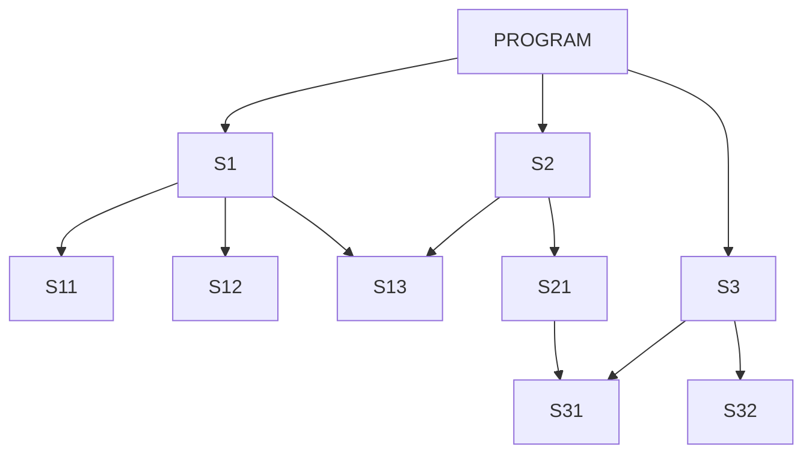

# Глава IV. Оптимизация фортранных подпрограмм

[Оглавление](README.md)

В этой небольшой главе мы вкратце рассмотрим некоторые вопросы оптимизации фортранных подпрограмм. Под оптимизацией здесь будет пониматься локальная (т. е. не затрагивающая общей структуры) модификация подпрограммы или комплекса подпрограмм, позволяющая ускорить их работу или уменьшить требуемый объем памяти.

Многие подпрограммы устроены так, что основная доля счетного времени в них падает на выполнение сравнительно небольшой последовательности операторов (самого внутреннего цикла). В этом случае нет смысла заниматься оптимизацией всей подпрограммы. Достаточно оптимизировать выполнение того внутреннего цикла, который забирает основную долю общего счетного времени.

В ряде случаев не имеет смысла оптимизировать подпрограмму по причине малого абсолютного выигрыша во времени. Например, если подпрограмма работает 5 минут и используется не слишком часто, то нет особой необходимости ее оптимизировать.
<a id="section-54"></a>

## § 54. Оптимизирующие возможности транслятора с фортрана

Для того чтобы умело пользоваться различными приемами оптимизации, полезно знать оптимизирующие возможности транслятора. На БЭСМ-6 транслятор с фортрана производит оптимизацию вычисления арифметических выражений в пределах одного оператора. Эта оптимизация состоит в следующем:

1) Функции от одних и тех же аргументов, встречающиеся в данном арифметическом выражении, вычисляются один раз для всего выражения. Например, в операторе

```fortran
Y=2.*SIN(X**2+C)+1./(SIN(X**2+C)+2.)
```

вычисление функции `SIN(X**2+C)` будет выполнено один раз.

2) Возведение в степень, показатель которой является целой константой, не превосходящей 8, транслятор заменяет последовательностью умножений. Например, оператор

```fortran
Y=X**5
```

будет преобразован транслятором в последовательность команд, состоящую из трех команд умножения (и нескольких команд считывания и записи).

3) Константы и простые переменные, не являющиеся элементами COMMON-блоков или формальными параметрами, имеют адреса, базированные по 7-му индекс-регистру (см. § 47). Это означает, что операции над этими величинами выполняются без дополнительных команд, необходимых для образования исполнительного адреса в командах с коротким адресом.

Отметим разницу в выполнении операций возведения в одну и ту же степень, заданных различными способами. Например, возведение вещественного Х в степень 3 можно задать следующими 4 способами:

- `X**3`
- `X**N`, где `N=3`
- `X**3.`
- `X**Y`, где `Y=3.`

Первая запись будет преобразована транслятором в последовательность из двух умножений.

Во втором случае транслятор сформирует обращение к системной подпрограмме `R*PO*I`, которая будет анализировать показатель N и производить нужные умножения. Здесь также будет выполнено два умножения, но в процессе анализа показателя степени N потребуется выполнить около десятка команд на каждое такое умножение. Тем самым время счета возрастает примерно на порядок по сравнению с первым случаем.

В двух последних случаях возведение в степень будет выполнено не через операции умножения, а как

`EXP(3.*ALOG(X))`

и

`EXP(Y*ALOG(X))` соответственно. Это означает, в частности, что возведение в такую степень возможно лишь для Х > 0. Отметим, что вычисление экспоненты и логарифма потребует примерно в 30 раз больше времени, чем вычисление `X**3` в первом случае.

В заключение скажем еще об оптимизации арифметических выражений. Назовем подвыражением арифметического выражения его часть, заключенную в скобки либо состоящую из операции вычисления функции.

Транслятор строит программу так, что одинаковые подвыражения (самого внутреннего уровня) вычисляются один раз. Поэтому, например, арифметическое выражение

`B*(X**2+3.)+(X**2+3.)+A`

будет вычислено быстрее, чем выражение

`B*(X**2+3.)+X**2+3.+A`

<a id="section-55"></a>

## § 55. Оптимизация путем изменения способа адресации величин

По способу адресации величины, используемые в подпрограмме, можно разделить на три типа: внутренние величины, элементы COMMON-блоков и формальные параметры.

Образование исполнительных адресов для внутренних величин производится путем базирования по 7-му индекс-регистру, т. е. без дополнительных команд модификации адреса.
Исполнительные адреса для элементов COMMON-блоков образуются с помощью команды UTC.

Формальные параметры адресуются косвенно, через команду WTC, которая выполняется медленно и замедляет выполнение других команд.

Отсюда следует, что операции над внутренними величинами выполняются наиболее быстро и реализуются посредством минимального числа машинных команд. Операции над элементами COMMON-блоков требуют большего числа команд и выполняются несколько медленнее операций над внутренними величинами. Операции над формальными параметрами занимают столько же места в памяти ЭВМ, что и операции над элементами COMMON-блоков, но выполняются значительно медленнее их. Поэтому переход к использованию внутренних величин вместо элементов COMMON-блоков и формальных параметров позволяет сэкономить счетное время и место в памяти.

Пусть, например, в некоторой подпрограмме простая переменная Х служит формальным параметром и часто используется. Тогда введение дополнительного оператора присваивания А = Х с последующим использованием внутренней переменной А вместо Х позволит сэкономить и счетное время, и место в памяти.

Замена формальных параметров элементами COMMON-блоков может дать выигрыш во времени счета, но такая замена не всегда удобна, да и не всегда возможна. В таких случаях иногда бывает выгодно перейти к автокоду (см. § 57).

<a id="section-56"></a>

## § 56. Оптимизация индексных выражений

Адресация элементов дву- и трехмерных массивов требует вычисления индексных функций, определяющих их относительные адреса в данном массиве. При этом существенно, что вычисляются сразу все индексные функции, зависящие от данной индексной переменной. Поэтому для образования различных индексных выражений иногда выгодно использовать отличные друг от друга индексные переменные. Например, запись вида

```fortran
      DO 1 I=1,20
    1 A(2*I+46)=0.
      DO 2 I=1,15
    2 B(I+1,2*I)=1.
```

можно оптимизировать, использовав во втором цикле другую индексную переменную.

В ряде случаев нет необходимости использовать элементы трехмерного массива как переменные с тремя индексами или элементы двумерного массива как переменные с двумя индексами. Например, вместо записи

```fortran
      DO 1 I=1,M
      DO 1 J=1,N
      DO 1 K=1,L
    1 A(I,J,K)=0.
```

можно написать

```fortran
      MNL=M*N*L
      DO 1 I=1,MNL
    1 A(I)=0.
```

В некоторых случаях можно уменьшить число индексов путем введения эквивалентности. Например, в записи.

```fortran
      DIMENSION A(30,20)
      D=0.
      DO 1 I=1,30
    1 D=D+A(I,5)*A(I,15)
```

можно ввести две дополнительных эквивалентности и переписать цикл в более экономном виде. Это можно сделать, например, так:

```fortran
      DIMENSION A(30,20),B(30),C(30)
      EQUIVALENCE (A(121),B),(A(421),C)
      D=0.
      DO 1 I=1,30
    1 D=D+B(I)*C(I)
```

Здесь элемент А(1,5), представленный как А(121), эквивалентен первому элементу массива В, и элемент А(1,15), представленный как A(421), эквивалентен первому элементу массива С.

В настоящее время разработан вариант транслятора, позволяющий в ряде случаев оптимизировать выполнение самых внутренних циклов [31], [32].

<a id="section-57"></a>

## § 57. Оптимизация с помощью автокода

Многие пользователи знают, что переход к автокоду позволяет в ряде случаев получить существенный выигрыш во времени счета. Однако программировать на автокоде гораздо сложнее, чем на фортране (или алголе). Разумный компромисс состоит в том, что в виде автокодных подпрограмм пишутся небольшие блоки фортранных (или алгольных) подпрограмм, представляющие собой самые внутренние циклы.

Пусть, например, написана подпрограмма

```fortran
      SUBROUTINE SCALAR(A,B,C,M,N)
      DIMENSION A(M,N),B(M,N),C(N)
      DO 2 J=1,N
      S=0.
      DO 1 I=1,M
    1 S=S+A(I,J)*B(I,J)
    2 C(J)=S
      RETURN
      END
```

Эта подпрограмма вычисляет скалярные произведения соответственных столбцов двумерных массивов А и В и заносит результаты в одномерный массив С. Здесь можно, конечно, провести оптимизацию, заменив во внутреннем цикле двумерные индексы на одномерные. Однако ввиду того, что массивы А и В являются формальными параметрами, внутренний цикл все равно будет выполняться довольно долго. Если М достаточно велико (скажем, не меньше 10), то оформление внутреннего цикла в виде простой автокодной подпрограммы даст значительную экономию времени. Такая подпрограмма уже была рассмотрена в § 48. Здесь остается ею воспользоваться. Итак, перепишем нашу подпрограмму в виде

```fortran
      SUBROUTINE SCALAR(A,B,C,M,N)
      DIMENSION A(M,N),B(M,N),C(N)
      I=1
      DO 2 J=1,N
      C(J)=SCAL(A(I),B(I),M)
    2 I=I+M
      RETURN
      END
```

Таким образом, оптимизация фортранных подпрограмм путем перехода к автокоду будет эффективной, если придерживаться следующих рекомендаций:

1. Нет необходимости всю подпрограмму переписывать на автокоде. Достаточно записать в виде автокодной подпрограммы (или подпрограммы-функции) лишь ту часть фортранной подпрограммы, которая забирает основную долю счетного времени.

2. Наиболее выгодно записывать на автокоде небольшие циклы. Эффект от перехода к автокоду увеличивается, если действия производятся с формальными параметрами.

<a id="section-58"></a>

## § 58. Способы экономии памяти. Сегментация задачи

До сих пор мы рассматривали способы экономии счетного времени (в ряде случаев попутно экономилась и память). Рассмотрим теперь способы экономии памяти (иногда, быть может, ценой увеличения счетного времени).

Максимальный объем оперативной памяти, доступный пользователю БЭСМ-6, составляет 72400В машинных слов, т. е. несколько более 29 листов. Необходимость в экономии памяти обычно возникает в тех случаях, когда задача не помещается в этот максимальный объем памяти.

Рассмотрим следующие способы экономии памяти:

1. Экономия в рамках отдельных подпрограмм путем описания дополнительных эквивалентностей.

2. Экономия в рамках всей задачи за счет введения дополнительных COMMON-блоков.

3. Экономия за счет отказа от форматного способа ввода-вывода информации.

4. Экономия путем сегментации задачи.

Первый способ экономии состоит в том, что выясняются дополнительные возможности описания эквивалентностей. Если, например, описаны массивы

```fortran
DIMENSION A(1000),B(2000)
```

и сначала используется массив А, а затем производится запись в массив В, то без ущерба для работы подпрограммы можно «заэквивалентить» начала этих массивов.

Второй способ позволяет экономить память в рамках всей задачи. При этом описываются дополнительные COMMON-блоки, и каждая подпрограмма, имеющая возможность передать часть своих внутренних массивов в «общее пользование», описывает некоторые из этих блоков. Иногда выгодно описать один большой COMMON-блок, с тем чтобы его могли использовать подпрограммы, которым требуются большие массивы. Для устранения возможного разбаланса в длинах блоков рекомендуется в головной программе (PROGRAM) описать их на максимальную длину.

Применяя этот способ экономии памяти, необходимо помнить, что при переходе от внутренних переменных к элементам COMMON-блоков происходит увеличение длины каждой из подпрограмм, описывающих соответствующие COMMON-блоки, за счет дополнительных команд UTC. Иногда такая «экономия» может привести к увеличению общего объема занимаемой памяти. Поэтому данный способ годится, вообще говоря, лишь для экономии массивов достаточно большой длины.

Третий способ экономии памяти состоит в том, что форматный ввод и вывод информации производится не с помощью операторов ввода-вывода и операторов FORMAT, а путем использования специальных системных подпрограмм. Это позволяет сэкономить примерно 1000 ячеек памяти. При таком способе экономии памяти придется отказаться от ввода данных с перфокарт и значительно ограничить возможности вывода информации на печать. Вывод на печать текстовой информации в этом случае можно произвести с помощью системной подпрограммы PRINTA, а распечатку чисел (аналогично формату Е) — с помощью подпрограммы PRINTE (см. § 52).

Сегментация задачи. Универсальным способом экономии памяти является сегментация задачи, которая состоит в разбиении ее на разделы, сменяющие друг друга в памяти. Рассмотрим конкретный пример.

Пусть схема взаимодействия отдельных подпрограмм задачи выглядит так (см. рис. 4).

Из схемы видно, что нет необходимости одновременно держать в памяти все подпрограммы. Сначала из PROGRAM достаточно вызвать подпрограмму S1, которая в свою очередь вызовет подпрограммы S11, S12 и S13. По окончании работы подпрограммы S1 на ее место можно загрузить S2, S21 и S31, оставив в памяти только S13, После того как сработает подпрограмма S2, на ее место можно загрузить S3 и S32, оставив в памяти только S31.

Таким образом, в памяти будут одновременно находиться лишь подпрограммы из каждого раздела S1, S2 и S3. Если и при таком способе сегментации все еще не хватает памяти, то можно произвести дополнительную сегментацию внутри каждого из разделов S1, S2 и S3. Например, внутри раздела S1 можно образовать подразделы S11, S12 и S13, поочередно загружая их в память.



Для того чтобы подпрограмма образовала сменяемый раздел, ее необходимо вызывать не непосредственно, а с помощью системной подпрограммы LOADGO. Обращение к ней имеет вид

```text
CALL LOADGO(P1,P2,...,Pn,'S')
```

Здесь S — наименование подпрограммы, заданное в виде текстовой константы; $P_1,P_2,\ldots,P_n$ — список ее фактических параметров при данном обращении. Например, вместо оператора

```fortran
CALL PS1(Z1,A(15,3))
```

пишется оператор

```fortran
CALL LOADGO(Z1,A(15,3),'PS1')
```

или

```fortran
CALL LOADGO(Z1,A(15,3),3HPS1)
```

Наименование подпрограммы, вызываемой через LOADGO, должно состоять не более чем из 6 символов и не содержать русских букв. При этом идентификатор подпрограммы должен быть указан без пробелов. Отметим,

что для образования сменяемого раздела необходимо, чтобы все вызовы его головной подпрограммы из всех подпрограмм были оформлены через LOADGO.

Сегментация на данном уровне осуществляется лишь в том случае, если на этом уровне имеется по меньшей мере два сменяемых раздела.

Рассмотрим конкретный пример сегментации для приведенной выше схемы. Будем предполагать, что все подпрограммы не имеют параметров.

```fortran
      PROGRAM TOLEG
      ...
      CALL LOADGO('S1')
      ...
      CALL LOADGO('S2')
      ...
      CALL LOADGO('S1')
      ...
      CALL S3
      ...
      CALL LOADGO('S1')
      ...
      END

      SUBROUTINE S1
      ...
      CALL LOADGO('S13')
      ...
      CALL LOADGO('S13')
      ...
      CALL S12
      ...
      CALL LOADGO('S11')
      ...
      CALL LOADGO('S13')
      ...
      RETURN
      END
```

Остальные подпрограммы вызываются непосредственно оператором CALL.

Работа программы будет происходить следующим образом. PROGRAM и все подпрограммы, не охваченные сегментацией (т. е. S3, S31 и S32), будут загружены в несменяемую область памяти. Затем будет загружен раздел S1 и подпрограмма S12 внутри этого раздела. Затем произойдет загрузка S13. При повторном вызове LOADGO с требованием на загрузку S13 выяснится, что данная подпрограмма уже загружена и повторной загрузки производиться не будет. Затем на место раздела S13 будет загружен раздел S11, после чего снова будет загружен S13 на место S11. После выхода из S1 на его место будет загружен раздел S2 и подразделы S13 и S21. Затем раздел S2 сменится разделом S1, который останется в памяти до окончания задачи.

При сегментации задачи надо учитывать наличие COMMON-блоков. Эти блоки необходимо дополнительно описать в одном из разделов, охватывающих все разделы, в подпрограммах которых описаны COMMON-блоки.

Пусть, например, в нашей схеме подпрограммы S11 и S21 имеют общий блок. Если не предпринять никаких дополнительных мер, то этот блок для подпрограммы S11 будет загружен вместе с разделом S1, а блок для подпрограммы S21 — вместе с разделом S2, который сменит раздел S1. Для того чтобы этот COMMON-блок мог функционировать, необходимо описать его в PROGRAM либо в одной из подпрограмм несегментируемой части задачи. Если имеется COMMON-блок для S11 и S13, то он должен быть описан в S1 или в любой из несегментируемых подпрограмм.

Для того чтобы отменить сегментацию некоторых подпрограмм внутри данного раздела, нет необходимости переписывать операторы вызова этих подпрограмм. Для этого достаточно описать эти подпрограммы в операторе EXTERNAL одного из «вышестоящих» разделов. Например, если в разделе S1 написать оператор EXTERNAL S11, то тем самым будет отменена сегментация этой подпрограммы внутри раздела S1. Описание ее в операторе EXTERNAL, расположенном в PROGRAM, приведет к тому, что S11 будет загружена в несменяемую область памяти.

Отметим, что сегментация задачи требует дополнительного машинного времени на перезагрузку разделов. В случае, когда разделы перезагружаются многократно, это может привести к значительному увеличению времени счета. Поэтому наиболее эффективный способ сегментации состоит в том, что самые внутренние, т. е. наиболее часто используемые подпрограммы, описываются оператором EXTERNAL в PROGRAM, попадая тем самым в несменяемую область памяти. Остальные, более редко используемые подпрограммы, сегментируются в той мере, в какой позволяет наличный объем памяти.

Отметим также, что при каждой перезагрузке происходит выдача списка вновь загружаемых подпрограмм. При отладке сегментируемой задачи не всегда удобно отключать эту выдачу. При счете по отлаженной программе можно использовать системную карту `*NO LOAD LIST`, отключающую печать всех таблиц загрузки.

Описанный способ сегментации (называемый динамическим) требует при каждой перезагрузке разделов производить настройку входящих в них подпрограмм по месту их нового расположения в памяти. При очень частой смене разделов это может вызвать значительные дополнительные затраты времени. Поэтому при запуске больших задач, требующих очень частой смены разделов, может оказаться выгодным использовать статический способ сегментации. Суть этого способа состоит в том, что до выхода задачи на счет формируется (на МБ) библиотека статических разделов, в которую записываются отдельные разделы, настроенные на фиксированные адреса памяти. Загрузка каждого такого раздела в процессе счета всякий раз будет производиться на одни и те же заранее определенные адреса памяти.

При использовании этого способа сегментации необходимо описать структуру каждого раздела (см. [27]).
