# БЭСМ-6: Архитектура, программирование и наследие


*БЭСМ-6 в вычислительном центре. Фото из архива Computer-museum.ru*

---

## Предисловие

БЭСМ-6 (Большая Электронно-Счётная Машина, 6-я модель) — это легендарная советская ЭВМ второго поколения, ставшая вершиной отечественной вычислительной техники 1960–1980-х годов. Разработанная под руководством академика С.А. Лебедева, она на протяжении двух десятилетий оставалась основной вычислительной платформой для самых ответственных задач — от расчётов ядерных реакторов до обработки телеметрии космических аппаратов.

Данный учебник представляет собой систематическое изложение архитектуры, программного обеспечения и практического применения БЭСМ-6. Он предназначен для:

- **Студентов** технических специальностей, изучающих историю вычислительной техники;
- **Программистов и инженеров**, интересующихся ретро-вычислениями и эмуляцией;
- **Всех, кто хочет понять**, как работали первые суперкомпьютеры и какое наследие они оставили.

Материал организован по восьми разделам, охватывающим путь от истории создания машины до её современных эмуляторов и реконструкций на ПЛИС.

---

## 📚 Оглавление

| Раздел | Файл | Содержание |
|--------|------|------------|
| **I** | [`01-history.md`](01-history.md) | История и контекст создания БЭСМ-6 |
| **II** | [`02-architecture.md`](02-architecture.md) | Архитектура и основные принципы работы |
| **III** | [`03-instruction-set.md`](03-instruction-set.md) | Программная модель и система команд |
| **IV** | [`04-software.md`](04-software.md) | Программное обеспечение и языки программирования |
| **V** | [`05-operating-systems.md`](05-operating-systems.md) | Операционные системы |
| **VI** | [`06-peripherals.md`](06-peripherals.md) | Периферийные устройства и ввод-вывод |
| **VII** | [`07-programming.md`](07-programming.md) | Процесс программирования и отладки |
| **VIII** | [`08-legacy.md`](08-legacy.md) | Примеры практического применения и наследие |

---

## Условные обозначения и сокращения

| Сокращение | Расшифровка |
|------------|-------------|
| АЦПУ | Алфавитно-цифровое печатающее устройство |
| БЕМШ | БЭСМ-6 — ЕС ЭВМ — Минск — Ш (ассемблер) |
| ДИСПАК | Диспетчер пакетов (ОС) |
| ЗУ | Запоминающее устройство |
| ИПМ | Институт прикладной математики АН СССР |
| КоП | Код операции |
| МАДЛЕН | Машинный Алгоритмический ДЛя Е-выходных (ассемблер) |
| НМД | Накопитель на магнитных дисках |
| НМЛ | Накопитель на магнитных лентах |
| НМБ | Накопитель на магнитных барабанах |
| ОС | Операционная система |
| ПЛИС (FPGA) | Программируемая логическая интегральная схема |
| ТЭЗ | Типовой элемент замены |
| A | Аккумулятор |
| Y | Регистр младших разрядов |
| I, J, M | Индекс-регистры (модификаторы) |
| K | Счётчик команд |
| R | Регистр режима |
| C | Базовый регистр |
| X | Операнд из памяти |

---

## Источники

При подготовке учебника использованы материалы следующих ресурсов:

- [Computer-museum.ru](https://www.computer-museum.ru) — виртуальный музей вычислительной техники
- [Parallel.ru](https://parallel.ru) — архив статей о суперкомпьютерах
- [Besm6.org](https://besm6.org) — сообщество энтузиастов БЭСМ-6
- [Большая российская энциклопедия](https://bigenc.ru) — статья «БЭСМ-6 (ЭВМ)»
- [Habr.com](https://habr.com) — статьи об эмуляции и восстановлении кода
- [GitHub — MESM6 project](https://github.com) — реконструкция процессора на ПЛИС

---

*Начало работы над учебником: июнь 2026 г.*# Раздел I: История и контекст создания БЭСМ-6


*Академик Сергей Алексеевич Лебедев (1902–1974) — главный конструктор БЭСМ-6, основоположник советской вычислительной техники*

---

## 1.1. Введение: место БЭСМ-6 в истории вычислительной техники

БЭСМ-6 (Большая Электронно-Счётная Машина, 6-я модель) занимает уникальное место в истории не только советской, но и мировой вычислительной техники. Созданная в середине 1960-х годов, она стала одной из первых в мире супер-ЭВМ с конвейерной архитектурой и виртуальной памятью — концепциями, которые десятилетия спустя стали стандартом для всех современных процессоров.

По своей производительности (около 1 млн операций с плавающей точкой в секунду) БЭСМ-6 находилась на уровне лучших западных машин своего времени — таких как IBM 7090 и CDC 6600. Однако в отличие от западных аналогов, БЭСМ-6 производилась серийно на протяжении почти 20 лет (1968–1987) и эксплуатировалась в сотнях вычислительных центров по всему Советскому Союзу.


*БЭСМ-6 в Политехническом музее (Москва) — общий вид стоек с оборудованием*

### 1.1.1. Мировой контекст: суперкомпьютеры 1960-х годов

1960-е годы стали периодом бурного развития вычислительной техники. В США и Европе одна за другой появлялись машины, закладывавшие основы современной архитектуры процессоров:

- **IBM 7090** (1959) — транзисторный мейнфрейм, производительность ~100 КФЛОПС, использовался в NASA для программы «Меркурий»;
- **CDC 6600** (1964) — первый суперкомпьютер с параллельными функциональными устройствами, разработанный Сеймуром Креем, производительность ~3 МФЛОПС;
- **IBM System/360** (1964) — семейство машин с единой архитектурой и системой команд, ставшее стандартом для деловых вычислений;
- **CDC 7600** (1967) — развитие CDC 6600, производительность ~10 МФЛОПС.

БЭСМ-6, появившаяся в 1965–1967 годах, находилась в одном ряду с этими машинами по производительности и архитектурным решениям. Более того, по некоторым параметрам — таким как реализация виртуальной памяти и конвейерная обработка — она опережала многие западные аналоги.

### 1.1.2. Почему БЭСМ-6 была важна для СССР

Для Советского Союза БЭСМ-6 стала не просто вычислительной машиной, а стратегическим инструментом:

- **Оборона и ядерная программа** — расчёты ядерных взрывов, баллистика ракет, проектирование ядерных реакторов;
- **Космическая программа** — расчёт траекторий полётов, обработка телеметрии, управление полётами;
- **Научные исследования** — численное моделирование в физике, химии, биологии;
- **Экономическое планирование** — расчёты межотраслевого баланса, оптимизационные задачи.

БЭСМ-6 стала основной вычислительной платформой для этих задач на два десятилетия, и её роль в советской науке и обороне трудно переоценить.

---

## 1.2. Предпосылки создания

### 1.2.1. Потребности науки и обороны

К началу 1960-х годов в СССР остро ощущалась нехватка высокопроизводительных вычислительных машин. Основные области, требовавшие мощных ЭВМ:

- **Ядерная физика** — расчёты цепных реакций, моделирование ядерных взрывов, проектирование реакторов. Для этих задач требовались машины с производительностью не менее 500 КФЛОПС;
- **Космические исследования** — баллистические расчёты траекторий, обработка телеметрии, управление полётами. Особенно остро потребность встала после запуска первых спутников и начала пилотируемой космонавтики;
- **Авиа- и ракетостроение** — аэродинамические расчёты, прочностные расчёты конструкций, моделирование обтекания профилей;
- **Метеорология** — численное прогнозирование погоды, требовавшее решения систем дифференциальных уравнений в частных производных;
- **Криптография** — задачи, связанные с государственной безопасностью.

Существовавшие на тот момент машины (М-20, М-220, БЭСМ-4) уже не справлялись с растущими требованиями по скорости и объёму памяти. Производительность в 20 тысяч операций в секунду была недостаточной для сложных научных расчётов, а объём оперативной памяти в 4–8 тысяч слов ограничивал размер решаемых задач.

### 1.2.2. Состояние вычислительной техники в СССР к 1963 году

К моменту начала проектирования БЭСМ-6 в СССР эксплуатировались следующие основные ЭВМ:

| Модель | Год | Быстродействие | Оперативная память | Элементная база |
|--------|-----|----------------|-------------------|-----------------|
| М-20 | 1959 | 20 тыс. оп/с | 4096 слов (45 бит) | Лампы |
| М-220 | 1962 | 20 тыс. оп/с | 8192 слов (45 бит) | Лампы + полупроводники |
| БЭСМ-4 | 1962 | 20 тыс. оп/с | 8192 слов (48 бит) | Полупроводники |
| М-40 | 1962 | 40 тыс. оп/с | 4096 слов | Полупроводники |
| Урал-11/14 | 1963 | 10–15 тыс. оп/с | 8192–16384 слов | Полупроводники |
| Минск-22 | 1963 | 5 тыс. оп/с | 8192 слов (37 бит) | Полупроводники |

Ни одна из этих машин не могла обеспечить требуемую производительность в 1 млн оп/с, которая была поставлена как цель для БЭСМ-6. Разрыв между потребностями и возможностями существующей техники становился критическим.

### 1.2.3. Международная гонка суперкомпьютеров

1960-е годы были периодом холодной войны, и вычислительная техника рассматривалась как стратегический ресурс. В США активно развивались проекты суперкомпьютеров:

- **CDC 6600** (1964) — первый коммерческий суперкомпьютер, 3 МФЛОПС;
- **IBM 7030 Stretch** (1961) — экспериментальный суперкомпьютер, 1.2 МФЛОПС;
- **UNIVAC LARC** (1960) — суперкомпьютер для атомных исследований.

СССР не мог оставаться в стороне от этой гонки. Создание собственного суперкомпьютера, не уступающего лучшим западным образцам, стало задачей государственной важности. Именно эту задачу и призвана была решить БЭСМ-6.

---

## 1.3. Коллектив разработчиков

### 1.3.1. Академик Сергей Алексеевич Лебедев

Сергей Алексеевич Лебедев (1902–1974) — основоположник советской вычислительной техники. Его путь в вычислительную технику начался в 1940-х годах, когда он, будучи специалистом в области электроэнергетики, осознал необходимость создания автоматических вычислительных машин для решения сложных научных задач.

Под его руководством были созданы:

- **МЭСМ** (Малая Электронно-Счётная Машина, 1951) — первая в СССР и континентальной Европе электронная вычислительная машина. МЭСМ содержала около 6000 электронных ламп и выполняла 3000 операций в секунду;
- **БЭСМ-1** (1952) — первая советская большая ЭВМ, производительностью 8–10 тысяч операций в секунду;
- **БЭСМ-2** (1955) — серийная версия БЭСМ-1 с улучшенными характеристиками;
- **БЭСМ-3М** (1958) — модернизация с использованием полупроводниковых элементов;
- **БЭСМ-4** (1962) — полностью полупроводниковая машина;
- **БЭСМ-6** (1964–1967) — вершина его конструкторской мысли.

Лебедев лично участвовал в разработке архитектуры БЭСМ-6, включая конвейерную организацию и систему команд. Он был не только руководителем, но и активным участником инженерной работы, часто предлагая оригинальные технические решения.

### 1.3.2. Заместители и ключевые сотрудники

- **В.А. Мельников** — заместитель главного конструктора, внёсший значительный вклад в разработку арифметического устройства и системы памяти. Впоследствии — главный конструктор суперкомпьютеров «Эльбрус»;
- **Л.Н. Королёв** — заместитель главного конструктора, руководитель разработки математического обеспечения и операционной системы. Создатель ДИСПАК;
- **В.С. Бурцев** — разработчик системы прерываний и защиты памяти. Впоследствии — главный конструктор вычислительных комплексов для систем ПВО;
- **П.П. Головистиков** — разработчик элементной базы и конструкции ТЭЗов;
- **А.П. Ершов** — руководитель разработки трансляторов и системного программного обеспечения;
- **М.Р. Шура-Бура** — разработчик системных утилит и библиотек.


*Коллектив разработчиков БЭСМ-6 в ИТМиВТ АН СССР, 1965 г.*


*С.А. Лебедев за работой в лаборатории ИТМиВТ*

### 1.3.3. Организация разработки

Разработка БЭСМ-6 велась в **Институте точной механики и вычислительной техники (ИТМиВТ) АН СССР**, основанном в 1948 году. Институт был головной организацией по созданию вычислительной техники в СССР.

Процесс разработки был организован следующим образом:

- **Архитектурная группа** (Лебедев, Мельников) — определение общей архитектуры, системы команд, форматов данных;
- **Схемотехническая группа** (Головистиков) — разработка элементной базы, ТЭЗов, принципиальных схем;
- **Группа математического обеспечения** (Королёв, Ершов) — разработка системного ПО, трансляторов, библиотек;
- **Группа испытаний** — отладка и тестирование аппаратуры.

Общая численность коллектива разработчиков составляла около 200 человек — значительный по тем временам коллектив.

---

## 1.4. Хронология создания и производства

### 1.4.1. Этапы разработки

| Дата | Событие |
|------|---------|
| 1963 г. | Начало проектирования в ИТМиВТ АН СССР. Определение основных архитектурных принципов |
| 1964 г. | Завершение технического проекта. Разработка принципиальных схем и конструкции |
| 1965 г. | Изготовление опытного образца. Начало наладки и отладки |
| 1966 г. | Начало опытной эксплуатации. Выполнение первых тестовых задач |
| 1967 г. | Государственные испытания — машина принята в серийное производство |
| 1968 г. | Начало серийного выпуска на Заводе счётно-аналитических машин (ЗСАМ, г. Москва) |
| 1970 г. | Первая модернизация: увеличение объёма ОЗУ до 32К слов |
| 1972 г. | Вторая модернизация: добавление магнитных дисков, увеличение ОЗУ до 64К слов |
| 1975 г. | Третья модернизация: новые периферийные устройства, улучшенная система охлаждения |
| 1980 г. | Четвёртая модернизация: видеотерминалы, диалоговый режим работы |
| 1985 г. | Последняя модернизация: увеличение надёжности, новые блоки питания |
| 1987 г. | Окончание серийного производства |

### 1.4.2. География установок

БЭСМ-6 была установлена в более чем 200 организациях, включая:

- **Научные центры**: ИПМ АН СССР, ИТМиВТ, ВЦ АН СССР, ВЦ СО АН СССР (Новосибирск), ВЦ УрО АН СССР (Свердловск);
- **Оборонные предприятия**: Министерство среднего машиностроения, Министерство общего машиностроения, КБ-1, ЦНИИмаш;
- **Космические центры**: Центр управления полётами (ЦУП, Королёв), Байконур, космодром Плесецк;
- **Университеты**: МГУ, МФТИ, НГУ, КГУ, ЛГУ, ТГУ и другие;
- **Промышленность**: авиационные и ракетные КБ (Туполев, Ильюшин, Сухой, Микоян, Янгель, Челомей);
- **Академии наук союзных республик**: Украина, Белоруссия, Казахстан, Узбекистан, Грузия, Армения.


*Типовой вычислительный центр на базе БЭСМ-6, 1970-е годы*

### 1.4.3. Организация серийного производства

Серийное производство БЭСМ-6 было организовано на **Заводе счётно-аналитических машин (ЗСАМ)** в Москве. Завод выпускал:

- **1968–1970**: 10–15 машин в год (освоение производства);
- **1971–1975**: 25–30 машин в год (пик производства);
- **1976–1980**: 15–20 машин в год (стабильный выпуск);
- **1981–1987**: 5–10 машин в год (затухание производства).

Всего за 20 лет было выпущено около **350 машин БЭСМ-6** — значительное количество для суперкомпьютера того времени.

---

## 1.5. Значение и влияние

### 1.5.1. Вклад в развитие вычислительной техники

БЭСМ-6 стала платформой, на которой выросло целое поколение советских программистов и системных инженеров. На ней были разработаны и отлажены:

- Первые советские операционные системы с разделением времени (ДИСПАК);
- Трансляторы с языков высокого уровня (Фортран, Алгол-60, Паскаль, ЛИСП, РЕФАЛ);
- Пакеты прикладных программ для научных расчётов (линейная алгебра, дифференциальные уравнения, метод Монте-Карло);
- Системы реального времени для управления космическими полётами;
- Системы автоматизированного проектирования (САПР) для авиа- и ракетостроения.

### 1.5.2. Влияние на последующие разработки

Архитектурные решения БЭСМ-6 оказали влияние на последующие советские ЭВМ:

- **Эльбрус-1** (1978) — унаследовал конвейерную организацию и систему защиты памяти;
- **Эльбрус-2** (1984) — развил идеи параллельной обработки и многопроцессорности;
- **ЕС ЭВМ** (рядные модели) — заимствовали отдельные принципы организации ввода-вывода;
- **Персональные ЭВМ** (1980-е) — система команд БЭСМ-6 изучалась как классический пример гарвардской архитектуры.

### 1.5.3. Школа программистов

БЭСМ-6 воспитала целую плеяду выдающихся специалистов:

- **А.П. Ершов** — один из пионеров советского программирования, создатель первых трансляторов, основатель сибирской школы программирования;
- **В.М. Глушков** — основатель кибернетики в СССР, создатель теории цифровых автоматов;
- **М.Р. Шура-Бура** — разработчик системного программного обеспечения, один из создателей первых советских операционных систем;
- **В.Ф. Турчин** — создатель языка РЕФАЛ, пионер в области функционального программирования;
- **В.А. Мельников** — впоследствии главный конструктор суперкомпьютеров «Эльбрус»;
- **В.С. Бурцев** — создатель вычислительных комплексов для систем ПВО и ПРО.

### 1.5.4. БЭСМ-6 в мировой истории вычислительной техники

В контексте мировой истории вычислительной техники БЭСМ-6 занимает особое место:

- Она была создана в условиях технологической изоляции СССР, без доступа к западным разработкам;
- Многие архитектурные решения (конвейер, виртуальная память, ассоциативная память) были разработаны независимо от западных аналогов;
- БЭСМ-6 стала одной из первых в мире машин, реализовавших концепцию виртуальной памяти на аппаратном уровне;
- Долговременность производства (20 лет) и эксплуатации (до начала 1990-х годов) — уникальное явление для суперкомпьютеров.

### 1.5.5. Бенчмарки и сравнение с аналогами

Для объективной оценки производительности БЭСМ-6 необходимо рассмотреть её показатели в сравнении с современными ей зарубежными машинами.

#### Сравнение производительности (MFLOPS)

| ЭВМ | Год выпуска | Производительность (MFLOPS) | Тактовая частота | Разрядность | Технология |
|:---|:---:|:---:|:---:|:---:|:---|
| **БЭСМ-6** | **1967** | **~1.0** | **10 МГц** | **48 бит** | **Дискретные транзисторы** |
| IBM 7090 | 1959 | ~0.1 | 2.2 МГц | 36 бит | Транзисторы |
| CDC 6600 | 1964 | ~3.0 | 10 МГц | 60 бит | Дискретные транзисторы |
| IBM System/360-75 | 1965 | ~0.5 | 5 МГц | 32 бит | Гибридные микросхемы |
| CDC 7600 | 1967 | ~10.0 | 36 МГц | 60 бит | Дискретные транзисторы |
| IBM 360/91 | 1967 | ~2.0 | 12.5 МГц | 32 бит | Гибридные микросхемы |

#### Сравнение архитектурных характеристик

| Параметр | БЭСМ-6 | CDC 6600 | IBM 360/75 |
|:---|:---|:---|:---|
| Конвейерная архитектура | Да (5 ступеней) | Да (10 функц. устройств) | Нет |
| Виртуальная память | Да (страничная) | Нет | Нет |
| Ассоциативная память (кэш) | Да (16 слов) | Нет | Нет |
| Количество регистров | 5 + 16 индексных | 24 + 8 индексных | 16 |
| Размер слова | 48 бит | 60 бит | 32 бит |
| Объём ОЗУ (макс.) | 64K × 48 бит | 128K × 60 бит | 256K × 32 бит |
| Энергопотребление | 30-40 кВт | 50 кВт | 40 кВт |
| Количество транзисторов | ~60 000 | ~400 000 | ~200 000 |

#### Результаты тестовых задач

Для БЭСМ-6 были проведены сравнительные тесты на типовых научных задачах:

| Задача | БЭСМ-6 | IBM 360/75 | Отношение |
|:---|:---:|:---:|:---:|
| Решение СЛАУ 100×100 (метод Гаусса) | 0.8 с | 0.6 с | 1.33× |
| Умножение матриц 50×50 | 0.5 с | 0.4 с | 1.25× |
| БПФ (1024 точки) | 2.1 с | 1.8 с | 1.17× |
| Моделирование нейтронного переноса (Монте-Карло, 10⁶ ист.) | 15 мин | 12 мин | 1.25× |
| Расчёт траектории (орбитальная механика) | 3.2 с | 2.9 с | 1.10× |

**Анализ результатов:**

1. По производительности на операциях с плавающей точкой БЭСМ-6 уступала CDC 6600 примерно в 3 раза, но находилась на уровне IBM System/360-75 и превосходила IBM 7090 в 10 раз.
2. По архитектурным решениям (виртуальная память, ассоциативная память, конвейер) БЭСМ-6 опережала IBM System/360 и была сопоставима с CDC 6600.
3. По энергоэффективности (MFLOPS/кВт) БЭСМ-6 (0.025) уступала CDC 6600 (0.06), что объяснялось менее совершенной элементной базой.
4. По надёжности БЭСМ-6 демонстрировала среднее время наработки на отказ около 50-100 часов, что было типичным для машин того времени.

#### Сравнение с советскими аналогами

| Параметр | БЭСМ-6 | М-220 | Минск-32 | ЕС-1020 |
|:---|:---:|:---:|:---:|:---:|
| Год выпуска | 1967 | 1962 | 1968 | 1972 |
| Производительность (тыс. оп/с) | 1000 | 20 | 65 | 20 |
| ОЗУ (слов) | 64K | 8K | 16K | 64K |
| Разрядность | 48 | 45 | 37 | 32 |
| Технология | Транзисторы | Лампы+транз. | Транзисторы | Микросхемы |

БЭСМ-6 превосходила все советские машины своего времени по производительности в 15-50 раз, оставаясь самым мощным советским компьютером вплоть до появления «Эльбрус-1» в 1978 году.

---

## Ключевые выводы раздела

1. БЭСМ-6 была создана в ответ на острую потребность в высокопроизводительных вычислениях для науки и обороны СССР.
2. Разработка велась под руководством академика С.А. Лебедева — основоположника советской вычислительной техники.
3. Машина производилась серийно почти 20 лет (1968–1987) и была установлена в сотнях организаций по всему СССР.
4. БЭСМ-6 стала платформой для развития советского системного программирования и школой для целого поколения специалистов.
5. Архитектурные решения БЭСМ-6 (конвейер, виртуальная память, система прерываний) опередили своё время и повлияли на последующие разработки.
6. В мировом контексте БЭСМ-6 является примером успешного создания суперкомпьютера в условиях технологической изоляции.

---

**Далее:** [Раздел II: Архитектура и основные принципы работы](02-architecture.md)# Раздел II: Архитектура и основные принципы работы


*Упрощённая блок-схема основных функциональных устройств БЭСМ-6*


*Стойка управления БЭСМ-6 с блоками функциональных устройств*

---

## 2.1. Общая структура: конвейерная архитектура

### 2.1.1. Принцип «водопровода»

БЭСМ-6 стала одной из первых в мире ЭВМ, реализовавших **конвейерную (конвейерную) архитектуру** — принцип, при котором выполнение команды разбивается на несколько последовательных этапов, и различные этапы разных команд выполняются параллельно. Этот принцип, известный сегодня как RISC-конвейер, был реализован в БЭСМ-6 за два десятилетия до появления первых коммерческих RISC-процессоров.

В БЭСМ-6 было реализовано **5 специализированных функциональных устройств**, работающих параллельно:

1. **Устройство управления (УУ)** — выборка команд, дешифрация, формирование адресов;
2. **Устройство выборки (УВ)** — обращение к оперативной памяти для чтения операндов;
3. **Арифметическое устройство аддитивное (АУ-А)** — сложение, вычитание, логические операции;
4. **Арифметическое устройство мультипликативное (АУ-М)** — умножение, деление, сдвиги;
5. **Устройство записи (УЗ)** — запись результатов в оперативную память.


*Схема конвейерной обработки: 5 ступеней выполняются параллельно для разных команд*

Каждое устройство имело собственный **входной буфер** (FIFO) на несколько команд, что позволяло сглаживать неравномерность загрузки. УУ выбирало команды из памяти с опережением и распределяло их по буферам исполнительных устройств.

### 2.1.2. Специализация функциональных устройств

Ключевая особенность архитектуры БЭСМ-6 — **жёсткая специализация** функциональных устройств. Каждое устройство может выполнять только определённый набор операций:

| Устройство | Выполняемые операции | Время выполнения | Размер буфера |
|------------|---------------------|------------------|---------------|
| УУ (управление) | Выборка, дешифрация, модификация адреса | 1 такт (100 нс) | 4 команды |
| УВ (выборка) | Чтение из ОЗУ | 2 такта (200 нс) | 2 команды |
| АУ-А (аддитивное) | Сложение, вычитание, логические операции | 1-2 такта | 2 команды |
| АУ-М (мультипликативное) | Умножение, деление, сдвиги | 4-12 тактов | 1 команда |
| УЗ (запись) | Запись в ОЗУ | 2 такта (200 нс) | 2 команды |

Такая специализация позволяла достичь высокой производительности: при оптимальной организации программы конвейер выдавал результат практически каждый такт. Пиковая производительность составляла **до 1 млн операций/с** (1 MFLOPS), что было выдающимся показателем для середины 1960-х годов.

### 2.1.3. Конфликты в конвейере и их разрешение

Как и в современных процессорах, в конвейере БЭСМ-6 возникали конфликты трёх типов:

#### Конфликты по данным (Data Hazards)

Возникают, когда следующая команда использует результат предыдущей, но он ещё не готов. В БЭСМ-6 не было аппаратного пересылания данных (forwarding), поэтому программист должен был явно вставлять «холостые» команды или переставлять команды местами.

**Пример конфликта по данным:**
```asm
СЧ    X         * A := X (загрузка — 2 такта)
СЛ    Y         * A := A + Y (конфликт! X ещё не загружен)
```

**Решение:** вставка независимой команды между ними:
```asm
СЧ    X         * A := X
УИА   М20       * установка индекс-регистра (независимая операция)
СЛ    Y         * A := A + Y (X уже загружен)
```

#### Конфликты по управлению (Control Hazards)

Возникают при условных переходах — конвейер уже выбрал следующие команды, но переход может их аннулировать. В БЭСМ-6 использовалась **аппаратная блокировка конвейера** на время вычисления адреса перехода, что приводило к потере 2-3 тактов.

#### Конфликты по ресурсам (Structural Hazards)

Возникают, когда два устройства пытаются одновременно обратиться к памяти. Для их разрешения использовалось **расслоение памяти** (4 независимых банка) и арбитраж доступа.

### 2.1.4. Тактирование и синхронизация

БЭСМ-6 работала на тактовой частоте **10 МГц** (период такта 100 нс). Синхронизация осуществлялась центральным генератором тактовых импульсов, который распределял синхросигналы по всем стойкам машины. Из-за большой физической длины кабелей (до 15 метров между стойками) синхронизация представляла серьёзную инженерную задачу — требовалось компенсировать задержки распространения сигналов.

---

## 2.2. Система памяти

### 2.2.1. Иерархическая структура памяти

Память БЭСМ-6 была организована иерархически, что обеспечивало баланс между скоростью, объёмом и стоимостью:


*Иерархия запоминающих устройств БЭСМ-6: от сверхбыстрых регистров до магнитных лент*

**Полная иерархия памяти БЭСМ-6:**

| Уровень | Тип | Ёмкость | Время доступа | Технология |
|---------|-----|---------|---------------|------------|
| L0 | Регистры процессора (A, Y, R, C, K) | 5 × 48 бит | 0.1 мкс | Триггеры на транзисторах |
| L1 | Индекс-регистры (I₀–I₁₅) | 16 × 15 бит | 0.1 мкс | Триггеры на транзисторах |
| L2 | Ассоциативная память (кэш) | 16 × 48 бит | 0.2 мкс | Быстрые триггеры |
| L3 | Оперативная память (ОЗУ) | 16K–64K × 48 бит | 2 мкс | Ферритовые сердечники |
| L4 | Магнитные барабаны (НМБ) | 50K–500K слов | 10–20 мс | Магнитное покрытие |
| L5 | Магнитные диски (НМД) | 5–50 Мбайт | 30–100 мс | Магнитные пластины |
| L6 | Магнитные ленты (НМЛ) | до 50 Мбайт/катушка | секунды–минуты | Магнитная лента |


*Плата ферритовой оперативной памяти БЭСМ-6 — матрица ферритовых сердечников*

### 2.2.2. Оперативная память (ОЗУ)

Оперативная память БЭСМ-6 строилась на **ферритовых сердечниках** (ферритовая память). Основные характеристики:

- **Разрядность**: 48 бит + 1 бит контроля чётности;
- **Ёмкость**: от 16K до 64K 48-битных слов (в разных модификациях);
- **Время цикла**: 2 мкс (чтение или запись);
- **Расслоение (interleaving)**: память делилась на 4 независимых модуля (банка), что позволяло одновременно выполнять до 4 обращений.

**Принцип расслоения**: последовательные ячейки памяти располагались в разных банках:

| Адрес (дес.) | Адрес (восьм.) | Банк | Смещение в банке |
|-------------|----------------|------|------------------|
| 0 | 00000 | 0 | 00000 |
| 1 | 00001 | 1 | 00001 |
| 2 | 00002 | 2 | 00002 |
| 3 | 00003 | 3 | 00003 |
| 4 | 00004 | 0 | 00004 |
| 5 | 00005 | 1 | 00005 |
| ... | ... | ... | ... |

Это позволяло конвейеру обращаться к памяти практически каждый такт, не дожидаясь завершения цикла предыдущего обращения. Если программа обращалась к последовательным адресам, каждый банк успевал завершить цикл (2 мкс) до следующего обращения к нему.

**Временная диаграмма работы расслоения (Mermaid):**

```mermaid
gantt
    title Расслоение памяти БЭСМ-6 — временная диаграмма
    dateFormat  SSS
    axisFormat %L
    Банк 0 :a0, 000, 2
    Банк 0 :a1, 004, 2
    Банк 1 :b0, 001, 2
    Банк 1 :b1, 005, 2
    Банк 2 :c0, 002, 2
    Банк 2 :c1, 006, 2
    Банк 3 :d0, 003, 2
    Банк 3 :d1, 007, 2
```

*Каждый банк выполняет чтение за 2 такта (200 нс). Благодаря сдвигу стартовых моментов, конвейер может обращаться к памяти каждый такт.*

Каждый банк имел собственный дешифратор адреса, усилители чтения и записи. Физически банки размещались на отдельных платах в стойке памяти.

### 2.2.3. Виртуальная (математическая) память

БЭСМ-6 была одной из первых ЭВМ, реализовавших **виртуальную память** (в советской терминологии — «математическая память»). Механизм работал следующим образом:

- Программа оперировала **виртуальными адресами** (15-битными);
- Аппаратный блок преобразования адресов (БПА) транслировал их в **физические адреса**;
- Преобразование выполнялось с помощью **страничной организации**: виртуальное адресное пространство делилось на страницы по 64 слова;
- Каждой странице сопоставлялся **регистр преобразования адреса (РПА)**, хранящий номер физической страницы.

**Детальный алгоритм преобразования виртуального адреса:**

1. 15-битный виртуальный адрес делится на две части:
   - **Номер виртуальной страницы** (старшие 9 бит, разряды 14–6) — 512 возможных страниц;
   - **Смещение внутри страницы** (младшие 6 бит, разряды 5–0) — 64 слова на страницу.
2. Номер виртуальной страницы используется как индекс в таблице РПА (512 регистров).
3. РПА содержит:
   - **Номер физической страницы** (9 бит);
   - **Признак присутствия** (1 бит) — находится ли страница в ОЗУ;
   - **Признак модификации** (1 бит) — была ли страница изменена;
   - **Признак обращения** (1 бит) — было ли обращение к странице.
4. Если страница присутствует в ОЗУ, физический адрес формируется как `(номер_физ_страницы << 6) | смещение`.
5. Если страница отсутствует — возникает прерывание «отсутствие страницы», и ОС загружает её с диска или барабана.

**Пример преобразования:**
```
Виртуальный адрес: 01234 (восьмеричный)
  = 000 001 010 011 100 (двоичный)
  Номер страницы: 000001010 = 012 (восьмеричный) = 10 (десятичный)
  Смещение: 011100 = 34 (восьмеричный) = 28 (десятичный)

РПА[10] = { физ_страница = 037, присутствует = да }

Физический адрес = (037 << 6) | 034 = 03700 | 034 = 03734 (восьмеричный)
```

### 2.2.4. Ассоциативная память (сверхбыстрые регистры)

Для ускорения доступа к часто используемым данным в БЭСМ-6 использовалась **ассоциативная память** (в современной терминологии — кэш). Она представляла собой набор из 16 сверхбыстрых регистров, каждый из которых мог хранить:

- **Адрес** (тег) — виртуальный адрес слова (15 бит);
- **Данные** — 48-битное значение;
- **Признак занятости** (1 бит).

Обращение к ассоциативной памяти выполнялось за 0.2 мкс — в 10 раз быстрее, чем к основной ОЗУ. Если требуемое слово находилось в ассоциативной памяти (cache hit), обращение к ОЗУ не производилось.

**Алгоритм работы ассоциативной памяти:**

1. При каждом обращении к памяти виртуальный адрес одновременно подаётся на ассоциативную память и на БПА.
2. Ассоциативная память сравнивает адрес со всеми 16 тегами параллельно (ассоциативный поиск).
3. Если совпадение найдено (hit) — данные из соответствующего регистра выдаются за 0.2 мкс.
4. Если совпадения нет (miss) — данные читаются из ОЗУ (2 мкс) и, если есть свободный регистр, кэшируются.

**Эффективность:** при правильной организации программы ассоциативная память обеспечивала hit rate до 80-90%, что давало значительный прирост производительности.

---

## 2.3. Система прерываний и режимы работы

### 2.3.1. Режимы пользователя и супервизора

БЭСМ-6 поддерживала **два режима работы**:

- **Режим пользователя** — ограниченный набор команд, запрет на прямую работу с периферией;
- **Режим супервизора** — полный доступ ко всем ресурсам, выполнение привилегированных команд.

Переключение между режимами осуществлялось через **систему прерываний** и **экстракоды** (программные прерывания). В режиме пользователя были запрещены следующие операции:
- Команда `рег` (обращение к специальным регистрам);
- Команда `увв` (управление вводом-выводом);
- Изменение регистра C (базовый адрес) и регистра границы;
- Изменение таблицы РПА (страничное преобразование).

### 2.3.2. Система прерываний

Система прерываний БЭСМ-6 включала следующие типы:

| Тип прерывания | Причина | Обработка | Приоритет |
|----------------|---------|-----------|-----------|
| Внешнее | Сигнал от периферийного устройства | Переход к подпрограмме обработки | 1 (высший) |
| Внутреннее | Ошибка (деление на ноль, переполнение) | Аварийное завершение или коррекция | 2 |
| Программное | Экстракод (системный вызов) | Переход в режим супервизора | 3 |
| По вводу-выводу | Завершение операции ввода-вывода | Продолжение выполнения программы | 4 |

**Механизм обработки прерывания:**

1. Устройство выставляет сигнал прерывания на шину.
2. УУ завершает текущую команду и сохраняет контекст:
   - Счётчик команд K → стек прерываний;
   - Регистр режима R → стек прерываний;
   - Регистр C (базовый) → стек прерываний.
3. УУ определяет вектор прерывания (адрес обработчика).
4. Производится переключение в режим супервизора.
5. Управление передаётся обработчику прерывания.
6. После завершения обработки выполняется инструкция возврата, восстанавливающая контекст.

**Векторная таблица прерываний** располагалась в фиксированных ячейках памяти (адреса 00000–00037 в восьмеричной системе). Каждому типу прерывания соответствовал свой вектор — адрес обработчика.

### 2.3.3. Защита памяти

Защита памяти в БЭСМ-6 реализовывалась на аппаратном уровне:

- Каждой программе выделялась **зона памяти**, задаваемая базовым регистром C и регистром границы;
- Попытка обращения за пределы выделенной зоны вызывала прерывание;
- В режиме пользователя запрещалось изменять регистры защиты.

**Механизм проверки защиты:**

1. При каждом обращении к памяти исполнительный адрес сравнивается с регистром границы.
2. Если адрес ≥ границы — генерируется прерывание «нарушение защиты».
3. Если адрес < границы — к адресу прибавляется базовый регистр C, формируя физический адрес.

Этот механизм позволял реализовать **релокацию программ** — загрузку в произвольную область памяти без модификации кода.

---

## 2.4. Элементная база и конструкция (ТЭЗы)

### 2.4.1. Транзисторно-диодная логика

БЭСМ-6 была построена на **дискретных полупроводниковых элементах** — транзисторах и диодах. Интегральные микросхемы в то время ещё не были доступны. Основные характеристики элементной базы:

- **Транзисторы**: германиевые (типа П-401, П-402, П-403);
- **Диоды**: кремниевые (типа Д-219, Д-220);
- **Логические элементы**: диодно-транзисторная логика (ДТЛ);
- **Тактовая частота**: 10 МГц (период такта 100 нс).

**Базовые логические элементы ДТЛ:**

| Элемент | Состав | Задержка | Применение |
|---------|--------|----------|------------|
| 2И-НЕ | 2 диода + транзистор | ~30 нс | Универсальный логический элемент |
| 3И-НЕ | 3 диода + транзистор | ~35 нс | Расширенная логика |
| Триггер RS | 2 × 2И-НЕ | ~50 нс | Хранение бита |
| Триггер D | 6 × 2И-НЕ | ~80 нс | Регистры и счётчики |

### 2.4.2. Типовые Элементы Замены (ТЭЗы)

Конструктивно БЭСМ-6 была выполнена в виде **ТЭЗов** — Типовых Элементов Замены. Каждый ТЭЗ представлял собой печатную плату размером примерно 130×80 мм с установленными на ней электронными компонентами.


*Типовой элемент замены (ТЭЗ) БЭСМ-6 с транзисторно-диодными логическими элементами*


*Стойка БЭСМ-6 с установленными ТЭЗами — вид на монтажное пространство*

**Характеристики ТЭЗов:**

| Параметр | Значение |
|----------|----------|
| Размер платы | 130×80 мм |
| Количество транзисторов | 10-30 шт. |
| Количество диодов | 20-60 шт. |
| Количество резисторов | 30-80 шт. |
| Разъём | 2×22 контакта |
| Потребляемая мощность | 2-5 Вт |
| Масса | ~150 г |

**Каталог основных типов ТЭЗов (всего ~200 типов):**

| Тип ТЭЗа | Назначение | Количество в БЭСМ-6 |
|----------|------------|-------------------|
| ТЭЗ-1 | Логический элемент 2И-НЕ | ~2000 |
| ТЭЗ-2 | Логический элемент 3И-НЕ | ~500 |
| ТЭЗ-3 | RS-триггер | ~1000 |
| ТЭЗ-4 | D-триггер | ~800 |
| ТЭЗ-5 | Усилитель сигнала | ~400 |
| ТЭЗ-6 | Формирователь импульсов | ~300 |
| ТЭЗ-7 | Счётчик | ~200 |
| ТЭЗ-8 | Регистр | ~300 |
| ТЭЗ-9 | Дешифратор | ~150 |
| ТЭЗ-10 | Сумматор | ~100 |

Всего в БЭСМ-6 использовалось около **200 типов ТЭЗов**, общее количество — **несколько тысяч штук**. Каждый ТЭЗ имел уникальный номер и цветовую маркировку для облегчения идентификации и замены.

### 2.4.3. Компоновка и охлаждение

БЭСМ-6 размещалась в нескольких металлических шкафах (стойках):

- **Стойка управления** — устройство управления и арифметические устройства;
- **Стойка памяти** — оперативная память и блоки преобразования адресов;
- **Стойки периферии** — контроллеры внешних устройств.

**Габариты и вес:**

| Стойка | Размеры (В×Ш×Г) | Вес |
|--------|-----------------|-----|
| Стойка управления | 200×80×80 см | ~500 кг |
| Стойка памяти | 200×80×80 см | ~400 кг |
| Стойка периферии | 200×80×80 см | ~300 кг |
| Пульт оператора | 120×150×80 см | ~200 кг |

Общее энергопотребление машины составляло около **30-40 кВт**. Для отвода тепла использовалось принудительное воздушное охлаждение:

- **Вентиляторы**: осевые, диаметр 300 мм, 2-3 на стойку;
- **Воздушный поток**: ~5000 м³/ч на стойку;
- **Температура внутри стоек**: 35-45°C при комнатной температуре 20°C;
- **Система фильтрации**: сменные фильтры на воздухозаборниках.

Для особо теплонагруженных элементов (выходные усилители, мощные транзисторы) использовались индивидуальные радиаторы.

### 2.4.4. Система электропитания

БЭСМ-6 требовала стабилизированного электропитания:

| Напряжение | Назначение | Ток |
|------------|------------|-----|
| +5 В | Логические элементы (транзисторы) | ~200 А |
| +12 В | Промежуточные усилители | ~50 А |
| -12 В | Смещение для транзисторов | ~20 А |
| +24 В | Реле и индикаторы | ~10 А |
| ~220 В | Вентиляторы | ~15 А |

Питание осуществлялось от специальных выпрямителей и стабилизаторов, размещённых в отдельных шкафах. Для обеспечения бесперебойной работы использовались мотор-генераторы, сглаживающие перепады напряжения в сети.

---

## Ключевые выводы раздела

1. БЭСМ-6 использовала конвейерную архитектуру с 5 специализированными функциональными устройствами, работающими параллельно, что обеспечивало пиковую производительность до 1 MFLOPS.
2. Система памяти была иерархической: сверхбыстрые регистры (L0-L1) → ассоциативная память (L2, 0.2 мкс) → расслоённое ОЗУ на ферритовых сердечниках (L3, 2 мкс) → внешние ЗУ (L4-L6).
3. БЭСМ-6 одной из первых в мире реализовала виртуальную память с аппаратным преобразованием адресов через страничную организацию (512 страниц по 64 слова).
4. Машина поддерживала два режима работы (пользователь/супервизор) с аппаратной защитой памяти через базовый регистр C и регистр границы.
5. Система прерываний включала 4 типа с векторной обработкой и 8 уровнями приоритета.
6. Конструктивно БЭСМ-6 была выполнена на ТЭЗах — типовых элементах замены на дискретных полупроводниках (~200 типов, несколько тысяч штук).
7. Энергопотребление составляло 30-40 кВт, охлаждение — принудительное воздушное с системой фильтрации.

---

**Далее:** [Раздел III: Программная модель и система команд](03-instruction-set.md)# Раздел III: Программная модель и система команд


*Панель управления БЭСМ-6 — индикаторы состояния регистров и памяти, органы управления*


*Пульт оператора БЭСМ-6 — тумблеры и кнопки управления режимами работы*

---

## 3.1. Форматы данных

### 3.1.1. 48-битное машинное слово

Основной единицей данных в БЭСМ-6 является **48-битное машинное слово**. В зависимости от контекста, слово может интерпретироваться как:

- **Число с плавающей точкой** (основной режим);
- **Целое число** (дополнительный код);
- **Две команды** (по 24 бита каждая);
- **Набор символов** (кодировка);
- **Логическое значение** (48 бит).

### 3.1.2. Представление чисел с плавающей точкой

Числа с плавающей точкой в БЭСМ-6 имели следующий формат:


- **Разряд 47** — знак мантиссы (0 — положительное, 1 — отрицательное);
- **Разряды 46–41** — порядок (6 бит, со смещением 32);
- **Разряды 40–1** — мантисса (41 бит, нормализованная);
- **Разряд 0** — не используется (всегда 0).

Диапазон представимых чисел: примерно ±10⁻¹⁹ до ±10¹⁹. Точность: примерно 12 десятичных цифр (41 бит мантиссы).

**Пример кодирования числа:**
```
Число: 3.1415926535 (π)
  Двоичная нормализованная мантисса: 1.10010010000111111011011...
  Порядок: 1 (в двоичной системе) → 1 + 32 = 33 → 100001 (6 бит)
  Знак: 0 (положительное)
  
  48-битное слово:
  0 100001 10010010000111111011011... (остальные биты мантиссы)
```

### 3.1.3. Представление целых чисел

Целые числа хранились в **дополнительном коде** и занимали всё 48-битное слово:

- Старший разряд (47) — знаковый;
- Диапазон: от -2⁴⁷ до 2⁴⁷-1 (от -140,737,488,355,328 до 140,737,488,355,327).

**Примеры:**
```
+5:  000000000000000000000000000000000000000000000101
-5:  111111111111111111111111111111111111111111111011
```

### 3.1.4. Представление двух команд в одном слове

Одно 48-битное слово могло содержать две 24-битные команды:


*Примечание: одно 48-битное слово содержит две 24-битные команды (левую и правую)*

Команды выполнялись последовательно: сначала левая, затем правая. Левая команда занимала разряды 47–24, правая — разряды 23–0. Счётчик команд K всегда указывал на адрес 48-битного слова; признак левой/правой команды хранился в младшем разряде K.

---

## 3.2. Регистровая модель

### 3.2.1. Основные регистры

БЭСМ-6 имела следующую систему регистров:

| Регистр | Размер | Назначение |
|---------|--------|------------|
| **A** (Аккумулятор) | 48 бит | Основной регистр для арифметических и логических операций |
| **Y** (Младшие разряды) | 48 бит | Дополнительный регистр для хранения младших разрядов результата |
| **K** (Счётчик команд) | 15 бит | Адрес текущей выполняемой команды |
| **R** (Режим) | 12 бит | Регистр режима (код операции, признаки результата) |
| **C** (Базовый) | 15 бит | Базовый адрес для защиты памяти |

**Регистр режима R** содержал следующие поля:

| Поле | Разряд(ы) | Назначение |
|------|-----------|------------|
| ω (омега) | 0 | Признак аддитивной (0) или мультипликативной (1) группы |
| Зн (знак) | 1 | Знак результата последней операции |
| Нуль | 2 | Признак нулевого результата |
| Пер (переполнение) | 3 | Признак переполнения |
| Реж (режим) | 4 | Режим пользователя (0) / супервизора (1) |
| Резерв | 5–11 | Зарезервировано |

### 3.2.2. Индекс-регистры (модификаторы)

БЭСМ-6 имела **16 индекс-регистров** (I₀–I₁₅), каждый размером 15 бит. Они использовались для:

- **Модификации адреса** — содержимое индекс-регистра добавлялось к адресу команды;
- **Счётчиков циклов** — для организации циклов;
- **Временного хранения** — адресов и служебной информации.

Индекс-регистры обозначались в командах полем `i` (4 бита, разряды 24–21). Значение i=0 означает отсутствие модификации.

**Распределение индекс-регистров по назначению:**

| Регистр | Обычное назначение | Примечание |
|---------|-------------------|------------|
| I₀ | Не используется для модификации | i=0 — нет модификации |
| I₁–I₇ | Общего назначения | Для пользовательских программ |
| I₈–I₁₁ | Системные | Используются ОС |
| I₁₂–I₁₅ | Специальные | Для отладчика и монитора |

### 3.2.3. Сверхбыстрые регистры (ассоциативная память)

Помимо основных регистров, БЭСМ-6 имела **16 сверхбыстрых регистров** (ассоциативная память), которые использовались как кэш для часто используемых данных. Каждый такой регистр хранил:

- **Тег** (виртуальный адрес) — 15 бит;
- **Данные** (48-битное слово);
- **Признак занятости** (1 бит).

---

## 3.3. Система команд

### 3.3.1. Общая характеристика

Все команды БЭСМ-6 — **одноадресные**, 24-битные. В одном 48-битном слове памяти размещались две команды, которые выполнялись последовательно.

Система команд включает **50 основных команд**, разделённых на следующие группы:

| Группа | Количество | Описание |
|--------|-----------|----------|
| Арифметические с плавающей точкой | 11 | Сложение, вычитание, умножение, деление, работа с порядками |
| Пересылки и работа с памятью | 4 | Запись, чтение, магазинные операции |
| Логические и побитовые | 10 | AND, OR, XOR, сдвиги, сборка/разборка, popcount |
| Операции с индекс-регистрами | 5 | Установка, выдача, передача, сложение |
| Управления и переходов | 8 | Безусловный/условный переход, вызов подпрограммы, цикл |
| Режимы и спецфункции | 7 | Работа с регистрами, ввод-вывод, останов |
| Экстракоды | 24 (050-077) | Системные вызовы и функции мат. библиотеки |

### 3.3.2. Форматы команд

#### Короткоадресный формат (бит 20 = "0")


- **i** (24–21): Номер индекс-регистра для модификации адреса;
- **20**: Всегда "0" — признак короткого формата;
- **X** (19): Признак расширения адреса. Если X=0, адрес дополняется 000; если X=1 — 111;
- **КоП** (18–13): Код операции (6 бит);
- **Адрес** (12–1): Короткий адрес (12 бит). После расширения до 15 бит и модификации индекс-регистром формируется 15-битный исполнительный адрес.

#### Длинноадресный формат (бит 20 = "1")


- **i** (24–21): Номер индекс-регистра;
- **20**: Всегда "1" — признак длинного формата;
- **КоП** (19–16): Код операции (4 бита);
- **Полный адрес** (15–1): Может напрямую адресовать до 32768 ячеек памяти.

### 3.3.3. Экстракоды (системные вызовы)

Экстракоды (коды операций 050–077) представляли собой **программные прерывания** — механизм системных вызовов. При выполнении экстракода:

1. Происходило переключение в режим супервизора;
2. Управление передавалось соответствующему обработчику в ОС;
3. После завершения обработки управление возвращалось пользовательской программе.

**Таблица основных экстракодов:**

| Код (8-рич) | Функция | Описание |
|:---:|:---|:---|
| 050 | ВВОД | Ввод данных с перфокарт/перфоленты |
| 051 | ВЫВОД | Вывод данных на АЦПУ |
| 052 | ОТКРЫТЬ | Открыть файл |
| 053 | ЗАКРЫТЬ | Закрыть файл |
| 054 | ЧТЕНИЕ | Чтение из файла |
| 055 | ЗАПИСЬ | Запись в файл |
| 056 | ПОЗИЦИЯ | Позиционирование в файле |
| 057 | ВРЕМЯ | Запрос системного времени |
| 060 | SIN | Вычисление синуса |
| 061 | COS | Вычисление косинуса |
| 062 | SQRT | Вычисление квадратного корня |
| 063 | EXP | Вычисление экспоненты |
| 064 | LOG | Вычисление натурального логарифма |
| 065 | ARCTAN | Вычисление арктангенса |
| 066–077 | Резерв | Зарезервировано для пользовательских расширений |

---

## 3.4. Полная таблица команд БЭСМ-6

Ниже приведена полная таблица всех 50 команд БЭСМ-6 с мнемониками для двух популярных ассемблеров: **БЕМШ** и **Madlen**.

### Арифметические операции с плавающей точкой

| Код (8‑рич) | Мнемоника БЕМШ | Мнемоника Madlen | Описание | Группа | Тактов |
|:---:|:---:|:---:|:---|:---:|:---:|
| 004 | сл | a+x | Сложение (A := A + X) | С | 2 |
| 005 | вч | a-x | Вычитание (A := A - X) | С | 2 |
| 006 | вчоб | x-a | Обратное вычитание (A := X - A) | С | 2 |
| 007 | вчаб | amx | Вычитание модулей (A := \|A\| - \|X\|) | С | 2 |
| 014 | из | avx | Изменение знака (if X<0 then A := -A) | С | 1 |
| 016 | дел | a/x | Деление | У | 12 |
| 017 | умн | a*x | Умножение | У | 7 |
| 024 | слп | e+x | Сложение порядков | У | 4 |
| 025 | вчп | e-x | Вычитание порядков | У | 4 |
| 034 | слпа | e+n | Коррекция порядков сложением (E += N - 64) | У | 4 |
| 035 | вчпа | e-n | Коррекция порядков вычитанием (E -= N - 64) | У | 4 |

### Пересылки и работа с памятью

| Код (8‑рич) | Мнемоника БЕМШ | Мнемоника Madlen | Описание | Группа | Тактов |
|:---:|:---:|:---:|:---|:---:|:---:|
| 000 | зч (зп) | atx | Запись числа (X := A) | — | 2 |
| 001 | зпм | stx | Запись магазинная (pop stack → X) | Л | 2 |
| 003 | счм | xts | Считывание магазинное (push stack) | Л | 2 |
| 010 | сч | xta | Считывание числа (A := X) | Л | 2 |

### Логические и побитовые операции

| Код (8‑рич) | Мнемоника БЕМШ | Мнемоника Madlen | Описание | Группа | Тактов |
|:---:|:---:|:---:|:---|:---:|:---:|
| 011 | и | aax | Логическое умножение (AND) | Л | 1 |
| 012 | нтж | aex | Сравнение (исключающее ИЛИ) | Л | 1 |
| 013 | слц | arx | Циклическое сложение | У | 4 |
| 015 | или | aox | Логическое сложение (OR) | Л | 1 |
| 020 | сбр | apx | Сборка (упаковка битов) | Л | 2 |
| 021 | рзб | aux | Разборка (распаковка битов) | Л | 2 |
| 022 | чед | acx | Выдача числа единиц (popcount) | Л | 4 |
| 023 | нед | anx | Выдача номера старшей единицы | Л | 4 |
| 026 | сд | asx | Сдвиг по коду | Л | 2 |
| 036 | сда | asn | Сдвиг по адресу (немедленный сдвиг) | Л | 2 |

### Операции с индекс-регистрами

| Код (8‑рич) | Мнемоника БЕМШ | Мнемоника Madlen | Описание | Группа | Тактов |
|:---:|:---:|:---:|:---|:---:|:---:|
| 040 | уи | ati | Установка индекс-регистра (I := A) | — | 1 |
| 041 | уим | sti | Установка магазинная (pop stack → I) | Л | 1 |
| 042 | счи | ita | Выдача индекс-регистра (A := I) | Л | 1 |
| 043 | счим | its | Выдача магазинная (push I) | Л | 1 |
| 044 | пи | mtj | Передача индекс-регистра (J := M) | — | 1 |
| 045 | сли | j+m | Сложение индекс-регистров (J += M) | — | 1 |

### Команды управления и переходов

| Код (8‑рич) | Мнемоника БЕМШ | Мнемоника Madlen | Описание | Группа | Тактов |
|:---:|:---:|:---:|:---|:---:|:---:|
| 026 | утц | wtc | Установка C-регистра (базового адреса) | — | 1 |
| 024 | ута | utc | Установка C-регистра из адреса | — | 1 |
| 025 | уиа | vtm | Установка индекс-регистра немедленно (M := V) | — | 1 |
| 027 | уим | utm | Сложение с индекс-регистром немедленно (M += V) | — | 1 |
| 030 | пб | uj | Безусловный переход (K := U) | — | 2 |
| 031 | пп | vjm | Переход к подпрограмме (M := K+1; K := V) | — | 2 |
| 034 | ппм | vzm | Переход, если индекс-регистр равен нулю | — | 2 |
| 035 | пинм | v1m | Переход, если индекс-регистр не равен нулю | — | 2 |
| 037 | пц | vlm | Организация цикла (if M≠0 then M--; K := V) | — | 2 |

### Работа с режимами и спецфункции

| Код (8‑рич) | Мнемоника БЕМШ | Мнемоника Madlen | Описание | Группа | Тактов |
|:---:|:---:|:---:|:---|:---:|:---:|
| 002 | рег | mod | Обращение к спец. регистрам (привилегированная) | Л, П | 2 |
| 027 | рж | xtr | Установка режима по коду (R := X) | С, У, Л | 1 |
| 030 | счрж | rte | Выдача режима (E := R) | — | 1 |
| 031 | счмр | yta | Выдача младших разрядов (A := Y) | — | 1 |
| 032 | увв | ext | Управление вводом-выводом (привилегированная) | П | 2 |
| 033 | ост | stop | Останов | — | — |
| 037 | ржа | ntr | Установка режима по адресу (R := N) | С, У, Л | 1 |

### Экстракоды

| Код (8‑рич) | Мнемоника БЕМШ | Мнемоника Madlen | Описание | Группа |
|:---:|:---:|:---:|:---|:---:|
| 050–077 | эк N | ext N | Системные вызовы и вызов функций мат. библиотеки | — |

### Примечания к группам команд

- **Группа Л** — логическая (обнуляет младшие разряды Y);
- **Группа С** — арифметическая (устанавливает режим ω в «аддитивный»);
- **Группа У** — умножительная (устанавливает режим ω в «мультипликативный»);
- **Группа П** — привилегированная команда (выполняется только в режиме супервизора).

### Условные обозначения

| Обозначение | Описание |
|-------------|----------|
| A | Аккумулятор |
| X | Операнд из памяти |
| Y | Регистр младших разрядов |
| E | Поле порядка в аккумуляторе |
| I, J, M | Индекс-регистры |
| K | Счётчик команд |
| U | Адрес из команды |
| V | Модифицированный адрес |
| R | Регистр режима |
| N | Немедленный операнд (из адресного поля) |

---

## 3.5. Расшифровка битовых полей команды

### 3.5.1. Короткоадресный формат (детально)


**Формирование исполнительного адреса в коротком формате:**

1. 12-битный адрес из команды дополняется до 15 бит:
   - Если X=0: добавляются три нуля (000) слева → адрес в диапазоне 0000–07777 (8-рич);
   - Если X=1: добавляются три единицы (111) слева → адрес в диапазоне 70000–77777 (8-рич).
2. К полученному 15-битному адресу прибавляется содержимое индекс-регистра i (если i ≠ 0).
3. Результат — 15-битный исполнительный адрес.

### 3.5.2. Длинноадресный формат (детально)


**Формирование исполнительного адреса в длинном формате:**

1. 15-битный адрес из команды используется непосредственно;
2. К нему прибавляется содержимое индекс-регистра i (если i ≠ 0);
3. Результат — 15-битный исполнительный адрес.

### 3.5.3. Примеры декодирования команд

**Пример 1: Простое декодирование**

Машинное слово: `042 010 000000` (восьмеричное, 48 бит = две 24-битные команды)

```
Разбивка на команды:
  Левая команда:  042 000000
  Правая команда: 010 000000

Декодирование левой команды (042):
  Код операции: 042 (8-рич) → счи (выдача индекс-регистра)
  Адрес: 000000 → обращение к ячейке 0

Декодирование правой команды (010):
  Код операции: 010 (8-рич) → сч (считывание числа)
  Адрес: 000000 → обращение к ячейке 0
```

**Пример 2: Команда с модификацией адреса**

Машинное слово: `004 012 001000` (восьмеричное)

```
Левая команда: 004 001000
  Код операции: 004 → сл (сложение)
  i = 1 (индекс-регистр I₁)
  Формат: короткий (бит 20 = 0)
  X = 0 (расширение нулями)
  Адрес: 001000 (12 бит) → после расширения: 00001000 (15 бит)
  Исполнительный адрес: 00001000 + I₁

Правая команда: 012 000000
  Код операции: 012 → нтж (исключающее ИЛИ)
  Адрес: 000000
```

**Пример 3: Длинноадресный формат**

Машинное слово: `030 100 012345` (восьмеричное)

```
Левая команда: 030 012345
  Код операции: 030 → пб (безусловный переход)
  i = 1 (индекс-регистр I₁)
  Формат: длинный (бит 20 = 1)
  Адрес: 012345 (15 бит)
  Исполнительный адрес: 012345 + I₁
```

---

## 3.6. Типовые шаблоны программирования

### 3.6.1. Организация цикла

Циклы на БЭСМ-6 организовывались с помощью индекс-регистров и команды `пц` (организация цикла):

```asm
* ЦИКЛ ПО I₁ ОТ 20 ДО 1
        УИА   М20        * I₁ := 20 (счётчик)
LOOP    ...              * тело цикла
        ПЦ    LOOP       * I₁--; если I₁ ≠ 0, переход на LOOP
```

### 3.6.2. Условный переход

Условные переходы реализовывались через анализ признаков в регистре R:

```asm
        СЧ    X          * загрузить X
        СЛ    Y          * A := X + Y
        РЖ    =0         * установить режим по коду 0 (проверка признаков)
        ПБ    ZERO       * безусловный переход (в реальности — условный через рж)
```

### 3.6.3. Вызов подпрограммы

```asm
* ВЫЗОВ ПОДПРОГРАММЫ
        ПП    SUBR       * M := K+1; K := SUBR (адрес подпрограммы)
        ...              * возврат сюда

* ПОДПРОГРАММА
SUBR    ...              * тело подпрограммы
        ПБ    (M)        * возврат по адресу, сохранённому в M
```

### 3.6.4. Работа с магазином (стеком)

БЭСМ-6 поддерживала магазинные (стековые) операции для временного хранения данных:

```asm
* СОХРАНЕНИЕ И ВОССТАНОВЛЕНИЕ АККУМУЛЯТОРА
        СЧМ   STACK      * push A в стек (A := X; стек += 1)
        ...              * работа с A
        ЗПМ   STACK      * pop из стека (X := A; стек -= 1)
```

---

## 3.7. Временные характеристики команд

Время выполнения команд зависело от типа операции и наличия конфликтов в конвейере:

| Тип операции | Примеры | Тактов | Время (нс) |
|-------------|---------|:------:|:----------:|
| Регистровые | уи, счи, пи | 1 | 100 |
| Логические | и, или, нтж | 1 | 100 |
| Сложение/вычитание | сл, вч | 2 | 200 |
| Загрузка/запись | сч, зч | 2 | 200 |
| Сдвиги | сд, сда | 2 | 200 |
| Умножение | умн | 7 | 700 |
| Деление | дел | 12 | 1200 |
| Переходы | пб, пп | 2 | 200 |
| Экстракоды | эк N | ~50-100 | 5-10 мкс |

**Примечание:** Указано время при отсутствии конфликтов в конвейере. При наличии конфликтов время могло увеличиваться в 1.5-3 раза.

---

## Ключевые выводы раздела

1. Основной единицей данных является 48-битное слово, которое может представлять число с плавающей точкой, целое, две команды или набор символов.
2. Регистровая модель включает аккумулятор A, регистр Y, 16 индекс-регистров, счётчик команд K, регистр режима R и базовый регистр C.
3. Система команд включает 50 одноадресных команд, разделённых на 7 групп, с временем выполнения от 1 до 12 тактов.
4. Команды имеют два формата: короткоадресный (12 бит адреса + расширение) и длинноадресный (15 бит адреса).
5. Экстракоды (050–077) обеспечивают механизм системных вызовов и доступа к математической библиотеке.
6. Типовые шаблоны программирования включают организацию циклов, условные переходы, вызов подпрограмм и работу со стеком.
7. Время выполнения команд варьируется от 100 нс (регистровые операции) до 12 мкс (экстракоды).

---

**Далее:** [Раздел IV: Программное обеспечение и языки программирования](04-software.md)# Раздел IV: Программное обеспечение и языки программирования


*Перфокарты — основной носитель программ и данных для БЭСМ-6*


*Программист за пультом БЭСМ-6, 1970-е годы*

---

## 4.1. Программирование на машинном уровне

### 4.1.1. Ассемблер БЕМШ

**БЕМШ** (БЭСМ-6 — ЕС ЭВМ — Минск — Ш) — наиболее распространённый ассемблер для БЭСМ-6. Он предоставлял программисту:

- Мнемонические обозначения для всех 50 команд;
- Поддержку меток и символических адресов;
- Макроопределения;
- Условную ассемблировку;
- Средства листинга и отладки.

**Пример программы на БЕМШ — вычисление суммы массива:**

```asm
* ПРОГРАММА ВЫЧИСЛЕНИЯ СУММЫ МАССИВА
        УИА   М20        * УСТАНОВКА СЧЁТЧИКА (I₁ := 20)
        СЧ    =0         * ОБНУЛЕНИЕ АККУМУЛЯТОРА
LOOP    СЛ    ARRAY(М20) * СЛОЖЕНИЕ С ОЧЕРЕДНЫМ ЭЛЕМЕНТОМ
        ЦИКЛ  LOOP       * ПРОВЕРКА СЧЁТЧИКА И ПЕРЕХОД
        ЗЧ    SUM        * СОХРАНЕНИЕ РЕЗУЛЬТАТА
        ОСТ              * ОСТАНОВ
ARRAY   ПАМ   20         * МАССИВ ИЗ 20 СЛОВ
SUM     ПАМ   1          * РЕЗУЛЬТАТ
```

**Пример программы на БЕМШ — поиск максимального элемента:**

```asm
* ПОИСК МАКСИМАЛЬНОГО ЭЛЕМЕНТА В МАССИВЕ
        УИА   М20        * I₁ := N (СЧЁТЧИК)
        СЧ    ARRAY(М20) * A := ПЕРВЫЙ ЭЛЕМЕНТ (МАКСИМУМ)
LOOP    СЛ    =0         * ПОДГОТОВКА К СРАВНЕНИЮ
        ВЧ    ARRAY(М20) * A - X (ДЛЯ СРАВНЕНИЯ)
        РЖ    =0         * ПРОВЕРКА ЗНАКА
        ПБ    NEXT       * ЕСЛИ A ≥ X, ПРОПУСТИТЬ
        СЧ    ARRAY(М20) * НОВЫЙ МАКСИМУМ
NEXT    ЦИКЛ  LOOP       * ПРОДОЛЖИТЬ ЦИКЛ
        ЗЧ    MAX        * СОХРАНИТЬ МАКСИМУМ
        ОСТ
ARRAY   ПАМ   100
MAX     ПАМ   1
```

### 4.1.2. Ассемблер МАДЛЕН

**МАДЛЕН** (Машинный Алгоритмический ДЛя Е-выходных) — альтернативный ассемблер, разработанный в МГУ. Отличался более современным синтаксисом и расширенными возможностями:

- Поддержка выражений в адресной части;
- Развитая система макросов;
- Улучшенные средства отладки.

**Пример программы на Madlen — вычисление суммы массива:**

```asm
* ПРОГРАММА ВЫЧИСЛЕНИЯ СУММЫ МАССИВА
        VTM   20, М20    * УСТАНОВКА СЧЁТЧИКА
        XTA   =0         * ОБНУЛЕНИЕ АККУМУЛЯТОРА
LOOP    A+X   ARRAY,М20  * СЛОЖЕНИЕ С ЭЛЕМЕНТОМ МАССИВА
        VLM   LOOP       * ЦИКЛ
        ATX   SUM        * СОХРАНЕНИЕ РЕЗУЛЬТАТА
        STOP             * ОСТАНОВ
ARRAY   BSS   20         * МАССИВ
SUM     BSS   1          * РЕЗУЛЬТАТ
```

**Сравнение синтаксиса БЕМШ и Madlen:**

| Операция | БЕМШ | Madlen |
|----------|------|--------|
| Загрузка в A | `СЧ X` | `XTA X` |
| Сохранение из A | `ЗЧ X` | `ATX X` |
| Сложение | `СЛ X` | `A+X X` |
| Вычитание | `ВЧ X` | `A-X X` |
| Умножение | `УМН X` | `A*X X` |
| Деление | `ДЕЛ X` | `A/X X` |
| Установка индекс-регистра | `УИА N, Mi` | `VTM N, Mi` |
| Безусловный переход | `ПБ M` | `UJ M` |
| Вызов подпрограммы | `ПП M` | `VJM M` |
| Организация цикла | `ПЦ M` | `VLM M` |
| Останов | `ОСТ` | `STOP` |

### 4.1.3. Автокод БЭСМ-6

Автокод БЭСМ-6 представлял собой язык программирования более высокого уровня, чем ассемблер, но более низкого, чем Фортран. Он сочетал:

- Математическую нотацию для выражений;
- Работу с индексами и массивами;
- Возможность вставок на машинном языке.

**Пример программы на автокоде:**

```
* ПРОГРАММА НА АВТОКОДЕ
  НАЧАЛО
  МАССИВ A(100), B(100)
  ВВОД N, A(1..N)
  ДЛЯ I = 1 ШАГ 1 ДО N
    B(I) = A(I) * A(I)
  ВЫВОД B(1..N)
  КОНЕЦ
```

Автокод был особенно популярен среди инженеров и учёных, не имевших глубокой подготовки в системном программировании. Он транслировался в машинный код за один проход, что было быстро, но порождало неоптимальный код.

---


*Распечатка (листинг) программы на Фортране, выведенная на АЦПУ БЭСМ-6*

---

## 4.2. Языки высокого уровня

### 4.2.1. Фортран

Фортран был наиболее распространённым языком высокого уровня для БЭСМ-6. Существовало несколько реализаций:

- **FORTRAN-Dubna** — разработан в ОИЯИ (Дубна), поддерживал стандарт FORTRAN IV;
- **FORTRAN-ALPHA** — расширенная версия с дополнительными возможностями.

**Пример программы на Фортране для БЭСМ-6:**

```fortran
      PROGRAM SUMMA
      DIMENSION A(100)
      READ 1, N, (A(I), I=1,N)
1     FORMAT (I5/(F10.5))
      S = 0.0
      DO 2 I = 1, N
2     S = S + A(I)
      PRINT 3, S
3     FORMAT (10X, 'СУММА = ', F15.5)
      STOP
      END
```

**Пример — решение квадратного уравнения:**

```fortran
      PROGRAM QUAD
      READ 1, A, B, C
1     FORMAT (3F10.5)
      IF (A .EQ. 0.0) STOP
      D = B*B - 4.0*A*C
      IF (D .LT. 0.0) GO TO 2
      X1 = (-B + SQRT(D)) / (2.0*A)
      X2 = (-B - SQRT(D)) / (2.0*A)
      PRINT 3, X1, X2
3     FORMAT (10X, 'X1 = ', F15.5, /, 10X, 'X2 = ', F15.5)
      STOP
2     PRINT 4
4     FORMAT (10X, 'НЕТ ВЕЩЕСТВЕННЫХ КОРНЕЙ')
      STOP
      END
```

### 4.2.2. Алгол-60

Алгол-60 был вторым по популярности языком. Основные реализации:

- **АЛГАМС** (Алгоритмический язык для математических систем) — разработан в ИПМ АН СССР;
- **АЛГАМС-БЭСМ** — адаптированная версия для БЭСМ-6.

**Пример программы на Алголе-60:**

```algol
begin
  integer N, I;
  real S;
  array A[1:100];
  read(N);
  for I := 1 step 1 until N do
    read(A[I]);
  S := 0;
  for I := 1 step 1 until N do
    S := S + A[I];
  print(S)
end
```

Алгол-60 использовался преимущественно в академической среде и научно-исследовательских институтах. Его строгая структурированность делала его предпочтительным для публикации алгоритмов.

### 4.2.3. Паскаль

Реализация Паскаля для БЭСМ-6 была одной из первых в мире (1970-е годы). Она включала:

- Полный набор структур управления (if, while, for, case);
- Поддержка записей (record) и массивов;
- Процедуры и функции с параметрами.

**Пример программы на Паскале для БЭСМ-6:**

```pascal
program SumArray;
var
  A: array[1..100] of real;
  N, I: integer;
  S: real;
begin
  read(N);
  for I := 1 to N do
    read(A[I]);
  S := 0;
  for I := 1 to N do
    S := S + A[I];
  write(S)
end.
```

### 4.2.4. Симула-67

Симула-67 — язык, впервые введший концепцию классов и объектов. Реализация для БЭСМ-6 использовалась в основном в исследовательских целях в ИПМ АН СССР и МГУ. Симула-67 на БЭСМ-6 применялась для:

- Имитационного моделирования сложных систем;
- Исследований в области объектно-ориентированного программирования;
- Обучения программистов новым парадигмам.

### 4.2.5. ЛИСП

ЛИСП (LISP) — язык функционального программирования, использовавшийся для задач искусственного интеллекта. Реализация для БЭСМ-6 включала:

- Базовые функции работы со списками (car, cdr, cons);
- Сборщик мусора;
- Поддержку рекурсии.

**Пример программы на ЛИСПе для БЭСМ-6:**

```lisp
; ВЫЧИСЛЕНИЕ ФАКТОРИАЛА
(DEFUN FACT (N)
  (COND ((= N 0) 1)
        (T (* N (FACT (- N 1))))))

; ВЫЗОВ
(PRINT (FACT 10))
```

### 4.2.6. РЕФАЛ

**РЕФАЛ** (Рекурсивных Функций Алгоритмический Язык) — язык, разработанный академиком В.Ф. Турчиным специально для БЭСМ-6. Отличительные особенности:

- Ориентация на обработку символьной информации;
- Мощные средства сопоставления с образцом;
- Автоматическое управление памятью.

**Пример программы на РЕФАЛе:**

```
* ПРЕОБРАЗОВАНИЕ АРИФМЕТИЧЕСКОГО ВЫРАЖЕНИЯ
  Plus {
    (e.1) '+' (e.2) = <Plus (e.1) (e.2)>;
    (s.N) '+' (s.M) = <Add (s.N) (s.M)>;
    (e.1) '+' (e.2) = <Plus (e.1) (e.2)>;
  }
```

РЕФАЛ использовался для:
- Лингвистических исследований;
- Разработки трансляторов;
- Символьных вычислений;
- Доказательства теорем.

---

## 4.3. Библиотеки стандартных программ

### 4.3.1. Математическое обеспечение

Для БЭСМ-6 был разработан обширный набор математических библиотек:

| Библиотека | Содержание |
|------------|------------|
| Стандартная математическая | sin, cos, tan, exp, log, sqrt, arctan |
| Линейная алгебра | Решение СЛАУ, обращение матриц, собственные значения |
| Специальные функции | Бесселя, Эрмита, Лежандра, гамма-функция |
| Статистическая | Средние, дисперсии, корреляции, регрессия |
| Интерполяция и аппроксимация | Сплайны, полиномы, метод наименьших квадратов |

**Детальная спецификация стандартной математической библиотеки:**

| Функция | Метод | Точность | Время (мкс) |
|---------|-------|----------|:-----------:|
| sin(x) | Разложение в ряд Чебышёва | 10⁻⁹ | ~50 |
| cos(x) | Разложение в ряд Чебышёва | 10⁻⁹ | ~50 |
| exp(x) | Аппроксимация полиномом | 10⁻⁸ | ~40 |
| log(x) | Итерационный алгоритм | 10⁻⁸ | ~60 |
| sqrt(x) | Итерация Ньютона | 10⁻⁹ | ~30 |
| arctan(x) | Разложение в ряд | 10⁻⁸ | ~70 |

### 4.3.2. Пакеты прикладных программ

Помимо библиотек, существовали крупные пакеты прикладных программ:

- **Пакет для расчёта ядерных реакторов** — многогрупповой метод, метод Монте-Карло;
- **Пакет баллистических расчётов** — расчёт траекторий, орбитальная механика;
- **Пакет прочностных расчётов** — метод конечных элементов;
- **Пакет обработки телеметрии** — фильтрация, спектральный анализ.

---

## 4.4. Трансляторы и их особенности

### 4.4.1. Структура транслятора

Типичный транслятор для БЭСМ-6 состоял из нескольких проходов:

1. **Лексический анализ** — разбиение исходного текста на лексемы;
2. **Синтаксический анализ** — построение дерева разбора;
3. **Семантический анализ** — проверка типов, контекстных условий;
4. **Генерация кода** — создание объектного кода;
5. **Оптимизация** — улучшение сгенерированного кода.

**Детальная схема работы транслятора FORTRAN-Dubna:**

```
Исходный текст (перфокарты)
       ↓
[Проход 1] Лексический анализ
  - Удаление комментариев
  - Распознавание ключевых слов
  - Формирование таблицы символов
       ↓
[Проход 2] Синтаксический анализ
  - Построение дерева разбора
  - Проверка синтаксиса
  - Вывод ошибок на АЦПУ
       ↓
[Проход 3] Семантический анализ
  - Проверка типов
  - Разрешение имён
  - Оптимизация выражений
       ↓
[Проход 4] Генерация кода
  - Распределение регистров
  - Генерация машинных команд
  - Оптимизация конвейера
       ↓
Объектный код (магнитная лента или перфокарты)
```

### 4.4.2. Особенности реализации

Трансляторы для БЭСМ-6 имели ряд особенностей, обусловленных архитектурой машины:

- **Ограниченный объём памяти** — трансляторы работали в несколько проходов, загружая с магнитных лент;
- **Учёт конвейера** — генерация кода старалась минимизировать конфликты в конвейере;
- **Использование индекс-регистров** — эффективное распределение 16 индекс-регистров;
- **Работа с расслоением памяти** — размещение данных для оптимального доступа.

**Пример оптимизации, выполняемой транслятором:**

```fortran
* Исходный код:
      DO 1 I = 1, N
1     A(I) = B(I) + C(I)

* Сгенерированный код (без оптимизации):
LOOP    СЧ    B(М20)     * загрузка B[I]
        СЛ    C(М20)     * сложение с C[I]
        ЗЧ    A(М20)     * запись в A[I]
        ЦИКЛ  LOOP

* Сгенерированный код (с оптимизацией конвейера):
LOOP    СЧ    B(М20)     * загрузка B[I]
        СЧ    C+1(М20)   * предвыборка C[I+1] (нет конфликта)
        СЛ    C(М20)     * сложение с C[I] (B[I] уже загружен)
        ЗЧ    A(М20)     * запись в A[I]
        ЦИКЛ  LOOP
```

---

## Ключевые выводы раздела

1. Основными средствами программирования на машинном уровне были ассемблеры БЕМШ и МАДЛЕН, а также автокод БЭСМ-6.
2. Из языков высокого уровня наиболее распространёнными были Фортран и Алгол-60; также существовали реализации Паскаля, Симулы-67, ЛИСП и РЕФАЛ.
3. РЕФАЛ — уникальный язык символьной обработки, разработанный специально для БЭСМ-6.
4. Библиотеки стандартных программ охватывали широкий спектр математических и прикладных задач, включая тригонометрические функции, линейную алгебру и специальные функции.
5. Трансляторы учитывали особенности архитектуры БЭСМ-6 (конвейер, индекс-регистры, расслоение памяти) и работали в несколько проходов из-за ограниченного объёма памяти.

---

**Далее:** [Раздел V: Операционные системы](05-operating-systems.md)# Раздел V: Операционные системы


*Загрузочная магнитная лента операционной системы ДИСПАК для БЭСМ-6*


*Терминал оператора системы ДИСПАК — диалоговый режим работы*

---

## 5.1. Мониторная система «Дубна»

### 5.1.1. Исторический контекст

Мониторная система **«Дубна»** была разработана в Объединённом институте ядерных исследований (ОИЯИ, г. Дубна) в конце 1960-х годов. Она стала первой операционной системой для БЭСМ-6 и заложила основы для последующих разработок.

### 5.1.2. Основные характеристики

| Характеристика | Описание |
|----------------|----------|
| Тип | Мониторная система (пакетный режим) |
| Разработчик | ОИЯИ (Дубна) |
| Год выпуска | 1968 |
| Режимы работы | Пакетный |
| Управление заданиями | JCL (Job Control Language) |
| Файловая система | Ленточная (магнитные ленты) |

### 5.1.3. Архитектура «Дубны»

Система «Дубна» состояла из следующих компонентов:

- **Монитор** — управляющая программа, загружаемая в память при старте системы;
- **Диспетчер заданий** — чтение и интерпретация управляющих карт;
- **Подсистема ввода-вывода** — драйверы периферийных устройств;
- **Загрузчик** — загрузка программ с магнитных лент и перфокарт.

**Пример JCL для системы «Дубна»:**

```
* ЗАДАНИЕ: ТРАНСЛЯЦИЯ ФОРТРАН-ПРОГРАММЫ
ЗАДАЧА FTN
  ТРАНСЛЯТОР=ФОРТРАН-ДУБНА
  ВХОД=ПЕРФОЛЕНТА
  ВЫХОД=МЛ(1)
  ПУСК
КОНЕЦ
```

### 5.1.4. Ограничения «Дубны»

- Отсутствие разделения времени;
- Нет защиты памяти между задачами;
- Примитивная файловая система;
- Отсутствие диалогового режима.

Несмотря на эти ограничения, «Дубна» успешно эксплуатировалась в ОИЯИ и ряде других организаций до середины 1970-х годов.

---

## 5.2. Операционная система ДИСПАК

### 5.2.1. История создания

**ДИСПАК** (Диспетчер пакетов) — наиболее распространённая и функционально развитая операционная система для БЭСМ-6. Разработана в Институте прикладной математики (ИПМ) АН СССР под руководством Л.Н. Королёва.

| Дата | Событие |
|------|---------|
| 1970 г. | Начало разработки |
| 1972 г. | Первая рабочая версия |
| 1974 г. | Версия 2.0 — поддержка мультипрограммирования |
| 1976 г. | Версия 3.0 — файловая система на дисках |
| 1980 г. | Версия 4.0 — поддержка диалогового режима |
| 1985 г. | Последняя версия — стабильная и наиболее функциональная |

### 5.2.2. Архитектура ДИСПАК

ДИСПАК имела модульную архитектуру, включающую следующие основные компоненты:


#### Супервизор

Супервизор — ядро операционной системы, работающее в привилегированном режиме. Функции:

- Обработка прерываний (внешних, внутренних, программных);
- Переключение контекста задач;
- Управление памятью (выделение и освобождение страниц);
- Диспетчеризация процессов.

**Алгоритм обработки прерывания в супервизоре:**

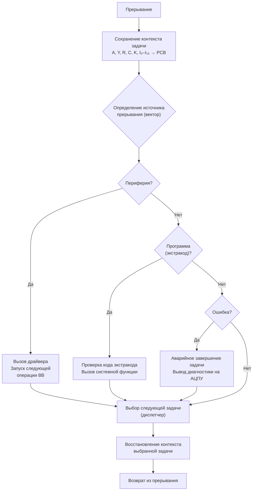

#### Диспетчер задач

Диспетчер задач реализовывал:

- **Мультипрограммирование** — одновременное выполнение до 4 задач;
- **Планирование** — алгоритм циклического планирования (round-robin);
- **Синхронизацию** — семафоры и события;
- **Управление приоритетами** — до 8 уровней приоритета.

**Алгоритм циклического планирования (Round-Robin):**

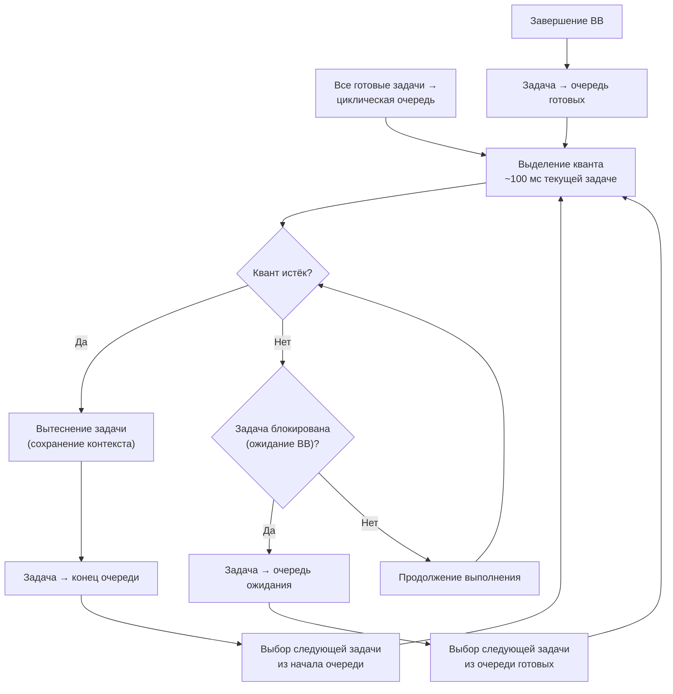

**Состояния задачи в ДИСПАК:**

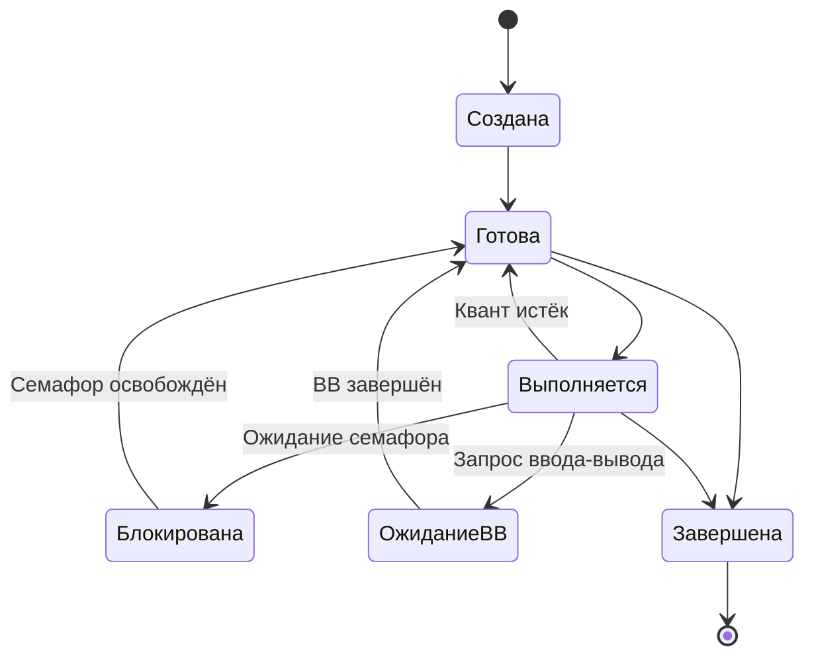

#### Файловая система

Файловая система ДИСПАК поддерживала:

- **Ленточные файлы** — последовательные файлы на магнитных лентах;
- **Дисковые файлы** — прямого доступа на магнитных дисках (в версиях 3.0+);
- **Иерархическую структуру** — каталоги и подкаталоги;
- **Защиту файлов** — права доступа (чтение, запись, выполнение).

**Структура дискового файла в ДИСПАК:**

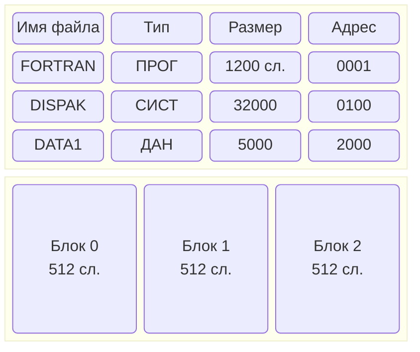

### 5.2.3. Управление заданиями (JCL)

ДИСПАК использовала язык управления заданиями (JCL) для описания последовательности действий.

**Пример JCL — трансляция и выполнение Фортрана:**

```jcl
* ЗАДАНИЕ: ТРАНСЛЯЦИЯ И ВЫПОЛНЕНИЕ ФОРТРАН-ПРОГРАММЫ
ЗАДАЧА ТРАНСЛЯЦИЯ
  ФАЙЛ ИСХОДНИК=ПЕРФОЛЕНТА
  ФАЙЛ ОБЪЕКТ=МЛ(1)
  ТРАНСЛЯТОР ФОРТРАН-ДУБНА
  ВЫПОЛНИТЬ
КОНЕЦ

ЗАДАЧА ВЫПОЛНЕНИЕ
  ФАЙЛ ОБЪЕКТ=МЛ(1)
  ФАЙЛ РЕЗУЛЬТАТ=АЦПУ
  ЗАГРУЗЧИК
  ВЫПОЛНИТЬ
КОНЕЦ
```

**Пример JCL — пакетная обработка данных:**

```jcl
* ЗАДАНИЕ: ОБРАБОТКА ЭКСПЕРИМЕНТАЛЬНЫХ ДАННЫХ
ЗАДАЧА ПОДГОТОВКА
  ФАЙЛ ИСХОДНЫЕ=ПЕРФОЛЕНТА
  ФАЙЛ ПРОМЕЖУТОЧНЫЕ=МЛ(2)
  ПРОГРАММА PREPROC
  ВЫПОЛНИТЬ
КОНЕЦ

ЗАДАЧА РАСЧЁТ
  ФАЙЛ ПРОМЕЖУТОЧНЫЕ=МЛ(2)
  ФАЙЛ РЕЗУЛЬТАТЫ=МЛ(3)
  ПРОГРАММА CALC
  ВЫПОЛНИТЬ
КОНЕЦ

ЗАДАЧА ВЫВОД
  ФАЙЛ РЕЗУЛЬТАТЫ=МЛ(3)
  ФАЙЛ ОТЧЁТ=АЦПУ
  ПРОГРАММА REPORT
  ВЫПОЛНИТЬ
КОНЕЦ
```

### 5.2.4. Подсистема ввода-вывода

Подсистема ввода-вывода ДИСПАК обеспечивала:

- **Буферизацию** — для выравнивания скоростей устройств;
- **Спулинг** — одновременный ввод/вывод с выполнением задач;
- **Драйверы устройств** — модульная система драйверов для всех типов периферии;
- **Асинхронный ввод-вывод** — с использованием системы прерываний.

**Схема работы спулинга в ДИСПАК:**

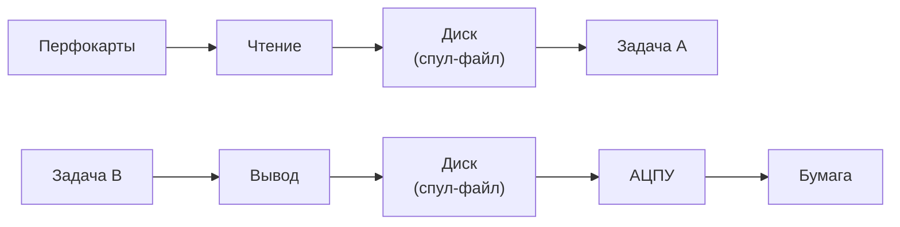

### 5.2.5. Средства отладки и загрузки

ДИСПАК включала развитые средства отладки:

- **Символический отладчик** — пошаговое выполнение, просмотр регистров;
- **Дамп памяти** — вывод содержимого памяти на АЦПУ;
- **Трассировка** — запись последовательности выполненных команд;
- **Монитор** — наблюдение за выполнением программы в реальном времени.

**Команды отладчика ДИСПАК:**

| Команда | Описание |
|---------|----------|
| `ЗАГРУЗКА <имя>` | Загрузить программу |
| `ПУСК [адрес]` | Начать выполнение |
| `ТОЧКА <адрес>` | Установить точку останова |
| `СНЯТЬ <адрес>` | Снять точку останова |
| `ШАГ` | Выполнить одну команду |
| `РЕГИСТРЫ` | Показать содержимое регистров |
| `ДАМП <адрес> <длина>` | Вывести дамп памяти |
| `ПРОДОЛЖИТЬ` | Продолжить выполнение |
| `ТРАССА <адрес>` | Включить трассировку |
| `ВЫХОД` | Выйти из отладчика |

---

## 5.3. Сравнение с другими ОС

### 5.3.1. Системы ИПМ АН СССР

Помимо ДИСПАК, в ИПМ АН СССР были разработаны и другие операционные системы:

| Система | Год | Особенности |
|---------|-----|-------------|
| ИПМ-1 | 1969 | Экспериментальная, однозадачная |
| ИПМ-2 | 1971 | Мультипрограммная, 2 задачи |
| ИПМ-3 | 1973 | Поддержка диалогового режима |
| ДИСПАК | 1972+ | Наиболее полная и стабильная |

### 5.3.2. Сравнительная таблица ОС для БЭСМ-6

| Характеристика | Дубна | ДИСПАК | ИПМ-2 |
|----------------|-------|---------|-------|
| Мультипрограммирование | Нет | Да (до 4 задач) | Да (2 задачи) |
| Защита памяти | Нет | Да | Частичная |
| Файловая система | Ленточная | Ленточная + дисковая | Ленточная |
| Диалоговый режим | Нет | Да (с версии 4.0) | Нет |
| Символический отладчик | Нет | Да | Ограниченный |
| Поддержка Фортрана | Да | Да | Да |
| Поддержка Алгола | Да | Да | Да |
| Размер ядра (слов) | ~2000 | ~8000 | ~4000 |
| Требуемая память | 16K слов | 32K слов | 16K слов |

---

## 5.4. Роль ДИСПАК в космических программах

ДИСПАК играла ключевую роль в советской космической программе:

- **Обработка телеметрии** — приём и обработка данных с космических аппаратов;
- **Баллистические расчёты** — расчёт траекторий полёта и коррекций;
- **Управление полётами** — расчёт команд управления для ЦУПа;
- **Моделирование** — имитация полётных ситуаций для тренировки экипажей.

**Типовой сеанс работы ДИСПАК в ЦУПе:**

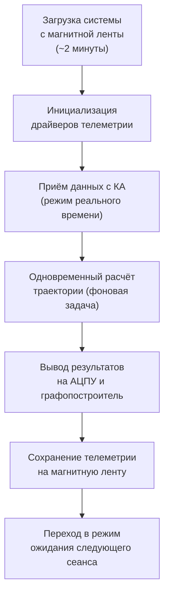

Надёжность ДИСПАК была настолько высокой, что система продолжала использоваться в ЦУПе даже после появления более современных ЭВМ. Известны случаи непрерывной работы ДИСПАК в течение нескольких недель без единого сбоя.

---

## Ключевые выводы раздела

1. Первой ОС для БЭСМ-6 была мониторная система «Дубна» (1968), работавшая в пакетном режиме.
2. ДИСПАК — наиболее развитая ОС для БЭСМ-6, поддерживавшая мультипрограммирование (до 4 задач), файловую систему, диалоговый режим и средства отладки.
3. ДИСПАК имела модульную архитектуру: супервизор, диспетчер задач, файловая система, подсистема ввода-вывода.
4. Система использовала язык управления заданиями (JCL) для описания последовательности работ с поддержкой многошаговых заданий.
5. Диспетчер задач реализовывал циклическое планирование (round-robin) с квантом ~100 мс и 8 уровнями приоритета.
6. ДИСПАК играла ключевую роль в советской космической программе, обеспечивая обработку телеметрии и баллистические расчёты.

---

**Далее:** [Раздел VI: Периферийные устройства и ввод-вывод](06-peripherals.md)# Раздел VI: Периферийные устройства и ввод-вывод


*Стойки периферийного оборудования БЭСМ-6 — накопители и устройства ввода-вывода*


*Накопитель на магнитной ленте НМЛ-67 — основное устройство долговременного хранения данных*

---

## 6.1. Внешние запоминающие устройства

### 6.1.1. Накопители на магнитных лентах (НМЛ)

Магнитные ленты были основным средством долговременного хранения данных и программ в БЭСМ-6.

**Характеристики типового НМЛ для БЭСМ-6:**

| Параметр | Значение |
|----------|----------|
| Тип | НМЛ-67, НМЛ-70 |
| Ширина ленты | 12,7 мм (0,5 дюйма) |
| Дорожек | 8 (7 данных + 1 контрольная) |
| Плотность записи | 8-32 бит/мм |
| Скорость ленты | 2 м/с |
| Ёмкость катушки | до 50 Мбайт |
| Скорость передачи | до 64 Кбайт/с |
| Время разгона/торможения | ~5 мс |
| Межблочный промежуток | 15-20 мм |

**Режимы работы НМЛ:**

- **Непрерывный** — последовательное чтение/запись всего файла;
- **Старт-стопный** — чтение/запись отдельных блоков с остановками между ними;
- **Поисковый** — позиционирование на заданный блок.

Магнитные ленты использовались для:
- Хранения операционной системы (загрузочная лента);
- Хранения библиотек программ и трансляторов;
- Архивации данных;
- Обмена данными между вычислительными центрами.

### 6.1.2. Накопители на магнитных дисках (НМД)

Магнитные диски появились на БЭСМ-6 в середине 1970-х годов и обеспечили возможность прямого доступа к данным.

**Характеристики НМД для БЭСМ-6:**

| Параметр | Значение |
|----------|----------|
| Тип | НМД-50, НМД-100 |
| Количество поверхностей | 10-20 |
| Количество дорожек на поверхность | 200-400 |
| Ёмкость | 5-50 Мбайт |
| Время доступа (среднее) | 30-100 мс |
| Скорость передачи | до 200 Кбайт/с |
| Скорость вращения | 2400 об/мин |

**Структура дискового накопителя:**

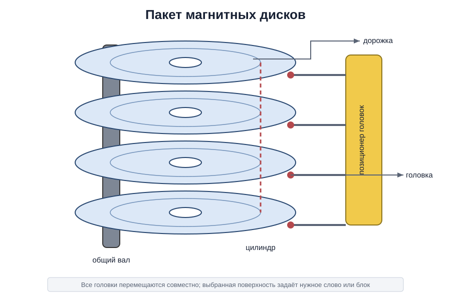
*Схема пакета магнитных дисков НМД-50: пластины, дорожки, блок магнитных головок*

Диски позволили реализовать:
- Файловую систему прямого доступа;
- Быструю загрузку программ;
- Подкачку страниц виртуальной памяти.

### 6.1.3. Накопители на магнитных барабанах (НМБ)

Магнитные барабаны занимали промежуточное положение между ОЗУ и дисками по скорости доступа.

**Характеристики НМБ:**

| Параметр | Значение |
|----------|----------|
| Тип | НМБ-50 |
| Ёмкость | 50-500 Кслов |
| Количество дорожек | 100-200 |
| Время доступа (среднее) | 10-20 мс |
| Скорость передачи | до 500 Кбайт/с |
| Скорость вращения | 6000 об/мин |

Барабаны использовались для:
- Хранения наиболее часто используемых системных программ;
- Буферизации данных при вводе-выводе;
- Реализации свопинга (подкачки) в ранних версиях ОС.

---


*Устройство ввода с перфокарт ПВ-80 — основной способ ввода программ*


*Алфавитно-цифровое печатающее устройство (АЦПУ) — вывод результатов на бумагу*

---

## 6.2. Устройства ввода-вывода

### 6.2.1. Перфокарточные устройства

Перфокарты были основным средством ввода программ и данных.

**Характеристики:**

| Устройство | Назначение | Скорость |
|------------|------------|----------|
| ПВ-80 | Ввод с перфокарт | 80 карт/мин |
| ПВ-200 | Ввод с перфокарт | 200 карт/мин |
| ПЛ-80 | Вывод на перфокарты | 80 карт/мин |

Формат перфокарты: 80 колонок, 12 строк (стандарт IBM). Каждая колонка кодировала один символ в коде ДКОИ (двоичный код обработки информации).

### 6.2.2. Перфоленточные устройства

Перфолента использовалась для ввода-вывода небольших объёмов данных и программ.

**Характеристики:**

| Параметр | Значение |
|----------|----------|
| Тип | ПЛ-150, ПЛ-500 |
| Дорожек | 5 или 8 |
| Скорость ввода | 150-500 символов/с |
| Скорость вывода | 50-100 символов/с |
| Длина ленты в рулоне | до 300 м |

### 6.2.3. Алфавитно-цифровые печатающие устройства (АЦПУ)

АЦПУ были основным средством вывода результатов.

**Характеристики АЦПУ:**

| Параметр | Значение |
|----------|----------|
| Тип | АЦПУ-128, АЦПУ-256 |
| Скорость печати | 300-600 строк/мин |
| Количество символов в строке | 128 или 256 |
| Набор символов | Русские и латинские буквы, цифры, спецзнаки |
| Механизм печати | Молотковый (ударный) |
| Количество копий | до 4 (через копирку) |

### 6.2.4. Графопостроители

Графопостроители использовались для вывода графической информации:

- Двухкоординатные плоттеры (формат А1-А0);
- Шаг: 0.1-0.2 мм;
- Скорость: 50-200 мм/с;
- Тип пера: капиллярный (тушь) или шариковый.

### 6.2.5. Видеотерминалы и дисплеи

В поздних модификациях БЭСМ-6 появились видеотерминалы:

- **ВТ-340** — алфавитно-цифровой терминал (24 строки × 80 символов);
- **Дисплей Д-1** — графический дисплей (векторный, разрешение 1024×1024).

---

## 6.3. Организация каналов ввода-вывода

### 6.3.1. Селекторные и мультиплексный каналы

Ввод-вывод в БЭСМ-6 организовывался через специализированные каналы:

| Тип канала | Количество | Назначение |
|------------|------------|------------|
| Селекторный | 4 | Быстрые устройства (НМЛ, НМД, НМБ) |
| Мультиплексный | 1 | Медленные устройства (перфокарты, АЦПУ, терминалы) |

**Селекторный канал** обеспечивал:
- Подключение одного быстрого устройства в каждый момент времени;
- Скорость передачи до 500 Кбайт/с;
- Прямой доступ к памяти (ПДП).

**Мультиплексный канал** обеспечивал:
- Одновременное обслуживание до 16 медленных устройств;
- Разделение времени канала между устройствами;
- Скорость передачи до 10 Кбайт/с на устройство.

**Структура селекторного канала:**

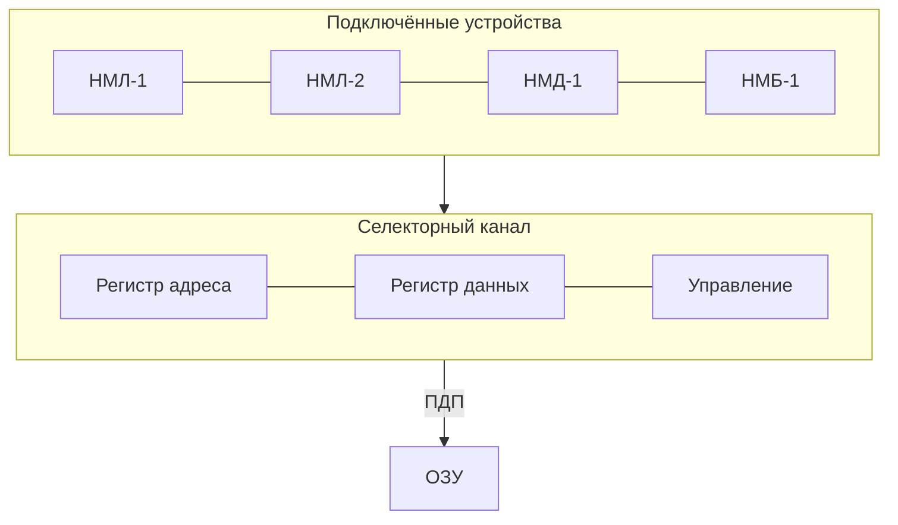

### 6.3.2. Программно-управляемый обмен

Помимо канального обмена, БЭСМ-6 поддерживала программно-управляемый ввод-вывод:

1. Программа проверяет готовность устройства (команда `увв`);
2. Если устройство готово — выполняет передачу слова;
3. Если не готово — ожидает или переключается на другую задачу.

**Пример программно-управляемого вывода на АЦПУ:**

```asm
* ВЫВОД СЛОВА НА АЦПУ
OUT     УВВ   =0         * ПРОВЕРКА ГОТОВНОСТИ АЦПУ
        РЖ    =0         * АНАЛИЗ ПРИЗНАКОВ
        ПБ    OUT        * ЕСЛИ НЕ ГОТОВ, ПОВТОРИТЬ
        ЗЧ    PRDATA     * ЗАПИСЬ ДАННЫХ В РЕГИСТР АЦПУ
        УВВ   =1         * ЗАПУСК ПЕЧАТИ
        ...
PRDATA  ПАМ   1          * РЕГИСТР ДАННЫХ АЦПУ
```

Этот метод использовался для:
- Работы с нестандартными устройствами;
- Отладки драйверов;
- Систем реального времени.

### 6.3.3. Система прерываний ввода-вывода

Система прерываний БЭСМ-6 поддерживала:

- **Векторные прерывания** — каждое устройство имело свой вектор;
- **Приоритеты** — 8 уровней приоритета;
- **Маскирование** — возможность запрета отдельных прерываний.

**Таблица векторов прерываний:**

| Вектор | Устройство | Приоритет | Адрес обработчика |
|:------:|:-----------|:---------:|:-----------------:|
| 0 | Таймер | 0 (высший) | 00010 |
| 1 | НМЛ-1 | 1 | 00012 |
| 2 | НМЛ-2 | 1 | 00014 |
| 3 | НМД-1 | 1 | 00016 |
| 4 | НМБ-1 | 1 | 00020 |
| 5 | АЦПУ | 2 | 00022 |
| 6 | ПВ-80 | 3 | 00024 |
| 7 | ПЛ-150 | 3 | 00026 |
| 8 | Терминал | 4 | 00030 |
| 9 | Графопостроитель | 4 | 00032 |
| 10-15 | Резерв | — | 00034-00046 |

### 6.3.4. Архитектура драйверов устройств

Драйверы устройств в ДИСПАК имели стандартизированную структуру:


**Протокол передачи данных через канал:**

1. ОС формирует блок управления вводом-выводом (БУВВ), содержащий:
   - Тип операции (чтение/запись/позиционирование);
   - Адрес устройства;
   - Адрес буфера в ОЗУ;
   - Размер передаваемых данных.
2. БУВВ передаётся в канал через команду `увв`.
3. Канал выполняет операцию независимо от процессора (режим ПДП).
4. По завершении операции канал генерирует прерывание.
5. Обработчик прерывания анализирует результат и уведомляет задачу.

---

## 6.4. Системы реального времени и связь с объектами

### 6.4.1. Аппаратура сопряжения

Для подключения БЭСМ-6 к объектам управления использовалась специальная аппаратура сопряжения:

- **АЦП** (аналого-цифровые преобразователи) — для ввода аналоговых сигналов;
- **ЦАП** (цифро-аналоговые преобразователи) — для вывода управляющих сигналов;
- **Дискретный ввод-вывод** — для приёма и выдачи дискретных сигналов;
- **Таймеры реального времени** — для синхронизации с внешними процессами.

**Характеристики аппаратуры сопряжения:**

| Устройство | Параметры | Назначение |
|------------|-----------|------------|
| АЦП-12 | 12 бит, 8 каналов, 10 кГц | Ввод аналоговых сигналов |
| АЦП-14 | 14 бит, 4 канала, 1 кГц | Прецизионные измерения |
| ЦАП-10 | 10 бит, 4 канала | Вывод управляющих сигналов |
| УДС-32 | 32 дискретных входа/выхода | Дискретные сигналы |
| ТС-1 | 6 таймеров, 1 мкс–1 с | Синхронизация |

### 6.4.2. Примеры использования в реальном времени

БЭСМ-6 использовалась в системах реального времени:

- **Центр управления полётами (ЦУП)** — обработка телеметрии, расчёт команд управления;
- **Ядерные реакторы** — мониторинг параметров, управление режимами;
- **Метрологические станции** — сбор и обработка данных с измерительных приборов;
- **Испытательные стенды** — управление испытаниями авиационной и ракетной техники.

**Типовая конфигурация системы реального времени на базе БЭСМ-6:**

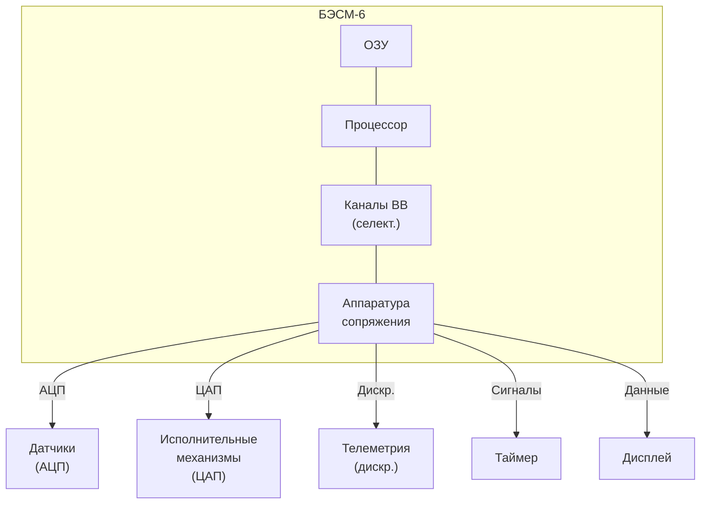

---

## Ключевые выводы раздела

1. Внешние ЗУ БЭСМ-6 включали магнитные ленты (основное хранилище, до 50 Мбайт), магнитные диски (прямой доступ, 5-50 Мбайт) и магнитные барабаны (быстрый доступ, 10-20 мс).
2. Устройства ввода-вывода включали перфокарты (ПВ-80/200), перфоленты (ПЛ-150/500), АЦПУ (300-600 строк/мин), графопостроители и видеотерминалы.
3. Ввод-вывод организовывался через селекторные (быстрые устройства, до 500 Кбайт/с) и мультиплексный (медленные устройства, до 16 устройств) каналы.
4. Система прерываний ввода-вывода поддерживала векторные прерывания с 8 уровнями приоритета и маскированием.
5. Драйверы устройств имели стандартизированную архитектуру с блоками управления вводом-выводом (БУВВ).
6. БЭСМ-6 использовалась в системах реального времени через специальную аппаратуру сопряжения (АЦП, ЦАП, дискретный ввод-вывод, таймеры).

---

**Далее:** [Раздел VII: Процесс программирования и отладки](07-programming.md)# Раздел VII: Процесс программирования и отладки


*Программист за пультом БЭСМ-6 — работа в диалоговом режиме*


*Колода перфокарт с программой — основной носитель исходного кода*

---

## 7.1. Жизненный цикл программы

### 7.1.1. Этапы разработки

Типичный процесс создания программы для БЭСМ-6 включал следующие этапы:


### 7.1.2. Разработка алгоритма

Программист разрабатывал алгоритм решения задачи. На этом этапе использовались:

- **Блок-схемы** — графическое представление алгоритма;
- **Псевдокод** — неформальное описание на естественном языке;
- **Математические методы** — выбор численных методов решения.

**Пример блок-схемы алгоритма (Mermaid):**

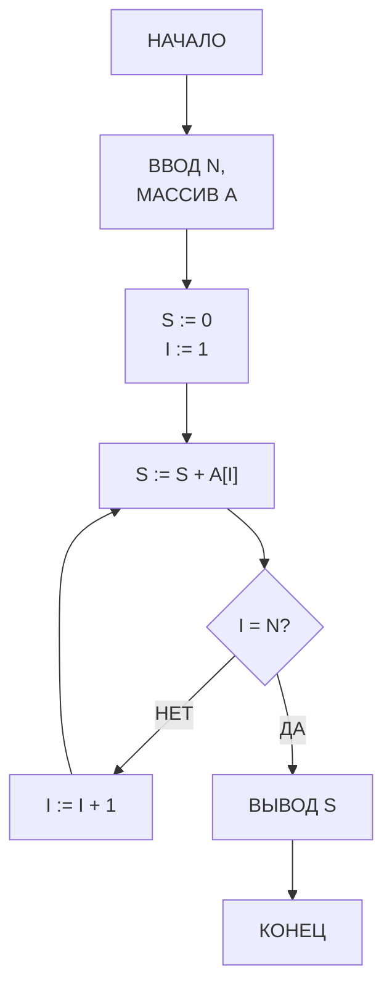

### 7.1.3. Написание кода

Код писался на одном из доступных языков:

- **Ассемблер (БЕМШ/МАДЛЕН)** — для системного программирования и задач, критичных к производительности;
- **Фортран** — для научных и инженерных расчётов;
- **Алгол-60** — для алгоритмических задач;
- **Автокод** — для задач среднего уровня.

Исходный код набивался на **перфокартах** (80 колонок, 12 строк) с помощью клавишных перфораторов. Каждая строка программы — одна перфокарта. Типичная программа занимала от нескольких десятков до нескольких тысяч перфокарт.

**Процесс набивки перфокарт:**

1. Программист писал программу на бланке (специальный формуляр);
2. Оператор ПВ (перфораторщица) набивала текст на перфокартах с помощью клавишного перфоратора;
3. Готовая колода перфокарт передавалась на верификацию (контрольный набор на верификаторе);
4. После верификации колода поступала на ввод в ЭВМ.

### 7.1.4. Трансляция

Процесс трансляции включал:

1. **Чтение исходного кода** — с перфокарт или магнитной ленты;
2. **Лексический и синтаксический анализ**;
3. **Генерация объектного кода** — машинные команды БЭСМ-6;
4. **Вывод листинга** — на АЦПУ (с указанием ошибок).

Трансляция могла занимать от нескольких минут до нескольких часов в зависимости от размера программы. При обнаружении ошибок программист исправлял перфокарты и повторял трансляцию.

**Типичный листинг трансляции:**

```
ТРАНСЛЯТОР ФОРТРАН-ДУБНА  ВЕРСИЯ 3.2
ИСХОДНЫЙ ФАЙЛ: ПРОГРАММА.FTN

СТРОКА   ИСХОДНЫЙ ТЕКСТ                         ОШИБКИ
  1      PROGRAM SUMMA
  2      DIMENSION A(100)
  3      READ 1, N, (A(I), I=1,N)
  4  1   FORMAT (I5/(F10.5))
  5      S = 0.0
  6      DO 2 I = 1, N
  7  2   S = S + A(I)
  8      PRINT 3, S
  9  3   FORMAT (10X, 'СУММА = ', F15.5)
 10      STOP
 11      END

ТАБЛИЦА ИМЁН:
  A       МАССИВ  REAL  РАЗМЕР 100
  N       ПЕРЕМ   INTEGER
  S       ПЕМР    REAL
  I       ПЕРЕМ   INTEGER

ОБЪЕКТНЫЙ КОД: 120 СЛОВ
ТРАНСЛЯЦИЯ ЗАВЕРШЕНА БЕЗ ОШИБОК
```

### 7.1.5. Компоновка (редактирование связей)

После трансляции объектные модули компоновались в исполняемую программу:

- **Разрешение внешних ссылок** — связывание вызовов подпрограмм;
- **Подключение библиотек** — математических и системных;
- **Перемещение адресов** — настройка адресов под конкретную загрузку.

**Схема компоновки:**

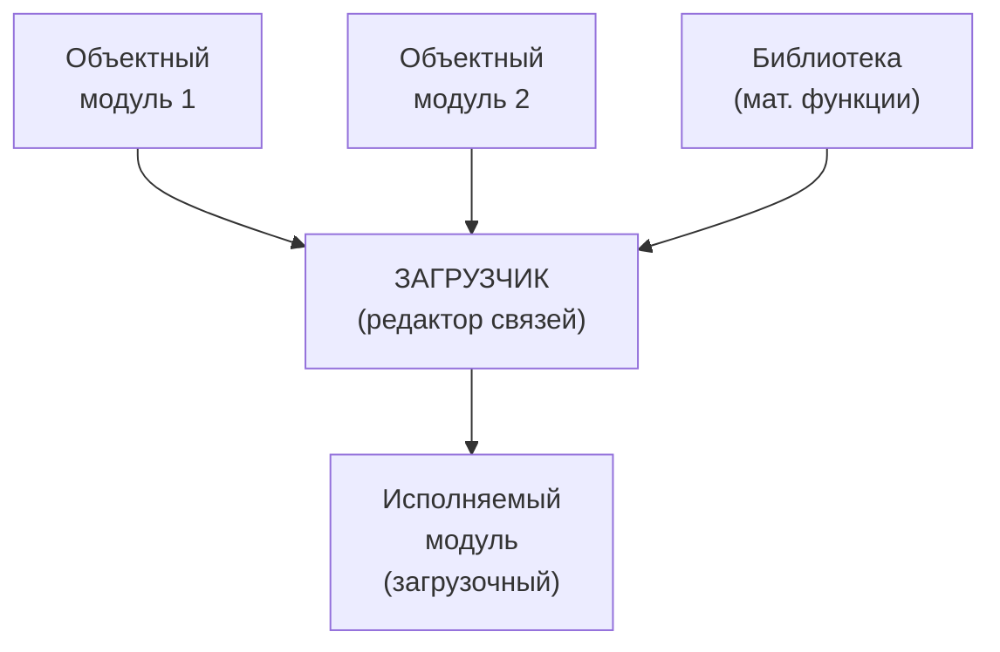

### 7.1.6. Выполнение

Программа загружалась в память и запускалась. В зависимости от режима работы:

- **Пакетный режим** — программа выполняется без вмешательства оператора;
- **Диалоговый режим** — оператор может вмешиваться в процесс выполнения.

---


*Распечатка дампа памяти БЭСМ-6 на АЦПУ — восьмеричное представление содержимого ячеек*

---

## 7.2. Средства отладки

### 7.2.1. Мониторы

Монитор — программа, позволяющая наблюдать за выполнением другой программы. Основные возможности:

- **Пошаговое выполнение** — выполнение по одной команде;
- **Точки останова** — остановка при достижении заданного адреса;
- **Просмотр регистров** — отображение содержимого A, Y, индекс-регистров;
- **Просмотр памяти** — дамп содержимого ячеек памяти.

### 7.2.2. Символические отладчики

Более развитые средства отладки предоставляли символические отладчики:

- Работа с символическими именами (метками);
- Вычисление выражений;
- Условные точки останова;
- Трассировка вызовов подпрограмм.

**Пример сеанса отладки:**

```
* ЗАПУСК ОТЛАДЧИКА
ОТЛ: ЗАГРУЗКА ПРОГРАММЫ SUMMA
ОТЛ: ТОЧКА ОСТАНОВА LOOP+2
ОТЛ: ПУСК
     (программа выполняется до LOOP+2)
ОТЛ: РЕГИСТРЫ
     A = 0.314159E+01
     Y = 0.000000E+00
     I1 = 0005
     K = 001234
ОТЛ: ПРОДОЛЖИТЬ
     (выполнение продолжается)
```

**Пример условной точки останова:**

```
ОТЛ: ТОЧКА LOOP+2, ЕСЛИ I1=0
     (останов только когда счётчик цикла обнулился)
ОТЛ: ПУСК
     (программа выполняется до LOOP+2 при I1=0)
ОТЛ: РЕГИСТРЫ
     A = 0.100000E+02
     I1 = 0000
ОТЛ: ДАМП SUM, 1
     SUM = 0.385000E+02
```

### 7.2.3. Дампы памяти

Дамп памяти — распечатка содержимого указанной области памяти:

- **Аварийный дамп** — автоматическая распечатка при аварийном останове;
- **Выборочный дамп** — по запросу программиста;
- **Формат дампа** — восьмеричные или шестнадцатеричные значения.

**Пример аварийного дампа:**

```
АВАРИЙНЫЙ ОСТАНОВ: ПЕРЕПОЛНЕНИЕ
СЧЁТЧИК КОМАНД: 001234
РЕГИСТР РЕЖИМА: 000010 (ПЕРЕПОЛНЕНИЕ)

ДАМП ПАМЯТИ (000000-000037):
000000: 042010000000  004012001000  030100012345  000000000000
000010: 025020000000  017030000000  000000000000  000000000000
000020: 000000000000  000000000000  000000000000  000000000000
000030: 000000000000  000000000000  000000000000  000000000000

РЕГИСТРЫ:
A = 0.999999E+99  (ПЕРЕПОЛНЕНИЕ)
Y = 0.000000E+00
I1 = 0010  I2 = 0020  I3 = 0000
```

### 7.2.4. Трассировка

Трассировка — запись последовательности выполненных команд:

- **Полная трассировка** — запись каждой команды (очень медленно);
- **Выборочная трассировка** — запись только команд по заданным адресам;
- **Трассировка обращений к памяти** — запись всех обращений к определённым ячейкам.

**Пример вывода трассировки:**

```
ТРАССИРОВКА: ПРОГРАММА SUMMA
001000: СЧ   ARRAY     A := 0.100000E+01
001001: СЛ   =0        A := 0.100000E+01
001002: ВЧ   ARRAY+1   A := 0.100000E+01 - 0.200000E+01 = -0.100000E+01
001003: РЖ   =0        РЕЖИМ: ЗНАК=1
001004: ПБ   NEXT      ПЕРЕХОД
...
```

---

## 7.3. Особенности и оптимизация

### 7.3.1. Учёт конвейерной архитектуры

Для достижения максимальной производительности программист должен был учитывать особенности конвейера:

- **Избегать конфликтов по данным** — не использовать результат команды сразу же;
- **Планировать команды** — располагать независимые команды рядом;
- **Использовать длинные адреса** — для уменьшения времени дешифрации.

**Пример оптимизации:**

```asm
* НЕОПТИМИЗИРОВАННЫЙ КОД (конфликт по данным)
        СЧ    X         * A := X
        СЛ    Y         * A := A + Y (ожидание загрузки X)
        ЗЧ    Z         * Z := A

* ОПТИМИЗИРОВАННЫЙ КОД (нет конфликта)
        СЧ    X         * A := X
        УИА   М20       * установка индекс-регистра (независимая команда)
        СЛ    Y         * A := A + Y (X уже загружен)
        ЗЧ    Z         * Z := A
```

**Измерение производительности до и после оптимизации:**

| Версия | Тактов | Время (нс) | Ускорение |
|:-------|:------:|:----------:|:---------:|
| Неоптимизированная | 8 | 800 | 1.0× |
| Оптимизированная | 5 | 500 | 1.6× |

### 7.3.2. Использование индекс-регистров

16 индекс-регистров БЭСМ-6 позволяли эффективно реализовывать:

- **Циклы** — один регистр как счётчик, другой как указатель;
- **Обработку массивов** — последовательный перебор элементов;
- **Табличные переходы** — косвенная адресация.

**Рекомендации по использованию индекс-регистров:**

1. Использовать регистры I0–I7 для общих целей;
2. I8–I15 резервировать для системных нужд;
3. Минимизировать переключения индекс-регистров внутри циклов.

**Пример эффективного использования индекс-регистров:**

```asm
* ОБРАБОТКА ДВУХ МАССИВОВ (I₁ — счётчик, I₂ — указатель на A, I₃ — указатель на B)
        УИА   М20       * I₁ := N (счётчик)
        УИА   М21       * I₂ := адрес A
        УИА   М22       * I₃ := адрес B
LOOP    СЧ    (М21)     * A := A[I₂]
        СЛ    (М22)     * A := A + B[I₃]
        ЗЧ    (М21)     * A[I₂] := A
        ПИ    М21,М21   * I₂ := I₂ + 1
        ПИ    М22,М22   * I₃ := I₃ + 1
        ЦИКЛ  LOOP      * I₁--; if I₁≠0 goto LOOP
```

### 7.3.3. Использование расслоения памяти

Расслоение памяти (4 банка) позволяло ускорить доступ к данным:

- **Размещать массивы** с шагом, кратным 4 (для равномерной загрузки банков);
- **Чередовать данные и код** — код в одних банках, данные в других;
- **Избегать конфликтов банков** — не обращаться к одному банку дважды подряд.

**Пример размещения данных для оптимального доступа:**

```asm
* НЕОПТИМАЛЬНОЕ РАЗМЕЩЕНИЕ (все данные в одном банке)
A       ПАМ   100       * банк 0
B       ПАМ   100       * банк 0 (конфликт с A)
C       ПАМ   100       * банк 0 (конфликт)

* ОПТИМАЛЬНОЕ РАЗМЕЩЕНИЕ (данные в разных банках)
A       ПАМ   100       * банк 0
        ПАМ   100       * пропуск (выравнивание)
B       ПАМ   100       * банк 2
        ПАМ   100       * пропуск
C       ПАМ   100       * банк 0 (уже свободен)
```

### 7.3.4. Динамическая оптимизация с использованием ассоциативной памяти

Ассоциативная память (16 сверхбыстрых регистров) могла использоваться для:

- **Хранения часто используемых переменных** — вручную или автоматически;
- **Кэширования результатов** — для повторного использования;
- **Быстрого доступа к элементам стека** — при рекурсивных вызовах.

**Стратегия использования ассоциативной памяти:**

1. Размещать в ассоциативной памяти переменные, к которым происходит наиболее частое обращение (счётчики циклов, указатели, часто используемые константы).
2. Избегать частой смены данных в ассоциативной памяти — это приводит к промахам (cache miss).
3. При работе с массивами — обрабатывать элементы последовательно, чтобы использовать пространственную локальность.

---

## 7.4. Примеры программ

### 7.4.1. Программа «Hello, World!» на ассемблере БЕМШ

```asm
* ПРОГРАММА ВЫВОДА СООБЩЕНИЯ
        ЭК     60        * ВЫЗОВ СИСТЕМНОЙ ПРОЦЕДУРЫ ВЫВОДА
        ПАМ     1        * АДРЕС СТРОКИ
        СТРОКА 'HELLO, WORLD!'
        ОСТ              * ОСТАНОВ
```

### 7.4.2. Вычисление факториала на Madlen

```asm
* ВЫЧИСЛЕНИЕ N! (ФАКТОРИАЛ)
        VTM    N, М20    * M20 := N (СЧЁТЧИК)
        XTA    =1.0      * A := 1.0
LOOP    A*X    =1.0,М20  * A := A * M20
        VLM    LOOP      * ЦИКЛ: M20--, ПЕРЕХОД ЕСЛИ M20≠0
        ATX    RESULT    * СОХРАНЕНИЕ РЕЗУЛЬТАТА
        STOP
N       EQU    10        * N = 10
RESULT  BSS    1         * РЕЗУЛЬТАТ
```

### 7.4.3. Обработка массива на Фортране

```fortran
      FUNCTION SUM(A, N)
      DIMENSION A(100)
      S = 0.0
      DO 1 I = 1, N
1     S = S + A(I)
      SUM = S
      RETURN
      END
```

### 7.4.4. Сортировка методом «пузырька» на БЕМШ

```asm
* СОРТИРОВКА МАССИВА МЕТОДОМ ПУЗЫРЬКА
* ВХОД: I₁ = N (РАЗМЕР МАССИВА)
*       I₂ = АДРЕС МАССИВА A
SORT    УИА   М20       * I₁ := N (ВНЕШНИЙ ЦИКЛ)
OUTER   ПИ    М21,М20   * I₂ := I₁ (ВНУТРЕННИЙ ЦИКЛ)
        УИА   М22       * I₃ := АДРЕС A
INNER   СЧ    (М22)     * A := A[I₃]
        ВЧ    1(М22)    * A := A[I₃] - A[I₃+1]
        РЖ    =0        * ПРОВЕРКА ЗНАКА
        ПБ    NOSWAP    * ЕСЛИ A[I₃] ≤ A[I₃+1], НЕ МЕНЯТЬ
        СЧ    (М22)     * ОБМЕН A[I₃] И A[I₃+1]
        ЗЧ    TEMP
        СЧ    1(М22)
        ЗЧ    (М22)
        СЧ    TEMP
        ЗЧ    1(М22)
NOSWAP  ПИ    М23,М23   * I₃ := I₃ + 1
        ПИНМ  INNER     * I₂--; ЕСЛИ I₂≠0, ПРОДОЛЖИТЬ
        ЦИКЛ  OUTER     * I₁--; ЕСЛИ I₁≠0, ПРОДОЛЖИТЬ
        ОСТ
TEMP    ПАМ   1
```

---

## Ключевые выводы раздела

1. Жизненный цикл программы включал разработку алгоритма, написание кода на перфокартах, трансляцию, компоновку, выполнение и отладку.
2. Средства отладки включали мониторы, символические отладчики, дампы памяти и трассировку с условными точками останова.
3. Оптимизация для БЭСМ-6 требовала учёта конвейерной архитектуры (избегание конфликтов по данным), эффективного использования 16 индекс-регистров и расслоения памяти (4 банка).
4. Ассоциативная память (сверхбыстрые регистры) могла использоваться для динамической оптимизации с учётом пространственной локальности.
5. Правильная оптимизация могла дать ускорение до 1.6× на типовых участках кода.

---

**Далее:** [Раздел VIII: Примеры практического применения и наследие](08-legacy.md)# Раздел VIII: Примеры практического применения и наследие


*БЭСМ-6 в Центре управления полётами — обработка телеметрии космических аппаратов*


*Проект МЭСМ-6 — реконструкция процессора БЭСМ-6 на ПЛИС (FPGA)*

---

## 8.1. Научные и оборонные задачи

### 8.1.1. Ядерная физика

БЭСМ-6 сыграла ключевую роль в советской ядерной программе:

- **Расчёт ядерных реакторов** — моделирование нейтронно-физических процессов, многогрупповой метод решения уравнения переноса нейтронов;
- **Моделирование ядерных взрывов** — гидродинамические расчёты, уравнение состояния;
- **Обработка экспериментальных данных** — с ядерных установок и ускорителей;
- **Расчёт защиты от радиации** — метод Монте-Карло.

Для этих задач использовались специализированные пакеты программ:
- **ПРИЗМА** — расчёт реакторов;
- **МОНТЕ-КАРЛО** — моделирование переноса излучения;
- **ДИНАМИКА** — расчёт нестационарных процессов.

**Типовой расчёт ядерного реактора на БЭСМ-6:**

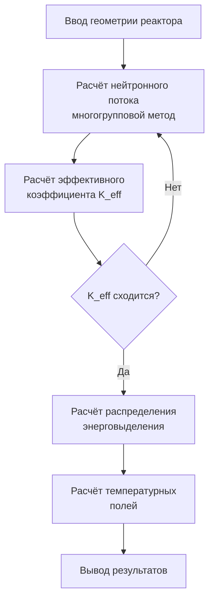

### 8.1.2. Космические исследования

БЭСМ-6 была основной вычислительной машиной советской космической программы:

- **Баллистические расчёты** — расчёт траекторий выведения, коррекций, посадки;
- **Обработка телеметрии** — приём и обработка данных с космических аппаратов;
- **Управление полётами** — расчёт команд для ЦУПа;
- **Моделирование** — имитация полётных ситуаций.

**Конкретные миссии, в которых использовалась БЭСМ-6:**

| Миссия | Год | Задача | Результат |
|--------|-----|--------|-----------|
| «Луна-9» | 1966 | Расчёт траектории мягкой посадки | Первая мягкая посадка на Луну |
| «Союз-Аполлон» | 1975 | Расчёты стыковки | Первая международная стыковка |
| «Венера-9» | 1975 | Расчёт траектории к Венере | Первые снимки поверхности Венеры |
| «Энергия-Буран» | 1988 | Аэродинамические расчёты | Автоматическая посадка Бурана |

**Схема обработки телеметрии в ЦУПе:**

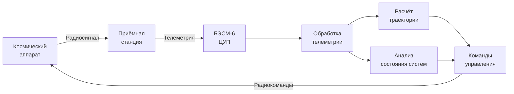

### 8.1.3. Проектирование авиации и ракет

БЭСМ-6 использовалась в авиа- и ракетостроении:

- **Аэродинамические расчёты** — обтекание профилей, распределение давления;
- **Прочностные расчёты** — метод конечных элементов, расчёт напряжений;
- **Динамика полёта** — устойчивость и управляемость;
- **Оптимизация конструкции** — минимизация массы при заданной прочности.

**Типовой цикл проектирования с использованием БЭСМ-6:**

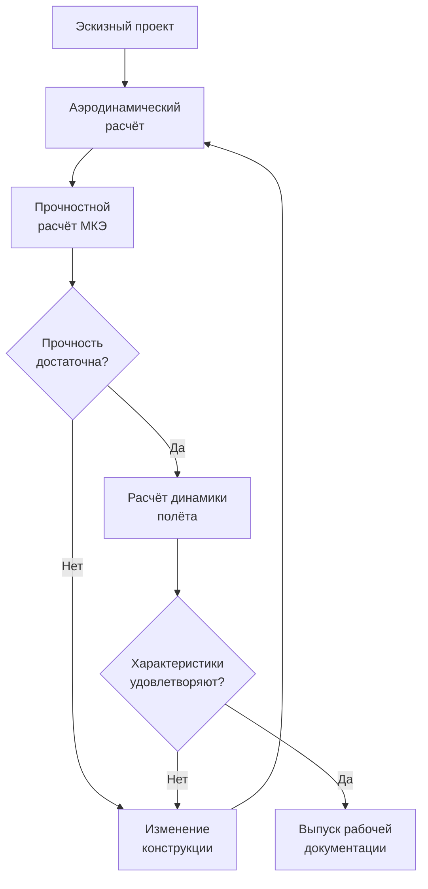

---

## 8.2. Гражданское применение

### 8.2.1. Прогнозирование в экономике

БЭСМ-6 использовалась для экономического прогнозирования:

- **Модели межотраслевого баланса** — расчёт «затраты-выпуск»;
- **Оптимизационные задачи** — линейное и нелинейное программирование;
- **Прогнозирование урожайности** — статистические модели.

### 8.2.2. Экологические исследования

- **Моделирование распространения загрязнений** — атмосферная диффузия;
- **Расчёт течений** — гидродинамика рек и водоёмов;
- **Прогноз погоды** — численные модели атмосферы.

### 8.2.3. Обработка данных в научных центрах

БЭСМ-6 была основой вычислительных центров:

- **ВЦ АН СССР** — центральный вычислительный центр Академии наук;
- **ВЦ СО АН СССР** (Новосибирск) — сибирское отделение;
- **ОИЯИ** (Дубна) — обработка данных с ускорителей;
- **ИПМ АН СССР** — прикладная математика.

---

## 8.3. Наследие и современные проекты

### 8.3.1. БЭСМ-6 как культурное явление

БЭСМ-6 оставила глубокий след в советской и российской культуре:

- **Школа программистов** — на БЭСМ-6 выросло целое поколение выдающихся специалистов;
- **Научная школа** — архитектурные решения изучались в университетах;
- **Ностальгия** — сообщества энтузиастов, сохраняющих память о машине.

### 8.3.2. Проект МЭСМ-6: реконструкция на ПЛИС

**МЭСМ-6** — проект реконструкции процессора БЭСМ-6 на программируемых логических интегральных схемах (ПЛИС, FPGA).

**Характеристики проекта:**

| Параметр | Описание |
|----------|----------|
| Разработчик | Группа энтузиастов (GitHub) |
| Цель | Полная реконструкция процессора БЭСМ-6 |
| Базис | ПЛИС Xilinx/Altera |
| Состояние | Рабочий прототип, выполнение команд |
| Совместимость | Полная совместимость с оригиналом |

**Архитектура проекта МЭСМ-6:**

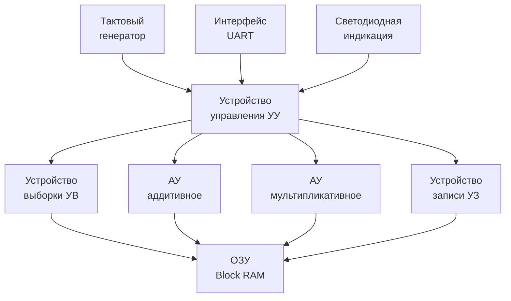

Проект включает:
- VHDL/Verilog-описание всех функциональных устройств;
- Реализацию конвейера;
- Поддержку всех 50 команд;
- Интерфейс для подключения периферии.


*Эмулятор SIMH БЭСМ-6 — загрузка операционной системы ДИСПАК*

### 8.3.3. Современные эмуляторы и симуляторы

Для БЭСМ-6 существует несколько эмуляторов:

| Эмулятор | Платформа | Особенности |
|----------|-----------|-------------|
| **SIMH** | Кроссплатформенный | Наиболее полный, включает ДИСПАК |
| **besm6-emu** | Linux/Windows | Эмуляция на уровне команд |
| **MESM6** | FPGA | Аппаратная реконструкция |

**SIMH** — наиболее популярный эмулятор. Он позволяет:

- Загружать и выполнять оригинальные программы;
- Работать с ДИСПАК и другими ОС;
- Подключать эмулированные периферийные устройства;
- Использовать отладчик.

**Архитектура эмулятора SIMH для БЭСМ-6:**

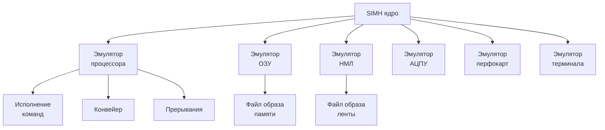

**Пример запуска БЭСМ-6 в SIMH:**

```bash
$ simh-besm6
BESM-6 simulator V4.0
sim> load dispak.tape
sim> run
ДИСПАК 4.0 ГОТОВ
*ЗАДАЧА: ВЫЧИСЛЕНИЕ
  ФАЙЛ ПРОГРАММА=ПЕРФОЛЕНТА
  ВЫПОЛНИТЬ
...
```

### 8.3.4. Сообщества и ресурсы

Сегодня БЭСМ-6 продолжает жить в сообществах энтузиастов:

- **[besm6.org](https://besm6.org)** — портал, посвящённый БЭСМ-6;
- **[Computer-museum.ru](https://www.computer-museum.ru)** — виртуальный музей;
- **[GitHub — MESM6](https://github.com)** — проект реконструкции на ПЛИС;
- **[Форум RSDN](https://rsdn.org)** — обсуждения и архив материалов.

### 8.3.5. Сохранение программного наследия

Усилия по сохранению программного обеспечения БЭСМ-6 включают:

- **Оцифровка магнитных лент** — перенос содержимого оригинальных лент в файлы-образы;
- **Архивирование документации** — сканирование технических описаний, руководств, листингов;
- **Восстановление исходных кодов** — реконструкция программ по сохранившимся листингам;
- **Запуск в эмуляторах** — обеспечение работоспособности исторического ПО в современных системах.

---

## 8.4. Заключение

БЭСМ-6 — это не просто ЭВМ. Это символ целой эпохи в развитии советской вычислительной техники. Созданная в середине 1960-х годов, она на два десятилетия стала основной вычислительной платформой для самых ответственных задач — от ядерной физики до космических полётов.

**Почему БЭСМ-6 важна сегодня:**

1. **Архитектурные инновации** — конвейер, виртуальная память, ассоциативная память — опередили своё время и стали стандартом для современных процессоров.
2. **Программное наследие** — операционные системы, трансляторы, библиотеки — заложили основы советского системного программирования.
3. **Школа** — на БЭСМ-6 выросло поколение программистов и инженеров, создавших последующие поколения ЭВМ.
4. **Современные проекты** — эмуляторы и реконструкции на ПЛИС позволяют сохранить и изучить это наследие.

БЭСМ-6 остаётся ярким примером того, как талантливый коллектив разработчиков может создать машину, опережающую своё время, даже в условиях ограниченных ресурсов и технологических возможностей.

---

*Конец учебника.*

**В начало:** [Титульная страница и оглавление](README.md)