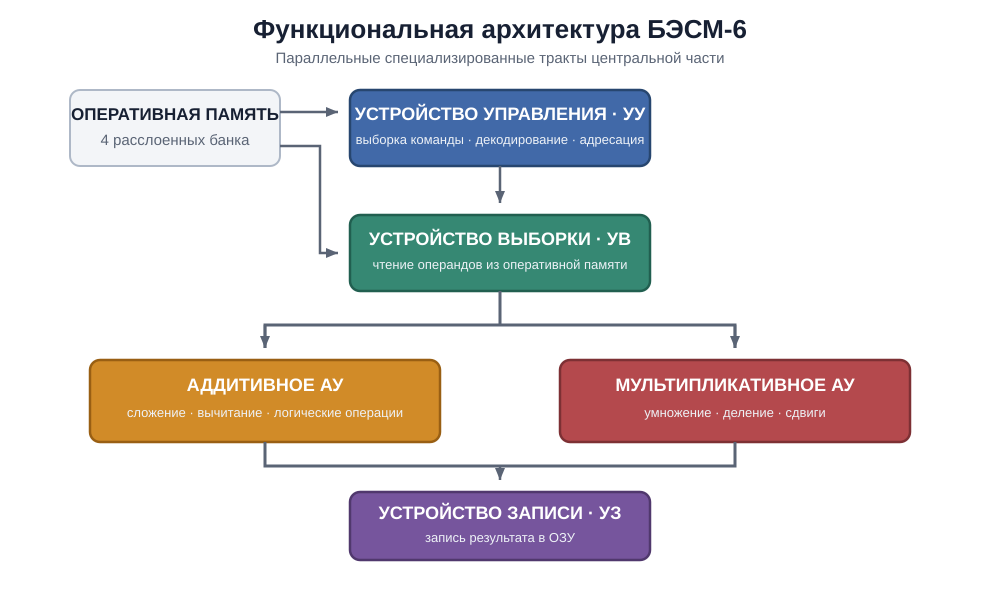
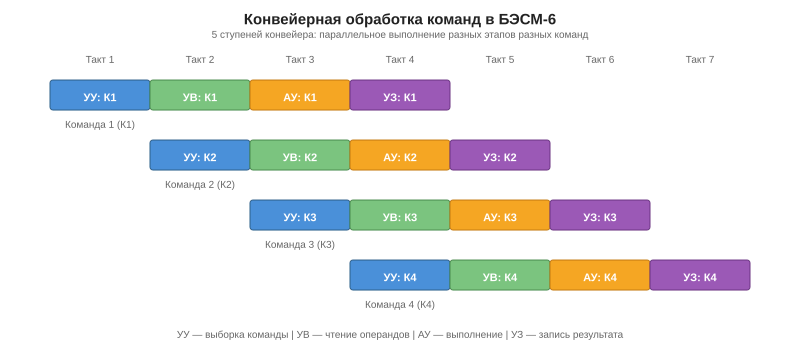
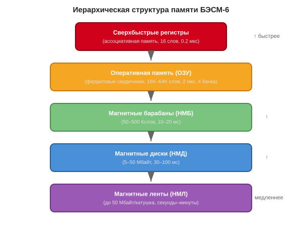
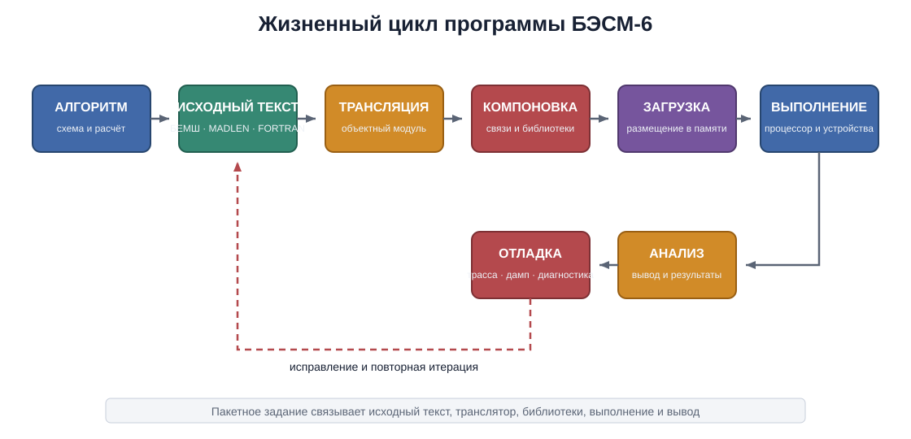

# БЭСМ-6: Архитектура, программирование и наследие


*БЭСМ-6 в вычислительном центре. Фото из архива Computer-museum.ru*

---

## Предисловие

БЭСМ-6 (Большая Электронно-Счётная Машина, 6-я модель) — это легендарная советская ЭВМ второго поколения, ставшая вершиной отечественной вычислительной техники 1960–1980-х годов. Разработанная под руководством академика С.А. Лебедева, она на протяжении двух десятилетий оставалась основной вычислительной платформой для самых ответственных задач — от расчётов ядерных реакторов до обработки телеметрии космических аппаратов.

Данный учебник представляет собой систематическое изложение архитектуры, программного обеспечения и практического применения БЭСМ-6. Он предназначен для:

- **Студентов** технических специальностей, изучающих историю вычислительной техники;
- **Программистов и инженеров**, интересующихся ретро-вычислениями и эмуляцией;
- **Всех, кто хочет понять**, как работали первые суперкомпьютеры и какое наследие они оставили.

Материал организован по восьми разделам, охватывающим путь от истории создания машины до её современных эмуляторов и реконструкций на ПЛИС.

---

## 📚 Оглавление

| Раздел | Файл | Содержание |
|--------|------|------------|
| **I** | [`01-history.md`](01-history.md) | История и контекст создания БЭСМ-6 |
| **II** | [`02-architecture.md`](02-architecture.md) | Архитектура и основные принципы работы |
| **III** | [`03-instruction-set.md`](03-instruction-set.md) | Программная модель и система команд |
| **IV** | [`04-software.md`](04-software.md) | Программное обеспечение и языки программирования |
| **V** | [`05-operating-systems.md`](05-operating-systems.md) | Операционные системы |
| **VI** | [`06-peripherals.md`](06-peripherals.md) | Периферийные устройства и ввод-вывод |
| **VII** | [`07-programming.md`](07-programming.md) | Процесс программирования и отладки |
| **VIII** | [`08-legacy.md`](08-legacy.md) | Примеры практического применения и наследие |

---

## Условные обозначения и сокращения

| Сокращение | Расшифровка |
|------------|-------------|
| АЦПУ | Алфавитно-цифровое печатающее устройство |
| БЕМШ | БЭСМ-6 — ЕС ЭВМ — Минск — Ш (ассемблер) |
| ДИСПАК | Диспетчер пакетов (ОС) |
| ЗУ | Запоминающее устройство |
| ИПМ | Институт прикладной математики АН СССР |
| КоП | Код операции |
| МАДЛЕН | Машинный Алгоритмический ДЛя Е-выходных (ассемблер) |
| НМД | Накопитель на магнитных дисках |
| НМЛ | Накопитель на магнитных лентах |
| НМБ | Накопитель на магнитных барабанах |
| ОС | Операционная система |
| ПЛИС (FPGA) | Программируемая логическая интегральная схема |
| ТЭЗ | Типовой элемент замены |
| A | Аккумулятор |
| Y | Регистр младших разрядов |
| I, J, M | Индекс-регистры (модификаторы) |
| K | Счётчик команд |
| R | Регистр режима |
| C | Базовый регистр |
| X | Операнд из памяти |

---

## Источники

При подготовке учебника использованы материалы следующих ресурсов:

- [Computer-museum.ru](https://www.computer-museum.ru) — виртуальный музей вычислительной техники
- [Parallel.ru](https://parallel.ru) — архив статей о суперкомпьютерах
- [Besm6.org](https://besm6.org) — сообщество энтузиастов БЭСМ-6
- [Большая российская энциклопедия](https://bigenc.ru) — статья «БЭСМ-6 (ЭВМ)»
- [Habr.com](https://habr.com) — статьи об эмуляции и восстановлении кода
- [GitHub — MESM6 project](https://github.com) — реконструкция процессора на ПЛИС

---

*Начало работы над учебником: июнь 2026 г.*# Раздел I: История и контекст создания БЭСМ-6


*Академик Сергей Алексеевич Лебедев (1902–1974) — главный конструктор БЭСМ-6, основоположник советской вычислительной техники*

---

## 1.1. Введение: место БЭСМ-6 в истории вычислительной техники

БЭСМ-6 (Большая Электронно-Счётная Машина, 6-я модель) занимает уникальное место в истории не только советской, но и мировой вычислительной техники. Созданная в середине 1960-х годов, она стала одной из первых в мире супер-ЭВМ с конвейерной архитектурой и виртуальной памятью — концепциями, которые десятилетия спустя стали стандартом для всех современных процессоров.

По своей производительности (около 1 млн операций с плавающей точкой в секунду) БЭСМ-6 находилась на уровне лучших западных машин своего времени — таких как IBM 7090 и CDC 6600. Однако в отличие от западных аналогов, БЭСМ-6 производилась серийно на протяжении почти 20 лет (1968–1987) и эксплуатировалась в сотнях вычислительных центров по всему Советскому Союзу.


*БЭСМ-6 в Политехническом музее (Москва) — общий вид стоек с оборудованием*

---

## 1.2. Предпосылки создания

### 1.2.1. Потребности науки и обороны

К началу 1960-х годов в СССР остро ощущалась нехватка высокопроизводительных вычислительных машин. Основные области, требовавшие мощных ЭВМ:

- **Ядерная физика** — расчёты цепных реакций, моделирование ядерных взрывов, проектирование реакторов;
- **Космические исследования** — баллистические расчёты траекторий, обработка телеметрии, управление полётами;
- **Авиа- и ракетостроение** — аэродинамические расчёты, прочностные расчёты конструкций;
- **Метеорология** — численное прогнозирование погоды;
- **Криптография** — задачи, связанные с государственной безопасностью.

Существовавшие на тот момент машины (М-20, М-220, БЭСМ-4) уже не справлялись с растущими требованиями по скорости и объёму памяти.

### 1.2.2. Состояние вычислительной техники в СССР к 1963 году

К моменту начала проектирования БЭСМ-6 в СССР эксплуатировались следующие основные ЭВМ:

| Модель | Год | Быстродействие | Оперативная память | Элементная база |
|--------|-----|----------------|-------------------|-----------------|
| М-20 | 1959 | 20 тыс. оп/с | 4096 слов (45 бит) | Лампы |
| М-220 | 1962 | 20 тыс. оп/с | 8192 слова (45 бит) | Лампы + полупроводники |
| БЭСМ-4 | 1962 | 20 тыс. оп/с | 8192 слова (48 бит) | Полупроводники |
| М-40 | 1962 | 40 тыс. оп/с | 4096 слов | Полупроводники |

Ни одна из этих машин не могла обеспечить требуемую производительность в 1 млн оп/с, которая была поставлена как цель для БЭСМ-6.

---

## 1.3. Коллектив разработчиков

### 1.3.1. Академик Сергей Алексеевич Лебедев

Сергей Алексеевич Лебедев (1902–1974) — основоположник советской вычислительной техники. Под его руководством были созданы:

- **МЭСМ** (Малая Электронно-Счётная Машина, 1951) — первая в СССР и континентальной Европе электронная вычислительная машина;
- **БЭСМ-1** (1952) — первая советская большая ЭВМ;
- **БЭСМ-2**, **БЭСМ-3М**, **БЭСМ-4** — последующие модели;
- **БЭСМ-6** (1964–1967) — вершина его конструкторской мысли.

Лебедев лично участвовал в разработке архитектуры БЭСМ-6, включая конвейерную организацию и систему команд.

### 1.3.2. Заместители и ключевые сотрудники

- **В.А. Мельников** — заместитель главного конструктора, внёсший значительный вклад в разработку арифметического устройства и системы памяти;
- **Л.Н. Королёв** — заместитель главного конструктора, руководитель разработки математического обеспечения и операционной системы;
- **В.С. Бурцев** — разработчик системы прерываний и защиты памяти;
- **П.П. Головистиков** — разработчик элементной базы и конструкции ТЭЗов.


*Коллектив разработчиков БЭСМ-6 в ИТМиВТ АН СССР, 1965 г.*


*С.А. Лебедев за работой в лаборатории ИТМиВТ*

---

## 1.4. Хронология создания и производства

### 1.4.1. Этапы разработки

| Дата | Событие |
|------|---------|
| 1963 г. | Начало проектирования в ИТМиВТ АН СССР (Институт точной механики и вычислительной техники) |
| 1964 г. | Завершение технического проекта |
| 1965 г. | Изготовление опытного образца |
| 1966 г. | Начало опытной эксплуатации |
| 1967 г. | Государственные испытания — машина принята в серийное производство |
| 1968 г. | Начало серийного выпуска на Заводе счётно-аналитических машин (ЗСАМ, г. Москва) |
| 1970-е гг. | Модернизация (увеличение объёма ОЗУ до 64К слов, добавление новых периферийных устройств) |
| 1980-е гг. | Постепенное вытеснение машинами серии ЕС ЭВМ |
| 1987 г. | Окончание серийного производства |

### 1.4.2. География установок

БЭСМ-6 была установлена в более чем 200 организациях, включая:

- **Научные центры**: ИПМ АН СССР, ИТМиВТ, ВЦ АН СССР, ВЦ СО АН СССР (Новосибирск);
- **Оборонные предприятия**: Министерство среднего машиностроения, Министерство общего машиностроения;
- **Космические центры**: Центр управления полётами (ЦУП), Байконур;
- **Университеты**: МГУ, МФТИ, НГУ, КГУ и другие;
- **Промышленность**: авиационные и ракетные КБ.


*География установок БЭСМ-6 на территории СССР — более 200 организаций*


*Типовой вычислительный центр на базе БЭСМ-6, 1970-е годы*

---

## 1.5. Значение и влияние

### 1.5.1. Вклад в развитие вычислительной техники

БЭСМ-6 стала платформой, на которой выросло целое поколение советских программистов и системных инженеров. На ней были разработаны и отлажены:

- Первые советские операционные системы с разделением времени (ДИСПАК);
- Трансляторы с языков высокого уровня (Фортран, Алгол-60, Паскаль);
- Пакеты прикладных программ для научных расчётов;
- Системы реального времени для управления космическими полётами.

### 1.5.2. Влияние на последующие разработки

Архитектурные решения БЭСМ-6 оказали влияние на последующие советские ЭВМ:

- **Эльбрус-1** (1978) — унаследовал конвейерную организацию и систему защиты памяти;
- **Эльбрус-2** (1984) — развил идеи параллельной обработки;
- **ЕС ЭВМ** (рядные модели) — заимствовали отдельные принципы организации ввода-вывода.

### 1.5.3. Школа программистов

БЭСМ-6 воспитала целую плеяду выдающихся специалистов:

- **А.П. Ершов** — один из пионеров советского программирования, создатель первых трансляторов;
- **В.М. Глушков** — основатель кибернетики в СССР;
- **М.Р. Шура-Бура** — разработчик системного программного обеспечения;
- **В.Ф. Турчин** — создатель языка РЕФАЛ.

---

## Ключевые выводы раздела

1. БЭСМ-6 была создана в ответ на острую потребность в высокопроизводительных вычислениях для науки и обороны.
2. Разработка велась под руководством академика С.А. Лебедева — основоположника советской вычислительной техники.
3. Машина производилась серийно почти 20 лет (1968–1987) и была установлена в сотнях организаций.
4. БЭСМ-6 стала платформой для развития советского системного программирования и школой для целого поколения специалистов.
5. Архитектурные решения БЭСМ-6 (конвейер, виртуальная память, система прерываний) опередили своё время и повлияли на последующие разработки.

---

**Далее:** [Раздел II: Архитектура и основные принципы работы](02-architecture.md)# Раздел II: Архитектура и основные принципы работы


*Упрощённая блок-схема основных функциональных устройств БЭСМ-6*


*Стойка управления БЭСМ-6 с блоками функциональных устройств*

---

## 2.1. Общая структура: конвейерная архитектура

### 2.1.1. Принцип «водопровода»

БЭСМ-6 стала одной из первых в мире ЭВМ, реализовавших **конвейерную (конвейерную) архитектуру** — принцип, при котором выполнение команды разбивается на несколько последовательных этапов, и различные этапы разных команд выполняются параллельно.

В БЭСМ-6 было реализовано **5 специализированных функциональных устройств**, работающих параллельно:

1. **Устройство управления (УУ)** — выборка команд, дешифрация, формирование адресов;
2. **Устройство выборки (УВ)** — обращение к оперативной памяти для чтения операндов;
3. **Арифметическое устройство аддитивное (АУ-А)** — сложение, вычитание, логические операции;
4. **Арифметическое устройство мультипликативное (АУ-М)** — умножение, деление, сдвиги;
5. **Устройство записи (УЗ)** — запись результатов в оперативную память.


*Схема конвейерной обработки: 5 ступеней выполняются параллельно для разных команд*

### 2.1.2. Специализация функциональных устройств

Ключевая особенность архитектуры БЭСМ-6 — **жёсткая специализация** функциональных устройств. Каждое устройство может выполнять только определённый набор операций:

| Устройство | Выполняемые операции | Время выполнения |
|------------|---------------------|------------------|
| УУ (управление) | Выборка, дешифрация, модификация адреса | 1 такт |
| УВ (выборка) | Чтение из ОЗУ | 2 такта |
| АУ-А (аддитивное) | Сложение, вычитание, логические операции | 1-2 такта |
| АУ-М (мультипликативное) | Умножение, деление, сдвиги | 4-12 тактов |
| УЗ (запись) | Запись в ОЗУ | 2 такта |

Такая специализация позволяла достичь высокой производительности: при оптимальной организации программы конвейер выдавал результат практически каждый такт.

### 2.1.3. Конфликты в конвейере и их разрешение

Как и в современных процессорах, в конвейере БЭСМ-6 возникали конфликты:

- **Конфликты по данным** — когда следующая команда использует результат предыдущей;
- **Конфликты по управлению** — при условных переходах (конвейер нужно сбрасывать);
- **Конфликты по ресурсам** — когда два устройства пытаются одновременно обратиться к памяти.

Для разрешения конфликтов использовались:
- **Аппаратная блокировка** — приостановка конвейера до готовности данных;
- **Сверхбыстрые регистры (ассоциативная память)** — для временного хранения промежуточных результатов.

---

## 2.2. Система памяти

### 2.2.1. Иерархическая структура памяти

Память БЭСМ-6 была организована иерархически, что обеспечивало баланс между скоростью, объёмом и стоимостью:


*Иерархия запоминающих устройств БЭСМ-6: от сверхбыстрых регистров до магнитных лент*


*Плата ферритовой оперативной памяти БЭСМ-6 — матрица ферритовых сердечников*

### 2.2.2. Оперативная память (ОЗУ)

Оперативная память БЭСМ-6 строилась на **ферритовых сердечниках** (ферритовая память). Основные характеристики:

- **Разрядность**: 48 бит + 1 бит контроля чётности;
- **Ёмкость**: от 16K до 64K 48-битных слов (в разных модификациях);
- **Время цикла**: 2 мкс (чтение или запись);
- **Расслоение (interleaving)**: память делилась на 4 независимых модуля (банка), что позволяло одновременно выполнять до 4 обращений.


*Расслоение памяти: 4 банка, адреса чередуются по модулю 4*

**Принцип расслоения**: последовательные ячейки памяти располагались в разных банках (адрес 0 — банк 0, адрес 1 — банк 1, адрес 2 — банк 2, адрес 3 — банк 3, адрес 4 — банк 0 и т.д.). Это позволяло конвейеру обращаться к памяти практически каждый такт, не дожидаясь завершения цикла предыдущего обращения.

### 2.2.3. Виртуальная (математическая) память

БЭСМ-6 была одной из первых ЭВМ, реализовавших **виртуальную память** (в советской терминологии — «математическая память»). Механизм работал следующим образом:

- Программа оперировала **виртуальными адресами** (15-битными);
- Аппаратный блок преобразования адресов (БПА) транслировал их в **физические адреса**;
- Преобразование выполнялось с помощью **страничной организации**: виртуальное адресное пространство делилось на страницы по 64 слова;
- Каждой странице сопоставлялся **регистр преобразования адреса (РПА)**, хранящий номер физической страницы.


*Схема преобразования виртуального адреса в физический*

### 2.2.4. Ассоциативная память (сверхбыстрые регистры)

Для ускорения доступа к часто используемым данным в БЭСМ-6 использовалась **ассоциативная память** (в современной терминологии — кэш). Она представляла собой набор из 16 сверхбыстрых регистров, каждый из которых мог хранить:

- **Адрес** (тег) — виртуальный адрес слова;
- **Данные** — 48-битное значение;
- **Признак занятости**.

Обращение к ассоциативной памяти выполнялось за 0.2 мкс — в 10 раз быстрее, чем к основной ОЗУ. Если требуемое слово находилось в ассоциативной памяти (cache hit), обращение к ОЗУ не производилось.

---

## 2.3. Система прерываний и режимы работы

### 2.3.1. Режимы пользователя и супервизора

БЭСМ-6 поддерживала **два режима работы**:

- **Режим пользователя** — ограниченный набор команд, запрет на прямую работу с периферией;
- **Режим супервизора** — полный доступ ко всем ресурсам, выполнение привилегированных команд.

Переключение между режимами осуществлялось через **систему прерываний** и **экстракоды** (программные прерывания).

### 2.3.2. Система прерываний

Система прерываний БЭСМ-6 включала следующие типы:

| Тип прерывания | Причина | Обработка |
|----------------|---------|-----------|
| Внешнее | Сигнал от периферийного устройства | Переход к подпрограмме обработки |
| Внутреннее | Ошибка (деление на ноль, переполнение) | Аварийное завершение или коррекция |
| Программное | Экстракод (системный вызов) | Переход в режим супервизора |
| По вводу-выводу | Завершение операции ввода-вывода | Продолжение выполнения программы |

### 2.3.3. Защита памяти

Защита памяти в БЭСМ-6 реализовывалась на аппаратном уровне:

- Каждой программе выделялась **зона памяти**, задаваемая базовым регистром C и регистром границы;
- Попытка обращения за пределы выделенной зоны вызывала прерывание;
- В режиме пользователя запрещалось изменять регистры защиты.

---

## 2.4. Элементная база и конструкция (ТЭЗы)

### 2.4.1. Транзисторно-диодная логика

БЭСМ-6 была построена на **дискретных полупроводниковых элементах** — транзисторах и диодах. Интегральные микросхемы в то время ещё не были доступны. Основные характеристики элементной базы:

- **Транзисторы**: германиевые (типа П-401, П-402, П-403);
- **Диоды**: кремниевые (типа Д-219, Д-220);
- **Логические элементы**: диодно-транзисторная логика (ДТЛ);
- **Тактовая частота**: 10 МГц (период такта 100 нс).

### 2.4.2. Типовые Элементы Замены (ТЭЗы)

Конструктивно БЭСМ-6 была выполнена в виде **ТЭЗов** — Типовых Элементов Замены. Каждый ТЭЗ представлял собой печатную плату размером примерно 130×80 мм с установленными на ней электронными компонентами.


*Типовой элемент замены (ТЭЗ) БЭСМ-6 с транзисторно-диодными логическими элементами*


*Стойка БЭСМ-6 с установленными ТЭЗами — вид на монтажное пространство*

**Характеристики ТЭЗов:**

| Параметр | Значение |
|----------|----------|
| Размер платы | 130×80 мм |
| Количество транзисторов | 10-30 шт. |
| Количество диодов | 20-60 шт. |
| Количество резисторов | 30-80 шт. |
| Разъём | 2×22 контакта |
| Потребляемая мощность | 2-5 Вт |

Всего в БЭСМ-6 использовалось около **200 типов ТЭЗов**, общее количество — несколько тысяч штук.

### 2.4.3. Компоновка и охлаждение

БЭСМ-6 размещалась в нескольких металлических шкафах (стойках):

- **Стойка управления** — устройство управления и арифметические устройства;
- **Стойка памяти** — оперативная память и блоки преобразования адресов;
- **Стойки периферии** — контроллеры внешних устройств.

Общее энергопотребление машины составляло около **30-40 кВт**. Для отвода тепла использовалось принудительное воздушное охлаждение.

---

## Ключевые выводы раздела

1. БЭСМ-6 использовала конвейерную архитектуру с 5 специализированными функциональными устройствами, работающими параллельно.
2. Система памяти была иерархической: сверхбыстрые регистры (ассоциативная память) → расслоённое ОЗУ на ферритовых сердечниках → внешние ЗУ.
3. БЭСМ-6 одной из первых в мире реализовала виртуальную память с аппаратным преобразованием адресов.
4. Машина поддерживала два режима работы (пользователь/супервизор) с аппаратной защитой памяти.
5. Конструктивно БЭСМ-6 была выполнена на ТЭЗах — типовых элементах замены на дискретных полупроводниках.

---

**Далее:** [Раздел III: Программная модель и система команд](03-instruction-set.md)# Раздел III: Программная модель и система команд


*Панель управления БЭСМ-6 — индикаторы состояния регистров и памяти, органы управления*


*Пульт оператора БЭСМ-6 — тумблеры и кнопки управления режимами работы*

---

## 3.1. Форматы данных

### 3.1.1. 48-битное машинное слово

Основной единицей данных в БЭСМ-6 является **48-битное машинное слово**. В зависимости от контекста, слово может интерпретироваться как:

- **Число с плавающей точкой** (основной режим);
- **Целое число** (дополнительный код);
- **Две команды** (по 24 бита каждая);
- **Набор символов** (кодировка);
- **Логическое значение** (48 бит).

### 3.1.2. Представление чисел с плавающей точкой

Числа с плавающей точкой в БЭСМ-6 имели следующий формат:


- **Разряд 47** — знак мантиссы (0 — положительное, 1 — отрицательное);
- **Разряды 46–41** — порядок (6 бит, со смещением 32);
- **Разряды 40–1** — мантисса (41 бит, нормализованная);
- **Разряд 0** — не используется (всегда 0).

Диапазон представимых чисел: примерно ±10⁻¹⁹ до ±10¹⁹.

### 3.1.3. Представление целых чисел

Целые числа хранились в **дополнительном коде** и занимали всё 48-битное слово:

- Старший разряд (47) — знаковый;
- Диапазон: от -2⁴⁷ до 2⁴⁷-1.

### 3.1.4. Представление двух команд в одном слове

Одно 48-битное слово могло содержать две 24-битные команды:


*Примечание: одно 48-битное слово содержит две 24-битные команды (левую и правую)*

Команды выполнялись последовательно: сначала левая, затем правая.

---

## 3.2. Регистровая модель

БЭСМ-6 имела следующую систему регистров:

### 3.2.1. Основные регистры

| Регистр | Размер | Назначение |
|---------|--------|------------|
| **A** (Аккумулятор) | 48 бит | Основной регистр для арифметических и логических операций |
| **Y** (Младшие разряды) | 48 бит | Дополнительный регистр для хранения младших разрядов результата |
| **K** (Счётчик команд) | 15 бит | Адрес текущей выполняемой команды |
| **R** (Режим) | 12 бит | Регистр режима (код операции, признаки результата) |
| **C** (Базовый) | 15 бит | Базовый адрес для защиты памяти |

### 3.2.2. Индекс-регистры (модификаторы)

БЭСМ-6 имела **16 индекс-регистров** (I₀–I₁₅), каждый размером 15 бит. Они использовались для:

- **Модификации адреса** — содержимое индекс-регистра добавлялось к адресу команды;
- **Счётчиков циклов** — для организации циклов;
- **Временного хранения** — адресов и служебной информации.

Индекс-регистры обозначались в командах полем `i` (4 бита, разряды 24–21).

### 3.2.3. Сверхбыстрые регистры (ассоциативная память)

Помимо основных регистров, БЭСМ-6 имела **16 сверхбыстрых регистров** (ассоциативная память), которые использовались как кэш для часто используемых данных. Каждый такой регистр хранил:

- **Тег** (виртуальный адрес);
- **Данные** (48-битное слово);
- **Признак занятости**.

---

## 3.3. Система команд

### 3.3.1. Общая характеристика

Все команды БЭСМ-6 — **одноадресные**, 24-битные. В одном 48-битном слове памяти размещались две команды, которые выполнялись последовательно.

Система команд включает **50 основных команд**, разделённых на следующие группы:

| Группа | Количество | Описание |
|--------|-----------|----------|
| Арифметические с плавающей точкой | 11 | Сложение, вычитание, умножение, деление, работа с порядками |
| Пересылки и работа с памятью | 4 | Запись, чтение, магазинные операции |
| Логические и побитовые | 10 | AND, OR, XOR, сдвиги, сборка/разборка, popcount |
| Операции с индекс-регистрами | 5 | Установка, выдача, передача, сложение |
| Управления и переходов | 8 | Безусловный/условный переход, вызов подпрограммы, цикл |
| Режимы и спецфункции | 7 | Работа с регистрами, ввод-вывод, останов |
| Экстракоды | 24 (050-077) | Системные вызовы и функции мат. библиотеки |

### 3.3.2. Форматы команд

#### Короткоадресный формат (бит 20 = "0")


- **i** (24–21): Номер индекс-регистра для модификации адреса;
- **20**: Всегда "0" — признак короткого формата;
- **X** (19): Признак расширения адреса. Если X=0, адрес дополняется 000; если X=1 — 111;
- **КоП** (18–13): Код операции (6 бит);
- **Адрес** (12–1): Короткий адрес (12 бит). После расширения до 15 бит и модификации индекс-регистром формируется 15-битный исполнительный адрес.

#### Длинноадресный формат (бит 20 = "1")


- **i** (24–21): Номер индекс-регистра;
- **20**: Всегда "1" — признак длинного формата;
- **КоП** (19–16): Код операции (4 бита);
- **Полный адрес** (15–1): Может напрямую адресовать до 32768 ячеек памяти.

### 3.3.3. Экстракоды (системные вызовы)

Экстракоды (коды операций 050–077) представляли собой **программные прерывания** — механизм системных вызовов. При выполнении экстракода:

1. Происходило переключение в режим супервизора;
2. Управление передавалось соответствующему обработчику в ОС;
3. После завершения обработки управление возвращалось пользовательской программе.

Экстракоды использовались для:
- Ввода-вывода данных;
- Работы с файлами;
- Вызова функций математической библиотеки (sin, cos, sqrt и т.д.);
- Управления памятью;
- Запроса системного времени.

---

## 3.4. Полная таблица команд БЭСМ-6

Ниже приведена полная таблица всех 50 команд БЭСМ-6 с мнемониками для двух популярных ассемблеров: **БЕМШ** и **Madlen**.

### Арифметические операции с плавающей точкой

| Код (8‑рич) | Мнемоника БЕМШ | Мнемоника Madlen | Описание | Группа |
|:---:|:---:|:---:|:---|:---:|
| 004 | сл | a+x | Сложение (A := A + X) | С |
| 005 | вч | a-x | Вычитание (A := A - X) | С |
| 006 | вчоб | x-a | Обратное вычитание (A := X - A) | С |
| 007 | вчаб | amx | Вычитание модулей (A := \|A\| - \|X\|) | С |
| 014 | из | avx | Изменение знака (if X<0 then A := -A) | С |
| 016 | дел | a/x | Деление | У |
| 017 | умн | a*x | Умножение | У |
| 024 | слп | e+x | Сложение порядков | У |
| 025 | вчп | e-x | Вычитание порядков | У |
| 034 | слпа | e+n | Коррекция порядков сложением (E += N - 64) | У |
| 035 | вчпа | e-n | Коррекция порядков вычитанием (E -= N - 64) | У |

### Пересылки и работа с памятью

| Код (8‑рич) | Мнемоника БЕМШ | Мнемоника Madlen | Описание | Группа |
|:---:|:---:|:---:|:---|:---:|
| 000 | зч (зп) | atx | Запись числа (X := A) | — |
| 001 | зпм | stx | Запись магазинная (pop stack → X) | Л |
| 003 | счм | xts | Считывание магазинное (push stack) | Л |
| 010 | сч | xta | Считывание числа (A := X) | Л |

### Логические и побитовые операции

| Код (8‑рич) | Мнемоника БЕМШ | Мнемоника Madlen | Описание | Группа |
|:---:|:---:|:---:|:---|:---:|
| 011 | и | aax | Логическое умножение (AND) | Л |
| 012 | нтж | aex | Сравнение (исключающее ИЛИ) | Л |
| 013 | слц | arx | Циклическое сложение | У |
| 015 | или | aox | Логическое сложение (OR) | Л |
| 020 | сбр | apx | Сборка (упаковка битов) | Л |
| 021 | рзб | aux | Разборка (распаковка битов) | Л |
| 022 | чед | acx | Выдача числа единиц (popcount) | Л |
| 023 | нед | anx | Выдача номера старшей единицы | Л |
| 026 | сд | asx | Сдвиг по коду | Л |
| 036 | сда | asn | Сдвиг по адресу (немедленный сдвиг) | Л |

### Операции с индекс-регистрами

| Код (8‑рич) | Мнемоника БЕМШ | Мнемоника Madlen | Описание | Группа |
|:---:|:---:|:---:|:---|:---:|
| 040 | уи | ati | Установка индекс-регистра (I := A) | — |
| 041 | уим | sti | Установка магазинная (pop stack → I) | Л |
| 042 | счи | ita | Выдача индекс-регистра (A := I) | Л |
| 043 | счим | its | Выдача магазинная (push I) | Л |
| 044 | пи | mtj | Передача индекс-регистра (J := M) | — |
| 045 | сли | j+m | Сложение индекс-регистров (J += M) | — |

### Команды управления и переходов

| Код (8‑рич) | Мнемоника БЕМШ | Мнемоника Madlen | Описание | Группа |
|:---:|:---:|:---:|:---|:---:|
| 026 | утц | wtc | Установка C-регистра (базового адреса) | — |
| 024 | ута | utc | Установка C-регистра из адреса | — |
| 025 | уиа | vtm | Установка индекс-регистра немедленно (M := V) | — |
| 027 | уим | utm | Сложение с индекс-регистром немедленно (M += V) | — |
| 030 | пб | uj | Безусловный переход (K := U) | — |
| 031 | пп | vjm | Переход к подпрограмме (M := K+1; K := V) | — |
| 034 | ппм | vzm | Переход, если индекс-регистр равен нулю | — |
| 035 | пинм | v1m | Переход, если индекс-регистр не равен нулю | — |
| 037 | пц | vlm | Организация цикла (if M≠0 then M--; K := V) | — |

### Работа с режимами и спецфункции

| Код (8‑рич) | Мнемоника БЕМШ | Мнемоника Madlen | Описание | Группа |
|:---:|:---:|:---:|:---|:---:|
| 002 | рег | mod | Обращение к спец. регистрам (привилегированная) | Л, П |
| 027 | рж | xtr | Установка режима по коду (R := X) | С, У, Л |
| 030 | счрж | rte | Выдача режима (E := R) | — |
| 031 | счмр | yta | Выдача младших разрядов (A := Y) | — |
| 032 | увв | ext | Управление вводом-выводом (привилегированная) | П |
| 033 | ост | stop | Останов | — |
| 037 | ржа | ntr | Установка режима по адресу (R := N) | С, У, Л |

### Экстракоды

| Код (8‑рич) | Мнемоника БЕМШ | Мнемоника Madlen | Описание | Группа |
|:---:|:---:|:---:|:---|:---:|
| 050–077 | эк N | ext N | Системные вызовы и вызов функций мат. библиотеки | — |

### Примечания к группам команд

- **Группа Л** — логическая (обнуляет младшие разряды Y);
- **Группа С** — арифметическая (устанавливает режим ω в «аддитивный»);
- **Группа У** — умножительная (устанавливает режим ω в «мультипликативный»);
- **Группа П** — привилегированная команда (выполняется только в режиме супервизора).

### Условные обозначения

| Обозначение | Описание |
|-------------|----------|
| A | Аккумулятор |
| X | Операнд из памяти |
| Y | Регистр младших разрядов |
| E | Поле порядка в аккумуляторе |
| I, J, M | Индекс-регистры |
| K | Счётчик команд |
| U | Адрес из команды |
| V | Модифицированный адрес |
| R | Регистр режима |
| N | Немедленный операнд (из адресного поля) |

---

## 3.5. Расшифровка битовых полей команды

### 3.5.1. Короткоадресный формат (детально)


**Формирование исполнительного адреса в коротком формате:**

1. 12-битный адрес из команды дополняется до 15 бит:
   - Если X=0: добавляются три нуля (000) слева → адрес в диапазоне 0000–07777 (8-рич);
   - Если X=1: добавляются три единицы (111) слева → адрес в диапазоне 70000–77777 (8-рич).
2. К полученному 15-битному адресу прибавляется содержимое индекс-регистра i (если i ≠ 0).
3. Результат — 15-битный исполнительный адрес.

### 3.5.2. Длинноадресный формат (детально)


**Формирование исполнительного адреса в длинном формате:**

1. 15-битный адрес из команды используется непосредственно;
2. К нему прибавляется содержимое индекс-регистра i (если i ≠ 0);
3. Результат — 15-битный исполнительный адрес.

### 3.5.3. Пример декодирования команды

Рассмотрим пример: машинное слово `042 010000000` (восьмеричное).

1. Левая команда: код 042 → `счи` (выдача индекс-регистра);
2. Правая команда: код 010 → `сч` (считывание числа);
3. Адрес 00000 → обращение к ячейке 0.

---

## Ключевые выводы раздела

1. Основной единицей данных является 48-битное слово, которое может представлять число с плавающей точкой, целое, две команды или набор символов.
2. Регистровая модель включает аккумулятор A, регистр Y, 16 индекс-регистров, счётчик команд K, регистр режима R и базовый регистр C.
3. Система команд включает 50 одноадресных команд, разделённых на 7 групп.
4. Команды имеют два формата: короткоадресный (12 бит адреса + расширение) и длинноадресный (15 бит адреса).
5. Экстракоды (050–077) обеспечивают механизм системных вызовов и доступа к математической библиотеке.

---

**Далее:** [Раздел IV: Программное обеспечение и языки программирования](04-software.md)# Раздел IV: Программное обеспечение и языки программирования


*Перфокарты — основной носитель программ и данных для БЭСМ-6*


*Программист за пультом БЭСМ-6, 1970-е годы*

---

## 4.1. Программирование на машинном уровне

### 4.1.1. Ассемблер БЕМШ

**БЕМШ** (БЭСМ-6 — ЕС ЭВМ — Минск — Ш) — наиболее распространённый ассемблер для БЭСМ-6. Он предоставлял программисту:

- Мнемонические обозначения для всех 50 команд;
- Поддержку меток и символических адресов;
- Макроопределения;
- Условную ассемблировку;
- Средства листинга и отладки.

**Пример программы на БЕМШ:**

```asm
* ПРОГРАММА ВЫЧИСЛЕНИЯ СУММЫ МАССИВА
        УИА   М20        * УСТАНОВКА СЧЁТЧИКА
        СЧ    =0         * ОБНУЛЕНИЕ АККУМУЛЯТОРА
LOOP    СЛ    ARRAY(М20) * СЛОЖЕНИЕ С ОЧЕРЕДНЫМ ЭЛЕМЕНТОМ
        ЦИКЛ  LOOP       * ПРОВЕРКА СЧЁТЧИКА И ПЕРЕХОД
        ЗЧ    SUM        * СОХРАНЕНИЕ РЕЗУЛЬТАТА
        ОСТ              * ОСТАНОВ
ARRAY   ПАМ   20         * МАССИВ ИЗ 20 СЛОВ
SUM     ПАМ   1          * РЕЗУЛЬТАТ
```

### 4.1.2. Ассемблер МАДЛЕН

**МАДЛЕН** (Машинный Алгоритмический ДЛя Е-выходных) — альтернативный ассемблер, разработанный в МГУ. Отличался более современным синтаксисом и расширенными возможностями:

- Поддержка выражений в адресной части;
- Развитая система макросов;
- Улучшенные средства отладки.

**Пример программы на Madlen:**

```asm
* ПРОГРАММА ВЫЧИСЛЕНИЯ СУММЫ МАССИВА
        VTM   20, М20    * УСТАНОВКА СЧЁТЧИКА
        XTA   =0         * ОБНУЛЕНИЕ АККУМУЛЯТОРА
LOOP    A+X   ARRAY,М20  * СЛОЖЕНИЕ С ЭЛЕМЕНТОМ МАССИВА
        VLM   LOOP       * ЦИКЛ
        ATX   SUM        * СОХРАНЕНИЕ РЕЗУЛЬТАТА
        STOP             * ОСТАНОВ
ARRAY   BSS   20         * МАССИВ
SUM     BSS   1          * РЕЗУЛЬТАТ
```

### 4.1.3. Автокод БЭСМ-6

Автокод БЭСМ-6 представлял собой язык программирования более высокого уровня, чем ассемблер, но более низкого, чем Фортран. Он сочетал:

- Математическую нотацию для выражений;
- Работу с индексами и массивами;
- Возможность вставок на машинном языке.

Автокод был особенно популярен среди инженеров и учёных, не имевших глубокой подготовки в системном программировании.

---


*Распечатка (листинг) программы на Фортране, выведенная на АЦПУ БЭСМ-6*

---

## 4.2. Языки высокого уровня

### 4.2.1. Фортран

Фортран был наиболее распространённым языком высокого уровня для БЭСМ-6. Существовало несколько реализаций:

- **FORTRAN-Dubna** — разработан в ОИЯИ (Дубна), поддерживал стандарт FORTRAN IV;
- **FORTRAN-ALPHA** — расширенная версия с дополнительными возможностями.

**Пример программы на Фортране для БЭСМ-6:**

```fortran
      PROGRAM SUMMA
      DIMENSION A(100)
      READ 1, N, (A(I), I=1,N)
1     FORMAT (I5/(F10.5))
      S = 0.0
      DO 2 I = 1, N
2     S = S + A(I)
      PRINT 3, S
3     FORMAT (10X, 'СУММА = ', F15.5)
      STOP
      END
```

### 4.2.2. Алгол-60

Алгол-60 был вторым по популярности языком. Основные реализации:

- **АЛГАМС** (Алгоритмический язык для математических систем) — разработан в ИПМ АН СССР;
- **АЛГАМС-БЭСМ** — адаптированная версия для БЭСМ-6.

Алгол-60 использовался преимущественно в академической среде и научно-исследовательских институтах.

### 4.2.3. Паскаль

Реализация Паскаля для БЭСМ-6 была одной из первых в мире (1970-е годы). Она включала:

- Полный набор структур управления (if, while, for, case);
- Поддержка записей (record) и массивов;
- Процедуры и функции с параметрами.

### 4.2.4. Симула-67

Симула-67 — язык, впервые введший концепцию классов и объектов. Реализация для БЭСМ-6 использовалась в основном в исследовательских целях в ИПМ АН СССР и МГУ.

### 4.2.5. ЛИСП

ЛИСП (LISP) — язык функционального программирования, использовавшийся для задач искусственного интеллекта. Реализация для БЭСМ-6 включала:

- Базовые функции работы со списками;
- Сборщик мусора;
- Поддержку рекурсии.

### 4.2.6. РЕФАЛ

**РЕФАЛ** (Рекурсивных Функций Алгоритмический Язык) — язык, разработанный академиком В.Ф. Турчиным специально для БЭСМ-6. Отличительные особенности:

- Ориентация на обработку символьной информации;
- Мощные средства сопоставления с образцом;
- Автоматическое управление памятью.

РЕФАЛ использовался для:
- Лингвистических исследований;
- Разработки трансляторов;
- Символьных вычислений.

---

## 4.3. Библиотеки стандартных программ

### 4.3.1. Математическое обеспечение

Для БЭСМ-6 был разработан обширный набор математических библиотек:

| Библиотека | Содержание |
|------------|------------|
| Стандартная математическая | sin, cos, tan, exp, log, sqrt, arctan |
| Линейная алгебра | Решение СЛАУ, обращение матриц, собственные значения |
| Специальные функции | Бесселя, Эрмита, Лежандра, гамма-функция |
| Статистическая | Средние, дисперсии, корреляции, регрессия |
| Интерполяция и аппроксимация | Сплайны, полиномы, метод наименьших квадратов |

### 4.3.2. Пакеты прикладных программ

Помимо библиотек, существовали крупные пакеты прикладных программ:

- **Пакет для расчёта ядерных реакторов** — многогрупповой метод, метод Монте-Карло;
- **Пакет баллистических расчётов** — расчёт траекторий, орбитальная механика;
- **Пакет прочностных расчётов** — метод конечных элементов;
- **Пакет обработки телеметрии** — фильтрация, спектральный анализ.

---

## 4.4. Трансляторы и их особенности

### 4.4.1. Структура транслятора

Типичный транслятор для БЭСМ-6 состоял из нескольких проходов:

1. **Лексический анализ** — разбиение исходного текста на лексемы;
2. **Синтаксический анализ** — построение дерева разбора;
3. **Семантический анализ** — проверка типов, контекстных условий;
4. **Генерация кода** — создание объектного кода;
5. **Оптимизация** — улучшение сгенерированного кода.

### 4.4.2. Особенности реализации

Трансляторы для БЭСМ-6 имели ряд особенностей, обусловленных архитектурой машины:

- **Ограниченный объём памяти** — трансляторы работали в несколько проходов, загружая с магнитных лент;
- **Учёт конвейера** — генерация кода старалась минимизировать конфликты в конвейере;
- **Использование индекс-регистров** — эффективное распределение 16 индекс-регистров;
- **Работа с расслоением памяти** — размещение данных для оптимального доступа.

---

## Ключевые выводы раздела

1. Основными средствами программирования на машинном уровне были ассемблеры БЕМШ и МАДЛЕН, а также автокод БЭСМ-6.
2. Из языков высокого уровня наиболее распространёнными были Фортран и Алгол-60; также существовали реализации Паскаля, Симулы-67, ЛИСП и РЕФАЛ.
3. РЕФАЛ — уникальный язык символьной обработки, разработанный специально для БЭСМ-6.
4. Библиотеки стандартных программ охватывали широкий спектр математических и прикладных задач.
5. Трансляторы учитывали особенности архитектуры БЭСМ-6 (конвейер, индекс-регистры, расслоение памяти).

---

**Далее:** [Раздел V: Операционные системы](05-operating-systems.md)# Раздел V: Операционные системы


*Загрузочная магнитная лента операционной системы ДИСПАК для БЭСМ-6*


*Терминал оператора системы ДИСПАК — диалоговый режим работы*

---

## 5.1. Мониторная система «Дубна»

### 5.1.1. Исторический контекст

Мониторная система **«Дубна»** была разработана в Объединённом институте ядерных исследований (ОИЯИ, г. Дубна) в конце 1960-х годов. Она стала первой операционной системой для БЭСМ-6 и заложила основы для последующих разработок.

### 5.1.2. Основные характеристики

| Характеристика | Описание |
|----------------|----------|
| Тип | Мониторная система (пакетный режим) |
| Разработчик | ОИЯИ (Дубна) |
| Год выпуска | 1968 |
| Режимы работы | Пакетный |
| Управление заданиями | JCL (Job Control Language) |
| Файловая система | Ленточная (магнитные ленты) |

### 5.1.3. Архитектура «Дубны»

Система «Дубна» состояла из следующих компонентов:

- **Монитор** — управляющая программа, загружаемая в память при старте системы;
- **Диспетчер заданий** — чтение и интерпретация управляющих карт;
- **Подсистема ввода-вывода** — драйверы периферийных устройств;
- **Загрузчик** — загрузка программ с магнитных лент и перфокарт.

### 5.1.4. Ограничения «Дубны»

- Отсутствие разделения времени;
- Нет защиты памяти между задачами;
- Примитивная файловая система;
- Отсутствие диалогового режима.

Несмотря на эти ограничения, «Дубна» успешно эксплуатировалась в ОИЯИ и ряде других организаций до середины 1970-х годов.

---

## 5.2. Операционная система ДИСПАК

### 5.2.1. История создания

**ДИСПАК** (Диспетчер пакетов) — наиболее распространённая и функционально развитая операционная система для БЭСМ-6. Разработана в Институте прикладной математики (ИПМ) АН СССР под руководством Л.Н. Королёва.

| Дата | Событие |
|------|---------|
| 1970 г. | Начало разработки |
| 1972 г. | Первая рабочая версия |
| 1974 г. | Версия 2.0 — поддержка мультипрограммирования |
| 1976 г. | Версия 3.0 — файловая система на дисках |
| 1980 г. | Версия 4.0 — поддержка диалогового режима |
| 1985 г. | Последняя версия — стабильная и наиболее функциональная |

### 5.2.2. Архитектура ДИСПАК

ДИСПАК имела модульную архитектуру, включающую следующие основные компоненты:

```
┌──────────────────────────────────────────────────┐
│                   ДИСПАК                          │
├──────────────────────────────────────────────────┤
│  Супервизор  │  Диспетчер  │  Файловая система   │
│  (прерывания, │  задач      │  (управление данными)│
│   защита)    │             │                      │
├──────────────┼─────────────┼──────────────────────┤
│  Подсистема  │  Загрузчик  │  Системные утилиты   │
│  ввода-вывода│  программ   │  (редактор, отладчик)│
└──────────────┴─────────────┴──────────────────────┘
```

#### Супервизор

Супервизор — ядро операционной системы, работающее в привилегированном режиме. Функции:

- Обработка прерываний (внешних, внутренних, программных);
- Переключение контекста задач;
- Управление памятью (выделение и освобождение страниц);
- Диспетчеризация процессов.

#### Диспетчер задач

Диспетчер задач реализовывал:

- **Мультипрограммирование** — одновременное выполнение до 4 задач;
- **Планирование** — алгоритм циклического планирования (round-robin);
- **Синхронизацию** — семафоры и события;
- **Управление приоритетами** — до 8 уровней приоритета.

#### Файловая система

Файловая система ДИСПАК поддерживала:

- **Ленточные файлы** — последовательные файлы на магнитных лентах;
- **Дисковые файлы** — прямого доступа на магнитных дисках (в версиях 3.0+);
- **Иерархическую структуру** — каталоги и подкаталоги;
- **Защиту файлов** — права доступа (чтение, запись, выполнение).

### 5.2.3. Управление заданиями (JCL)

ДИСПАК использовала язык управления заданиями (JCL) для описания последовательности действий. Пример JCL-программы:

```jcl
* ЗАДАНИЕ: ТРАНСЛЯЦИЯ И ВЫПОЛНЕНИЕ ФОРТРАН-ПРОГРАММЫ
ЗАДАЧА ТРАНСЛЯЦИЯ
  ФАЙЛ ИСХОДНИК=ПЕРФОЛЕНТА
  ФАЙЛ ОБЪЕКТ=МЛ(1)
  ТРАНСЛЯТОР ФОРТРАН-ДУБНА
  ВЫПОЛНИТЬ
КОНЕЦ

ЗАДАЧА ВЫПОЛНЕНИЕ
  ФАЙЛ ОБЪЕКТ=МЛ(1)
  ФАЙЛ РЕЗУЛЬТАТ=АЦПУ
  ЗАГРУЗЧИК
  ВЫПОЛНИТЬ
КОНЕЦ
```

### 5.2.4. Подсистема ввода-вывода

Подсистема ввода-вывода ДИСПАК обеспечивала:

- **Буферизацию** — для выравнивания скоростей устройств;
- **Спулинг** — одновременный ввод/вывод с выполнением задач;
- **Драйверы устройств** — модульная система драйверов для всех типов периферии;
- **Асинхронный ввод-вывод** — с использованием системы прерываний.

### 5.2.5. Средства отладки и загрузки

ДИСПАК включала развитые средства отладки:

- **Символический отладчик** — пошаговое выполнение, просмотр регистров;
- **Дамп памяти** — вывод содержимого памяти на АЦПУ;
- **Трассировка** — запись последовательности выполненных команд;
- **Монитор** — наблюдение за выполнением программы в реальном времени.

---

## 5.3. Сравнение с другими ОС

### 5.3.1. Системы ИПМ АН СССР

Помимо ДИСПАК, в ИПМ АН СССР были разработаны и другие операционные системы:

| Система | Год | Особенности |
|---------|-----|-------------|
| ИПМ-1 | 1969 | Экспериментальная, однозадачная |
| ИПМ-2 | 1971 | Мультипрограммная, 2 задачи |
| ИПМ-3 | 1973 | Поддержка диалогового режима |
| ДИСПАК | 1972+ | Наиболее полная и стабильная |

### 5.3.2. Сравнительная таблица ОС для БЭСМ-6

| Характеристика | Дубна | ДИСПАК | ИПМ-2 |
|----------------|-------|---------|-------|
| Мультипрограммирование | Нет | Да (до 4 задач) | Да (2 задачи) |
| Защита памяти | Нет | Да | Частичная |
| Файловая система | Ленточная | Ленточная + дисковая | Ленточная |
| Диалоговый режим | Нет | Да (с версии 4.0) | Нет |
| Символический отладчик | Нет | Да | Ограниченный |
| Поддержка Фортрана | Да | Да | Да |
| Поддержка Алгола | Да | Да | Да |

---

## 5.4. Роль ДИСПАК в космических программах

ДИСПАК играла ключевую роль в советской космической программе:

- **Обработка телеметрии** — приём и обработка данных с космических аппаратов;
- **Баллистические расчёты** — расчёт траекторий полёта и коррекций;
- **Управление полётами** — расчёт команд управления для ЦУПа;
- **Моделирование** — имитация полётных ситуаций для тренировки экипажей.

Надёжность ДИСПАК была настолько высокой, что система продолжала использоваться в ЦУПе даже после появления более современных ЭВМ.

---

## Ключевые выводы раздела

1. Первой ОС для БЭСМ-6 была мониторная система «Дубна» (1968), работавшая в пакетном режиме.
2. ДИСПАК — наиболее развитая ОС для БЭСМ-6, поддерживавшая мультипрограммирование, файловую систему, диалоговый режим и средства отладки.
3. ДИСПАК имела модульную архитектуру: супервизор, диспетчер задач, файловая система, подсистема ввода-вывода.
4. Система использовала язык управления заданиями (JCL) для описания последовательности работ.
5. ДИСПАК играла ключевую роль в советской космической программе, обеспечивая обработку телеметрии и баллистические расчёты.

---

**Далее:** [Раздел VI: Периферийные устройства и ввод-вывод](06-peripherals.md)# Раздел VI: Периферийные устройства и ввод-вывод


*Стойки периферийного оборудования БЭСМ-6 — накопители и устройства ввода-вывода*


*Накопитель на магнитной ленте НМЛ-67 — основное устройство долговременного хранения данных*

---

## 6.1. Внешние запоминающие устройства

### 6.1.1. Накопители на магнитных лентах (НМЛ)

Магнитные ленты были основным средством долговременного хранения данных и программ в БЭСМ-6.

**Характеристики типового НМЛ для БЭСМ-6:**

| Параметр | Значение |
|----------|----------|
| Тип | НМЛ-67, НМЛ-70 |
| Ширина ленты | 12,7 мм (0,5 дюйма) |
| Дорожек | 8 (7 данных + 1 контрольная) |
| Плотность записи | 8-32 бит/мм |
| Скорость ленты | 2 м/с |
| Ёмкость катушки | до 50 Мбайт |
| Скорость передачи | до 64 Кбайт/с |

Магнитные ленты использовались для:
- Хранения операционной системы (загрузочная лента);
- Хранения библиотек программ и трансляторов;
- Архивации данных;
- Обмена данными между вычислительными центрами.

### 6.1.2. Накопители на магнитных дисках (НМД)

Магнитные диски появились на БЭСМ-6 в середине 1970-х годов и обеспечили возможность прямого доступа к данным.

**Характеристики НМД для БЭСМ-6:**

| Параметр | Значение |
|----------|----------|
| Тип | НМД-50, НМД-100 |
| Количество поверхностей | 10-20 |
| Ёмкость | 5-50 Мбайт |
| Время доступа | 30-100 мс |
| Скорость передачи | до 200 Кбайт/с |

Диски позволили реализовать:
- Файловую систему прямого доступа;
- Быструю загрузку программ;
- Подкачку страниц виртуальной памяти.

### 6.1.3. Накопители на магнитных барабанах (НМБ)

Магнитные барабаны занимали промежуточное положение между ОЗУ и дисками по скорости доступа.

**Характеристики НМБ:**

| Параметр | Значение |
|----------|----------|
| Тип | НМБ-50 |
| Ёмкость | 50-500 Кслов |
| Время доступа | 10-20 мс |
| Скорость передачи | до 500 Кбайт/с |

Барабаны использовались для:
- Хранения наиболее часто используемых системных программ;
- Буферизации данных при вводе-выводе;
- Реализации свопинга (подкачки) в ранних версиях ОС.

---


*Устройство ввода с перфокарт ПВ-80 — основной способ ввода программ*


*Алфавитно-цифровое печатающее устройство (АЦПУ) — вывод результатов на бумагу*

---

## 6.2. Устройства ввода-вывода

### 6.2.1. Перфокарточные устройства

Перфокарты были основным средством ввода программ и данных.

**Характеристики:**

| Устройство | Назначение | Скорость |
|------------|------------|----------|
| ПВ-80 | Ввод с перфокарт | 80 карт/мин |
| ПВ-200 | Ввод с перфокарт | 200 карт/мин |
| ПЛ-80 | Вывод на перфокарты | 80 карт/мин |

Формат перфокарты: 80 колонок, 12 строк (стандарт IBM).

### 6.2.2. Перфоленточные устройства

Перфолента использовалась для ввода-вывода небольших объёмов данных и программ.

**Характеристики:**

| Параметр | Значение |
|----------|----------|
| Тип | ПЛ-150, ПЛ-500 |
| Дорожек | 5 или 8 |
| Скорость ввода | 150-500 символов/с |
| Скорость вывода | 50-100 символов/с |

### 6.2.3. Алфавитно-цифровые печатающие устройства (АЦПУ)

АЦПУ были основным средством вывода результатов.

**Характеристики АЦПУ:**

| Параметр | Значение |
|----------|----------|
| Тип | АЦПУ-128, АЦПУ-256 |
| Скорость печати | 300-600 строк/мин |
| Количество символов в строке | 128 или 256 |
| Набор символов | Русские и латинские буквы, цифры, спецзнаки |

### 6.2.4. Графопостроители

Графопостроители использовались для вывода графической информации:

- Двухкоординатные плоттеры (формат А1-А0);
- Шаг: 0.1-0.2 мм;
- Скорость: 50-200 мм/с.

### 6.2.5. Видеотерминалы и дисплеи

В поздних модификациях БЭСМ-6 появились видеотерминалы:

- **ВТ-340** — алфавитно-цифровой терминал;
- **Дисплей Д-1** — графический дисплей (векторный).

---

## 6.3. Организация каналов ввода-вывода

### 6.3.1. Селекторные и мультиплексный каналы

Ввод-вывод в БЭСМ-6 организовывался через специализированные каналы:

| Тип канала | Количество | Назначение |
|------------|------------|------------|
| Селекторный | 4 | Быстрые устройства (НМЛ, НМД, НМБ) |
| Мультиплексный | 1 | Медленные устройства (перфокарты, АЦПУ, терминалы) |

**Селекторный канал** обеспечивал:
- Подключение одного быстрого устройства в каждый момент времени;
- Скорость передачи до 500 Кбайт/с;
- Прямой доступ к памяти (ПДП).

**Мультиплексный канал** обеспечивал:
- Одновременное обслуживание до 16 медленных устройств;
- Разделение времени канала между устройствами;
- Скорость передачи до 10 Кбайт/с на устройство.

### 6.3.2. Программно-управляемый обмен

Помимо канального обмена, БЭСМ-6 поддерживала программно-управляемый ввод-вывод:

1. Программа проверяет готовность устройства (команда `увв`);
2. Если устройство готово — выполняет передачу слова;
3. Если не готово — ожидает или переключается на другую задачу.

Этот метод использовался для:
- Работы с нестандартными устройствами;
- Отладки драйверов;
- Систем реального времени.

### 6.3.3. Система прерываний ввода-вывода

Система прерываний БЭСМ-6 поддерживала:

- **Векторные прерывания** — каждое устройство имело свой вектор;
- **Приоритеты** — 8 уровней приоритета;
- **Маскирование** — возможность запрета отдельных прерываний.

---

## 6.4. Системы реального времени и связь с объектами

### 6.4.1. Аппаратура сопряжения

Для подключения БЭСМ-6 к объектам управления использовалась специальная аппаратура сопряжения:

- **АЦП** (аналого-цифровые преобразователи) — для ввода аналоговых сигналов;
- **ЦАП** (цифро-аналоговые преобразователи) — для вывода управляющих сигналов;
- **Дискретный ввод-вывод** — для приёма и выдачи дискретных сигналов;
- **Таймеры реального времени** — для синхронизации с внешними процессами.

### 6.4.2. Примеры использования

БЭСМ-6 использовалась в системах реального времени:

- **Центр управления полётами (ЦУП)** — обработка телеметрии, расчёт команд управления;
- **Ядерные реакторы** — мониторинг параметров, управление режимами;
- **Метрологические станции** — сбор и обработка данных с измерительных приборов;
- **Испытательные стенды** — управление испытаниями авиационной и ракетной техники.

---

## Ключевые выводы раздела

1. Внешние ЗУ БЭСМ-6 включали магнитные ленты (основное хранилище), магнитные диски (прямой доступ) и магнитные барабаны (быстрый доступ).
2. Устройства ввода-вывода включали перфокарты, перфоленты, АЦПУ, графопостроители и видеотерминалы.
3. Ввод-вывод организовывался через селекторные (быстрые устройства) и мультиплексный (медленные устройства) каналы.
4. БЭСМ-6 использовалась в системах реального времени через специальную аппаратуру сопряжения.

---

**Далее:** [Раздел VII: Процесс программирования и отладки](07-programming.md)# Раздел VII: Процесс программирования и отладки


*Программист за пультом БЭСМ-6 — работа в диалоговом режиме*


*Колода перфокарт с программой — основной носитель исходного кода*

---

## 7.1. Жизненный цикл программы

### 7.1.1. Этапы разработки

Типичный процесс создания программы для БЭСМ-6 включал следующие этапы:



### 7.1.2. Разработка алгоритма

Программист разрабатывал алгоритм решения задачи. На этом этапе использовались:

- **Блок-схемы** — графическое представление алгоритма;
- **Псевдокод** — неформальное описание на естественном языке;
- **Математические методы** — выбор численных методов решения.

### 7.1.3. Написание кода

Код писался на одном из доступных языков:

- **Ассемблер (БЕМШ/МАДЛЕН)** — для системного программирования и задач, критичных к производительности;
- **Фортран** — для научных и инженерных расчётов;
- **Алгол-60** — для алгоритмических задач;
- **Автокод** — для задач среднего уровня.

Исходный код набивался на **перфокартах** (80 колонок, 12 строк) с помощью клавишных перфораторов. Каждая строка программы — одна перфокарта.

### 7.1.4. Трансляция

Процесс трансляции включал:

1. **Чтение исходного кода** — с перфокарт или магнитной ленты;
2. **Лексический и синтаксический анализ**;
3. **Генерация объектного кода** — машинные команды БЭСМ-6;
4. **Вывод листинга** — на АЦПУ (с указанием ошибок).

Трансляция могла занимать от нескольких минут до нескольких часов в зависимости от размера программы.

### 7.1.5. Компоновка (редактирование связей)

После трансляции объектные модули компоновались в исполняемую программу:

- **Разрешение внешних ссылок** — связывание вызовов подпрограмм;
- **Подключение библиотек** — математических и системных;
- **Перемещение адресов** — настройка адресов под конкретную загрузку.

### 7.1.6. Выполнение

Программа загружалась в память и запускалась. В зависимости от режима работы:

- **Пакетный режим** — программа выполняется без вмешательства оператора;
- **Диалоговый режим** — оператор может вмешиваться в процесс выполнения.

---


*Распечатка дампа памяти БЭСМ-6 на АЦПУ — восьмеричное представление содержимого ячеек*

---

## 7.2. Средства отладки

### 7.2.1. Мониторы

Монитор — программа, позволяющая наблюдать за выполнением другой программы. Основные возможности:

- **Пошаговое выполнение** — выполнение по одной команде;
- **Точки останова** — остановка при достижении заданного адреса;
- **Просмотр регистров** — отображение содержимого A, Y, индекс-регистров;
- **Просмотр памяти** — дамп содержимого ячеек памяти.

### 7.2.2. Символические отладчики

Более развитые средства отладки предоставляли символические отладчики:

- Работа с символическими именами (метками);
- Вычисление выражений;
- Условные точки останова;
- Трассировка вызовов подпрограмм.

**Пример работы с отладчиком:**

```
* ЗАПУСК ОТЛАДЧИКА
ОТЛ: ЗАГРУЗКА ПРОГРАММЫ SUMMA
ОТЛ: ТОЧКА ОСТАНОВА LOOP+2
ОТЛ: ПУСК
     (программа выполняется до LOOP+2)
ОТЛ: РЕГИСТРЫ
     A = 0.314159E+01
     Y = 0.000000E+00
     I1 = 0005
     K = 001234
ОТЛ: ПРОДОЛЖИТЬ
     (выполнение продолжается)
```

### 7.2.3. Дампы памяти

Дамп памяти — распечатка содержимого указанной области памяти:

- **Аварийный дамп** — автоматическая распечатка при аварийном останове;
- **Выборочный дамп** — по запросу программиста;
- **Формат дампа** — восьмеричные или шестнадцатеричные значения.

### 7.2.4. Трассировка

Трассировка — запись последовательности выполненных команд:

- **Полная трассировка** — запись каждой команды (очень медленно);
- **Выборочная трассировка** — запись только команд по заданным адресам;
- **Трассировка обращений к памяти** — запись всех обращений к определённым ячейкам.

---

## 7.3. Особенности и оптимизация

### 7.3.1. Учёт конвейерной архитектуры

Для достижения максимальной производительности программист должен был учитывать особенности конвейера:

- **Избегать конфликтов по данным** — не использовать результат команды сразу же;
- **Планировать команды** — располагать независимые команды рядом;
- **Использовать длинные адреса** — для уменьшения времени дешифрации.

**Пример оптимизации:**

```asm
* НЕОПТИМИЗИРОВАННЫЙ КОД (конфликт по данным)
        СЧ    X         * A := X
        СЛ    Y         * A := A + Y (ожидание загрузки X)
        ЗЧ    Z         * Z := A

* ОПТИМИЗИРОВАННЫЙ КОД (нет конфликта)
        СЧ    X         * A := X
        УИА   М20       * установка индекс-регистра (независимая команда)
        СЛ    Y         * A := A + Y (X уже загружен)
        ЗЧ    Z         * Z := A
```

### 7.3.2. Использование индекс-регистров

16 индекс-регистров БЭСМ-6 позволяли эффективно реализовывать:

- **Циклы** — один регистр как счётчик, другой как указатель;
- **Обработку массивов** — последовательный перебор элементов;
- **Табличные переходы** — косвенная адресация.

**Рекомендации по использованию индекс-регистров:**

1. Использовать регистры I0–I7 для общих целей;
2. I8–I15 резервировать для системных нужд;
3. Минимизировать переключения индекс-регистров внутри циклов.

### 7.3.3. Использование расслоения памяти

Расслоение памяти (4 банка) позволяло ускорить доступ к данным:

- **Размещать массивы** с шагом, кратным 4 (для равномерной загрузки банков);
- **Чередовать данные и код** — код в одних банках, данные в других;
- **Избегать конфликтов банков** — не обращаться к одному банку дважды подряд.

### 7.3.4. Динамическая оптимизация с использованием ассоциативной памяти

Ассоциативная память (16 сверхбыстрых регистров) могла использоваться для:

- **Хранения часто используемых переменных** — вручную или автоматически;
- **Кэширования результатов** — для повторного использования;
- **Быстрого доступа к элементам стека** — при рекурсивных вызовах.

---

## 7.4. Примеры программ

### 7.4.1. Программа «Hello, World!» на ассемблере БЕМШ

```asm
* ПРОГРАММА ВЫВОДА СООБЩЕНИЯ
        ЭК     60        * ВЫЗОВ СИСТЕМНОЙ ПРОЦЕДУРЫ ВЫВОДА
        ПАМ     1        * АДРЕС СТРОКИ
        СТРОКА 'HELLO, WORLD!'
        ОСТ              * ОСТАНОВ
```

### 7.4.2. Вычисление факториала на Madlen

```asm
* ВЫЧИСЛЕНИЕ N! (ФАКТОРИАЛ)
        VTM    N, М20    * M20 := N (СЧЁТЧИК)
        XTA    =1.0      * A := 1.0
LOOP    A*X    =1.0,М20  * A := A * M20
        VLM    LOOP      * ЦИКЛ: M20--, ПЕРЕХОД ЕСЛИ M20≠0
        ATX    RESULT    * СОХРАНЕНИЕ РЕЗУЛЬТАТА
        STOP
N       EQU    10        * N = 10
RESULT  BSS    1         * РЕЗУЛЬТАТ
```

### 7.4.3. Обработка массива на Фортране

```fortran
      FUNCTION SUM(A, N)
      DIMENSION A(100)
      S = 0.0
      DO 1 I = 1, N
1     S = S + A(I)
      SUM = S
      RETURN
      END
```

---

## Ключевые выводы раздела

1. Жизненный цикл программы включал разработку алгоритма, написание кода на перфокартах, трансляцию, компоновку, выполнение и отладку.
2. Средства отладки включали мониторы, символические отладчики, дампы памяти и трассировку.
3. Оптимизация для БЭСМ-6 требовала учёта конвейерной архитектуры, эффективного использования индекс-регистров и расслоения памяти.
4. Ассоциативная память (сверхбыстрые регистры) могла использоваться для динамической оптимизации.

---

**Далее:** [Раздел VIII: Примеры практического применения и наследие](08-legacy.md)# Раздел VIII: Примеры практического применения и наследие


*БЭСМ-6 в Центре управления полётами — обработка телеметрии космических аппаратов*


*Проект МЭСМ-6 — реконструкция процессора БЭСМ-6 на ПЛИС (FPGA)*

---

## 8.1. Научные и оборонные задачи

### 8.1.1. Ядерная физика

БЭСМ-6 сыграла ключевую роль в советской ядерной программе:

- **Расчёт ядерных реакторов** — моделирование нейтронно-физических процессов, многогрупповой метод решения уравнения переноса нейтронов;
- **Моделирование ядерных взрывов** — гидродинамические расчёты, уравнение состояния;
- **Обработка экспериментальных данных** — с ядерных установок и ускорителей;
- **Расчёт защиты от радиации** — метод Монте-Карло.

Для этих задач использовались специализированные пакеты программ:
- **ПРИЗМА** — расчёт реакторов;
- **МОНТЕ-КАРЛО** — моделирование переноса излучения;
- **ДИНАМИКА** — расчёт нестационарных процессов.

### 8.1.2. Космические исследования

БЭСМ-6 была основной вычислительной машиной советской космической программы:

- **Баллистические расчёты** — расчёт траекторий выведения, коррекций, посадки;
- **Обработка телеметрии** — приём и обработка данных с космических аппаратов;
- **Управление полётами** — расчёт команд для ЦУПа;
- **Моделирование** — имитация полётных ситуаций.

**Конкретные миссии, в которых использовалась БЭСМ-6:**

| Миссия | Год | Задача |
|--------|-----|--------|
| «Луна-9» | 1966 | Расчёт траектории мягкой посадки |
| «Союз-Аполлон» | 1975 | Расчёты стыковки |
| «Венера-9» | 1975 | Расчёт траектории к Венере |
| «Энергия-Буран» | 1988 | Аэродинамические расчёты |

### 8.1.3. Проектирование авиации и ракет

БЭСМ-6 использовалась в авиа- и ракетостроении:

- **Аэродинамические расчёты** — обтекание профилей, распределение давления;
- **Прочностные расчёты** — метод конечных элементов, расчёт напряжений;
- **Динамика полёта** — устойчивость и управляемость;
- **Оптимизация конструкции** — минимизация массы при заданной прочности.

---

## 8.2. Гражданское применение

### 8.2.1. Прогнозирование в экономике

БЭСМ-6 использовалась для экономического прогнозирования:

- **Модели межотраслевого баланса** — расчёт «затраты-выпуск»;
- **Оптимизационные задачи** — линейное и нелинейное программирование;
- **Прогнозирование урожайности** — статистические модели.

### 8.2.2. Экологические исследования

- **Моделирование распространения загрязнений** — атмосферная диффузия;
- **Расчёт течений** — гидродинамика рек и водоёмов;
- **Прогноз погоды** — численные модели атмосферы.

### 8.2.3. Обработка данных в научных центрах

БЭСМ-6 была основой вычислительных центров:

- **ВЦ АН СССР** — центральный вычислительный центр Академии наук;
- **ВЦ СО АН СССР** (Новосибирск) — сибирское отделение;
- **ОИЯИ** (Дубна) — обработка данных с ускорителей;
- **ИПМ АН СССР** — прикладная математика.

---

## 8.3. Наследие и современные проекты

### 8.3.1. БЭСМ-6 как культурное явление

БЭСМ-6 оставила глубокий след в советской и российской культуре:

- **Школа программистов** — на БЭСМ-6 выросло целое поколение выдающихся специалистов;
- **Научная школа** — архитектурные решения изучались в университетах;
- **Ностальгия** — сообщества энтузиастов, сохраняющих память о машине.

### 8.3.2. Проект МЭСМ-6: реконструкция на ПЛИС

**МЭСМ-6** — проект реконструкции процессора БЭСМ-6 на программируемых логических интегральных схемах (ПЛИС, FPGA).

**Характеристики проекта:**

| Параметр | Описание |
|----------|----------|
| Разработчик | Группа энтузиастов (GitHub) |
| Цель | Полная реконструкция процессора БЭСМ-6 |
| Базис | ПЛИС Xilinx/Altera |
| Состояние | Рабочий прототип, выполнение команд |
| Совместимость | Полная совместимость с оригиналом |

Проект включает:
- VHDL/Verilog-описание всех функциональных устройств;
- Реализацию конвейера;
- Поддержку всех 50 команд;
- Интерфейс для подключения периферии.


*Эмулятор SIMH БЭСМ-6 — загрузка операционной системы ДИСПАК*

### 8.3.3. Современные эмуляторы и симуляторы

Для БЭСМ-6 существует несколько эмуляторов:

| Эмулятор | Платформа | Особенности |
|----------|-----------|-------------|
| **SIMH** | Кроссплатформенный | Наиболее полный, включает ДИСПАК |
| **besm6-emu** | Linux/Windows | Эмуляция на уровне команд |
| **MESM6** | FPGA | Аппаратная реконструкция |

**SIMH** — наиболее популярный эмулятор. Он позволяет:

- Загружать и выполнять оригинальные программы;
- Работать с ДИСПАК и другими ОС;
- Подключать эмулированные периферийные устройства;
- Использовать отладчик.

**Пример запуска БЭСМ-6 в SIMH:**

```bash
$ simh-besm6
BESM-6 simulator V4.0
sim> load dispak.tape
sim> run
ДИСПАК 4.0 ГОТОВ
*ЗАДАЧА: ВЫЧИСЛЕНИЕ
  ФАЙЛ ПРОГРАММА=ПЕРФОЛЕНТА
  ВЫПОЛНИТЬ
...
```

### 8.3.4. Сообщества и ресурсы

Сегодня БЭСМ-6 продолжает жить в сообществах энтузиастов:

- **[besm6.org](https://besm6.org)** — портал, посвящённый БЭСМ-6;
- **[Computer-museum.ru](https://www.computer-museum.ru)** — виртуальный музей;
- **[GitHub — MESM6](https://github.com)** — проект реконструкции на ПЛИС;
- **[Форум RSDN](https://rsdn.org)** — обсуждения и архив материалов.

---

## 8.4. Заключение

БЭСМ-6 — это не просто ЭВМ. Это символ целой эпохи в развитии советской вычислительной техники. Созданная в середине 1960-х годов, она на два десятилетия стала основной вычислительной платформой для самых ответственных задач — от ядерной физики до космических полётов.

**Почему БЭСМ-6 важна сегодня:**

1. **Архитектурные инновации** — конвейер, виртуальная память, ассоциативная память — опередили своё время и стали стандартом для современных процессоров.
2. **Программное наследие** — операционные системы, трансляторы, библиотеки — заложили основы советского системного программирования.
3. **Школа** — на БЭСМ-6 выросло поколение программистов и инженеров, создавших последующие поколения ЭВМ.
4. **Современные проекты** — эмуляторы и реконструкции на ПЛИС позволяют сохранить и изучить это наследие.

БЭСМ-6 остаётся ярким примером того, как талантливый коллектив разработчиков может создать машину, опережающую своё время, даже в условиях ограниченных ресурсов и технологических возможностей.

---

*Конец учебника.*

**В начало:** [Титульная страница и оглавление](README.md)