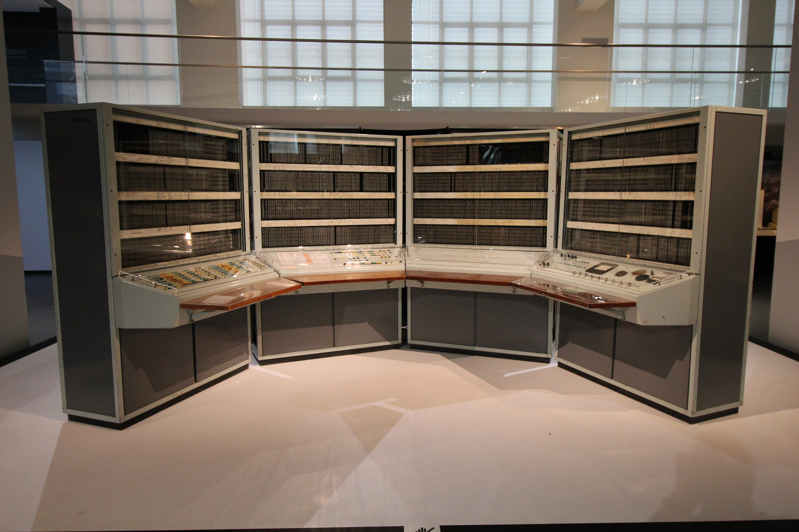
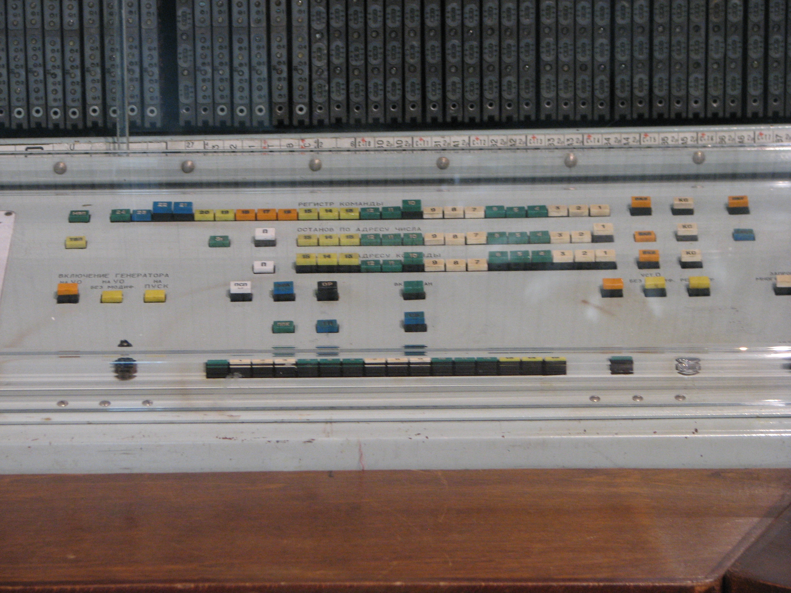
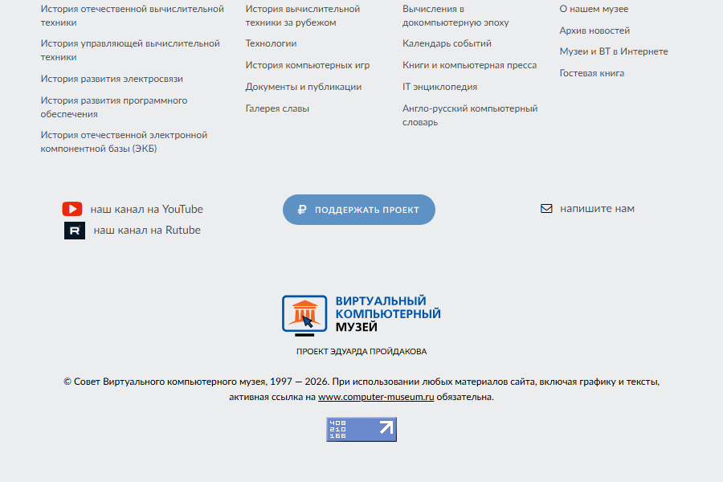

<!-- marp: true -->
<!-- theme: default -->
<!-- paginate: true -->
<!-- size: 16:9 -->
<!-- Источники содержания: главы 01–08 и иллюстрации каталога book/images -->

# БЭСМ-6

## Как устроена машина, на которой выросла советская вычислительная школа

Курс для студентов

---

## После курса вы сможете читать БЭСМ-6 как систему

- объяснить, зачем машине 48-битное слово;
- разобрать адрес и код команды;
- проследить путь данных через процессор и память;
- понять роль экстракодов и MONSYS;
- запустить небольшой пример в симуляторе.

---

## Главный вопрос курса: как машина превращает слово в действие?

Мы пройдём один и тот же путь на разных уровнях:

**бит → слово → команда → программа → задание → вычислительная система**

---

## БЭСМ-6 интересна не только как музейный экспонат

- это цельная архитектура общего назначения;
- она соединяет конвейер, виртуальную память и развитое ПО;
- её ограничения хорошо показывают цену инженерных решений;
- исторические программы можно изучать в современном симуляторе.

---

## В 1960-е скорость вычислений стала научным ресурсом

- физика требовала численного моделирования;
- космические программы — расчёта траекторий;
- инженерия — решения больших систем уравнений;
- обработка данных перестала помещаться в ручные процессы.

---

## Школа Лебедева проектировала не отдельный процессор, а комплекс



- вычислительная машина;
- устройства хранения и ввода-вывода;
- системное программное обеспечение;
- языки, библиотеки и методики эксплуатации.

---

## Разработка БЭСМ-6 опиралась на опыт предыдущих машин

- архитектурные идеи развивались последовательно;
- проект учитывал реальные научные нагрузки;
- серийность требовала ремонтопригодности;
- программная совместимость становилась самостоятельной ценностью.

---

## Серийная машина превратила архитектуру в инфраструктуру

БЭСМ-6 работали в вычислительных центрах, университетах и научных институтах.

Важно не только число установок: вокруг них появились операторы, системные
программисты, библиотекари программ и пользователи пакетной обработки.

---

## Типичная задача проходила длинный путь до результата

1. Подготовить программу и данные.
2. Сформировать пакет задания.
3. Отдать его оператору.
4. Дождаться трансляции и выполнения.
5. Получить распечатку или перфоленту.

---

## Проверьте историческую рамку

1. Почему производительность стала системной потребностью?
2. Зачем вычислительному центру отдельные роли оператора и программиста?
3. Чем серийная машина отличается от лабораторного прототипа?

---

## Архитектура БЭСМ-6 строится вокруг нескольких параллельных трактов


- процессор выбирает и исполняет команды;
- память хранит общие слова данных и кода;
- устройства обмениваются блоками;
- управляющие механизмы согласуют работу частей.

---

## 48 бит — центральный масштаб машины

Одно слово достаточно широко для точных научных вычислений и одновременно
вмещает две 24-битные команды.

Это решение связывает арифметику, формат программы и пропускную способность памяти.

---

## Конвейер совмещает этапы нескольких команд


Пока одна команда вычисляется, следующая может декодироваться, а ещё одна —
выбираться из памяти.

Производительность появляется из перекрытия, а не только из быстрого элемента.

---

## Упрощённый цикл команды состоит из четырёх шагов

1. Выборка слова по счётчику команд.
2. Выбор левой или правой половины.
3. Декодирование операции и адреса.
4. Выполнение и запись результата.

---

## Параллелизм полезен, пока команды не зависят друг от друга

- чтение следующей команды можно начать заранее;
- арифметика и обращение к памяти используют разные узлы;
- независимые операции перекрываются;
- зависимость по данным заставляет ждать.

---

## Конфликт конвейера — это вопрос времени, а не логики программы

Если следующей команде нужен ещё не готовый результат, архитектура должна:

- приостановить продвижение;
- передать результат напрямую;
- либо изменить порядок подготовительных действий.

---

## Быстродействие определяется всем трактом

На время выполнения влияют:

- длительность арифметической операции;
- задержка памяти;
- попадание в быстрые регистры;
- конфликты банков;
- обмен с внешним устройством.

---

## Транзисторно-диодная логика задала физические ограничения

- схемы занимали значительный объём;
- задержки на соединениях были заметны;
- надёжность требовала контроля и охлаждения;
- ремонт выполнялся заменой типовых элементов.

---

## Конструкция машины была частью архитектуры



Стойки, питание, вентиляция и кабельные соединения определяли достижимую частоту,
надёжность и удобство обслуживания не меньше, чем логическая схема.

---

## Проверьте архитектурное мышление

1. Почему конвейер не сокращает задержку одной команды?
2. Как зависимость по данным снижает производительность?
3. Почему физическая компоновка влияет на архитектуру?

---

## Память БЭСМ-6 — это иерархия скоростей


Чем ближе хранилище к процессору, тем оно быстрее и меньше.

Регистры, оперативная память, барабаны, диски и ленты решают разные задачи.

---

## Оперативная память хранит 48-битные слова

- данные и команды используют одну память;
- адрес указывает на слово, а не на байт;
- контрольные признаки помогают обнаруживать ошибки;
- время доступа заметно для конвейера.

---

## 15-битный адрес задаёт пространство из 32 768 слов

$$2^{15}=32768$$

Это 32K слов по 48 бит — около 192 КиБ полезных данных без учёта контроля.

Восьмеричная запись естественно группирует 15 бит в пять цифр.

---

## Адрес ноль требует явной семантики

В архитектурном коде нулевой адрес может означать:

- реальную ячейку данных;
- отсутствие адреса в поле команды;
- недопустимый переход;
- специальный вариант экстракода.

Контекст важнее числового значения.

---

## Расслоение памяти повышает пропускную способность

Последовательные адреса распределяются между независимыми банками.

Пока банк 0 завершает цикл, процессор может обратиться к банку 1, затем 2 и 3.

---

## Последовательный массив хорошо использует четыре банка

| Адрес | 00000 | 00001 | 00002 | 00003 | 00004 |
|---|---:|---:|---:|---:|---:|
| Банк | 0 | 1 | 2 | 3 | 0 |

Шаг массива, кратный четырём, снова обращается к тому же банку и может создать конфликт.

---

## Математическая память отделяет адрес программы от размещения

Программа использует виртуальный адрес, а система преобразует его в физический.

Это позволяет защищать задания, перемещать страницы и давать каждой программе
собственное адресное пространство.

---

## Адрес страницы складывается из номера и смещения

Для страницы размером 64 слова:

- младшие 6 бит — смещение внутри страницы;
- старшие 9 бит — номер виртуальной страницы;
- таблица преобразования выбирает физическую страницу.

---

## Ассоциативная память ускоряет повторные обращения

Быстрые регистры хранят недавно или часто использованные слова вместе с тегом адреса.

Идея похожа на кэш: поиск выполняется по содержимому тега, а не последовательным
просмотром памяти.

---

## Проверьте понимание памяти

1. Сколько слов адресует 15-битный адрес?
2. Почему последовательный доступ дружит с расслоением?
3. Что разделяет виртуальная память: программу и физическое размещение или код и данные?

---

## Одно слово имеет несколько допустимых интерпретаций


- число с плавающей точкой;
- целое или логическая маска;
- шесть восьмибитных символов;
- две 24-битные команды.

Тип определяется операцией, а не самой памятью.

---

## Формат данных задаёт смысл битов

Одинаковое слово может быть корректным числом и одновременно набором команд.

Процессор не хранит «тип ячейки». Тип возникает при декодировании текущей операции.

---

## Плавающая точка разделяет порядок и мантиссу

- порядок задаёт масштаб числа;
- мантисса задаёт значащие цифры;
- нормализация сохраняет точность;
- режим округления влияет на младшие биты результата.

---

## Сложение вещественных чисел начинается с выравнивания порядков

Для $1.5 + 0.125$ машина должна:

1. привести мантиссы к общему порядку;
2. сложить выровненные мантиссы;
3. нормализовать результат;
4. округлить его до разрядности слова.

---

## Целое число использует дополнительный код

- положительные числа записываются прямо;
- отрицательное получается инверсией и прибавлением единицы;
- сложение не требует отдельной схемы для знака;
- переполнение требует отдельной проверки.

---

## Текст зависит от таблицы кодировки

Исторические программы используют GOST, ISO, ITM и КОИ-7.

Байт без правильной таблицы — всего лишь число. Поэтому ошибки кодировки выглядят
как «кракозябры», хотя память и ввод-вывод работают исправно.

---

## Две команды в слове экономят пропускную способность памяти

Каждая половина занимает 24 бита:

- сначала выполняется левая;
- затем правая;
- после правой счётчик переходит к следующему слову.

---

## Левая и правая половины — часть состояния процессора

Переход может выбрать новое слово и сбросить признак половины.

Экстракод также может завершить всё командное слово, пропуская оставшуюся половину.

---

## Счётчик команд указывает на слово, а половина хранится отдельно

Такой подход объясняет, почему трасса должна показывать два признака:

`PC = 01234, half = L` или `PC = 01234, half = R`.

Один PC без половины не определяет текущую команду.

---

## Проверьте понимание машинного слова

1. Почему память не знает тип хранимого слова?
2. Что происходит после исполнения правой команды?
3. Какие этапы обязательны при сложении чисел с разными порядками?

---

## Регистры удерживают рабочее состояние процессора

Основные группы:

- аккумулятор и регистр младших разрядов;
- счётчик и регистр команды;
- режим арифметического устройства;
- индекс-регистры;
- служебные адреса и модификаторы.

---

## Аккумулятор ACC — главный операнд и результат

Большинство одноадресных операций используют схему:

`ACC ← операция(ACC, память[адрес])`

Поэтому состояние ACC критично для воспроизводимой трассы.

---

## RMR сохраняет вытесненные или младшие разряды

Регистр младших разрядов нужен для:

- сдвигов;
- округления;
- длинных результатов;
- некоторых сервисных преобразований.

Потеря RMR проявляется далеко после самой ошибки.

---

## RAU определяет способ интерпретации результата

Режим арифметического устройства различает логические, аддитивные и
мультипликативные состояния.

Условный переход может зависеть не только от ACC, но и от текущего режима.

---

## Индекс-регистры превращают адрес в выражение

Исполнительный адрес обычно вычисляется так:

`EA = (поле_адреса + M[регистр]) mod 32768`

Это основа массивов, циклов, стека и позиционно-независимого кода.

---

## M[0] означает отсутствие модификации

Нулевой номер индекс-регистра обычно даёт добавку 0.

Это не то же самое, что чтение произвольного пользовательского регистра с номером 0.

---

## M[15] часто играет роль указателя стека

Магазинные варианты команд могут автоматически:

- уменьшить M[15] перед записью;
- прочитать или записать вершину;
- восстановить указатель при прерванной команде.

---

## MOD переносит модификацию на следующую команду

Команда модификации устанавливает временную поправку адреса.

Следующая команда потребляет MOD, после чего поправка сбрасывается. Это маленькое
состояние сильно влияет на поток управления.

---

## PC, RK и AEX отвечают на три разных вопроса

- **PC:** где находится командное слово?
- **RK:** какие 24 бита сейчас декодируются?
- **AEX:** к какому адресу реально обращается команда?

---

## Проверьте регистровую модель

1. Зачем хранить RMR, если есть ACC?
2. Как индекс-регистр помогает пройти массив?
3. Почему MOD нужно сбрасывать после одной команды?

---

## Команда кодирует операцию, регистр и адрес

Три вопроса декодирования:

1. Что сделать?
2. Какой индекс-регистр добавить?
3. Как получить исходный адрес?

Формат команды отвечает на них разными полями.

---

## Короткий формат экономит биты для частых адресов


Код операции получает больше битов, а адрес хранится компактно и расширяется
по правилам формата.

---

## Длинный формат даёт полный 15-битный адрес


Кодов операций меньше, зато команда прямо указывает любую ячейку адресного пространства.

---

## Исполнительный адрес формируется в несколько шагов

1. Декодировать поле адреса.
2. Расширить короткий адрес при необходимости.
3. Добавить индекс-регистр.
4. Применить MOD.
5. Оставить младшие 15 бит.

---

## Чтение и запись связывают ACC с памятью

- `сч` загружает слово в ACC;
- `зп` записывает ACC в память;
- магазинные формы дополнительно меняют M[15];
- адрес ноль может включать специальный стековый вариант.

---

## Арифметические команды работают с нормализованными числами

Группа включает сложение, вычитание, умножение, деление и операции над порядком.

У каждой команды есть не только числовой результат, но и новое состояние RAU/RMR.

---

## Логические команды рассматривают слово как 48 независимых битов

- И, ИЛИ и исключающее ИЛИ;
- подсчёт и анализ разрядов;
- сборка и разборка полей;
- маскирование флагов и адресов.

---

## Сдвиг использует пару ACC–RMR

При сдвиге вытесняемые биты не обязаны исчезать: они могут переходить между
регистрами.

Это позволяет выполнять длинные преобразования и точное округление.

---

## Индексные команды управляют адресами как данными

Они загружают, выдают, складывают и передают значения M-регистров.

Так программа строит циклы и указатели без обращения к обычной памяти на каждом шаге.

---

## Проверьте группы команд

1. Чем короткий формат платит за расширенный код операции?
2. Какие шаги образуют исполнительный адрес?
3. Почему сдвигу полезен второй 48-битный регистр?

---

## Безусловный переход заменяет продолжение программы

Переход устанавливает новый PC и выбирает левую половину нового слова.

Переход на ноль обычно сигнализирует ошибку потока, а не штатное завершение.

---

## Условный переход читает признаки результата

Условие может учитывать:

- знак или ноль ACC;
- режим RAU;
- содержимое индекс-регистра;
- результат предыдущей операции.

---

## Команда цикла объединяет изменение счётчика и переход

Типовой шаблон:

1. изменить индекс-регистр;
2. проверить условие завершения;
3. перейти к началу тела;
4. продолжить после выхода.

---

## Вызов подпрограммы должен сохранить адрес возврата

Архитектура не навязывает один высокий уровень соглашений.

Программа и библиотека договариваются, где хранить возврат, параметры и временные данные.

---

## Стек делает вложенные вызовы управляемыми

В стек помещают:

- адрес возврата;
- сохранённые регистры;
- локальные данные;
- промежуточные параметры.

M[15] связывает эти элементы в дисциплину LIFO.

---

## Режимные команды изменяют правила следующего действия

Они могут управлять MOD, индекс-регистрами, режимом вычисления и системным состоянием.

Такие команды опасно рассматривать как обычную арифметику: эффект живёт дольше результата.

---

## STOP — архитектурно явное завершение

Штатная программа должна прийти к останову или экстракоду завершения.

Лимит инструкций, цикл и переход на ноль — диагностические исходы, а не аналоги STOP.

---

## Некоторые коды намеренно считаются недопустимыми

Illegal instruction означает, что текущая модель не допускает операцию в данном режиме.

Нельзя превращать её в no-op только ради продолжения: это скрывает более раннюю ошибку.

---

## Экстракод передаёт сложную функцию системному слою

Команды `050–077` используются как вызовы математических, файловых, печатных и
операционных сервисов.

Для программы это одна команда; для системы — отдельный протокол.

---

## Проверьте управление потоком

1. Чем STOP отличается от лимита инструкций?
2. Где хранится адрес возврата подпрограммы?
3. Почему неизвестную команду нельзя автоматически игнорировать?

---

## Экстракод 50 объединяет математику и системные сервисы

Вариант выбирается исполнительным адресом или индекс-регистром:

- корень, синус, косинус, логарифм;
- разбор и форматирование числа;
- дата и время;
- служебные запросы ОС.

---

## Экстракод 57 управляет лентами и файлами

Типовые операции:

- назначить устройство;
- найти том;
- разрешить запись;
- открыть файл или scratch-область;
- освободить ресурс.

---

## Экстракод 64 превращает память в печатное представление

Он поддерживает списки областей и разные форматы:

- GOST и ISO-текст;
- восьмеричные слова;
- вещественные числа;
- команды;
- управление строкой и страницей.

---

## Экстракод 67 ставит одноразовую точку наблюдения

Режимы watchpoint:

- выборка команды;
- запись по адресу;
- чтение по адресу.

При срабатывании выполнение возвращается к адресу продолжения до опасного действия.

---

## Экстракод 70 переносит страницу между памятью и устройством

Контрольное слово задаёт:

- чтение или запись;
- номер диска или барабана;
- зону, тракт и сектор;
- страницу оперативной памяти.

---

## Экстракод 71 связывает память с терминалом и перфоратором

Управляющее слово задаёт начальный и конечный адреса буфера и направление обмена.

Одна операция может вывести строку, принять ввод или пробить набор карт.

---

## Экстракоды 72, 75 и 76 обслуживают системное состояние

- `72` — запросы страниц и dayfile;
- `75` — запись и вооружение перехвата;
- `76` — отдельные режимные запросы ядра.

Поддерживаемый набор определяется операционной системой.

---

## Жизненный цикл экстракода должен сохранять состояние процессора

1. Завершить текущее командное слово.
2. Вычислить исполнительный адрес.
3. Выполнить обработчик.
4. Сохранить новые ACC, RMR и регистры.
5. Вернуть логический режим и продолжить.

---

## Арифметическая ошибка может быть перехвачена системой

При переполнении или делении на ноль процессор:

- корректирует незавершённое изменение стека;
- проверяет вооружённый перехват;
- передаёт управление обработчику;
- либо завершает задание с диагностикой.

---

## Проверьте протоколы экстракодов

1. Почему экстракод может пропустить правую половину слова?
2. Что задаёт контрольное слово I/O?
3. Какие регистры нельзя потерять при возврате из обработчика?

---

## Периферия превращает процессор в вычислительный центр

Основные классы устройств:

- магнитные ленты;
- барабаны и диски;
- перфокарты и перфоленты;
- печатающие устройства;
- терминалы и графические выводы.

---

## Магнитная лента удобна для последовательных наборов данных

- большая ёмкость и низкая стоимость;
- естественная последовательная обработка;
- монтаж тома перед использованием;
- заметное время перемотки и поиска.

---

## Магнитный барабан даёт быстрый циклический доступ

Данные распределяются по трактам и секторам.

Задержка зависит от вращения, но фиксированная геометрия делает обмен предсказуемым.

---

## Дисковый пакет сочетает адресуемость и сменный носитель


Зона и сектор определяют положение блока, а устройство переносит страницу между
накопителем и оперативной памятью.

---

## Перфокарта хранит строку данных в физической форме

- отверстия кодируют символы или двоичные поля;
- колода задаёт последовательность;
- ошибка порядка карт меняет программу;
- чтение естественно работает пакетами.

---

## Принтер и плоттер выводят разные структуры

- АЦПУ печатает строки и страницы;
- плоттер строит графику командами движения;
- форматирование выполняется до физического вывода;
- управляющие символы меняют строку или страницу.

---

## Терминал добавляет интерактивность в пакетный мир

Терминальный обмен требует состояния готовности и ожидания ввода.

Программа больше не может считать, что данные уже лежат в памяти к моменту команды.

---

## Реальный I/O асинхронен, а простой симулятор часто делает его синхронным

**Аппаратная модель:** команда запускает устройство, завершение приходит позже.

**Упрощённая модель:** весь блок копируется внутри экстракода.

Второй вариант удобнее, но скрывает прерывания и ожидание готовности.

---

## Контрольное слово — компактный контракт с устройством

Оно объединяет код операции, устройство, адрес памяти и геометрию носителя.

Ошибка одного бита может выбрать другой диск, направление обмена или размер блока.

---

## Проверьте модель устройств

1. Почему лента хуже диска для случайного доступа?
2. Что теряет синхронная модель I/O?
3. Зачем контролировать состояние готовности терминала?

---

## MONSYS связывает задания с ресурсами машины

Мониторная система «Дубна»:

- принимает управляющие карты;
- монтирует библиотеки и файлы;
- запускает трансляторы;
- компонует программу;
- передаёт ей управление и собирает вывод.

---

## Управляющие карты описывают работу, а не отдельные команды CPU

Примеры намерений:

- `*NAME` — назвать задание;
- `*FORTRAN` или `*MADLEN` — выбрать транслятор;
- `*EXECUTE` — запустить результат;
- `*END FILE` — завершить пакет.

---

## Экосистема языков была шире машинного кода

На БЭСМ-6 использовали:

- БЕМШ и MADLEN;
- FORTRAN и ALGOL;
- Pascal, LISP и REFAL;
- математические и отраслевые библиотеки.

Архитектура жила через программную среду.

---

## Программа проходит цикл от текста до результата


Исходный текст → трансляция → объектные модули → компоновка → загрузка → исполнение → вывод.

---

## Минимальное задание показывает границу уровней

```text
*NAME HELLO
*FORTRAN
      PROGRAM HELLO
      PRINT 100
  100 FORMAT('HELLO, WORLD!')
      END
*EXECUTE
*END FILE
```

Карты управляют системой, строки FORTRAN — транслятором.

---

## Ассемблерный Hello показывает работу слова и экстракода

```text
PROGRAM :  , NAME,
          , *64 ,INF64
          , *74 ,
INF64   : ,     ,TEXT
TEXT    : , GOST,18H HELLO, WORLD!
```

Программа готовит описание текста, вызывает печать и завершает задание.

---

## Современный симулятор превращает историю в лабораторную работу



В симуляторе можно:

- выполнить команду пошагово;
- увидеть ACC, RMR, PC и M-регистры;
- сравнить трассы;
- запускать исторические задания;
- находить архитектурные расхождения.

---

## Практическая работа: проследите одно слово до печати

1. Запустите `hello-assem.dub`.
2. Найдите слово с двумя командами.
3. Запишите PC и половину перед каждой командой.
4. Проследите подготовку указателя для `*64`.
5. Объясните, почему программа завершается через `*74` или STOP.

---

## Материалы курса находятся рядом с презентацией

- `book/01-history.md`–`08-legacy.md` — основной учебный материал;
- `src/besm6.net` — исполняемая модель;
- Victor R. Ruiz, [БЭСМ-6 в Science Museum](https://commons.wikimedia.org/wiki/File:BESM-6_(London_Science_Museum).jpg), CC BY 2.0;
- Kristopher Doern, [пульт БЭСМ-6 BRUS](https://commons.wikimedia.org/wiki/File:Console_BESM-6_BRUS.jpg), CC BY-SA 4.0.

---

## БЭСМ-6 показывает, что компьютер — это договор между уровнями

**Биты** получают смысл в формате.
**Команды** получают данные через регистры и память.
**Программы** получают сервисы через экстракоды.
**Пользователи** получают результат через операционную систему и устройства.

Понимание машины начинается со связей между этими уровнями.
