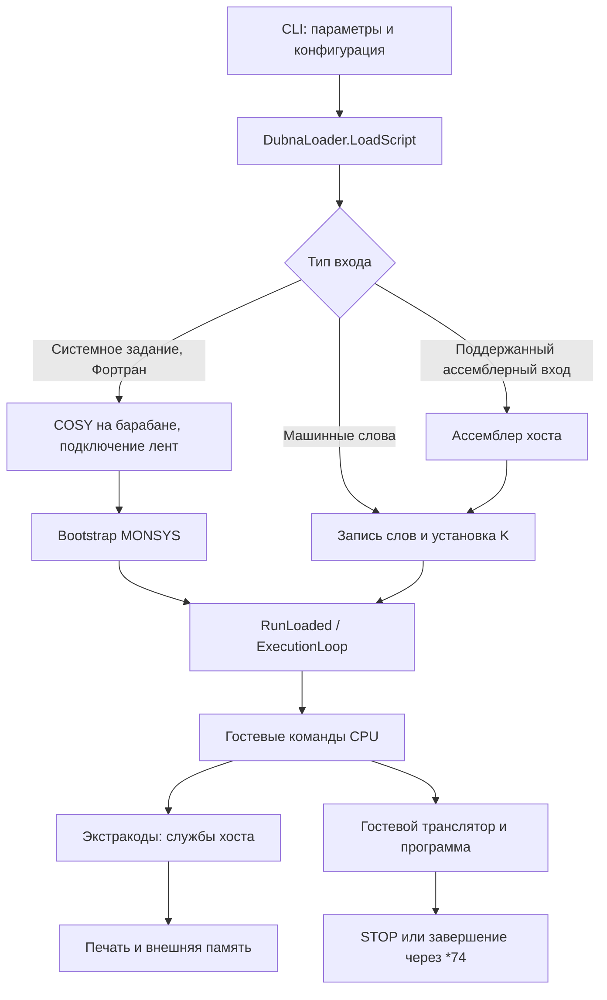
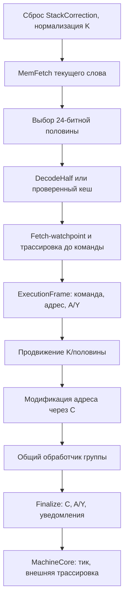

# Исполнение БЭСМ-6 на C#: состояние, горячий путь, точность и скорость

Срез принятого кода: `fbeb315`, проверка 9 октября 2026 года.
[Историческая архитектура и сверка учебника](besm6-machine-analysis.md).
Ниже рассматривается производственный Processor/DubnaLoader; другие учебные
движки репозитория не включены в его профиль.

## 1. Карта реализации

| Слой | Основные файлы | Ответственность |
|---|---|---|
| Архитектура | `Word48`, `MantissaExponent`, `InstructionCodec`, `Opcode`, `RFlags` | Биты, представления чисел/команд, константы |
| Состояние CPU | `ProcessorState`, `Processor` | Регистры, интерфейс управления, перехваты, состояние половины слова |
| Исполнение | `InstructionExecutor`, `ExecutionFrame`, четыре группы executor | Выборка, декодирование, адресация, семантика команд, завершение |
| АЛУ | `Alu`, `AdditiveOperations`, `MultiplicativeOperations`, `NormalizationAndRounding`, `ShiftOperations` | Точные целочисленные алгоритмы гостевой арифметики |
| Память CPU | `CoreMemory`, `ProcessorMemoryAccess`, `ProcessorDebugWatch` | Хранилище, особый нулевой адрес, fetch/load/store, watchpoints |
| Сборка машины | `MachineCore`, `SystemBus`, `DeviceManager` | Объединение CPU и инфраструктуры, шаги и наблюдатели |
| Загрузка | `DubnaLoader`, `JobProgramLoader`, `MonsysBootstrapper`, `TapeMountService` | Вход задания, MONSYS, барабаны/ленты, начальное состояние |
| Исполнительный цикл | `ExecutionLoop`, `ExecutionPacer`, `ExecutionStatistics` | Скорость, лимиты, остановка, перехваты, подсчёты |
| Системные услуги | части `ExtracodeHandler`, `TapeImage`, кодировки | Печать, внешняя память, математические/системные вызовы |
| Измерения | `OpcodeProfiler`, `Besm6Timing`, Python tools | Состав команд, модельное время, проверки и сравнение запусков |

Навигация по исходникам:
[Architecture](../src/Besm6.Architecture/InstructionCodec.cs),
[Processor](../src/Besm6.Processor/Processor.cs),
[MachineCore](../src/Besm6.Runtime/MachineCore.cs),
[DubnaLoader](../src/Besm6.Runtime/DubnaLoader.cs).

Основные объекты исполнителей создаются один раз для CPU и ссылаются на
единый ProcessorState. Разделение на классы облегчает проверку семантики,
но не бесплатно: если JIT не встраивает метод, каждая гостевая команда
проходит дополнительные вызовы и загрузки ссылок. Этот расход особенно
заметен у XTA, ATX и индексных команд, полезная работа которых коротка.

## 2. Путь от файла задания до результата



LoadScript сбрасывает CPU, устанавливает обработчик экстракодов и готовит
вход. Для системного пути MONSYS подключается как лента, загрузочный код
записывается в память, выполнение начинается с bootstrap. При отображении
барабана на образ MONSYS данные клонируются: работа одного задания не должна
портить исходный системный образ для следующего запуска.

RunLoaded запускает общий исполнительный цикл. В его время входят
исполнение bootstrap/монитора, трансляция гостевого Фортрана, инициализация,
ядро бенчмарка и завершение вывода. Файловое чтение и подготовка до RunLoaded
не входят в это время. Полный процесс CLI дополнительно включает запуск
dotnet, загрузку сборок, JIT, конфигурацию и подготовку образов.

Это объясняет необходимость трёх раздельных показателей: полный процесс,
RunLoaded и оценка ядра после вычитания baseline. Ни один из них нельзя
подписывать как другой.
[Методика запуска](../tools/benchmark_processor_stages.py).

## 3. Обычный шаг: порядок действий и исключений



Выборка происходит до продвижения счётчика. Ошибка fetch должна оставлять
K/половину и A/Y в прежнем состоянии. После успешной выборки счётчик
продвигается **до** обработчика. Исключение в АЛУ или load/store поэтому
видит другое состояние K, чем ошибка fetch. Переход устанавливает цель
и левую половину; это перекрывает обычное продвижение.

Полная трассировка фиксирует состояние до команды, затем после завершения.
Legacy TraceInstruction вызывается после fetch/decode, но до advance.
Fetch-watchpoint проверяется по принятому правилу для левой половины.
MemLoad/MemStore проверяют watchpoint до специальной обработки адреса 0.
Перестановка этих шагов может изменить то, что увидит отладчик.
[InstructionExecutor](../src/Besm6.Processor/InstructionExecutor.cs),
[ProcessorMemoryAccess](../src/Besm6.Processor/ProcessorMemoryAccess.cs).

InstructionOutcome.Stop — обычная успешная команда. Экстракод *74 использует
ProcessorException с пустым сообщением как сигнал завершения. Runtime
обрабатывает его отдельно, завершает наблюдение и вывод. Непустое сообщение
может быть перехвачено гостевым механизмом Intercept; иначе задание считается
ошибочным. Лимит исполнения — самостоятельный исход, его нельзя принять
за успешный бенчмарк только потому, что процесс вернул часть вывода.

При ошибке Runtime вызывает StackCorrection. A/Y могут быть уже изменены
АЛУ до исключения переполнения; кадр может ещё не быть зафиксирован.
Таким образом, точность требует сохранения порядка исключений и записи
состояния, а не только конечного результата нормального пути.
[ExecutionLoop](../src/Besm6.Runtime/Loading/ExecutionLoop.cs).

## 4. ExecutionFrame: что устранено и что остаётся

Первоначальная реализация выделяла объект кадра на каждую команду.
При десятках миллионов команд это создавало поток короткоживущих объектов
и давление на GC. Сейчас ExecutionFrame — структура, изменяющие обработчики
получают её по `ref`. Общие исполнители и АЛУ не размножены по режимам.
[ExecutionFrame](../src/Besm6.Processor/ExecutionFrame.cs).

В кадре находятся декодированная команда, текущий и исполнительный адрес,
A/Y, NextC и флаги завершения. Это не «бесплатно» только потому, что объект
больше не лежит в куче: инициализация, передача адреса структуры, копирование
полей и spill в стек хоста могут сохраняться в машинном коде JIT.

Флаг RegistersInState означает, что A/Y уже принадлежат окончательному
ProcessorState или не требуют обратной записи. Арифметика пишет результат
в State; повторное копирование State → frame → State убрано. Простые
управляющие команды также обходят фиксацию A/Y, когда это безопасно.

Однако XTA/ATX и некоторые другие команды должны удерживать прежний снимок
регистров через обращение к пользовательскому IMemory. Пользовательское
чтение/запись может изменить A/Y или установить hook. Поэтому общий
«ленивый A/Y из State» меняет смысл наблюдаемого вызова. Для этой границы
добавлены проверки памяти с побочными эффектами.
[ExecutionFrameOptimizationTests](../tests/Besm6.Processor.Tests/ExecutionFrameOptimizationTests.cs).

Прототип ленивого A/Y с dirty-флагами прошёл проверки результатов, но
замедлил основные нагрузки примерно на 7,7–21,8%. Проверка флага и
дополнительные загрузки оказались дороже устранённых записей. Прототип
ref-кадра со ссылкой на декодированную команду не дал устойчивого общего
выигрыша. Оба отклонены; в принятом коде остаётся обычная структура.
[Изолированные эксперименты](../reports/processor-hot-path-report.md).

Дополнительно проверен кадр с компактными Opcode/Address/Register без
поля Format. Контрольное состояние совпало, но устойчивый выигрыш на всех
нагрузках не подтверждён, а серия имела выросший разброс хоста. Прототип
тоже отменён. [Замеры последующих кандидатов](../reports/processor-followup-experiments.md).

## 5. Память: быстрый и наблюдаемый доступ

CoreMemory теперь хранит слова в непрерывном Word48[], сохраняя нумерацию
банков и сообщения ошибок. В исходном Word48[][] путь включал вычисление
банка, загрузку ссылки на подмассив и обращение к нему. Непрерывный массив
убирает одну косвенность и раздельные проверки; это изменение размещения
данных хоста, а не изменение адресов гостя.

Есть три разных операции CPU:

| Операция | Нулевой адрес | Наблюдение |
|---|---|---|
| MemFetch | ProcessorException «Jump to zero» | Fetch-watchpoint в исполнительном пути |
| MemLoad | Возвращает 0 | Load-watchpoint до обработки нулевого адреса |
| MemStore | Ничего не записывает | Store-watchpoint до обработки нулевого адреса |

Сам CoreMemory.Read(0) читает физический элемент массива. Нулевая ячейка
становится особой только через CPU-обёртки. Поэтому нельзя заменять
MemLoad прямым Read без сохранения этих правил.

ProcessorMemoryAccess сохраняет IMemory и дополнительно кеширует CoreMemory
**только при точном совпадении типа**. Принятый быстрый fetch обращается к
этому конкретному объекту напрямую. Подклассы CoreMemory и другие IMemory
остаются на интерфейсном пути; проверки показывают, что их повторные чтения
не теряются.
[ProcessorFetchOptimizationTests](../tests/Besm6.Processor.Tests/ProcessorFetchOptimizationTests.cs).

Попытка применить типизированный путь сразу ко всем load/store дала
регрессию Dhrystone более допустимых 3% и отклонена. Само устранение
интерфейсного вызова не гарантирует ускорение: добавленная ветвь, размер
кода и размещение spill могут перекрыть выигрыш.

JIT принятой версии оставляет две проверки границ при встроенном Read:
пользовательскую проверку адреса с ThrowAccessViolation и стандартную
проверку массива. Эксперимент с явным `return` после холодного бросающего
метода убрал вторую проверку и уменьшил bare-loop с 1801 до 1727 байт.
Но новые замеры не показали требуемого общего ускорения; изменение
отклонено. Правильный машинный код и меньший размер ещё не являются
доказательством выигрыша времени.

## 6. Кеш декодирования и самозапись

В max создаётся массив из 65536 записей: по одной для каждой половины
32768 адресов. Запись хранит декодированную команду и тег `rawHalf+1`.
Нулевой тег обозначает пустую запись; нулевое полуслово остаётся допустимой
командой и имеет тег 1.

На **каждой** команде выполняется настоящая выборка слова. Затем выбранные
24 бита сравниваются с тегом. При совпадении используется готовая команда,
при изменении снова вызывается общий InstructionCodec.DecodeHalf.
Поэтому запись в левую/правую половину, внешняя запись через IMemory и
загрузка нового кода по прежнему адресу видны следующей выборке.

Это программный кеш разбора битов. Он не моделирует аппаратный стек команд,
не отменяет доступ к памяти и не делает программу неизменяемой. Кеш,
проверяющий только номер страницы или только запись через MemStore,
не покрывает внешние изменения памяти и потребовал бы другой контракт.

Цена кеша — выделение массива и дополнительные чтения/сравнения. На короткой
одноразовой последовательности он может не окупаться. Поэтому выигрыш нужно
измерять на гостевом компиляторе и основных циклах, а не предполагать по
самому факту наличия кеша.
[InstructionExecutor](../src/Besm6.Processor/InstructionExecutor.cs).

## 7. Что означает «выполнение блоками»

ExecutionLoop в max запрашивает до 256 команд за обращение к MachineCore.
Это уменьшает внешний цикл и повторные проверки. Размер ограничивается
оставшимся лимитом, а при wall-clock-лимите — также старой границей проверки
каждых 4096 успешных шагов. Лимит команд не округляется вверх до блока.

Внутри MachineCore есть ещё более узкий bare-путь. Он допустим при
обычном CoreMemory, отсутствии диагностических подписчиков, watchpoints
и незавершённой трассировки. Вызовы Processor.Step/MachineCore.Step на
каждую команду обходятся, но fetch, адресация и общие обработчики остаются.
Счётчик успешно завершённых шагов и тик обновляются после каждой команды;
исключение не приписывает себе успешный шаг.

Перед экстракодом блок заканчивается **до начала этой команды**. Экстракод
может установить hook или изменить окружение; он должен пройти обычный
Step с прежним порядком наблюдения. После возвращения возможность bare-пути
проверяется заново. При включении трассировки цикл возвращается к полному
диагностическому исполнению.
[MachineCore.ExecuteBlock](../src/Besm6.Runtime/MachineCore.cs),
[InstructionExecutor.ExecuteUnobservedBlock](../src/Besm6.Processor/InstructionExecutor.cs).

Это последовательное интерпретирование пакета команд, а не JIT гостевой
программы и не готовый граф базовых блоков. Самозапись продолжает проверяться
на каждой выборке. Новый кеш настоящих блоков потребует учёта всех путей
изменения памяти, переходов и входа в середину блока; он ещё не добавлен.

## 8. Профиль, статистика и диагностика — разные расходы

Лёгкое InstructionExecuted передаёт только Opcode. Профайлер и original
используют его вместо полных снимков. ProcessorTraceController готовит
снимки до/после лишь при подписке на InstructionTrace/RegisterTrace.
В снимках копируется массив M; это правильная цена полноценной диагностики,
но лишняя цена для подсчёта опкодов.
[ProcessorTraceController](../src/Besm6.Processor/ProcessorTraceController.cs).

В max без stats/profile нет табличного счётчика тактов и таймера для
ограничения скорости. Таймер нужен, если установлен отдельный wall-clock
лимит. История K выделяется/заполняется только при LoopDetect; обычный
прогресс и поиск циклов тоже меняют условия быстрого пути.

С включённым профилем/statistics opcode-уведомление остаётся реальным
вызовом и делает bare-путь недоступным. Следовательно, время профилированного
прогона нельзя использовать как скорость полностью свободного max.
Для counts/modelCycles выполняется отдельная калибровка; время max измеряется
без наблюдателей, после чего проверяется состояние машины.

LoopDetect проверяет диапазон K в окне, а HangDetect — число экстракодов
без печати/остановки. Эти эвристики могут ошибочно принять корректный
маленький вычислительный цикл за зависание. Для контролируемых бенчмарков
они отключены, а конечность обеспечена лимитом и проверкой STOP.
Старое сообщение HangDetect о невозможности фортранных заданий устарело:
контрольные запуски нынешних фортранных тестов успешно выполняются.

## 9. Реальные границы инфраструктуры машины

### 9.1. SystemBus и устройства

В MachineCore зарегистрированы объекты console/disk/drum/teletype с ID
`0x1000..0x4000`. В текущем SystemBus все адреса перенаправляются в CoreMemory.
Эти ID не превращают диапазоны памяти CPU в memory-mapped I/O.
Производственный доступ гостя к внешней памяти проходит через обработчики
экстракодов. Для ускорения CPU напрямую использует тот же экземпляр
CoreMemory, что находится за шиной.
[SystemBus](../src/Besm6.Runtime/SystemBus.cs),
[MachineCore](../src/Besm6.Runtime/MachineCore.cs).

### 9.2. Сброс и повторная загрузка

MachineCore.Reset сбрасывает CPU. Он не очищает память, Clock, очередь
Scheduler и все устройства. LoadProgram записывает слова и устанавливает K,
но сам по себе не сбрасывает выбор правой половины. Для самостоятельного
повторного запуска важен явно определённый жизненный цикл; название Reset
не следует понимать как аппаратный cold boot всей машины.

DubnaLoader добавляет собственные действия подготовки задания и установки
hook. Проведённые проверки повторного запуска относятся к этому пути и
оговорённым условиям. Они не доказывают отсутствие старых событий у любого
пользователя низкоуровневого MachineCore.

### 9.3. Clock и Scheduler: воспроизведённый пробел

MachineCore.Step увеличивает общий Clock, но не вызывает Scheduler.AdvanceTo.
Scheduler при исполнении каждого события пытается продвинуть часы к времени
этого события. Если CPU уже прошёл его срок, получается попытка движения
назад. Пример на принятой логике:

```csharp
var machine = new MachineCore();
// Две XTA 0 по адресу слова 1.
machine.LoadProgram(new[] { new Word48(0x008000008000UL) }, 1);
bool called = false;
machine.Scheduler.Schedule(1, () => called = true);
machine.Step();
machine.Step();  // Clock.Tick == 2, called == false
machine.Scheduler.AdvanceTo(machine.Clock.Tick);
// InvalidOperationException: current 2, requested 1
```

Временный Release-probe подтвердил: `tick=2`, callback не вызван,
сообщение `Simulation time cannot move backward (current 2, requested 1)`.
Это пробел интеграции очереди с CPU, а не источник замедления основных
бенчмарков. Отдельные тесты очереди проходят без этого сценария.
Исправление потребует решения о порядке событий относительно инструкции;
единицы часов в рамках оптимизации не менялись.
[EventScheduler](../src/Besm6.Runtime/EventScheduler.cs),
[SimulationClock](../src/Besm6.Runtime/SimulationClock.cs).

## 10. Подтверждённое ускорение относительно первого кода

Один прогрев и пять измеряемых последовательных Release-запусков,
фиксированный DATE*, одинаковые гостевые задания. Первый код собран из
`c0c7989`; предыдущий оптимизированный — `a6d801e`; принятый текущий —
`fbeb315`. Сборки, параметры и хеши сохранены в
[processor-hot-path-results.json](../reports/processor-hot-path-results.json).

### 10.1. RunLoaded без наблюдателей

| Нагрузка | Первый код, с | `a6d801e`, с | `fbeb315`, с | Ускорение к первому |
|---|---:|---:|---:|---:|
| Dhrystone 5000 | 1,936759 | 0,898200 | 0,703150 | ×2,754 |
| Dhrystone 10000 | 2,920581 | 1,257823 | 0,995200 | ×2,935 |
| MPMFLOPS 1 | 1,049383 | 0,580710 | 0,408087 | ×2,571 |
| MPMFLOPS 2 | 1,391330 | 0,696709 | 0,536572 | ×2,593 |
| MPMFLOPS 3 | 2,658803 | 1,192508 | 1,039656 | ×2,557 |

Последний принятый этап относительно `a6d801e` дал рост производительности
примерно 14,7–42,3%, в зависимости от нагрузки. Это не нужно складывать
с процентами более ранних этапов: коэффициенты ускорения перемножаются,
а замеры с разной нагрузкой на хост нельзя произвольно объединять.

### 10.2. Полный CLI-процесс

| Нагрузка | Первый код, с | `fbeb315`, с | Ускорение |
|---|---:|---:|---:|
| Dhrystone 5000 | 2,223217 | 1,001480 | ×2,220 |
| Dhrystone 10000 | 3,217133 | 1,284498 | ×2,505 |
| MPMFLOPS 1 | 1,320837 | 0,703133 | ×1,879 |
| MPMFLOPS 2 | 1,600891 | 0,835115 | ×1,917 |
| MPMFLOPS 3 | 3,018983 | 1,353577 | ×2,230 |

Полный процесс ускоряется меньше из-за подготовки, запуска .NET и других
расходов вне оптимизированного CPU. **Минимум ×3 на всех основных заданиях
ещё не достигнут** ни по RunLoaded, ни по полному CLI.

### 10.3. DMIPS/MFLOPS после вычитания baseline

| Нагрузка | Модельная метрика | Скорость хоста max |
|---|---:|---:|
| Dhrystone 5000 | 1,85858 DMIPS | 9,98473 DMIPS |
| Dhrystone 10000 | 1,85865 DMIPS | 9,86294 DMIPS |
| MPMFLOPS 1 | 0,62656 MFLOPS | 2,69879 MFLOPS |
| MPMFLOPS 2 | 1,33510 MFLOPS | 6,57384 MFLOPS |
| MPMFLOPS 3 | 1,86131 MFLOPS | 10,38888 MFLOPS |

Формулы:

```text
kernelHostSeconds = median(RunLoaded workload) − median(RunLoaded baseline)
kernelModelSeconds = (workloadCycles − baselineCycles) × 100 ns
DMIPS = N / seconds / 1757
MFLOPS = (9000 × 30 × operationsPerElement) / seconds / 1_000_000
```

Для MPMFLOPS число полезных операций — 540000 / 2160000 / 8640000.
Базовый вариант выполняет ту же подготовку без ядра. Вычитание baseline —
оценка, а не измерение точных границ каждой команды ядра: меняется путь
выбора режима и возможна шумовая ошибка разности времён.

Ускорение ядра Dhrystone-10000 после baseline примерно ×3,447, MPMFLOPS-3 —
×2,435. Первое значение нельзя использовать для объявления всей машины
ускоренной минимум втрое. Модельные показатели не изменились от ускорения
хоста, поскольку состав команд и таблица тактов сохранены.

### 10.4. MemSpeed

Два массива по 4096 слов, 1000 проходов. Гостевой объём данных — 48 КиБ.
Копирование считает 12 байт трафика на элемент, add/triad — 18.
После baseline в одной сопоставимой серии:

| Ядро | Предыдущий max, MB/s | `fbeb315`, MB/s | Прирост |
|---|---:|---:|---:|
| Copy | 27,9096 | 34,9029 | +25,1% |
| Add | 35,7813 | 43,8932 | +22,7% |
| Triad | 31,9998 | 38,1179 | +19,1% |

Это логический трафик гостя, десятичные MB/s, не MiB/s и не показание
контроллера памяти хоста. АЛУ и диспетчеризация входят в знаменатель.
Модельные величины: 5,2142 / 6,9164 / 5,4494 MB/s.
[Проверки значений и всех элементов](../reports/memspeed-report.md).

## 11. Что сейчас занимает время

Sampling-профиль принятой DLL собран dotnet-trace без гостевого профиля/stats.
Собственная доля записанного времени основного потока:

| Метод | Dhrystone 10000 | MPMFLOPS 3 |
|---|---:|---:|
| ExecuteUnobservedBlock | 55,33% | 46,33% |
| MemoryInstructionExecutor.ExecuteOther | 9,02% | 21,27% |
| AdditiveOperations.Add | 2,93% | 3,33% |
| MultiplicativeOperations.Multiply | 0,65% | 3,35% |

После встраивания команд их время учитывается у bare-loop. Поэтому 46–55%
у цикла означает смесь выборки, проверки кеша, подготовки кадра, адресации,
части команд и завершения. Это не означает «пустой for тратит половину CPU».
Sampling статистический; короткие методы и один короткий процесс дают
ограниченную точность. В профиль входит и гостевая трансляция.

JIT-дизассемблирование подтверждает: Dispatch, AdvanceInstructionHalf,
FinalizeInstruction и обычная MemFetch встроены; hot XTA/ATX/NTR и ряд
управляющих команд также находятся внутри цикла. Остальные исполнители и
данные MemLoad/MemStore остаются вызовами. Bare-loop принятого варианта
занимает 1801 байт машинного кода.
[Профиль и доказательства](../reports/processor-hot-path-report.md).

Вывод по этим нагрузкам: основные оставшиеся расходы — весь путь команды
и крупный общий обработчик памяти, затем точная арифметика. Это вывод о
данных Dhrystone/MPMFLOPS, а не о любой программе. Делительно насыщенная
программа, массовая печать или терминальная работа могут иметь другой профиль.

## 12. Почему локальная оптимизация не даёт ещё ×3

При доле оптимизируемой работы `p` и локальном ускорении `s` предел общего
ускорения: `1 / ((1 − p) + p/s)`. Если реальная доля деления мала, даже
идеально быстрое деление мало меняет общий тест. Собственные доли sampling
нельзя непосредственно подставлять как точные p для встроенных методов.

Для достижения ×3 относительно первой серии нужно уменьшить нынешнее
RunLoaded ещё примерно на 2,2% для DH10000, 8,2% для DH5000, 14,3% для MP1,
13,6% для MP2 и 14,8% для MP3. Это оценки из сохранённых медиан; новый
кандидат должен проверяться в общей новой серии с исходной сборкой.
Для полного CLI требуется существенно больше, поскольку CPU ускоряет
лишь часть полного процесса.

Принятые изменения складываются из устранения накладных расходов и точных
алгоритмов, но следующий этап уже ограничен памятью инструкций хоста,
размером кода, загрузками состояния и стоимостью оставшихся вызовов.
AggressiveInlining — запрос JIT, а не гарантия лучшего времени. Раздувание
цикла может помочь арифметическому тесту и одновременно замедлить Dhrystone.

## 13. Следующие эксперименты и обязательные инварианты

| Кандидат | Ожидаемый механизм | Что может перечеркнуть выигрыш |
|---|---|---|
| Уменьшить перенос полей декодированной команды/кадра | Меньше spill и инициализации | Дополнительные getter/маски, изменение API, худшее встраивание |
| Разделить горячий и холодный путь памяти | Короче успешный fetch/load/store | Новые ветви и нарушения IMemory/watchpoint-контракта |
| Встраивать выбранные команды по одной | Убрать dispatch/call для частых opcodes | Рост bare-loop и регрессия другого теста |
| Убрать доказанно повторную нормализацию адреса в bare-пути | Меньше масок/записей K | Изменения K из переходов, hook, особые исключения |
| Точная арифметика широкими целыми | Меньше операций сборки произведения/деления | Подпрограммы JIT, знаковые границы, Y и правила округления |
| Настоящий кеш базовых блоков | Амортизировать fetch/decode/dispatch | Инвалидация самозаписи и внешних записей, порядок диагностики |

Принимать изменения можно только после замера по отдельности и общей
проверки: полезное ускорение от 5%, без регрессии более 3% на основной
нагрузке. Нельзя обосновывать изменение только меньшим числом C#-строк,
атрибутом inlining или одним удачным запуском.

Неприкосновенные свойства: A/Y/R/C/M и флаг половины; эффективные адреса;
модификация следующей команды; нулевой адрес; магазинная коррекция;
самозапись и внешние IMemory; нормализация/округление; STOP/*74/перехваты;
порядок исключений и уведомлений; точный лимит успешных шагов; повторный
запуск и восстановление подписок. Общая семантика обоих режимов сохраняется.

## 14. Проверки и практический предел утверждения о точности

Принятая версия: Release Rebuild без ошибок/предупреждений;
748 тестов прошли, два прежних диагностических теста пропущены;
быстрые golden-проверки 3/3. Сравнены конечные регистры, хеш всей памяти,
состав команд и модельные такты между исходным/предыдущим/текущим max;
для original — также соответствие состоянию и темп. MemSpeed проверяет
все элементы в гостевой программе и контрольные суммы извне.

CERN-гейт: 394 из 397 прошли. `i312a`, `j531a`, `j531b` остаются ошибочными
с теми же сообщениями, что до последней оптимизации, кроме времени.
Это подтверждает отсутствие новой регрессии в этих трёх случаях, но
**не превращает гейт в полностью пройденный** и не доказывает точность
всех возможных программ. Полная аппаратная точность, приписка страниц,
электрические задержки и устройства этим набором не проверяются.
[Результаты проверок](../reports/processor-hot-path-results.json).

## 15. Воспроизводимость измерений

Снимки сборок неизменяемы во время одной серии. Python создаёт варианты
заданий во временном каталоге; исходные примеры не переписываются. В каждой
серии один прогрев и пять измерений, варианты чередуются по очереди,
параллельные CPU-бенчмарки не запускаются. Это уменьшает влияние состояния
хоста, но не заменяет оценку разброса.

Перед засчитыванием результата проверяются код возврата, завершение,
контрольные значения, отсутствие усечения лимитом. Листинг компилятора
исключается из области поиска результата. Калибровка со stats/profile
даёт детерминированные counts/cycles; время bare max берётся из отдельного
прогона без них. FinalState и SHA-256 памяти снимаются за пределами таймера.

Сохраняются JSON/CSV, исходный вывод, параметры среды и хеши сборок.
Для локального повтора принятых снимков:

```powershell
python tools/benchmark_processor_stages.py --legacy-variant initial=tmp/besm6-threefold/original-source/src/Besm6.Cli/bin/Release/net8.0/besm6.dll --variant current=tmp/besm6-memory-direct/control/besm6.dll --jobs dh0 dh5000 dh10000 mp0 mp1 mp2 mp3 --runtime-probe --output tests-run/architecture-repeat
```

При отсутствии временных снимков их нужно пересобрать из указанных Git-коммитов
в отдельных каталогах. Сравнение со старой DLL неизвестного происхождения
или со stats-временем вместо bare max не воспроизводит эту методику.
