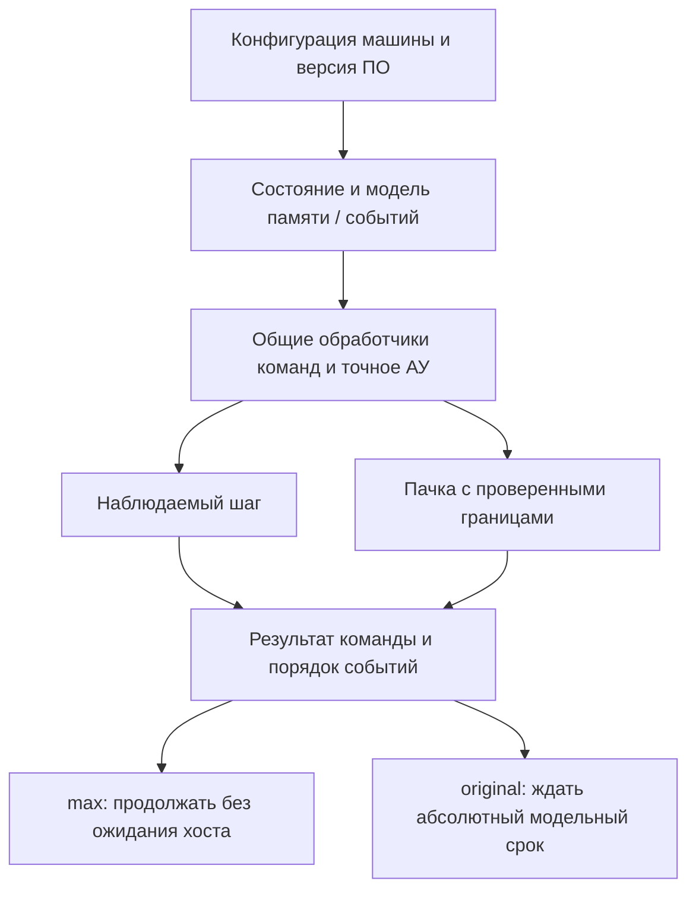

# БЭСМ-6: спецификация точности и устройство быстрого симулятора

Дата: 9 октября 2026 года. Проверенный срез кода: `2bab373`; процессорные
оптимизации: `092634f`. Этот документ — архитектурный анализ и предложение
дальнейшей работы. Описанные ниже новые профили точности, MMU, контрольные
разряды и аппаратная модель времени **ещё не реализованы**.

Актуализация: начата [первая часть этапа 3](besm6-hardware-memory.md): отдельные
50-разрядные ячейки, физическая память 32K, приписка и защита по ТО-8 1967 года.
Физическая память и БРЗ/БРС теперь доступны CPU через
[выбираемую модель памяти](besm6-memory-models.md). Приписка/защита,
аппаратный профиль и модель времени остаются незавершёнными.
Ниже сохранён анализ исходного среза.

После этого среза выполнен [первый инфраструктурный этап](execution-lifecycle.md):
доставка событий, явный старт и сброс CPU. Ограничения раздела 9 ниже
описывают исходное состояние; актуальные контракты приведены по ссылке.

Текущий движок убедительно воспроизводит большой корпус программ системы
«Дубна» и уже ускорен относительно исходной реализации. Для утверждения
«поведение реальной машины» этого недостаточно: надо определить конфигурацию
БЭСМ-6, версию диспетчера, наблюдаемое состояние и правила времени. Особенно
важны различия между данными и командами в памяти, арифметические авосты,
самомодификация, буферы и завершение обмена с устройствами.

Быстрое и точное исполнение совместимы. Скорость хоста может меняться без
изменения гостевых результатов и порядка событий. Но исключать аппаратные
механизмы, которые программа способна наблюдать, можно лишь в отдельном,
явно ограниченном профиле совместимости.

## 1. Источники и границы доказательств

Основной источник — А. И. Салтыков, Г. И. Макаренко,
«Программирование на языке Фортран», под редакцией Н. Н. Говоруна,
«Наука», 1976, 256 с. Использована [книга в составе репозитория](../book/fortran-1976/README.md):

| Материал | Для чего использован |
|---|---|
| [Глава I, §§ 1–6](../book/fortran-1976/01-besm6.md) | Слово, регистры, адресация, память, арифметика, экстракоды |
| Глава I, §§ 7–8 | Граница машины, диспетчера и мониторной системы |
| [Глава II, §§ 11, 14–15, 28–32](../book/fortran-1976/02-fortran-dubna.md) | Представления Фортрана, функции, ввод-вывод, диагностика |
| [Глава III, §§ 36, 47, 52](../book/fortran-1976/03-madlen.md) | Команды MADLEN, базирование, библиотечная печать |
| [Глава IV, §§ 54–58](../book/fortran-1976/04-optimization.md) | Причины различия времени гостевых программ |
| [Приложение 1](../book/fortran-1976/05-appendices.md) | Изменения A/Y/R и отдельные времена УУ/АУ |
| [Скан страницы 247](../book/fortran-1976/original/page-247.png) | Независимая визуальная сверка таблицы арифметики |

В Markdown-конверсии прямо указано, что полная независимая посимвольная
сверка не проводилась. Таблицу страницы 247 проверил по изображению:
сложение 5/11/280, умножение 15/18/162, деление 47/50/174 такта в АУ
соответствуют текстовой версии. Остальные положения проверены по тексту;
это не поскановая экспертиза всей книги.

Современные [раздел II](../book/02-architecture.md) и
[раздел III](../book/03-instruction-set.md) полезны для навигации, но содержат
ошибки и неподтверждённые упрощения. Например, разряд знака мантиссы,
размер порядка и смещение в § 3.1.2 противоречат изданию 1976 года;
пятиступенчатая схема сама по себе не доказывает устройство физической БЭСМ-6.
Использовать такие схемы как спецификацию процессора нельзя.
Подробный перечень уже приведён в [историческом анализе](besm6-machine-analysis.md).

Книга описывает прежде всего математический режим и программирование.
Она отсылает к «Инструкции по программированию на БЭСМ-6» 1967 года
и книге Л. Н. Королева «Структуры ЭВМ и их математическое обеспечение»
1974 года: позиции 22 и 24 [библиографии](../book/fortran-1976/06-bibliography.md).
Наличие названия в библиографии не означает, что содержимое этой работы
здесь проверено. Точные схемы приоритетов прерываний, образования контрольных
разрядов, вытеснения буферов и привилегированных регистров требуют отдельного
источника. Ниже эти места обозначены как незакрытые вопросы.

## 2. Что означает «повторить поведение»

Следует разделить четыре уровня доказательства:

| Уровень | Что должно совпадать | Чего уровень ещё не доказывает |
|---|---|---|
| Результат задания | Вывод, файлы, STOP, код завершения | Все промежуточные регистры и исключения |
| Архитектура команд | A/Y/M/R/C/K, половина слова, изменения памяти, авосты после каждого шага | Аппаратные задержки и внешние события |
| Система | Приписка, защита, контроль памяти, диспетчер, обмен, прерывания | Исторический темп на конкретной конфигурации |
| Время машины | Моменты доступности результатов, конфликтов и событий | Электрические процессы и надёжность элементов |

Текущий корпус тестов даёт серьёзное подтверждение первых двух уровней
для покрытых программ и случаев. Он не превращает плоскую память
в физическую МОЗУ и не доказывает аппаратное время. Совпадение с C++ Dubna
показывает совместимость с выбранной реализацией; если обе версии наследуют
одну ошибку или упрощение, дифференциальный тест этого не обнаружит.

Для воспроизводимости нужна запись конфигурации: размер физической памяти,
режим адресации, версия ОС и библиотек, образы носителей, модель устройств,
правила арифметики и времени. Историческая машина с другим диспетчером
может иначе обработать тот же авост, даже при одинаковом АУ.

## 3. Слово и числовая модель

### 3.1. Биты и команды

В книге биты нумеруются справа налево 1–48; в C# — 0–47.
Программное слово имеет 48 бит. В МОЗУ существуют ещё два контрольных
разряда, недоступных обычной программе (§ 2). Поэтому `Word48` подходит
для программного значения, но не описывает всю физическую ячейку.

Левая команда — старшие 24 бита, правая — младшие 24.
Адрес перехода указывает слово, переход начинается с его левой команды.
Половину слова следует учитывать отдельно от 15-разрядного адреса K.
В существующем коде это `ProcessorState.IsRightHalf`.

[InstructionCodec](../src/Besm6.Architecture/InstructionCodec.cs) выделяет
4-битный индекс, короткую либо длинную операцию и адрес. Короткий адрес
не является обычным знаковым 12-битным числом: дополнительный признак
выбирает диапазон `00000–07777` либо `70000–77777` (восьмерично).
Изменение декодера проверяется на всех 24-битных кодах или на полном
покрытии полей с независимыми контрольными векторами.

### 3.2. Число БЭСМ-6 не равно double

Пусть `e` — семь старших битов слова, `m` — знаковое 41-битное целое
из младших битов с дополнительным кодом. Тогда значение:

`x = m × 2^(e − 64 − 40)`.

Знак мантиссы — бит 41 книги, то есть бит 40 C#. Порядок имеет смещение 64.
Положительная нормализованная мантисса находится в `[1/2, 1)`,
отрицательная — в `[-1, -1/2)`. Минимальный ненулевой модуль нормализованного
числа — `2^-65`, максимальный — `2^63 × (1 − 2^-40)`; ненормализованные
значения позволяют дойти до `2^-104` (§ 2).

Фортранное INTEGER — соглашение компилятора о представлении ненормализованного
числа с порядком 40, а не отдельный универсальный тип АУ. Нельзя подменять
все гостевые операции обычной арифметикой C# `long` по типу исходной переменной:
машина выполняет коды команд, а COMMON/EQUIVALENCE позволяют менять трактовку
тех же битов.

`double` может быть удобен для отображения и приближённых библиотечных
функций. Для точных команд АУ нужны целочисленные мантиссы, расширенные
промежуточные результаты и явные правила округления. Иначе исчезнут
ненормализованные значения, низшие разряды Y и особенности авостов.

## 4. Архитектурное состояние и переход одной команды

Минимальное состояние математического режима:

`S = (A, Y, M[0..15], R, C, ApplyC, K, Half, Memory, Stop/Fault)`.

Дополнительно для точной системы нужны состояние приписки и защиты,
контрольные разряды, аппаратные буферы, запросы прерываний, состояния
обмена и модельное время. Диагностические подписчики и кеш декодирования
не являются гостевыми регистрами, но могут влиять на границы исполнения.

| Регистр | Существенное правило |
|---|---|
| A | 48 бит; число или логический код определяется командой |
| Y | 48 бит; многие команды меняют или гасят его независимо от A |
| M1–M15 | Модификаторы по модулю `2^15`; M15 участвует в магазине |
| M0 | В текущей программной модели нулевой модификатор |
| R | Шесть признаков; групповые признаки не являются обычными NZCV |
| C + ApplyC | Однократная модификация следующей команды |
| K + Half | Адрес слова и положение в нём; необходимы для возврата/перехвата |

R содержит блокировку нормализации, блокировку округления, логическую
группу, группу умножения, группу сложения и блокировку авоста по переполнению
(§ 4). UZA/U1A смотрят на разные свойства A в зависимости от группы:
логический код, знак порядка либо знак мантиссы. Заменять эту логику
проверкой `A == 0` нельзя.

### 4.1. Фактический порядок в текущем исполнителе

В [InstructionExecutor](../src/Besm6.Processor/InstructionExecutor.cs):

1. Сбрасывается `StackCorrection`, нормализуется K, выбирается слово.
2. Выделяется полуслово, проверяется либо обновляется кеш декодирования.
3. Выполняются fetch-watchpoint и наблюдение перед командой.
4. Создаётся структурный `ExecutionFrame` с исходными A/Y и адресом.
5. Продвигаются K/Half; затем применяется C к адресной части.
6. Общий обработчик выполняет команду и обращения к памяти.
7. Обновляются модификация C и A/Y, если результат ещё не находится в state.
8. Вызывается наблюдение после команды. Runtime отдельно учитывает шаг.

Такой порядок уже является наблюдаемым контрактом реализации. Например,
исключение в обработчике может увидеть продвинутый K и частично изменённые
регистры. Нельзя объявить команду транзакцией с полным откатом без проверки
авостов и совместимости. `NormalizeAndRound` записывает A/Y перед проверкой
неблокированного переполнения; это важно для состояния после исключения.

Нужна таблица для каждой операции: чтения, записи, изменения M15, A/Y/R/C,
положение K при успехе и каждой ошибке. Значения «не определено» из книги
нельзя превращать в произвольное требование к аппаратуре. Например, Y после
деления в приложении не определён: для совместимости с Dubna можно закрепить
его конкретное значение, но аппаратный тест должен отличать обязательные
поля от дополнительных наблюдений выбранного эталона.

### 4.2. Адресация и магазин

Исполнительный адрес обычно получается как `(address + C + M[index]) & 077777`,
но участие модификатора зависит от команды. VZM/V1M проверяют сам модификатор,
а не используют его как обычное смещение перехода. UTC/WTC формируют C
для следующей команды; это не постоянный базовый регистр.

Магазинный случай определяется индексом 15 и нулевым адресом до добавления
M15. Порядок изменения M15 и чтения/записи особенно важен при ошибке памяти.
Отдельно проверяются XTS/STX/ITS/STI, переполнение 15-битного адреса и WTC.
Оптимизация вычисления адреса должна сохранять эти различия, а не вводить
одну универсальную формулу для всех операций.

В [ProcessorMemoryAccess](../src/Besm6.Processor/ProcessorMemoryAccess.cs)
чтение данных по адресу 0 возвращает 0, запись игнорируется, fetch по адресу
0 вызывает `Jump to zero`. Это контракт текущего профиля; перенос его
на физические адреса диспетчерского режима без отдельного источника неверен.

## 5. АУ: где точность наиболее уязвима

### 5.1. Нормализация и округление

По § 5 сначала нормализуется результат, затем выполняется округление.
Округление БЭСМ-6 состоит в установке младшего бита A при определённых
условиях наличия младших разрядов. Это не IEEE round-to-nearest-even
и не арифметическое прибавление единицы ко всей мантиссе.
Если при нормализации единицы перешли из младших разрядов в старшие,
решение об округлении меняется.

После сложения, вычитаний и умножения результат использует 80 разрядов
мантиссы: младшие 40 доступны через Y. Проверять лишь преобразованный
в `double` результат недостаточно. Ошибка младшего бита может проявиться
только после YTA или последующего вычисления.

У [NormalizationAndRounding](../src/Besm6.Processor/NormalizationAndRounding.cs)
есть разные пути для положительных и отрицательных мантисс, переноса из Y,
машинного нуля и блокировки нормализации. На нулевых/underflow-путях
сохраняются старшие биты старого Y при гашении младших 40, тогда как
обычный результат записывает `y & BITS40`. Поэтому обобщение «Y всегда
обнуляется при нуле» уже не соответствует фактическому коду.

### 5.2. Деление

Книга требует нормализованный делитель; нулевой или ненормализованный
делитель вызывает авост. После деления отдельное округление не выполняется.
Точно представимый результат должен быть точным, например 9/6 = 1,5.

[MultiplicativeOperations](../src/Besm6.Processor/MultiplicativeOperations.cs)
проверяет нормализованность по двум битам, использует невосстанавливающее
деление и вызывает нормализатор без roundFlag. Сообщение `Division by zero`
покрывает и ненормализованный делитель; текст диагностики и архитектурную
причину полезно различать в будущей спецификации.

Нельзя заменить цикл деления обычным целочисленным `/` только на основании
совпадения нескольких десятичных ответов. Надо доказать совпадение знаков,
последнего бита, остановки при нулевом остатке, точных частных, переполнения
и ненормализованного делимого. Существование другого алгоритма у независимого
эмулятора — повод сравнить контрольные векторы, а не автоматически считать
его новым безусловным эталоном.

### 5.3. Математические экстракоды

По § 6 библиотечные функции принимают и ненормализованный аргумент,
возвращают нормализованное значение, имеют собственные области определения
и диагностику. Указана точность не менее 11 десятичных знаков для подходящих
аргументов и времена 55–90 мкс, для целой части — 25 мкс.

Пути host-математики в [Runtime](../src/Besm6.Runtime/ExtracodeHandler.Math.cs)
не доказывают побитовое совпадение с исторической библиотекой.
Для строгого профиля предпочтительно исполнять закреплённые гостевые
подпрограммы либо доказать совпадение портированного алгоритма.
Выбор `Math.Sin` вместо исторического алгоритма — решение о совместимости,
а не бесплатная точная оптимизация режима max.

## 6. Память: три разных механизма

### 6.1. Программное хранилище

[CoreMemory](../src/Besm6.Processor/CoreMemory.cs) хранит слова непрерывным
`Word48[]`. Это разумно для скорости хоста: физическая раздельность банков
не требует восьми объектов массива. Прежняя нумерация банков в диагностике
сохраняется, но занятость банка и задержки в активном пути не моделируются.
Метод `GetAccessTimeNs` возвращает 900; сам по себе он не создаёт ожидания
и не является моделью полного цикла МОЗУ.

### 6.2. Физическая память и приписка

§ 3 описывает от одного до четырёх сегментов по 32К слов; распространённую
конфигурацию с двумя сегментами; страницы по 1024 слова; до 32 страниц
математического адресного пространства задачи. Таблица приписки связывает
математический номер страницы с физическим.

Увеличение массива CoreMemory до 64К не реализует MMU: CPU всё ещё
маскирует обычные адреса 15 битами. Нужны явные операции перевода адреса,
контроля доступа и физического обращения диспетчера. Проверка границ
массива C# не заменяет авост защиты или отказ приписки.

Для будущей реализации можно оставить плотный массив значений и отдельный
массив метаданных. Контроль команды/числа выполняется перед использованием
кеша декодирования. Запись должна обновлять значение, контрольные разряды
и версии памяти согласованно. Точный способ формирования двух контрольных
разрядов надо взять из аппаратной инструкции; сводить его к одному
произвольно выбранному признаку executable нельзя.

### 6.3. Самомодификация и аппаратные буферы

По §§ 2, 6 обычная запись числа и запись команды различаются. Экстракод
`*75/CTX` пишет слово с контрольными разрядами команд непосредственно в МОЗУ,
а обычный ATX сначала попадает в буфер записи. Поэтому одинаковые 48 бит
не гарантируют одинаковую допустимость и момент выборки команды.

Текущий программный кеш проверяет реальные 24 бита при каждой выборке.
Он корректно замечает записи через разные интерфейсы и изменение второй
половины слова в нынешней модели. Но он не воспроизводит физический
стек команд: книга описывает четыре слова/восемь команд и восемь БРЗ.
Сохранённая аппаратной предварительной выборкой команда может требовать
другого правила видимости записи. Точный порядок инвалидации и CTX нужно
установить по аппаратному источнику; немедленная видимость всех ATX
не должна молча объявляться аппаратной нормой.

Это важное различие для приёмки: старый тест «ATX меняет исполняемое слово»
может остаться верным для профиля Dubna, а аппаратный тест должен учитывать
контрольные разряды и состояние буферов. Изменение профиля точности способно
законно изменить результат программы; изменение только скорости — нет.

## 7. Время: исходная модель и физическая машина

### 7.1. Три шкалы, которые сейчас существуют

| Шкала | Единица и применение |
|---|---|
| Host elapsed | Stopwatch, длительность работы процесса/цикла |
| Legacy timing | `Σ CyclesOf(opcode) × 100 нс`, профиль и original |
| SimulationClock | Один тик на успешный шаг MachineCore; экспериментальная инфраструктура |

В [Besm6Timing](../src/Besm6.Runtime/Profiling/Besm6Timing.cs) источник —
современная таблица репозитория. В книге 1976 года указан такт 0,11 мкс,
а приложение различает УУ и АУ, минимум/среднее/максимум:

| Операция | Нынешняя модель | Книга: среднее АУ × 0,11 мкс |
|---|---:|---:|
| Сложение | 2 × 0,1 = 0,2 мкс | 11 × 0,11 = 1,21 мкс |
| Умножение | 7 × 0,1 = 0,7 мкс | 18 × 0,11 = 1,98 мкс |
| Деление | 12 × 0,1 = 1,2 мкс | 50 × 0,11 = 5,50 мкс |

Последний столбец — время АУ, не готовая полная стоимость инструкции.
Нельзя просто сложить УУ, АУ и память для всех команд: устройства работают
с перекрытием. Нельзя и просто заменить 100 нс на 110 нс: различаются сами
стоимости и механизм их вычисления. Среднее не является правилом для
конкретных операндов; у сложения максимум 280 тактов в таблице.

### 7.2. Как строить аппаратную модель

Рекомендуется дискретная модель событий с временами готовности ресурсов:
УУ, АУ, банков МОЗУ, буферов и каналов обмена. Начало операции ограничивают
готовность входов и доступность ресурсов; завершение публикует результаты.
Схематически:

`start = max(готовность входов, доступность требуемых ресурсов)`;
`finish = start + документированная длительность операции`.

Это принцип проектирования, а не восстановленная схема БЭСМ-6.
Какие операции могут перекрываться и где стоят блокировки, надо установить
по источникам. Фиксированные пять стадий современного учебного рисунка
не дают такого доказательства.

Внутреннее время удобно хранить целым числом наносекунд либо более мелких
единиц, точно представляющих выбранные длительности. Единицу надо указать
в типе/контракте. Существующий SimulationClock нельзя незаметно переопределить
из «шагов» в «110 нс»: это сломает текущие контракты планировщика.
До согласованной миграции аппаратное время должно быть отдельной шкалой.

### 7.3. Связь с original/max

В пределах одной модели точности обе скорости должны вычислять одинаковое
гостевое время. `max` не ждёт хостовых часов; `original` синхронизирует
тот же гостевой срок с `Stopwatch`. Если устройство завершает обмен
в модельный момент t, быстрое исполнение доставляет событие в t,
а не в момент случайного завершения фонового потока Windows.

В нынешнем original ожидание происходит по абсолютному сроку, через каждые
100 000 модельных тактов и перед успешным завершением. При опоздании хоста
инструкции не пропускаются, начальная точка не переносится. Это хорошая
политика ограничения темпа, но её точность не повышает достоверность
исторической таблицы. Текущая проверка укладывается в 8,3881 мс на выбранных
заданиях; она доказывает реализацию pacing относительно legacy-модели.

## 8. Диспетчер, монитор и устройства

По §§ 7–8 монитор организует подготовку задания, трансляцию и библиотечную
сборку; диспетчер обслуживает ресурсы и авосты во время счёта.
Текущий Runtime исполняет гостевой MONSYS и предоставляет часть системных
услуг в host-коде. Это сильная программная совместимость, но ещё не
загрузка всей исторической ОС на полной привилегированной машине.

По § 6 экстракод пропускает правую команду текущего слова, продолжает
с левой следующего, меняет M14 и сохраняет остальные модификаторы и R.
[ExtracodeInstructionExecutor](../src/Besm6.Processor/ExtracodeInstructionExecutor.cs)
правильно учитывает переход половин и записывает M14, но после успешного
host-dispatch вызывает `SetLogical()`. Это конкретное расхождение
с общим описанием книги. Пока не проверены версии диспетчера, особые
экстракоды и независимые векторы, его следует считать **кандидатом на аудит**,
а не основанием немедленно менять все обработчики. Тесту нужен ненулевой R
с арифметической группой, иначе расхождение останется невидимым.

Внешние устройства требуют не только файла-образа. По § 1 обмен с лентой
и барабаном имеет размеры блоков, контроль слов/суммы, завершение и ошибки.
Для точного профиля нужны состояние занятости, очередь запроса, положение
носителя, данные и время готовности, а также видимость незавершённого обмена
для CPU. Ожидание устройства можно ускорить переходом к следующему
модельному событию, если в интервале нет наблюдаемой работы CPU.

Печать должна сохранять GOST, размещение, листование и историческое
числовое форматирование. Символ `⏨` — не form-feed. Нельзя нормализовать
его в пробел или разрыв страницы ради прохождения golden-теста.
Три прежние ошибки CERN оказались устаревшими эталонами и уже исправлены
по независимому C++ выводу и закреплённым upstream-файлам:
[доказательства](../reports/cernlib-golden-refresh.md).

[SystemBus](../src/Besm6.Runtime/SystemBus.cs) направляет все адреса в память.
Идентификаторы устройств `0x1000..0x4000` не являются диапазонами MMIO.
Возвращать перехват этих адресов нельзя: там находятся обычные гостевые слова.
Для аппаратной системы нужны её команды/регистры обмена, а не выдуманный
современный memory-mapped протокол.

## 9. Уже видимые инфраструктурные ограничения

Эти пункты обнаружены в коде и важны до подключения аппаратных устройств:

| Место | Текущее поведение | Следствие и необходимый контракт |
|---|---|---|
| `MachineCore.Step` | Продвигает Clock напрямую, не исполняет очередь Scheduler | События не доставляются автоматически при шагах CPU |
| `EventScheduler.AdvanceTo` | Перед callback устанавливает часы в момент события | Если CPU уже прошёл ожидающее событие, попытка установки времени назад вызывает ошибку |
| `MachineCore.Reset` | Вызывает только `Cpu.Reset()` | Название не означает очистку памяти, времени, очередей и устройств |
| `MachineCore.LoadProgram` | Записывает слова и K, не устанавливает Half | Повторная загрузка после правой команды не гарантирует левый старт |
| Буферы и MMU | Нет активной физической модели | Нельзя подтвердить полный диспетчерский режим тестами пользовательских программ |

Воспроизводимый пример для времени: запланировать событие на тик 1,
выполнить два Step — Clock станет 2, callback не выполнится.
Последующий `AdvanceTo(2)` попытается перейти к тику события 1 и нарушит
монотонность. Нужен единый владелец продвижения времени с доставкой
просроченных событий по определённому правилу; поздняя случайная доставка
не является точной моделью. При миграции надо сохранить отдельный контракт
старой шкалы, а не смешать его с аппаратными наносекундами.

Для жизненного цикла предлагается различать сброс CPU, перезапуск задания
и холодный сброс машины. Для каждого указывается судьба памяти, времени,
носителей, очередей, наблюдателей и кеша. Устанавливать обязательный холодный
сброс при любом LoadProgram нельзя: некоторые загрузчики намеренно сохраняют
память. Важно явное соглашение и тест повторного запуска.

## 10. Максимальная производительность при сохранении точности

### 10.1. Что уже ускорено

Принятые изменения: структурный ExecutionFrame, отказ от лишних снимков
при отключённой диагностике, плотное хранилище, кеш декодирования с
проверкой битов, выполнение пачками через общие обработчики, улучшенный
JIT-код горячих методов и точные побитовые операции.
АЛУ пишет результат непосредственно в ProcessorState; `RegistersInState`
предотвращает обратную ненужную запись из frame. Полного обязательного
переноса `state → frame → state` для каждой арифметической операции уже нет.

Пачка сейчас — последовательная интерпретация, а не трансляция базового
блока. Она сохраняет обработчики и выходит перед callback-способным
экстракодом. Это полезная граница оптимизации: host-service может установить
наблюдателя и изменить условия продолжения.

При `max` без профиля/статистики табличный подсчёт тактов и pacing не нужны.
Однако в будущем аппаратном профиле учёт событий, занятости ресурсов
и запросов прерываний нельзя выключать вместе с диагностикой, если они
влияют на гостевую программу. Их следует делать дешевле, а не исключать.

### 10.2. Предлагаемое разделение настроек

Существующий CLI имеет `--speed original|max`. Для будущей полной машины
предлагаются независимые параметры точности и темпа; следующие названия
профилей концептуальные, **это не доступные сейчас флаги CLI**:

| Профиль | Общая семантика | Дополнительная ответственность |
|---|---|---|
| Совместимость Dubna | Нынешние команды/ABI и эталоны | Legacy-модель времени, нынешние услуги Runtime |
| Аппаратная архитектура | Общие команды АУ и адресации | Приписка, контроль памяти, привилегии, авосты |
| Аппаратное время | Всё предыдущее | Буферы, ресурсы, асинхронный обмен, документированные задержки |

Каждый профиль может исполняться в max либо с ограничением реального темпа.
Переход скорости не должен менять профиль. Отключение трассировки,
профиля и watchpoints освобождает ресурсы хоста; отключение защиты,
нормализации или контрольных разрядов меняет определение машины.

### 10.3. Условия следующей оптимизации блоков

Кешировать можно синтаксис, а не вычисленный адрес с M/C и не прочитанный
операнд. Для блока, который избегает повторной выборки, понадобится проверка
версий всех затронутых слов/страниц, включая записи CPU, загрузчика и DMA.
В аппаратном профиле проверяются также приписка, контрольные разряды
и состояние аппаратной выборки. Версия логической страницы недостаточна,
если разные виртуальные адреса отображаются на одно физическое слово.

Блок обязан закончиться перед наблюдаемым событием, экстракодом, изменением
режима/отображения или командой, для которой нельзя безопасно сохранить
промежуточное состояние. Исключение внутри блока должно оставить ту же
архитектурную точку, что пошаговое исполнение. Частное ускорение ветвления
не даёт права переносить чтение памяти раньше предшествующего авоста.

Сокращение frame допустимо только по доказанным полям чтения/записи
обработчика. Полностью убрать frame без измерения не обязательно выгодно:
больше специализированных путей увеличивает машинный код и нагрузку
на кеш инструкций хоста. Предыдущие неудачные варианты задокументированы
в [отчёте экспериментов](../reports/processor-followup-experiments.md).

## 11. Что говорят замеры, а что остаётся неизвестным

В контрольной серии Release, один прогрев и пять измерений, фиксированный
DATE*, одинаковые задания и последовательные запуски, получены:

| Задание | Исходный RunLoaded, с | Текущий, с | Ускорение |
|---|---:|---:|---:|
| Dhrystone 5000 | 1,858967 | 0,563345 | 3,300× |
| Dhrystone 10000 | 2,690162 | 0,805835 | 3,338× |
| MPMFLOPS, часть 1 | 0,990790 | 0,259770 | 3,814× |
| MPMFLOPS, часть 2 | 1,306389 | 0,381750 | 3,422× |
| MPMFLOPS, часть 3 | 2,590428 | 0,836608 | 3,096× |

RunLoaded включает гостевую подготовку/компиляцию, вход/выход и завершение
вывода. Полный холодный CLI ускорен на этих же заданиях в 2,20–2,71 раза.
Измерения сделаны на i7-2600/Windows/.NET 8; это не гарантия для другого хоста.
[Исходные параметры и результаты](../reports/processor-tier1-results.json).

После вычитания baseline текущие host-оценки: Dhrystone 9,77–10,66 DMIPS,
MPMFLOPS 4,32/8,74/12,31 MFLOPS. Это скорость исполнения гостевых задач
симулятором. Соответствующие legacy-model показатели около 1,86 DMIPS
и 0,627/1,335/1,861 MFLOPS не являются измерением физической БЭСМ-6.

MemSpeed-подобный тест даёт 39,01/48,06/40,91 MB/s для copy/add/triad.
Это логический трафик 6-байтовых гостевых слов, не пропускная способность
DRAM хоста и не исторический замер МОЗУ.
[Методика и значения](../reports/memspeed-report.md).

Native-профиль относит к `ExecuteUnobservedBlock` 57,07% собственных
выборок потока в DH10000 и 43,28% в MP3; к `Memory.ExecuteOther` —
7,88% и 21,74%. Встраивание относит время к вызывающему методу:
это не доказательство, что собственно декодирование занимает 57%.
В MP3 Multiply занимает 5,02%, Add — 3,43% по этой атрибуции.
Ускорение одного умножения вдвое при доле 5% даст лишь около 2,6%
общего ускорения, если остальные затраты неизменны. Точную долю вложенных
операций надо уточнять отдельным экспериментом, не суммируя несовместимые
inclusive/exclusive проценты. [Профиль и ограничения](../reports/processor-tier1-report.md).

Главный следующий потенциал — повторяющаяся работа исполнения команд:
выборка, адресация, dispatch, работа с регистрами и завершение. Но замеры
не обосновывают обещание ещё 3–10 раз. Любой кандидат оценивается отдельно;
для host-оптимизаций требуется хотя бы 5% общего выигрыша.
После уточнения пользователя на первом инфраструктурном этапе допустимая
регрессия на основных нагрузках составляет 5% (исходный план задавал 3%).

## 12. Проверяемая программа точности

### 12.1. Независимые эталоны

Нужны три взаимодополняющих источника:

1. Контрольные векторы из книги/аппаратной инструкции с точными битами
   и указанием состояния, которое источник действительно определяет.
2. Закреплённые версии независимых симуляторов и исторических программ.
   В отчёте фиксируются commit, конфигурация, образы и известные упрощения.
3. Пошаговый запуск против ускоренного пути этого репозитория — проверка,
   что оптимизация не меняет уже выбранную семантику.

Третий источник не является независимым доказательством правильности АУ,
поскольку обработчики общие. Он зато обнаруживает ошибки границ блока,
счётчиков, наблюдения и исключений. Книжная формула арифметики может
подтвердить часть семантики, но не заменяет неизвестную схему деления
или взаимодействия аппаратных буферов.

### 12.2. Матрица обязательных сценариев

| Область | Сценарии | Что сравнивать |
|---|---|---|
| Формат команд | Короткий/длинный адрес, обе половины, крайние регистры | Декодирование и кодирование битов |
| Адресация | UTC/WTC цепочки, переход через `077777`, нулевой адрес | C/ApplyC, EA, K/Half, ошибка |
| Магазин | Чтение/запись M15, XTS/STX/ITS/STI, ошибка памяти | Порядок изменения M15 и памяти |
| Группы R | UZA/U1A в каждой группе; блокировки | Условие перехода, A/Y/R |
| Сложение | Разные порядки, компенсация, знаки, переносы из Y | Все биты A/Y, нормализация и авост |
| Умножение | Ноль, ±1/2, крайние мантиссы/порядки | 80-разрядный результат, A/Y/R |
| Деление | Точное/неточное частное, оба знака, нулевой/ненормальный делитель | A, обязательные признаки, состояние ошибки |
| Округление | Все четыре режима; потерянные и перенесённые биты | Последний бит A и младшие 40 Y |
| Диапазон | Underflow, overflow с/без блокировки, ненормальные нули | Значение и состояние до/после авоста |
| Логика/сдвиги | Ноль, один бит в каждой позиции, крайние сдвиги | Нумерация ANX, A/Y, циклическое сложение |
| Экстракод | Левая/правая половина, ненулевой R, M14, неудачный dispatch | Пропуск половины, регистры и причина ошибки |
| Самомодификация | Изменение обеих половин, alias, CTX/ATX | Видимость, контроль памяти, версия кеша |
| MMU | Remap, alias двух страниц, защита, физическое чтение | Физический адрес, отказ и регистры авоста |
| Устройства | Чтение во время обмена, ошибка носителя, отмена, STOP | Данные, завершение, событие/прерывание |
| Планировщик | Одновременные события, callback создаёт событие, CPU на границе | Порядок и монотонность времени |
| Диагностика | Fetch/load/store watchpoints, hook в экстракоде | Точная остановка и продолжение |
| Жизненный цикл | STOP → повторный запуск, загрузка после правой команды | Все состояния согласно виду reset |
| Темп | max/original, опоздание хоста, подставные часы | Одинаковое гостевое состояние и разные ожидания |

При сравнении шага сохраняются K/Half до команды, raw opcode, операнды,
изменения регистров/памяти и результат `continue/stop/fault/intercept`.
На больших программах сначала сравниваются контрольные точки и хеши;
при первой разнице участок повторяется с полной трассировкой. Это позволяет
не включать дорогую диагностику в каждый быстрый измеряемый запуск.

Для аппаратного профиля хеш должен включать не только 48-битные значения,
но и метаданные памяти, приписку, события, устройства и видимое состояние
буферов. Время host и внутренние записи программного кеша сравнивать
как гостевые значения не требуется.

### 12.3. Состояние проверок сейчас

Первый этап исполнения и жизненного цикла завершён коммитом `c077506`:
1187 passed, 0 failed, 3 прежних skipped, 397/397 активных CERN, golden 3/3.
Повторные Release-бенчмарки прошли с принятым пользователем допуском
регрессии 5%; original выдержал прежний допуск max(20 мс, 2%).
Результаты сохранены в [отчёте этапа 1](../reports/execution-lifecycle-report.md).

Второй этап добавляет независимые книжные векторы и реестр расхождений.
Его [спецификация](besm6-command-conformance.md) и
[отчёт](../reports/book-conformance-report.md) отдельно указывают,
какие биты подтверждены книгой, какие принадлежат совместимости Dubna,
и где аппаратное правило ещё неизвестно. Изменений горячего пути нет.

Три CERN-эталона закреплены по upstream `9cc404f4241e00c2d98e386a85cdf56eca7a74a9`.
Обновление печатных эталонов не импортировало последующие изменения
алгоритмов АУ. Подробности, происхождение и строгий режим сравнения
сохранены в [отчёте CERN](../reports/cernlib-golden-refresh.md).
Прохождение CERN подтверждает этот корпус программ, но не испытания
MMU, контрольных разрядов или аппаратных прерываний.

## 13. Очерёдность реализации и критерии завершения

| Этап | Работа | Критерий завершения |
|---|---|---|
| 1 | Исполнение, события, старт и сброс CPU | Завершено: единый контракт, повторный запуск, CERN, benchmark |
| 2 | Спецификация команд и АУ | Независимые A/Y/R/C/M/K; источник/профиль/биты; классификация экстракодов, деления и авостов |
| 3 | Аппаратная память | Контрольные разряды, ATX/CTX, физические адреса, приписка, защита; self-modification/alias/remap/ошибки |
| 4 | Диспетчер и устройства | Привилегии, асинхронный обмен, прерывания; закреплённая ОС выполняет контрольные задания |
| 5 | Аппаратное время | Исторические задержки и перекрытие АУ/УУ/банков/буферов, независимые проверки времени и видимости |
| 6 | Следующее ускорение | Общая семантика, корректные границы блоков, побитовое совпадение, ≥5% выигрыша, регрессия ≤5% |

Таблица отражает принятый пользователем план из шести этапов и заменяет
предварительную восьмиэтапную последовательность этого документа.
Работу над скоростью можно вести параллельно по независимым изменениям,
но не принимать ускорение за счёт смены гостевого алгоритма или ослабления
проверок. Аппаратное время нельзя честно объявить завершённым лишь по
подгонке двух бенчмарков под исторические средние.

Для пользователя итоговый контракт должен быть простым: выбирается
конфигурация точности, затем original либо max; результаты и модельные
события внутри этой конфигурации одинаковы. Для исследователя дополнительно
сохраняются происхождение спецификации, список реализованных механизмов
и незакрытые вопросы. Это позволяет отличить точно воспроизводимую
программную модель от полной аппаратной реконструкции.

## 14. Навигация по уже выполненной работе

- [Историческое устройство и исправления учебного описания](besm6-machine-analysis.md).
- [Разбор C# и горячего пути](besm6-csharp-analysis.md).
- [Существующие CLI original/max](execution-speed.md).
- [Итоговый профиль, методика, принятые оптимизации](../reports/processor-tier1-report.md).
- [JSON измерений](../reports/processor-tier1-results.json).
- [Отклонённые и принятые отдельные эксперименты](../reports/processor-followup-experiments.md).
- [Проверка и исправление трёх CERN-эталонов](../reports/cernlib-golden-refresh.md).
