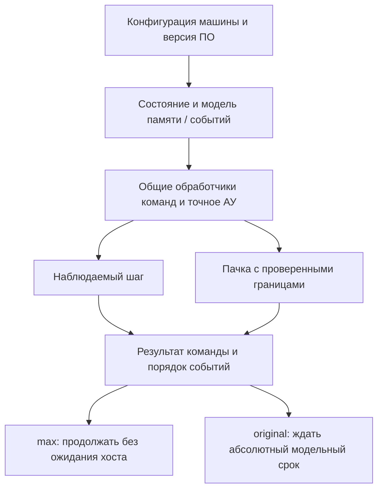
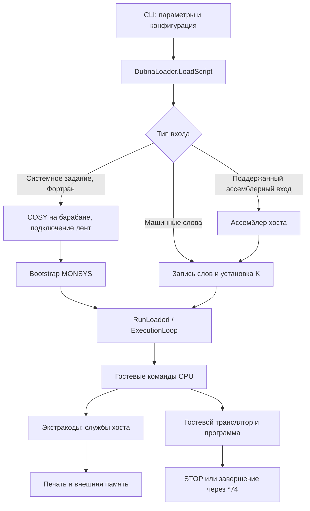
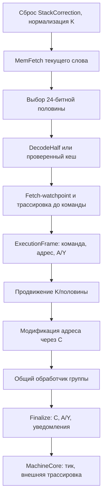

# БЭСМ-6: машина, симулятор, исполнение и скорость

Сводный документ по движку: историческое устройство и границы модели,
спецификация точности, разбор реализации на C#, жизненный цикл исполнения
и режимы скорости original/max. Разделы ниже сохранены из отдельных
документов без изменения содержания.


## Содержание

- [БЭСМ-6: устройство машины, «Дубна» и границы современной модели](#бэсм-6-устройство-машины-дубна-и-границы-современной-модели)
- [БЭСМ-6: спецификация точности и устройство быстрого симулятора](#бэсм-6-спецификация-точности-и-устройство-быстрого-симулятора)
- [Исполнение БЭСМ-6 на C#: состояние, горячий путь, точность и скорость](#исполнение-бэсм-6-на-c-состояние-горячий-путь-точность-и-скорость)
- [Первый этап: исполнение, события и жизненный цикл](#первый-этап-исполнение-события-и-жизненный-цикл)
- [Скорость исполнения БЭСМ-6](#скорость-исполнения-бэсм-6)


---

## БЭСМ-6: устройство машины, «Дубна» и границы современной модели

Дата проверки: 9 октября 2026 года. Срез реализации: `fbeb315`.

Этот разбор связывает три разных предмета: физическую БЭСМ-6, описание
программирования в учебнике 1976 года и исполняющий движок этого репозитория.
Похожее название объекта не означает одинакового устройства. Например,
аппаратный буфер команд и программный кеш декодирования ускоряют разные
операции; модельный такт и тик планировщика имеют разные единицы.

Смежные документы:

- [Спецификация точности: книга → состояние машины → быстрый симулятор](besm6-machine.md).
- [Подробный разбор реализации на C#](besm6-machine.md).
- [Замеры, профиль и принятое ускорение](../reports/processor-optimization-report.md#итоговое-ускорение-оптимизированный-jit-для-общих-обработчиков).
- [Машиночитаемые результаты итоговой контрольной серии](../reports/processor/processor-tier1-results.json).
- [Предыдущие оптимизации и отклонённые кандидаты](../reports/processor-optimization-report.md#проверка-следующих-кандидатов-после-fbeb315).
- [Переключение original/max](besm6-machine.md).
- [MemSpeed](../reports/memspeed-report.md).

### 1. Источники и способ проверки

Основной исторический учебник в репозитории — А. И. Салтыков,
Г. И. Макаренко, «Программирование на языке Фортран», под редакцией
Н. Н. Говоруна, «Наука», 1976. Особенно важны
[глава I](../book/fortran-1976/01-besm6.md),
[глава IV](../book/fortran-1976/04-optimization.md) и
[приложение с системой команд](../book/fortran-1976/05-appendices.md).
Это редакционная транскрипция предоставленного скана. Её
[описание](../book/fortran-1976/README.md) прямо предупреждает, что полной
независимой посимвольной сверки не было. Спорные OCR-символы нельзя считать
новым свойством архитектуры.

Интернет-поиск и чтение источников выполнены отдельно. Исторические сведения
сверены с [архивом БЭСМ-6](https://www.besm-6.ru/besm6.html),
его [первичными документами](https://www.besm-6.ru/documents.html),
публикациями [ОИЯИ о Н. Н. Говоруне](https://www.jinr.ru/posts/pamyati-nikolaya-govoruna/)
и [математическом обеспечении комплексов](https://lit.jinr.ru/ru/node/749).
Архив [технического описания БЭСМ-6](https://besm6.github.io/doc/)
содержит отдельные книги об УУ, АУ, МОЗУ и системе команд. Здесь подтверждено
наличие этих сканов; полного чтения всех томов электрических схем не проводилось.

Для исполнения проверен фактический C#-код. Для сопоставления происхождения
семантики прочитаны [проект Dubna](https://github.com/besm6/dubna) и его
[processor.cpp](https://github.com/besm6/dubna/blob/master/processor.cpp).
Комментарии C# использованы как навигация, но не заменяют проверку поведения.
Ни современный учебный текст, ни README эмулятора сами по себе не доказывают
временную точность модели или полноту аппаратной реализации.

Для бенчмарков проверены [материалы Dhrystone в Netlib](https://www.netlib.org/performance/html/dhrystone.intro.html),
[правила и исходник автора](https://www.netlib.org/benchmark/dhry-c),
[исходник MP MFLOPS в anybench](https://github.com/EntityFX/anybench/blob/master/src/benchmarks/generic/mpmflops/mpmflops.c)
и публикации автора семейства тестов [Roy Longbottom](https://roylongbottom.github.io/royRepository/).
Числа производительности этого репозитория получены локально; интернет-таблицы
других компьютеров не использовались как результаты физической БЭСМ-6.

### 2. Историческое место машины

БЭСМ-6 принята государственной комиссией в 1967 году. Главный конструктор —
С. А. Лебедев; среди заместителей — В. А. Мельников и Л. Н. Королёв.
Разработчиками названы ИТМ и ВТ и Московский завод САМ. Серийный выпуск
начался в 1968 году и завершился в 1987 году; архив указывает 355 машин.
Эти даты относятся к разработке и производству, а не к срокам работы каждой
конкретной установки. [Историческая справка](https://www.besm-6.ru/besm6.html).

Её интересная черта — перекрытие работы устройств. Выборка команд, подготовка
адресов, исполнение арифметики и обращения к памяти могли идти параллельно.
Лебедев называл организацию потока «водопроводом». Из этого не следует
современный синхронный конвейер с обязательными пятью стадиями и одним
результатом на каждом такте. Для БЭСМ-6 существенны асинхронность, зависимости
по операндам и промежуточные буферы.
[Описание принципов разработчиками](https://www.besm-6.ru/besm6.html).

Для ОИЯИ важным было программное окружение. Физикам требовались Фортран,
библиотеки численных методов и совместимость с научными программами ЦЕРН.
По инициативе Н. Н. Говоруна создавался транслятор Фортрана для БЭСМ-6.
Современная публикация ОИЯИ описывает эту работу в конце 1960-х годов,
а историческая статья ЛВТА сообщает о подготовке первой версии ещё до
появления БЭСМ-6 в институте в 1968 году. Формулировки «первая версия»,
«отладка», «ввод в эксплуатацию» нельзя сводить к одной дате.
[ОИЯИ](https://www.jinr.ru/posts/pamyati-nikolaya-govoruna/),
[историческая статья ЛВТА](https://lit.jinr.ru/ru/node/749).

Именно это окружение сохраняет нынешний проект: исполняются исторические
машинные программы монитора и трансляторов, а не только отдельные команды
из школьного примера. Историческая ценность здесь — воспроизводимый путь
от текста задания до машинного результата, включая ограничения старого языка,
кодировки и диагностические сообщения.

### 3. Слово, адрес и два разных способа понимать биты

Программно доступное слово содержит 48 бит. В книге биты нумеруются **1–48**
справа налево. В C# используются индексы **0–47**. Поэтому знак мантиссы,
называемый в книге разрядом 41, в C# имеет маску `1UL << 40`.

В памяти одно и то же слово может содержать данные или две команды.
Тип не записан внутри `Word48`: способ интерпретации определяется операцией.
Физическая машина имела дополнительные контрольные разряды. Учебник описывает
разный контроль команд и чисел и экстракод записи команд. В текущем `Word48`
эти контрольные разряды отсутствуют. Из допустимости самозаписи в симуляторе
не следует полная реализация аппаратного контроля памяти.
[Учебник, § 2](../book/fortran-1976/01-besm6.md#section-2).

#### 3.1. Адресация

Адрес команды/данного в пользовательском пространстве — 15 бит:
`0..32767`, или `00000..77777` в восьмеричной записи. Адрес обозначает
**слово**, а не байт. 32К слов — 196608 гостевых байтов по 6 байт на слово.
В памяти .NET одно `Word48` хранится в `ulong`, то есть занимает 8 байт;
массив 32768 слов содержит 262144 байта полезной нагрузки хоста без заголовка.
Смешивать эти объёмы в показателях памяти нельзя.

Физическая конфигурация машины могла иметь несколько сегментов по 32К слов.
Учебник описывает до четырёх сегментов и таблицу приписки страниц. Это
позволяет различать адреса задачи и физическое размещение. Нынешний CPU
маскирует исполнительные адреса до 15 бит и не реализует такое преобразование.
Увеличение `CoreMemory.Size` само по себе не создаёт историческую MMU.
[Учебник, § 3](../book/fortran-1976/01-besm6.md#section-3).

#### 3.2. Командное слово

Левая команда занимает биты C# 47–24, правая — 23–0. Обе имеют длину 24 бита.
Переход на адрес слова начинает исполнение с левой команды. Продвижение
после левой команды выбирает правую, после правой — следующее слово.

| Поле полуслова | Короткая команда: индексы C# | Длинная команда: индексы C# |
|---|---|---|
| Номер модификатора | 23–20 | 23–20 |
| Признак длинного формата | 19 = 0 | 19 = 1, часть старшего кода |
| Расширение короткого адреса | 18 | — |
| Код операции | 17–12 | 19–15 |
| Адрес | 11–0 + расширение | 14–0 |

Короткая команда представляет два диапазона адресов: `0x0000..0x0FFF`
и `0x7000..0x7FFF`. При установленном бите 18 декодер добавляет `0x7000`.
Это эквивалентно знаковому расширению короткого адреса до 15 бит.
Промежуточные адреса требуют базирования или модификации. Для длинных
команд декодер сохраняет код в форме `0x80, 0x88, ... 0xF8`; это объясняет
почему программный enum содержит значения, отличающиеся от компактной
таблицы длинных команд `22, 23, ... 37` в книге.
[InstructionCodec](../src/Besm6.Architecture/Isa/InstructionCodec.cs).

#### 3.3. Число с плавающей запятой

| Поле | Нумерация учебника | Индексы C# | Смысл |
|---|---|---|---|
| Порядок вместе с признаком знака порядка | 48–42 | 47–41 | 7 бит, смещение 64 |
| Знак мантиссы | 41 | 40 | Старший бит знакового 41-битного кода |
| Дробная часть мантиссы | 40–1 | 39–0 | Все 40 бит используются |

Пусть `E = (word >> 41) & 127`, а `m` — младшие 41 бит после знакового
расширения. Тогда значение:

```text
value = (m / 2^40) × 2^(E − 64)
```

Это не IEEE 754. Нет отдельного знака всего числа в старшем бите слова,
скрытой единицы мантиссы, специальных IEEE NaN и бесконечностей.
Положительная нормализованная мантисса лежит в `[0.5, 1)`; для отрицательных
чисел граница отличается из-за дополнительного кода. Биты знака мантиссы
и её следующего разряда должны различаться у нормализованного числа.
Например, `+1` имеет `E=65, m=2^39`, а нормализованное `−1` — `E=64, m=−2^40`.
[Учебник, § 2](../book/fortran-1976/01-besm6.md#section-2),
[проверочные битовые примеры архива](https://besm6.github.io/wiki/Numbers),
[MantissaExponent](../src/Besm6.Architecture/Numerics/MantissaExponent.cs).

Диапазон нормализованных значений по учебнику: от `2^-65` до
`2^63 × (1 − 2^-40)` по модулю; это приблизительно `10^-19..10^19`.
Мантисса даёт примерно 12 десятичных знаков. Ненормализованные числа имеют
другую нижнюю границу. Целые значения Фортрана могут храниться с порядком 40
и ненормализованной мантиссой. Поэтому «целочисленный Dhrystone» может
использовать арифметические команды этой машины: классификация исходного
языка не равна классификации машинных команд.
[Учебник, § 2](../book/fortran-1976/01-besm6.md#section-2).

### 4. Регистры и адресная арифметика

| Объект | Размер | Назначение | Представление C# |
|---|---:|---|---|
| A | 48 | Сумматор, основной операнд и результат | `Word48` в `ProcessorState` |
| Y | 48 | Продолжение результата, сдвиги и дополнительные данные | `Word48` |
| M1–M15 | 15 каждый | Базирование, индексы, счётчики, возвраты | `uint[16]`, адресная маска |
| M0 | Логический нуль | Отсутствие индексирования | Элемент массива, обнуляемый соответствующими командами |
| C | 15 | Модификация адреса следующей команды | `uint C` и `bool ApplyC` |
| R | 6 значимых | Режим арифметики и признаки группы | `uint R`, маски `RFlags` |
| K | 15 | Адрес командного слова | `uint K` |
| Половина команды | 1 | Левая/правая команда текущего слова | Отдельный `bool IsRightHalf` |

`K` в этой реализации не содержит флаг половины в младшем бите. Это
существенно для отладчика: две разные команды могут иметь один и тот же K.
Полный адрес точки исполнения — пара `(K, IsRightHalf)`.
[ProcessorState](../src/Besm6.Processor/Cpu/ProcessorState.cs).

Для обычной адресуемой команды исполнительный адрес получается по схеме:

```text
address = (decodedAddress + (ApplyC ? C : 0)) & 0x7FFF
effectiveAddress = (address + M[register]) & 0x7FFF
```

У конкретных команд есть исключения: VTM устанавливает регистр по адресу,
VZM/V1M проверяют регистр, но не прибавляют его к адресу перехода; VJM
использует модификатор для адреса возврата. Нельзя заменить все обработчики
одной универсальной формулой.

UTC устанавливает C из адреса, WTC — из младших разрядов прочитанного слова.
Модификация применяется к следующей команде; затем признак обычно снимается.
Код хранит значение C отдельно от признака: когда `ApplyC=false`, численно
ненулевой C ещё может оставаться в состоянии и не использоваться. Нулевая
новая модификация сбрасывает признак. STOP сохраняет прежнее состояние
модификации по специальному флагу кадра.
[ControlInstructionExecutor](../src/Besm6.Processor/Execution/ControlInstructionExecutor.cs),
[InstructionExecutor](../src/Besm6.Processor/Execution/InstructionExecutor.cs).

M15 используется для магазинной адресации. При адресе 0 и регистре 15
некоторые чтения предварительно уменьшают указатель, а записи увеличивают
его после сохранения. STX и XTS совмещают операции со стеком. Временная
`StackCorrection` позволяет внешнему обработчику исправить указатель при
исключении. Именно порядок «изменить M15 → обратиться к памяти → закончить
команду» нужно сохранять при оптимизации, включая ошибочные обращения.

### 5. Группы инструкций и особенности управления

| Группа | Примеры | Что принципиально проверять |
|---|---|---|
| Пересылки | XTA, ATX, XTS, STX | A/Y, нулевой адрес, стек, порядок чтений и записей |
| Арифметика | A+X, A-X, X-A, AMX, A*X, A/X | Мантисса/порядок, Y, нормализация, округление, переполнение |
| Логика | AAX, AEX, AOX, ARX | Все 48 бит, циклический перенос, правила Y |
| Побитовые | APX, AUX, ACX, ANX, ASN, ASX | Нумерация битов, нуль, диапазон и знак сдвига |
| Режим | NTR, XTR, RTE, YTA | Состояние R и зависимость YTA от группы |
| Индексы | ATI, ITA, MTJ, J+M, VTM, UTM | 15-битное замыкание, M0, стековые варианты |
| Переходы | UJ, UZA, U1A, VJM, VZM, V1M, VLM | Левая половина цели, группа R, адрес возврата |
| Системные вызовы | *50, *64, *70, *74 и другие | Контекст вызова, побочные эффекты, остановка и перехваты |

Регистр R: бит 0 блокирует нормализацию, 1 — округление, 2 — логическая
группа, 3 — группа умножения, 4 — группа сложения, 5 — прерывание по
переполнению. В учебной нумерации это разряды 1–6. Обычные команды группы
устанавливают один групповой признак и снимают два других; NTR/XTR могут
задавать комбинацию напрямую.
[Учебник, § 4](../book/fortran-1976/01-besm6.md#section-4),
[RFlags](../src/Besm6.Architecture/State/RFlags.cs).

UZA/U1A не являются универсальным сравнением A с числовым нулём.
В логической группе проверяется весь код A, в группе сложения — знак
мантиссы, в группе умножения — признак порядка. Поэтому перестановка
команды, изменяющей группу, может изменить последующий переход при
неизменном A. Текущие обработчики также записывают A в Y перед проверкой:
принимая оптимизацию, нужно сравнивать Y, а не только выбранную ветвь.
[ControlInstructionExecutor](../src/Besm6.Processor/Execution/ControlInstructionExecutor.cs).

VLM используется со счётчиком в 15-битном пространстве. Ненулевой
модификатор увеличивается на 1 и выполняется переход. Обычно начальное
значение отрицательно в адресной арифметике и постепенно подходит к нулю.
Считать это обычным `for (int i=0; i<n; i++)` внутри эмулятора нельзя: команды
цикла и модификация регистров должны реально исполняться.

### 6. АЛУ, младшие разряды и округление

Операции сложения и умножения могут оставлять расширенную мантиссу: старшая
часть идёт в A, младшие 40 разрядов — в Y. YTA позволяет использовать эту
часть; сдвиги также связывают A/Y. Не всякая команда сохраняет Y.
Сравнение только печатаемого десятичного результата способно пропустить
ошибку на младших разрядах.
[Учебник, § 5](../book/fortran-1976/01-besm6.md#section-5).

Текущий АЛУ использует целочисленные представления мантисс. Сложение
выравнивает порядки, учитывает вытесненные разряды, знак и расширенный
результат. Умножение собирает точное произведение частями и распределяет
старшие/младшие разряды. Деление использует собственный алгоритм с проверкой
делителя; оно не заменено делением `double` хоста.
[AdditiveOperations](../src/Besm6.Processor/Arithmetic/AdditiveOperations.cs),
[MultiplicativeOperations](../src/Besm6.Processor/Arithmetic/MultiplicativeOperations.cs),
[MantissaExponent.Multiply](../src/Besm6.Architecture/Numerics/MantissaExponent.cs).

Нормализация предшествует округлению. В C# округляющая ветвь устанавливает
младший бит мантиссы (`Mantissa |= 1`) при соответствующем признаке. Это
не IEEE «к ближайшему с чётной последней цифрой». Переполнение проверяется
после формирования A/Y, поэтому исключение может видеть уже изменённые
регистры. Ветвь машинного нуля имеет своё правило Y. Такое поведение нельзя
воспроизвести одной общей конверсией из `double`.
[NormalizationAndRounding](../src/Besm6.Processor/Arithmetic/NormalizationAndRounding.cs).

У деления в учебнике отдельное правило: дополнительного округления после
операции нет; точные представимые отношения должны получаться точными.
Деление на нуль и ненормализованный делитель вызывают прерывание.
Блокировки режима и механизм перехвата в Runtime — часть наблюдаемого
результата, а не необязательная диагностика.
[Учебник, § 5](../book/fortran-1976/01-besm6.md#section-5).

### 7. Память физической машины

По учебнику память состоит из сегментов по 32К слов, страниц по 1024 слова,
с аппаратной припиской страниц к задачам. Цикл МОЗУ — 2 мкс.
Пропускная способность не равна просто обратной величине этого цикла:
считывание разных блоков перекрывается и помогает скрывать ожидание.
[Учебник, § 3](../book/fortran-1976/01-besm6.md#section-3).

Книга описывает стек команд на **4 слова / 8 команд** и **8 буферных
регистров записи**. Повторная команда может браться из стека без нового
обращения к МОЗУ; недавняя запись может удовлетворять чтение из буфера.
Это конкретные аппаратные структуры. Называть их без уточнения современным
«L1-кешем на 16 слов» нельзя. Поведение короткого цикла зависит от того,
успела ли первая команда покинуть стек и какие ещё обращения выполнялись.
[Учебник, § 3](../book/fortran-1976/01-besm6.md#section-3).

В симуляторе CoreMemory — обычный массив, который хранит окончательное
значение слова немедленно. Есть нумерация восьми банков в ошибках, но нет
очередей банков, вытеснения аппаратных буферов, ожидания 2 мкс и модели
конфликтов чтения. `GetAccessTimeNs` возвращает константу 900 и не задерживает
каждое обращение процессора.
[CoreMemory](../src/Besm6.Processor/Memory/CoreMemory.cs).

### 8. «Дубна», трансляторы и внешние устройства

Учебник описывает мониторную систему как связанное программное окружение:
трансляторы, загрузчик, библиотеки, пакет задания и службы. В описанном
варианте трансляция Фортрана проходит через автокод, затем стандартный
массив и загрузку. Глава IV объясняет, как адресация формальных параметров,
COMMON и индексных выражений увеличивает число машинных команд.
Это полезно для понимания профиля: арифметическое выражение на одну строку
может требовать много команд базирования, обращения к параметрам и переходов.
[Учебник, § 7](../book/fortran-1976/01-besm6.md#section-7),
[глава IV](../book/fortran-1976/04-optimization.md).

Исторические показатели скорости трансляции относятся к конкретному варианту
системы в книге. Их нельзя переносить на любой образ MONSYS или современный
хост. Так же нельзя предполагать полную поддержку каждого расширения
Фортрана только потому, что название языка совпадает.

Нынешний DubnaLoader различает непосредственную загрузку машинных слов,
host-ассемблирование поддерживаемого входа и путь системного задания.
Для фортранных бенчмарков текст помещается на модельный барабан в COSY,
подключаются ленты, исполняется загрузочный код MONSYS, затем гостевой
транслятор и программа. Поэтому замер RunLoaded содержит и компиляцию.
Использование SDK .NET для сборки симулятора не означает компиляцию
исторического Фортрана современным компилятором хоста.
[DubnaLoader](../src/Besm6.Runtime/Loading/DubnaLoader.cs),
[JobProgramLoader](../src/Besm6.Runtime/Loading/JobProgramLoader.cs),
[MonsysBootstrapper](../src/Besm6.Runtime/Loading/MonsysBootstrapper.cs).

Экстракод — переход к системной услуге. В этой модели часть услуг реализована
на C#: печать, преобразование представлений, работа с лентами/барабанами,
терминалом, элементарные функции. Это существующая граница эмуляции.
Оптимизация CPU не добавляла распознавание бенчмарков или замену их циклов
готовыми вычислениями хоста. При этом утверждение «любая математика всегда
исполняется только гостевыми командами» тоже неверно: математические
экстракоды уже используют host-реализации услуг.
[ExtracodeHandler](../src/Besm6.Runtime/Extracodes/ExtracodeHandler.cs),
[математические услуги](../src/Besm6.Runtime/Extracodes/ExtracodeHandler.Math.cs).

Есть конкретное различие с описанием § 6: книга говорит о сохранении R
после экстракода, а текущий ExtracodeInstructionExecutor после успешного
host-dispatch вызывает SetLogical, заменяя групповые признаки R.
Прочие блокировки этой операцией сохраняются. Вход в экстракод также
записывает исполнительный адрес в M14 и выравнивает возврат на левую
команду следующего слова. Различие R требует отдельной сверки версии
монитора и эталонного поведения; в оптимизации оно не изменялось.
[Фактический обработчик](../src/Besm6.Processor/Execution/ExtracodeInstructionExecutor.cs),
[учебник, § 6](../book/fortran-1976/01-besm6.md#section-6).

Обмен внешней памяти в книге организован страницами по 1024 слова;
для барабана возможны сектора по 256 слов. Слова на внешних носителях
сопровождаются служебной информацией и контролем, зависящими от устройства.
Текущий TapeImage содержит плотные 6-байтовые слова; нельзя автоматически
подавать ему иной формат образа с восемью служебными словами на зону.
Например, [описание некоторых архивных образов](https://besm6.github.io/download/)
указывает другой контейнер с заголовком зоны. Совместимость формата нужно
проверять отдельно от совместимости команд.
[TapeImage](../src/Besm6.Runtime/Storage/TapeImage.cs).

Печать требует кодировок ГОСТ 10859, КОИ-7, COSY и внутренних форматов
монитора. Ошибка декодирования вывода не обязательно означает ошибку АЛУ;
ошибка адреса печатного массива способна выглядеть как испорченный текст.
Поэтому бенчмарки проверяют финальный сегмент вывода, исключая листинг,
а точность CPU дополнительно проверяется по состоянию памяти и регистров.
[Encoding](../src/Besm6.Runtime/Encoding/TextCodec.cs).

### 9. Время: почему «оригинальный темп» требует уточнения

В проекте одновременно существуют три разных отсчёта.

| Отсчёт | Единица | Что измеряет | Что не моделирует |
|---|---|---|---|
| `SimulationClock.Tick` | 1 успешный MachineCore.Step | Дискретный порядок шагов | Табличные такты АЛУ, наносекунды |
| `Besm6Timing` | Фиксированная стоимость opcode × 100 нс | Детерминированное модельное время | Перекрытие устройств, операндозависимые задержки |
| `Stopwatch` | Секунды хоста | Реальное время выполнения/ожидания | Историческую частоту машины само по себе |

DATE* и выбор wall-clock-источника системных услуг — ещё один независимый
аспект воспроизводимости. Изменение скорости не должно менять дату,
численный результат или количество исполненных гостевых команд.

#### 9.1. Обнаруженное расхождение таблиц

Учебник в § 4 указывает такт **0,11 мкс**. Его приложение разделяет УУ и АУ,
дает минимум/среднее/максимум. Среднее сложение — 11 тактов АУ, умножение —
18, деление — 50; § 1 приводит приблизительно 1,2 / 2,0 / 5,5 мкс.
Нынешний `Besm6Timing` использует **100 нс**, A+X=2, A*X=7, A/X=12.
Эти таблицы описывают разные модели и количественно не совпадают.
[Учебник, приложение 1](../book/fortran-1976/05-appendices.md),
[Besm6Timing](../src/Besm6.Runtime/Profiling/Besm6Timing.cs).

| Операция | Учебник: среднее АУ × 0,11 мкс | Текущая таблица × 0,10 мкс |
|---|---:|---:|
| A+X | 1,21 мкс | 0,20 мкс |
| A*X | 1,98 мкс | 0,70 мкс |
| A/X | 5,50 мкс | 1,20 мкс |

Это иллюстрация расхождения, **не формула исправления всей программы**.
Нельзя сложить средние длительности АУ и УУ и получить точный темп
асинхронной машины: есть перекрытие, память, зависимость от данных и пути
ветвления. Нельзя также исправить всё одним коэффициентом 1,1.

В рамках согласованного требования таблица сохранена. `--speed original`
означает «темп существующей табличной модели». Подтверждена точность ожидания
относительно этой таблицы; аппаратная временная точность этим не доказана.
Модельные DMIPS/MFLOPS следует подписывать именно так.

#### 9.2. Как работает ограничение скорости

Суммарные такты задают абсолютный срок от начала исполнительного цикла.
Проверка происходит через 100000 тактов и при успешном завершении. Если
хост впереди, применяется Sleep для крупной части интервала и короткая
проверка времени в конце. Если хост отстал, команды продолжаются без
дополнительного ожидания: начальный срок не переносится, команды не
пропускаются. Так ошибка отдельного Sleep не накапливается как постоянный
сдвиг темпа.
[ExecutionPacer](../src/Besm6.Runtime/Loading/ExecutionPacer.cs).

В проверенной серии original, один прогрев и пять замеров DH10000/MP3,
максимальное абсолютное отклонение исполнительного времени от модельного
в свежей серии `092634f` было 8,388 мс. Это результат конкретного свободного хоста; на перегруженном
или медленном хосте ожидание не способно ускорить вычисления.
[Подтверждение](../reports/processor/processor-tier1-results.json).

### 10. Исправления к современному тексту в репозитории

Исторический учебник 1976 года и современный `book/03-instruction-set.md`
нельзя рассматривать как один источник. В современном тексте найдены
следующие расхождения. Исходные главы книги здесь не переписывались.

| Утверждение современного текста | Подтверждённое описание | Где проверить |
|---|---|---|
| Знак числа в старшем бите 47 | Знак мантиссы — индекс 40; старшие 7 бит — порядок | Учебник § 2; MantissaExponent |
| Порядок 6 бит со смещением 32 | Порядок 7 бит со смещением 64 | Учебник § 2; декодирование `>>41 & 0x7F` |
| Младший бит числа не используется | Мантисса использует индекс 0; округление может устанавливать его | NormalizeAndRound |
| Флаг половины встроен в младший бит K | В текущем CPU K и IsRightHalf раздельны | ProcessorState |
| R имеет 12 разрядов | В описанной пользовательской модели R имеет 6 значимых разрядов | Учебник § 4; RFlags |
| C — база/защита памяти | C модифицирует адрес следующей команды | Учебник § 4; UTC/WTC |
| Достаточно одной фиксированной таблицы для точного исторического времени | Учебник разделяет УУ/АУ и min/avg/max | Приложение 1 |

Количественные сравнения с IBM/CDC, время FFT и решение СЛАУ из современного
исторического текста не использованы как доказанные бенчмарки: в проверенных
фрагментах нет воспроизводимой программы, комплектации и первичного протокола.
Такие числа требуют отдельного поиска первичных материалов.

### 11. Что можно исторически заключить из нынешних бенчмарков

Dhrystone создан в 1984 году. Прогон сегодняшнего фортранного порта в
историческом мониторе — полезный контролируемый эксперимент, но не
архивный результат БЭСМ-6 1967 года. DMIPS — нормализация числа итераций
к 1757 Dhrystones/s VAX-11/780; это не непосредственно число машинных
инструкций в миллионах за секунду. Netlib также отмечает зависимость
результата от компилятора и ограниченность маленькой синтетической программы.
[Netlib](https://www.netlib.org/performance/html/dhrystone.intro.html).

MP MFLOPS содержит ядра с 2, 8 и 32 арифметическими операциями на элемент.
Современный исходник anybench работает с `float`, потоками и значительно
большими массивами. Локальный порт использует 9000 элементов, 30 проходов,
одно гостевое исполнение и формат БЭСМ-6. Одинаковая формула полезна для
характеристики нагрузки, но не делает результаты эквивалентными штатному
многопоточному тесту ПК.
[Исходник anybench](https://github.com/EntityFX/anybench/blob/master/src/benchmarks/generic/mpmflops/mpmflops.c),
[описание автора семейства](https://www.researchgate.net/publication/320716999_MultiThreading_Benchmarks),
[локальный порт](../examples/mpmflops.dub).

MemSpeed здесь — самостоятельный порт трёх форм операций на гостевых
48-битных словах: копирование, сложение, умножение со сложением. Он
характеризует весь путь «гостевые команды → адресация → АЛУ → память
симулятора». Это не измерение пропускной способности физической RAM хоста
и не официальный результат MemSpeed для IEEE float/double/int32.
[Описание семейства](https://roylongbottom.github.io/royRepository/),
[локальный метод и результаты](../reports/memspeed-report.md).

Для честной исторической оценки нужны хотя бы исходная программа, версия
транслятора, режим округления, конфигурация памяти, правила отсчёта времени
и сравнение с протоколом реального запуска. Существующие замеры дают более
узкий, но надёжный вывод: насколько ускорилась конкретная C#-реализация
при неизменных результатах гостевого вычисления.

---

## БЭСМ-6: спецификация точности и устройство быстрого симулятора

Дата: 9 октября 2026 года. Проверенный срез кода: `2bab373`; процессорные
оптимизации: `092634f`. Этот документ — архитектурный анализ и предложение
дальнейшей работы. Описанные ниже новые профили точности, MMU, контрольные
разряды и аппаратная модель времени **ещё не реализованы**.

Актуализация: начата [первая часть этапа 3](besm6-memory.md): отдельные
50-разрядные ячейки, физическая память 32K, приписка и защита по ТО-8 1967 года.
Физическая память и БРЗ/БРС теперь доступны CPU через
[выбираемую модель памяти](besm6-memory.md). Приписка/защита,
аппаратный профиль и модель времени остаются незавершёнными.
Ниже сохранён анализ исходного среза.

После этого среза выполнен [первый инфраструктурный этап](besm6-machine.md):
доставка событий, явный старт и сброс CPU. Ограничения раздела 9 ниже
описывают исходное состояние; актуальные контракты приведены по ссылке.

Текущий движок убедительно воспроизводит большой корпус программ системы
«Дубна» и уже ускорен относительно исходной реализации. Для утверждения
«поведение реальной машины» этого недостаточно: надо определить конфигурацию
БЭСМ-6, версию диспетчера, наблюдаемое состояние и правила времени. Особенно
важны различия между данными и командами в памяти, арифметические авосты,
самомодификация, буферы и завершение обмена с устройствами.

Быстрое и точное исполнение совместимы. Скорость хоста может меняться без
изменения гостевых результатов и порядка событий. Но исключать аппаратные
механизмы, которые программа способна наблюдать, можно лишь в отдельном,
явно ограниченном профиле совместимости.

### 1. Источники и границы доказательств

Основной источник — А. И. Салтыков, Г. И. Макаренко,
«Программирование на языке Фортран», под редакцией Н. Н. Говоруна,
«Наука», 1976, 256 с. Использована [книга в составе репозитория](../book/fortran-1976/README.md):

| Материал | Для чего использован |
|---|---|
| [Глава I, §§ 1–6](../book/fortran-1976/01-besm6.md) | Слово, регистры, адресация, память, арифметика, экстракоды |
| Глава I, §§ 7–8 | Граница машины, диспетчера и мониторной системы |
| [Глава II, §§ 11, 14–15, 28–32](../book/fortran-1976/02-fortran-dubna.md) | Представления Фортрана, функции, ввод-вывод, диагностика |
| [Глава III, §§ 36, 47, 52](../book/fortran-1976/03-madlen.md) | Команды MADLEN, базирование, библиотечная печать |
| [Глава IV, §§ 54–58](../book/fortran-1976/04-optimization.md) | Причины различия времени гостевых программ |
| [Приложение 1](../book/fortran-1976/05-appendices.md) | Изменения A/Y/R и отдельные времена УУ/АУ |
| [Скан страницы 247](../book/fortran-1976/original/page-247.png) | Независимая визуальная сверка таблицы арифметики |

В Markdown-конверсии прямо указано, что полная независимая посимвольная
сверка не проводилась. Таблицу страницы 247 проверил по изображению:
сложение 5/11/280, умножение 15/18/162, деление 47/50/174 такта в АУ
соответствуют текстовой версии. Остальные положения проверены по тексту;
это не поскановая экспертиза всей книги.

Современные [раздел II](../book/02-architecture.md) и
[раздел III](../book/03-instruction-set.md) полезны для навигации, но содержат
ошибки и неподтверждённые упрощения. Например, разряд знака мантиссы,
размер порядка и смещение в § 3.1.2 противоречат изданию 1976 года;
пятиступенчатая схема сама по себе не доказывает устройство физической БЭСМ-6.
Использовать такие схемы как спецификацию процессора нельзя.
Подробный перечень уже приведён в [историческом анализе](besm6-machine.md).

Книга описывает прежде всего математический режим и программирование.
Она отсылает к «Инструкции по программированию на БЭСМ-6» 1967 года
и книге Л. Н. Королева «Структуры ЭВМ и их математическое обеспечение»
1974 года: позиции 22 и 24 [библиографии](../book/fortran-1976/06-bibliography.md).
Наличие названия в библиографии не означает, что содержимое этой работы
здесь проверено. Точные схемы приоритетов прерываний, образования контрольных
разрядов, вытеснения буферов и привилегированных регистров требуют отдельного
источника. Ниже эти места обозначены как незакрытые вопросы.

### 2. Что означает «повторить поведение»

Следует разделить четыре уровня доказательства:

| Уровень | Что должно совпадать | Чего уровень ещё не доказывает |
|---|---|---|
| Результат задания | Вывод, файлы, STOP, код завершения | Все промежуточные регистры и исключения |
| Архитектура команд | A/Y/M/R/C/K, половина слова, изменения памяти, авосты после каждого шага | Аппаратные задержки и внешние события |
| Система | Приписка, защита, контроль памяти, диспетчер, обмен, прерывания | Исторический темп на конкретной конфигурации |
| Время машины | Моменты доступности результатов, конфликтов и событий | Электрические процессы и надёжность элементов |

Текущий корпус тестов даёт серьёзное подтверждение первых двух уровней
для покрытых программ и случаев. Он не превращает плоскую память
в физическую МОЗУ и не доказывает аппаратное время. Совпадение с C++ Dubna
показывает совместимость с выбранной реализацией; если обе версии наследуют
одну ошибку или упрощение, дифференциальный тест этого не обнаружит.

Для воспроизводимости нужна запись конфигурации: размер физической памяти,
режим адресации, версия ОС и библиотек, образы носителей, модель устройств,
правила арифметики и времени. Историческая машина с другим диспетчером
может иначе обработать тот же авост, даже при одинаковом АУ.

### 3. Слово и числовая модель

#### 3.1. Биты и команды

В книге биты нумеруются справа налево 1–48; в C# — 0–47.
Программное слово имеет 48 бит. В МОЗУ существуют ещё два контрольных
разряда, недоступных обычной программе (§ 2). Поэтому `Word48` подходит
для программного значения, но не описывает всю физическую ячейку.

Левая команда — старшие 24 бита, правая — младшие 24.
Адрес перехода указывает слово, переход начинается с его левой команды.
Половину слова следует учитывать отдельно от 15-разрядного адреса K.
В существующем коде это `ProcessorState.IsRightHalf`.

[InstructionCodec](../src/Besm6.Architecture/Isa/InstructionCodec.cs) выделяет
4-битный индекс, короткую либо длинную операцию и адрес. Короткий адрес
не является обычным знаковым 12-битным числом: дополнительный признак
выбирает диапазон `00000–07777` либо `70000–77777` (восьмерично).
Изменение декодера проверяется на всех 24-битных кодах или на полном
покрытии полей с независимыми контрольными векторами.

#### 3.2. Число БЭСМ-6 не равно double

Пусть `e` — семь старших битов слова, `m` — знаковое 41-битное целое
из младших битов с дополнительным кодом. Тогда значение:

`x = m × 2^(e − 64 − 40)`.

Знак мантиссы — бит 41 книги, то есть бит 40 C#. Порядок имеет смещение 64.
Положительная нормализованная мантисса находится в `[1/2, 1)`,
отрицательная — в `[-1, -1/2)`. Минимальный ненулевой модуль нормализованного
числа — `2^-65`, максимальный — `2^63 × (1 − 2^-40)`; ненормализованные
значения позволяют дойти до `2^-104` (§ 2).

Фортранное INTEGER — соглашение компилятора о представлении ненормализованного
числа с порядком 40, а не отдельный универсальный тип АУ. Нельзя подменять
все гостевые операции обычной арифметикой C# `long` по типу исходной переменной:
машина выполняет коды команд, а COMMON/EQUIVALENCE позволяют менять трактовку
тех же битов.

`double` может быть удобен для отображения и приближённых библиотечных
функций. Для точных команд АУ нужны целочисленные мантиссы, расширенные
промежуточные результаты и явные правила округления. Иначе исчезнут
ненормализованные значения, низшие разряды Y и особенности авостов.

### 4. Архитектурное состояние и переход одной команды

Минимальное состояние математического режима:

`S = (A, Y, M[0..15], R, C, ApplyC, K, Half, Memory, Stop/Fault)`.

Дополнительно для точной системы нужны состояние приписки и защиты,
контрольные разряды, аппаратные буферы, запросы прерываний, состояния
обмена и модельное время. Диагностические подписчики и кеш декодирования
не являются гостевыми регистрами, но могут влиять на границы исполнения.

| Регистр | Существенное правило |
|---|---|
| A | 48 бит; число или логический код определяется командой |
| Y | 48 бит; многие команды меняют или гасят его независимо от A |
| M1–M15 | Модификаторы по модулю `2^15`; M15 участвует в магазине |
| M0 | В текущей программной модели нулевой модификатор |
| R | Шесть признаков; групповые признаки не являются обычными NZCV |
| C + ApplyC | Однократная модификация следующей команды |
| K + Half | Адрес слова и положение в нём; необходимы для возврата/перехвата |

R содержит блокировку нормализации, блокировку округления, логическую
группу, группу умножения, группу сложения и блокировку авоста по переполнению
(§ 4). UZA/U1A смотрят на разные свойства A в зависимости от группы:
логический код, знак порядка либо знак мантиссы. Заменять эту логику
проверкой `A == 0` нельзя.

#### 4.1. Фактический порядок в текущем исполнителе

В [InstructionExecutor](../src/Besm6.Processor/Execution/InstructionExecutor.cs):

1. Сбрасывается `StackCorrection`, нормализуется K, выбирается слово.
2. Выделяется полуслово, проверяется либо обновляется кеш декодирования.
3. Выполняются fetch-watchpoint и наблюдение перед командой.
4. Создаётся структурный `ExecutionFrame` с исходными A/Y и адресом.
5. Продвигаются K/Half; затем применяется C к адресной части.
6. Общий обработчик выполняет команду и обращения к памяти.
7. Обновляются модификация C и A/Y, если результат ещё не находится в state.
8. Вызывается наблюдение после команды. Runtime отдельно учитывает шаг.

Такой порядок уже является наблюдаемым контрактом реализации. Например,
исключение в обработчике может увидеть продвинутый K и частично изменённые
регистры. Нельзя объявить команду транзакцией с полным откатом без проверки
авостов и совместимости. `NormalizeAndRound` записывает A/Y перед проверкой
неблокированного переполнения; это важно для состояния после исключения.

Нужна таблица для каждой операции: чтения, записи, изменения M15, A/Y/R/C,
положение K при успехе и каждой ошибке. Значения «не определено» из книги
нельзя превращать в произвольное требование к аппаратуре. Например, Y после
деления в приложении не определён: для совместимости с Dubna можно закрепить
его конкретное значение, но аппаратный тест должен отличать обязательные
поля от дополнительных наблюдений выбранного эталона.

#### 4.2. Адресация и магазин

Исполнительный адрес обычно получается как `(address + C + M[index]) & 077777`,
но участие модификатора зависит от команды. VZM/V1M проверяют сам модификатор,
а не используют его как обычное смещение перехода. UTC/WTC формируют C
для следующей команды; это не постоянный базовый регистр.

Магазинный случай определяется индексом 15 и нулевым адресом до добавления
M15. Порядок изменения M15 и чтения/записи особенно важен при ошибке памяти.
Отдельно проверяются XTS/STX/ITS/STI, переполнение 15-битного адреса и WTC.
Оптимизация вычисления адреса должна сохранять эти различия, а не вводить
одну универсальную формулу для всех операций.

В [ProcessorMemoryAccess](../src/Besm6.Processor/Memory/ProcessorMemoryAccess.cs)
чтение данных по адресу 0 возвращает 0, запись игнорируется, fetch по адресу
0 вызывает `Jump to zero`. Это контракт текущего профиля; перенос его
на физические адреса диспетчерского режима без отдельного источника неверен.

### 5. АУ: где точность наиболее уязвима

#### 5.1. Нормализация и округление

По § 5 сначала нормализуется результат, затем выполняется округление.
Округление БЭСМ-6 состоит в установке младшего бита A при определённых
условиях наличия младших разрядов. Это не IEEE round-to-nearest-even
и не арифметическое прибавление единицы ко всей мантиссе.
Если при нормализации единицы перешли из младших разрядов в старшие,
решение об округлении меняется.

После сложения, вычитаний и умножения результат использует 80 разрядов
мантиссы: младшие 40 доступны через Y. Проверять лишь преобразованный
в `double` результат недостаточно. Ошибка младшего бита может проявиться
только после YTA или последующего вычисления.

У [NormalizationAndRounding](../src/Besm6.Processor/Arithmetic/NormalizationAndRounding.cs)
есть разные пути для положительных и отрицательных мантисс, переноса из Y,
машинного нуля и блокировки нормализации. На нулевых/underflow-путях
сохраняются старшие биты старого Y при гашении младших 40, тогда как
обычный результат записывает `y & BITS40`. Поэтому обобщение «Y всегда
обнуляется при нуле» уже не соответствует фактическому коду.

#### 5.2. Деление

Книга требует нормализованный делитель; нулевой или ненормализованный
делитель вызывает авост. После деления отдельное округление не выполняется.
Точно представимый результат должен быть точным, например 9/6 = 1,5.

[MultiplicativeOperations](../src/Besm6.Processor/Arithmetic/MultiplicativeOperations.cs)
проверяет нормализованность по двум битам, использует невосстанавливающее
деление и вызывает нормализатор без roundFlag. Сообщение `Division by zero`
покрывает и ненормализованный делитель; текст диагностики и архитектурную
причину полезно различать в будущей спецификации.

Нельзя заменить цикл деления обычным целочисленным `/` только на основании
совпадения нескольких десятичных ответов. Надо доказать совпадение знаков,
последнего бита, остановки при нулевом остатке, точных частных, переполнения
и ненормализованного делимого. Существование другого алгоритма у независимого
эмулятора — повод сравнить контрольные векторы, а не автоматически считать
его новым безусловным эталоном.

#### 5.3. Математические экстракоды

По § 6 библиотечные функции принимают и ненормализованный аргумент,
возвращают нормализованное значение, имеют собственные области определения
и диагностику. Указана точность не менее 11 десятичных знаков для подходящих
аргументов и времена 55–90 мкс, для целой части — 25 мкс.

Пути host-математики в [Runtime](../src/Besm6.Runtime/Extracodes/ExtracodeHandler.Math.cs)
не доказывают побитовое совпадение с исторической библиотекой.
Для строгого профиля предпочтительно исполнять закреплённые гостевые
подпрограммы либо доказать совпадение портированного алгоритма.
Выбор `Math.Sin` вместо исторического алгоритма — решение о совместимости,
а не бесплатная точная оптимизация режима max.

### 6. Память: три разных механизма

#### 6.1. Программное хранилище

[CoreMemory](../src/Besm6.Processor/Memory/CoreMemory.cs) хранит слова непрерывным
`Word48[]`. Это разумно для скорости хоста: физическая раздельность банков
не требует восьми объектов массива. Прежняя нумерация банков в диагностике
сохраняется, но занятость банка и задержки в активном пути не моделируются.
Метод `GetAccessTimeNs` возвращает 900; сам по себе он не создаёт ожидания
и не является моделью полного цикла МОЗУ.

#### 6.2. Физическая память и приписка

§ 3 описывает от одного до четырёх сегментов по 32К слов; распространённую
конфигурацию с двумя сегментами; страницы по 1024 слова; до 32 страниц
математического адресного пространства задачи. Таблица приписки связывает
математический номер страницы с физическим.

Увеличение массива CoreMemory до 64К не реализует MMU: CPU всё ещё
маскирует обычные адреса 15 битами. Нужны явные операции перевода адреса,
контроля доступа и физического обращения диспетчера. Проверка границ
массива C# не заменяет авост защиты или отказ приписки.

Для будущей реализации можно оставить плотный массив значений и отдельный
массив метаданных. Контроль команды/числа выполняется перед использованием
кеша декодирования. Запись должна обновлять значение, контрольные разряды
и версии памяти согласованно. Точный способ формирования двух контрольных
разрядов надо взять из аппаратной инструкции; сводить его к одному
произвольно выбранному признаку executable нельзя.

#### 6.3. Самомодификация и аппаратные буферы

По §§ 2, 6 обычная запись числа и запись команды различаются. Экстракод
`*75/CTX` пишет слово с контрольными разрядами команд непосредственно в МОЗУ,
а обычный ATX сначала попадает в буфер записи. Поэтому одинаковые 48 бит
не гарантируют одинаковую допустимость и момент выборки команды.

Текущий программный кеш проверяет реальные 24 бита при каждой выборке.
Он корректно замечает записи через разные интерфейсы и изменение второй
половины слова в нынешней модели. Но он не воспроизводит физический
стек команд: книга описывает четыре слова/восемь команд и восемь БРЗ.
Сохранённая аппаратной предварительной выборкой команда может требовать
другого правила видимости записи. Точный порядок инвалидации и CTX нужно
установить по аппаратному источнику; немедленная видимость всех ATX
не должна молча объявляться аппаратной нормой.

Это важное различие для приёмки: старый тест «ATX меняет исполняемое слово»
может остаться верным для профиля Dubna, а аппаратный тест должен учитывать
контрольные разряды и состояние буферов. Изменение профиля точности способно
законно изменить результат программы; изменение только скорости — нет.

### 7. Время: исходная модель и физическая машина

#### 7.1. Три шкалы, которые сейчас существуют

| Шкала | Единица и применение |
|---|---|
| Host elapsed | Stopwatch, длительность работы процесса/цикла |
| Legacy timing | `Σ CyclesOf(opcode) × 100 нс`, профиль и original |
| SimulationClock | Один тик на успешный шаг MachineCore; экспериментальная инфраструктура |

В [Besm6Timing](../src/Besm6.Runtime/Profiling/Besm6Timing.cs) источник —
современная таблица репозитория. В книге 1976 года указан такт 0,11 мкс,
а приложение различает УУ и АУ, минимум/среднее/максимум:

| Операция | Нынешняя модель | Книга: среднее АУ × 0,11 мкс |
|---|---:|---:|
| Сложение | 2 × 0,1 = 0,2 мкс | 11 × 0,11 = 1,21 мкс |
| Умножение | 7 × 0,1 = 0,7 мкс | 18 × 0,11 = 1,98 мкс |
| Деление | 12 × 0,1 = 1,2 мкс | 50 × 0,11 = 5,50 мкс |

Последний столбец — время АУ, не готовая полная стоимость инструкции.
Нельзя просто сложить УУ, АУ и память для всех команд: устройства работают
с перекрытием. Нельзя и просто заменить 100 нс на 110 нс: различаются сами
стоимости и механизм их вычисления. Среднее не является правилом для
конкретных операндов; у сложения максимум 280 тактов в таблице.

#### 7.2. Как строить аппаратную модель

Рекомендуется дискретная модель событий с временами готовности ресурсов:
УУ, АУ, банков МОЗУ, буферов и каналов обмена. Начало операции ограничивают
готовность входов и доступность ресурсов; завершение публикует результаты.
Схематически:

`start = max(готовность входов, доступность требуемых ресурсов)`;
`finish = start + документированная длительность операции`.

Это принцип проектирования, а не восстановленная схема БЭСМ-6.
Какие операции могут перекрываться и где стоят блокировки, надо установить
по источникам. Фиксированные пять стадий современного учебного рисунка
не дают такого доказательства.

Внутреннее время удобно хранить целым числом наносекунд либо более мелких
единиц, точно представляющих выбранные длительности. Единицу надо указать
в типе/контракте. Существующий SimulationClock нельзя незаметно переопределить
из «шагов» в «110 нс»: это сломает текущие контракты планировщика.
До согласованной миграции аппаратное время должно быть отдельной шкалой.

#### 7.3. Связь с original/max

В пределах одной модели точности обе скорости должны вычислять одинаковое
гостевое время. `max` не ждёт хостовых часов; `original` синхронизирует
тот же гостевой срок с `Stopwatch`. Если устройство завершает обмен
в модельный момент t, быстрое исполнение доставляет событие в t,
а не в момент случайного завершения фонового потока Windows.

В нынешнем original ожидание происходит по абсолютному сроку, через каждые
100 000 модельных тактов и перед успешным завершением. При опоздании хоста
инструкции не пропускаются, начальная точка не переносится. Это хорошая
политика ограничения темпа, но её точность не повышает достоверность
исторической таблицы. Текущая проверка укладывается в 8,3881 мс на выбранных
заданиях; она доказывает реализацию pacing относительно legacy-модели.

### 8. Диспетчер, монитор и устройства

По §§ 7–8 монитор организует подготовку задания, трансляцию и библиотечную
сборку; диспетчер обслуживает ресурсы и авосты во время счёта.
Текущий Runtime исполняет гостевой MONSYS и предоставляет часть системных
услуг в host-коде. Это сильная программная совместимость, но ещё не
загрузка всей исторической ОС на полной привилегированной машине.

По § 6 экстракод пропускает правую команду текущего слова, продолжает
с левой следующего, меняет M14 и сохраняет остальные модификаторы и R.
[ExtracodeInstructionExecutor](../src/Besm6.Processor/Execution/ExtracodeInstructionExecutor.cs)
правильно учитывает переход половин и записывает M14, но после успешного
host-dispatch вызывает `SetLogical()`. Это конкретное расхождение
с общим описанием книги. Пока не проверены версии диспетчера, особые
экстракоды и независимые векторы, его следует считать **кандидатом на аудит**,
а не основанием немедленно менять все обработчики. Тесту нужен ненулевой R
с арифметической группой, иначе расхождение останется невидимым.

Внешние устройства требуют не только файла-образа. По § 1 обмен с лентой
и барабаном имеет размеры блоков, контроль слов/суммы, завершение и ошибки.
Для точного профиля нужны состояние занятости, очередь запроса, положение
носителя, данные и время готовности, а также видимость незавершённого обмена
для CPU. Ожидание устройства можно ускорить переходом к следующему
модельному событию, если в интервале нет наблюдаемой работы CPU.

Печать должна сохранять GOST, размещение, листование и историческое
числовое форматирование. Символ `⏨` — не form-feed. Нельзя нормализовать
его в пробел или разрыв страницы ради прохождения golden-теста.
Три прежние ошибки CERN оказались устаревшими эталонами и уже исправлены
по независимому C++ выводу и закреплённым upstream-файлам:
[доказательства](../reports/cernlib-report.md#исправление-трёх-ложных-отказов-cernlib).

[SystemBus](../src/Besm6.Runtime/Machine/SystemBus.cs) направляет все адреса в память.
Идентификаторы устройств `0x1000..0x4000` не являются диапазонами MMIO.
Возвращать перехват этих адресов нельзя: там находятся обычные гостевые слова.
Для аппаратной системы нужны её команды/регистры обмена, а не выдуманный
современный memory-mapped протокол.

### 9. Уже видимые инфраструктурные ограничения

Эти пункты обнаружены в коде и важны до подключения аппаратных устройств:

| Место | Текущее поведение | Следствие и необходимый контракт |
|---|---|---|
| `MachineCore.Step` | Продвигает Clock напрямую, не исполняет очередь Scheduler | События не доставляются автоматически при шагах CPU |
| `EventScheduler.AdvanceTo` | Перед callback устанавливает часы в момент события | Если CPU уже прошёл ожидающее событие, попытка установки времени назад вызывает ошибку |
| `MachineCore.Reset` | Вызывает только `Cpu.Reset()` | Название не означает очистку памяти, времени, очередей и устройств |
| `MachineCore.LoadProgram` | Записывает слова и K, не устанавливает Half | Повторная загрузка после правой команды не гарантирует левый старт |
| Буферы и MMU | Нет активной физической модели | Нельзя подтвердить полный диспетчерский режим тестами пользовательских программ |

Воспроизводимый пример для времени: запланировать событие на тик 1,
выполнить два Step — Clock станет 2, callback не выполнится.
Последующий `AdvanceTo(2)` попытается перейти к тику события 1 и нарушит
монотонность. Нужен единый владелец продвижения времени с доставкой
просроченных событий по определённому правилу; поздняя случайная доставка
не является точной моделью. При миграции надо сохранить отдельный контракт
старой шкалы, а не смешать его с аппаратными наносекундами.

Для жизненного цикла предлагается различать сброс CPU, перезапуск задания
и холодный сброс машины. Для каждого указывается судьба памяти, времени,
носителей, очередей, наблюдателей и кеша. Устанавливать обязательный холодный
сброс при любом LoadProgram нельзя: некоторые загрузчики намеренно сохраняют
память. Важно явное соглашение и тест повторного запуска.

### 10. Максимальная производительность при сохранении точности

#### 10.1. Что уже ускорено

Принятые изменения: структурный ExecutionFrame, отказ от лишних снимков
при отключённой диагностике, плотное хранилище, кеш декодирования с
проверкой битов, выполнение пачками через общие обработчики, улучшенный
JIT-код горячих методов и точные побитовые операции.
АЛУ пишет результат непосредственно в ProcessorState; `RegistersInState`
предотвращает обратную ненужную запись из frame. Полного обязательного
переноса `state → frame → state` для каждой арифметической операции уже нет.

Пачка сейчас — последовательная интерпретация, а не трансляция базового
блока. Она сохраняет обработчики и выходит перед callback-способным
экстракодом. Это полезная граница оптимизации: host-service может установить
наблюдателя и изменить условия продолжения.

При `max` без профиля/статистики табличный подсчёт тактов и pacing не нужны.
Однако в будущем аппаратном профиле учёт событий, занятости ресурсов
и запросов прерываний нельзя выключать вместе с диагностикой, если они
влияют на гостевую программу. Их следует делать дешевле, а не исключать.

#### 10.2. Предлагаемое разделение настроек

Существующий CLI имеет `--speed original|max`. Для будущей полной машины
предлагаются независимые параметры точности и темпа; следующие названия
профилей концептуальные, **это не доступные сейчас флаги CLI**:

| Профиль | Общая семантика | Дополнительная ответственность |
|---|---|---|
| Совместимость Dubna | Нынешние команды/ABI и эталоны | Legacy-модель времени, нынешние услуги Runtime |
| Аппаратная архитектура | Общие команды АУ и адресации | Приписка, контроль памяти, привилегии, авосты |
| Аппаратное время | Всё предыдущее | Буферы, ресурсы, асинхронный обмен, документированные задержки |

Каждый профиль может исполняться в max либо с ограничением реального темпа.
Переход скорости не должен менять профиль. Отключение трассировки,
профиля и watchpoints освобождает ресурсы хоста; отключение защиты,
нормализации или контрольных разрядов меняет определение машины.



#### 10.3. Условия следующей оптимизации блоков

Кешировать можно синтаксис, а не вычисленный адрес с M/C и не прочитанный
операнд. Для блока, который избегает повторной выборки, понадобится проверка
версий всех затронутых слов/страниц, включая записи CPU, загрузчика и DMA.
В аппаратном профиле проверяются также приписка, контрольные разряды
и состояние аппаратной выборки. Версия логической страницы недостаточна,
если разные виртуальные адреса отображаются на одно физическое слово.

Блок обязан закончиться перед наблюдаемым событием, экстракодом, изменением
режима/отображения или командой, для которой нельзя безопасно сохранить
промежуточное состояние. Исключение внутри блока должно оставить ту же
архитектурную точку, что пошаговое исполнение. Частное ускорение ветвления
не даёт права переносить чтение памяти раньше предшествующего авоста.

Сокращение frame допустимо только по доказанным полям чтения/записи
обработчика. Полностью убрать frame без измерения не обязательно выгодно:
больше специализированных путей увеличивает машинный код и нагрузку
на кеш инструкций хоста. Предыдущие неудачные варианты задокументированы
в [отчёте экспериментов](../reports/processor-optimization-report.md#проверка-следующих-кандидатов-после-fbeb315).

### 11. Что говорят замеры, а что остаётся неизвестным

В контрольной серии Release, один прогрев и пять измерений, фиксированный
DATE*, одинаковые задания и последовательные запуски, получены:

| Задание | Исходный RunLoaded, с | Текущий, с | Ускорение |
|---|---:|---:|---:|
| Dhrystone 5000 | 1,858967 | 0,563345 | 3,300× |
| Dhrystone 10000 | 2,690162 | 0,805835 | 3,338× |
| MPMFLOPS, часть 1 | 0,990790 | 0,259770 | 3,814× |
| MPMFLOPS, часть 2 | 1,306389 | 0,381750 | 3,422× |
| MPMFLOPS, часть 3 | 2,590428 | 0,836608 | 3,096× |

RunLoaded включает гостевую подготовку/компиляцию, вход/выход и завершение
вывода. Полный холодный CLI ускорен на этих же заданиях в 2,20–2,71 раза.
Измерения сделаны на i7-2600/Windows/.NET 8; это не гарантия для другого хоста.
[Исходные параметры и результаты](../reports/processor/processor-tier1-results.json).

После вычитания baseline текущие host-оценки: Dhrystone 9,77–10,66 DMIPS,
MPMFLOPS 4,32/8,74/12,31 MFLOPS. Это скорость исполнения гостевых задач
симулятором. Соответствующие legacy-model показатели около 1,86 DMIPS
и 0,627/1,335/1,861 MFLOPS не являются измерением физической БЭСМ-6.

MemSpeed-подобный тест даёт 39,01/48,06/40,91 MB/s для copy/add/triad.
Это логический трафик 6-байтовых гостевых слов, не пропускная способность
DRAM хоста и не исторический замер МОЗУ.
[Методика и значения](../reports/memspeed-report.md).

Native-профиль относит к `ExecuteUnobservedBlock` 57,07% собственных
выборок потока в DH10000 и 43,28% в MP3; к `Memory.ExecuteOther` —
7,88% и 21,74%. Встраивание относит время к вызывающему методу:
это не доказательство, что собственно декодирование занимает 57%.
В MP3 Multiply занимает 5,02%, Add — 3,43% по этой атрибуции.
Ускорение одного умножения вдвое при доле 5% даст лишь около 2,6%
общего ускорения, если остальные затраты неизменны. Точную долю вложенных
операций надо уточнять отдельным экспериментом, не суммируя несовместимые
inclusive/exclusive проценты. [Профиль и ограничения](../reports/processor-optimization-report.md#итоговое-ускорение-оптимизированный-jit-для-общих-обработчиков).

Главный следующий потенциал — повторяющаяся работа исполнения команд:
выборка, адресация, dispatch, работа с регистрами и завершение. Но замеры
не обосновывают обещание ещё 3–10 раз. Любой кандидат оценивается отдельно;
для host-оптимизаций требуется хотя бы 5% общего выигрыша.
После уточнения пользователя на первом инфраструктурном этапе допустимая
регрессия на основных нагрузках составляет 5% (исходный план задавал 3%).

### 12. Проверяемая программа точности

#### 12.1. Независимые эталоны

Нужны три взаимодополняющих источника:

1. Контрольные векторы из книги/аппаратной инструкции с точными битами
   и указанием состояния, которое источник действительно определяет.
2. Закреплённые версии независимых симуляторов и исторических программ.
   В отчёте фиксируются commit, конфигурация, образы и известные упрощения.
3. Пошаговый запуск против ускоренного пути этого репозитория — проверка,
   что оптимизация не меняет уже выбранную семантику.

Третий источник не является независимым доказательством правильности АУ,
поскольку обработчики общие. Он зато обнаруживает ошибки границ блока,
счётчиков, наблюдения и исключений. Книжная формула арифметики может
подтвердить часть семантики, но не заменяет неизвестную схему деления
или взаимодействия аппаратных буферов.

#### 12.2. Матрица обязательных сценариев

| Область | Сценарии | Что сравнивать |
|---|---|---|
| Формат команд | Короткий/длинный адрес, обе половины, крайние регистры | Декодирование и кодирование битов |
| Адресация | UTC/WTC цепочки, переход через `077777`, нулевой адрес | C/ApplyC, EA, K/Half, ошибка |
| Магазин | Чтение/запись M15, XTS/STX/ITS/STI, ошибка памяти | Порядок изменения M15 и памяти |
| Группы R | UZA/U1A в каждой группе; блокировки | Условие перехода, A/Y/R |
| Сложение | Разные порядки, компенсация, знаки, переносы из Y | Все биты A/Y, нормализация и авост |
| Умножение | Ноль, ±1/2, крайние мантиссы/порядки | 80-разрядный результат, A/Y/R |
| Деление | Точное/неточное частное, оба знака, нулевой/ненормальный делитель | A, обязательные признаки, состояние ошибки |
| Округление | Все четыре режима; потерянные и перенесённые биты | Последний бит A и младшие 40 Y |
| Диапазон | Underflow, overflow с/без блокировки, ненормальные нули | Значение и состояние до/после авоста |
| Логика/сдвиги | Ноль, один бит в каждой позиции, крайние сдвиги | Нумерация ANX, A/Y, циклическое сложение |
| Экстракод | Левая/правая половина, ненулевой R, M14, неудачный dispatch | Пропуск половины, регистры и причина ошибки |
| Самомодификация | Изменение обеих половин, alias, CTX/ATX | Видимость, контроль памяти, версия кеша |
| MMU | Remap, alias двух страниц, защита, физическое чтение | Физический адрес, отказ и регистры авоста |
| Устройства | Чтение во время обмена, ошибка носителя, отмена, STOP | Данные, завершение, событие/прерывание |
| Планировщик | Одновременные события, callback создаёт событие, CPU на границе | Порядок и монотонность времени |
| Диагностика | Fetch/load/store watchpoints, hook в экстракоде | Точная остановка и продолжение |
| Жизненный цикл | STOP → повторный запуск, загрузка после правой команды | Все состояния согласно виду reset |
| Темп | max/original, опоздание хоста, подставные часы | Одинаковое гостевое состояние и разные ожидания |

При сравнении шага сохраняются K/Half до команды, raw opcode, операнды,
изменения регистров/памяти и результат `continue/stop/fault/intercept`.
На больших программах сначала сравниваются контрольные точки и хеши;
при первой разнице участок повторяется с полной трассировкой. Это позволяет
не включать дорогую диагностику в каждый быстрый измеряемый запуск.

Для аппаратного профиля хеш должен включать не только 48-битные значения,
но и метаданные памяти, приписку, события, устройства и видимое состояние
буферов. Время host и внутренние записи программного кеша сравнивать
как гостевые значения не требуется.

#### 12.3. Состояние проверок сейчас

Первый этап исполнения и жизненного цикла завершён коммитом `c077506`:
1187 passed, 0 failed, 3 прежних skipped, 397/397 активных CERN, golden 3/3.
Повторные Release-бенчмарки прошли с принятым пользователем допуском
регрессии 5%; original выдержал прежний допуск max(20 мс, 2%).
Результаты сохранены в [отчёте этапа 1](../reports/stage1-execution-report.md#этап-1-исполнение-события-и-жизненный-цикл).

Второй этап добавляет независимые книжные векторы и реестр расхождений.
Его [спецификация](besm6-commands.md) и
[отчёт](../reports/stage2-commands-report.md#второй-этап-команды-и-ау) отдельно указывают,
какие биты подтверждены книгой, какие принадлежат совместимости Dubna,
и где аппаратное правило ещё неизвестно. Изменений горячего пути нет.

Три CERN-эталона закреплены по upstream `9cc404f4241e00c2d98e386a85cdf56eca7a74a9`.
Обновление печатных эталонов не импортировало последующие изменения
алгоритмов АУ. Подробности, происхождение и строгий режим сравнения
сохранены в [отчёте CERN](../reports/cernlib-report.md#исправление-трёх-ложных-отказов-cernlib).
Прохождение CERN подтверждает этот корпус программ, но не испытания
MMU, контрольных разрядов или аппаратных прерываний.

### 13. Очерёдность реализации и критерии завершения

| Этап | Работа | Критерий завершения |
|---|---|---|
| 1 | Исполнение, события, старт и сброс CPU | Завершено: единый контракт, повторный запуск, CERN, benchmark |
| 2 | Спецификация команд и АУ | Независимые A/Y/R/C/M/K; источник/профиль/биты; классификация экстракодов, деления и авостов |
| 3 | Аппаратная память | Контрольные разряды, ATX/CTX, физические адреса, приписка, защита; self-modification/alias/remap/ошибки |
| 4 | Диспетчер и устройства | Привилегии, асинхронный обмен, прерывания; закреплённая ОС выполняет контрольные задания |
| 5 | Аппаратное время | Исторические задержки и перекрытие АУ/УУ/банков/буферов, независимые проверки времени и видимости |
| 6 | Следующее ускорение | Общая семантика, корректные границы блоков, побитовое совпадение, ≥5% выигрыша, регрессия ≤5% |

Таблица отражает принятый пользователем план из шести этапов и заменяет
предварительную восьмиэтапную последовательность этого документа.
Работу над скоростью можно вести параллельно по независимым изменениям,
но не принимать ускорение за счёт смены гостевого алгоритма или ослабления
проверок. Аппаратное время нельзя честно объявить завершённым лишь по
подгонке двух бенчмарков под исторические средние.

Для пользователя итоговый контракт должен быть простым: выбирается
конфигурация точности, затем original либо max; результаты и модельные
события внутри этой конфигурации одинаковы. Для исследователя дополнительно
сохраняются происхождение спецификации, список реализованных механизмов
и незакрытые вопросы. Это позволяет отличить точно воспроизводимую
программную модель от полной аппаратной реконструкции.

### 14. Навигация по уже выполненной работе

- [Историческое устройство и исправления учебного описания](besm6-machine.md).
- [Разбор C# и горячего пути](besm6-machine.md).
- [Существующие CLI original/max](besm6-machine.md).
- [Итоговый профиль, методика, принятые оптимизации](../reports/processor-optimization-report.md#итоговое-ускорение-оптимизированный-jit-для-общих-обработчиков).
- [JSON измерений](../reports/processor/processor-tier1-results.json).
- [Отклонённые и принятые отдельные эксперименты](../reports/processor-optimization-report.md#проверка-следующих-кандидатов-после-fbeb315).
- [Проверка и исправление трёх CERN-эталонов](../reports/cernlib-report.md#исправление-трёх-ложных-отказов-cernlib).

---

## Исполнение БЭСМ-6 на C#: состояние, горячий путь, точность и скорость

Срез принятого кода: `092634f`, проверка 9 октября 2026 года.
[Историческая архитектура и сверка учебника](besm6-machine.md).
[Спецификация точности и проект аппаратной модели](besm6-machine.md).
[Последующее изменение исполнения и жизненного цикла](besm6-machine.md)
уточняет доставку событий, счётчики, старт программы и контракт сброса.
Ниже рассматривается производственный Processor/DubnaLoader; другие учебные
движки репозитория не включены в его профиль.

### 1. Карта реализации

| Слой | Основные файлы | Ответственность |
|---|---|---|
| Архитектура | `Word48`, `MantissaExponent`, `InstructionCodec`, `Opcode`, `RFlags` | Биты, представления чисел/команд, константы |
| Состояние CPU | `ProcessorState`, `Processor` | Регистры, интерфейс управления, перехваты, состояние половины слова |
| Исполнение | `InstructionExecutor`, `ExecutionFrame`, четыре группы executor | Выборка, декодирование, адресация, семантика команд, завершение |
| АЛУ | `Alu`, `AdditiveOperations`, `MultiplicativeOperations`, `NormalizationAndRounding`, `ShiftOperations` | Точные целочисленные алгоритмы гостевой арифметики |
| Память CPU | `CoreMemory`, `ProcessorMemoryAccess`, `ProcessorDebugWatch` | Хранилище, особый нулевой адрес, fetch/load/store, watchpoints |
| Сборка машины | `MachineCore`, `SystemBus`, `DeviceManager` | Объединение CPU и инфраструктуры, шаги и наблюдатели |
| Загрузка | `DubnaLoader`, `JobProgramLoader`, `MonsysBootstrapper`, `TapeMountService` | Вход задания, MONSYS, барабаны/ленты, начальное состояние |
| Исполнительный цикл | `ExecutionLoop`, `ExecutionPacer`, `ExecutionStatistics` | Скорость, лимиты, остановка, перехваты, подсчёты |
| Системные услуги | части `ExtracodeHandler`, `TapeImage`, кодировки | Печать, внешняя память, математические/системные вызовы |
| Измерения | `OpcodeProfiler`, `Besm6Timing`, Python tools | Состав команд, модельное время, проверки и сравнение запусков |

Навигация по исходникам:
[Architecture](../src/Besm6.Architecture/Isa/InstructionCodec.cs),
[Processor](../src/Besm6.Processor/Cpu/Processor.cs),
[MachineCore](../src/Besm6.Runtime/Machine/MachineCore.cs),
[DubnaLoader](../src/Besm6.Runtime/Loading/DubnaLoader.cs).

Основные объекты исполнителей создаются один раз для CPU и ссылаются на
единый ProcessorState. Разделение на классы облегчает проверку семантики,
но не бесплатно: если JIT не встраивает метод, каждая гостевая команда
проходит дополнительные вызовы и загрузки ссылок. Этот расход особенно
заметен у XTA, ATX и индексных команд, полезная работа которых коротка.

### 2. Путь от файла задания до результата



LoadScript сбрасывает CPU, устанавливает обработчик экстракодов и готовит
вход. Для системного пути MONSYS подключается как лента, загрузочный код
записывается в память, выполнение начинается с bootstrap. При отображении
барабана на образ MONSYS данные клонируются: работа одного задания не должна
портить исходный системный образ для следующего запуска.

RunLoaded запускает общий исполнительный цикл. В его время входят
исполнение bootstrap/монитора, трансляция гостевого Фортрана, инициализация,
ядро бенчмарка и завершение вывода. Файловое чтение и подготовка до RunLoaded
не входят в это время. Полный процесс CLI дополнительно включает запуск
dotnet, загрузку сборок, JIT, конфигурацию и подготовку образов.

Это объясняет необходимость трёх раздельных показателей: полный процесс,
RunLoaded и оценка ядра после вычитания baseline. Ни один из них нельзя
подписывать как другой.
[Методика запуска](../tools/benchmark_processor_stages.py).

### 3. Обычный шаг: порядок действий и исключений



Выборка происходит до продвижения счётчика. Ошибка fetch должна оставлять
K/половину и A/Y в прежнем состоянии. После успешной выборки счётчик
продвигается **до** обработчика. Исключение в АЛУ или load/store поэтому
видит другое состояние K, чем ошибка fetch. Переход устанавливает цель
и левую половину; это перекрывает обычное продвижение.

Полная трассировка фиксирует состояние до команды, затем после завершения.
Legacy TraceInstruction вызывается после fetch/decode, но до advance.
Fetch-watchpoint проверяется по принятому правилу для левой половины.
MemLoad/MemStore проверяют watchpoint до специальной обработки адреса 0.
Перестановка этих шагов может изменить то, что увидит отладчик.
[InstructionExecutor](../src/Besm6.Processor/Execution/InstructionExecutor.cs),
[ProcessorMemoryAccess](../src/Besm6.Processor/Memory/ProcessorMemoryAccess.cs).

InstructionOutcome.Stop — обычная успешная команда. Экстракод *74 использует
ProcessorException с пустым сообщением как сигнал завершения. Runtime
обрабатывает его отдельно, завершает наблюдение и вывод. Непустое сообщение
может быть перехвачено гостевым механизмом Intercept; иначе задание считается
ошибочным. Лимит исполнения — самостоятельный исход, его нельзя принять
за успешный бенчмарк только потому, что процесс вернул часть вывода.

При ошибке Runtime вызывает StackCorrection. A/Y могут быть уже изменены
АЛУ до исключения переполнения; кадр может ещё не быть зафиксирован.
Таким образом, точность требует сохранения порядка исключений и записи
состояния, а не только конечного результата нормального пути.
[ExecutionLoop](../src/Besm6.Runtime/Loading/ExecutionLoop.cs).

### 4. ExecutionFrame: что устранено и что остаётся

Первоначальная реализация выделяла объект кадра на каждую команду.
При десятках миллионов команд это создавало поток короткоживущих объектов
и давление на GC. Сейчас ExecutionFrame — структура, изменяющие обработчики
получают её по `ref`. Общие исполнители и АЛУ не размножены по режимам.
[ExecutionFrame](../src/Besm6.Processor/Execution/ExecutionFrame.cs).

В кадре находятся декодированная команда, текущий и исполнительный адрес,
A/Y, NextC и флаги завершения. Это не «бесплатно» только потому, что объект
больше не лежит в куче: инициализация, передача адреса структуры, копирование
полей и spill в стек хоста могут сохраняться в машинном коде JIT.

Флаг RegistersInState означает, что A/Y уже принадлежат окончательному
ProcessorState или не требуют обратной записи. Арифметика пишет результат
в State; повторное копирование State → frame → State убрано. Простые
управляющие команды также обходят фиксацию A/Y, когда это безопасно.

Однако XTA/ATX и некоторые другие команды должны удерживать прежний снимок
регистров через обращение к пользовательскому IMemory. Пользовательское
чтение/запись может изменить A/Y или установить hook. Поэтому общий
«ленивый A/Y из State» меняет смысл наблюдаемого вызова. Для этой границы
добавлены проверки памяти с побочными эффектами.
[ExecutionFrameOptimizationTests](../tests/Besm6.Processor.Tests/ExecutionFrameOptimizationTests.cs).

Прототип ленивого A/Y с dirty-флагами прошёл проверки результатов, но
замедлил основные нагрузки примерно на 7,7–21,8%. Проверка флага и
дополнительные загрузки оказались дороже устранённых записей. Прототип
ref-кадра со ссылкой на декодированную команду не дал устойчивого общего
выигрыша. Оба отклонены; в принятом коде остаётся обычная структура.
[Изолированные эксперименты](../reports/processor-optimization-report.md#продолжение-оптимизации-общего-пути-процессора).

Дополнительно проверен кадр с компактными Opcode/Address/Register без
поля Format. Контрольное состояние совпало, но устойчивый выигрыш на всех
нагрузках не подтверждён, а серия имела выросший разброс хоста. Прототип
тоже отменён. [Замеры последующих кандидатов](../reports/processor-optimization-report.md#проверка-следующих-кандидатов-после-fbeb315).

### 5. Память: быстрый и наблюдаемый доступ

CoreMemory теперь хранит слова в непрерывном Word48[], сохраняя нумерацию
банков и сообщения ошибок. В исходном Word48[][] путь включал вычисление
банка, загрузку ссылки на подмассив и обращение к нему. Непрерывный массив
убирает одну косвенность и раздельные проверки; это изменение размещения
данных хоста, а не изменение адресов гостя.

Есть три разных операции CPU:

| Операция | Нулевой адрес | Наблюдение |
|---|---|---|
| MemFetch | ProcessorException «Jump to zero» | Fetch-watchpoint в исполнительном пути |
| MemLoad | Возвращает 0 | Load-watchpoint до обработки нулевого адреса |
| MemStore | Ничего не записывает | Store-watchpoint до обработки нулевого адреса |

Сам CoreMemory.Read(0) читает физический элемент массива. Нулевая ячейка
становится особой только через CPU-обёртки. Поэтому нельзя заменять
MemLoad прямым Read без сохранения этих правил.

ProcessorMemoryAccess сохраняет IMemory и дополнительно кеширует CoreMemory
**только при точном совпадении типа**. Принятый быстрый fetch обращается к
этому конкретному объекту напрямую. Подклассы CoreMemory и другие IMemory
остаются на интерфейсном пути; проверки показывают, что их повторные чтения
не теряются.
[ProcessorFetchOptimizationTests](../tests/Besm6.Processor.Tests/ProcessorFetchOptimizationTests.cs).

Попытка применить типизированный путь сразу ко всем load/store дала
регрессию Dhrystone более допустимых 3% и отклонена. Само устранение
интерфейсного вызова не гарантирует ускорение: добавленная ветвь, размер
кода и размещение spill могут перекрыть выигрыш.

JIT принятой версии оставляет две проверки границ при встроенном Read:
пользовательскую проверку адреса с ThrowAccessViolation и стандартную
проверку массива. Эксперимент с явным `return` после холодного бросающего
метода убрал вторую проверку и уменьшил bare-loop с 1801 до 1727 байт.
Но новые замеры не показали требуемого общего ускорения; изменение
отклонено. Правильный машинный код и меньший размер ещё не являются
доказательством выигрыша времени.

### 6. Кеш декодирования и самозапись

В max создаётся массив из 65536 записей: по одной для каждой половины
32768 адресов. Запись хранит декодированную команду и тег `rawHalf+1`.
Нулевой тег обозначает пустую запись; нулевое полуслово остаётся допустимой
командой и имеет тег 1.

На **каждой** команде выполняется настоящая выборка слова. Затем выбранные
24 бита сравниваются с тегом. При совпадении используется готовая команда,
при изменении снова вызывается общий InstructionCodec.DecodeHalf.
Поэтому запись в левую/правую половину, внешняя запись через IMemory и
загрузка нового кода по прежнему адресу видны следующей выборке.

Это программный кеш разбора битов. Он не моделирует аппаратный стек команд,
не отменяет доступ к памяти и не делает программу неизменяемой. Кеш,
проверяющий только номер страницы или только запись через MemStore,
не покрывает внешние изменения памяти и потребовал бы другой контракт.

Цена кеша — выделение массива и дополнительные чтения/сравнения. На короткой
одноразовой последовательности он может не окупаться. Поэтому выигрыш нужно
измерять на гостевом компиляторе и основных циклах, а не предполагать по
самому факту наличия кеша.
[InstructionExecutor](../src/Besm6.Processor/Execution/InstructionExecutor.cs).

### 7. Что означает «выполнение блоками»

ExecutionLoop в max запрашивает до 256 команд за обращение к MachineCore.
Это уменьшает внешний цикл и повторные проверки. Размер ограничивается
оставшимся лимитом, а при wall-clock-лимите — также старой границей проверки
каждых 4096 успешных шагов. Лимит команд не округляется вверх до блока.

Внутри MachineCore есть ещё более узкий bare-путь. Он допустим при
обычном CoreMemory, отсутствии диагностических подписчиков, watchpoints
и незавершённой трассировки. Вызовы Processor.Step/MachineCore.Step на
каждую команду обходятся, но fetch, адресация и общие обработчики остаются.
Счётчик успешно завершённых шагов и тик обновляются после каждой команды;
исключение не приписывает себе успешный шаг.

Перед экстракодом блок заканчивается **до начала этой команды**. Экстракод
может установить hook или изменить окружение; он должен пройти обычный
Step с прежним порядком наблюдения. После возвращения возможность bare-пути
проверяется заново. При включении трассировки цикл возвращается к полному
диагностическому исполнению.
[MachineCore.ExecuteBlock](../src/Besm6.Runtime/Machine/MachineCore.cs),
[InstructionExecutor.ExecuteUnobservedBlock](../src/Besm6.Processor/Execution/InstructionExecutor.cs).

Это последовательное интерпретирование пакета команд, а не JIT гостевой
программы и не готовый граф базовых блоков. Самозапись продолжает проверяться
на каждой выборке. Новый кеш настоящих блоков потребует учёта всех путей
изменения памяти, переходов и входа в середину блока; он ещё не добавлен.

### 8. Профиль, статистика и диагностика — разные расходы

Лёгкое InstructionExecuted передаёт только Opcode. Профайлер и original
используют его вместо полных снимков. ProcessorTraceController готовит
снимки до/после лишь при подписке на InstructionTrace/RegisterTrace.
В снимках копируется массив M; это правильная цена полноценной диагностики,
но лишняя цена для подсчёта опкодов.
[ProcessorTraceController](../src/Besm6.Processor/Diagnostics/ProcessorTraceController.cs).

В max без stats/profile нет табличного счётчика тактов и таймера для
ограничения скорости. Таймер нужен, если установлен отдельный wall-clock
лимит. История K выделяется/заполняется только при LoopDetect; обычный
прогресс и поиск циклов тоже меняют условия быстрого пути.

С включённым профилем/statistics opcode-уведомление остаётся реальным
вызовом и делает bare-путь недоступным. Следовательно, время профилированного
прогона нельзя использовать как скорость полностью свободного max.
Для counts/modelCycles выполняется отдельная калибровка; время max измеряется
без наблюдателей, после чего проверяется состояние машины.

LoopDetect проверяет диапазон K в окне, а HangDetect — число экстракодов
без печати/остановки. Эти эвристики могут ошибочно принять корректный
маленький вычислительный цикл за зависание. Для контролируемых бенчмарков
они отключены, а конечность обеспечена лимитом и проверкой STOP.
Старое сообщение HangDetect о невозможности фортранных заданий устарело:
контрольные запуски нынешних фортранных тестов успешно выполняются.

### 9. Реальные границы инфраструктуры машины

#### 9.1. SystemBus и устройства

В MachineCore зарегистрированы объекты console/disk/drum/teletype с ID
`0x1000..0x4000`. В текущем SystemBus все адреса перенаправляются в CoreMemory.
Эти ID не превращают диапазоны памяти CPU в memory-mapped I/O.
Производственный доступ гостя к внешней памяти проходит через обработчики
экстракодов. Для ускорения CPU напрямую использует тот же экземпляр
CoreMemory, что находится за шиной.
[SystemBus](../src/Besm6.Runtime/Machine/SystemBus.cs),
[MachineCore](../src/Besm6.Runtime/Machine/MachineCore.cs).

#### 9.2. Сброс и повторная загрузка

MachineCore.Reset сбрасывает CPU. Он не очищает память, Clock, очередь
Scheduler и все устройства. LoadProgram записывает слова и устанавливает K,
но сам по себе не сбрасывает выбор правой половины. Для самостоятельного
повторного запуска важен явно определённый жизненный цикл; название Reset
не следует понимать как аппаратный cold boot всей машины.

DubnaLoader добавляет собственные действия подготовки задания и установки
hook. Проведённые проверки повторного запуска относятся к этому пути и
оговорённым условиям. Они не доказывают отсутствие старых событий у любого
пользователя низкоуровневого MachineCore.

#### 9.3. Clock и Scheduler: воспроизведённый пробел

MachineCore.Step увеличивает общий Clock, но не вызывает Scheduler.AdvanceTo.
Scheduler при исполнении каждого события пытается продвинуть часы к времени
этого события. Если CPU уже прошёл его срок, получается попытка движения
назад. Пример на принятой логике:

```csharp
var machine = new MachineCore();
// Две XTA 0 по адресу слова 1.
machine.LoadProgram(new[] { new Word48(0x008000008000UL) }, 1);
bool called = false;
machine.Scheduler.Schedule(1, () => called = true);
machine.Step();
machine.Step();  // Clock.Tick == 2, called == false
machine.Scheduler.AdvanceTo(machine.Clock.Tick);
// InvalidOperationException: current 2, requested 1
```

Временный Release-probe подтвердил: `tick=2`, callback не вызван,
сообщение `Simulation time cannot move backward (current 2, requested 1)`.
Это пробел интеграции очереди с CPU, а не источник замедления основных
бенчмарков. Отдельные тесты очереди проходят без этого сценария.
Исправление потребует решения о порядке событий относительно инструкции;
единицы часов в рамках оптимизации не менялись.
[EventScheduler](../src/Besm6.Runtime/Execution/EventScheduler.cs),
[SimulationClock](../src/Besm6.Runtime/Execution/SimulationClock.cs).

### 10. Подтверждённое ускорение относительно первого кода

Один прогрев и пять измеряемых последовательных Release-запусков,
фиксированный DATE*, одинаковые гостевые задания. Первый код собран из
`c0c7989`; предыдущий max — `fbeb315`; текущий код — `092634f`.
Шесть общих обработчиков команд и АЛУ получили AggressiveOptimization.
Они сразу компилируются JIT с оптимизациями, без начального Tier0.
Алгоритмы гостевых команд и оба режима исполнения сохраняют общую семантику.
[Итоговый отчёт](../reports/processor-optimization-report.md#итоговое-ускорение-оптимизированный-jit-для-общих-обработчиков),
[хеши, диапазоны и контрольное состояние](../reports/processor/processor-tier1-results.json).

#### 10.1. RunLoaded без наблюдателей

Время включает гостевую компиляцию, исполнение, вход/выход и завершение
вывода. Подготовка до запуска и контрольный снимок после STOP исключены.

| Нагрузка | Первый код, с | `fbeb315`, с | `092634f`, с | К первому |
|---|---:|---:|---:|---:|
| Dhrystone 5000 | 1,858967 | 0,692135 | 0,563345 | ×3,300 |
| Dhrystone 10000 | 2,690162 | 1,119190 | 0,805835 | ×3,338 |
| MPMFLOPS 1 | 0,990790 | 0,403363 | 0,259770 | ×3,814 |
| MPMFLOPS 2 | 1,306389 | 0,555968 | 0,381750 | ×3,422 |
| MPMFLOPS 3 | 2,590428 | 1,015811 | 0,836608 | ×3,096 |

**Минимум ×3 подтверждён на всех пяти основных нагрузках по RunLoaded.**
Последний этап дал ×1,21–1,55 относительно предыдущего max в той же серии.
Это медианы новых непосредственных сравнений, не произведение эффектов
разных опытов и не отношение к прежнему лучшему запуску.

#### 10.2. Полный CLI-процесс

| Нагрузка | Первый код, с | `092634f`, с | Ускорение |
|---|---:|---:|---:|
| Dhrystone 5000 | 2,067947 | 0,841712 | ×2,457 |
| Dhrystone 10000 | 3,041867 | 1,121188 | ×2,713 |
| MPMFLOPS 1 | 1,268373 | 0,575953 | ×2,202 |
| MPMFLOPS 2 | 1,565753 | 0,649448 | ×2,411 |
| MPMFLOPS 3 | 2,871108 | 1,127201 | ×2,547 |

Полный CLI даёт ×2,20–2,71: минимум ×3 для всего холодного процесса
не достигнут. Запуск .NET и подготовка вне RunLoaded занимают заметную
часть короткого задания. Это отдельная область измерения.

#### 10.3. DMIPS/MFLOPS после вычитания baseline

| Нагрузка | Модельная метрика | Скорость хоста max |
|---|---:|---:|
| Dhrystone 5000 | 1,85858 DMIPS | 9,77231 DMIPS |
| Dhrystone 10000 | 1,85865 DMIPS | 10,66432 DMIPS |
| MPMFLOPS 1 | 0,62656 MFLOPS | 4,31783 MFLOPS |
| MPMFLOPS 2 | 1,33510 MFLOPS | 8,74342 MFLOPS |
| MPMFLOPS 3 | 1,86131 MFLOPS | 12,30944 MFLOPS |

Формулы:

```text
kernelHostSeconds = median(RunLoaded workload) − median(RunLoaded baseline)
kernelModelSeconds = (workloadCycles − baselineCycles) × 100 ns
DMIPS = N / seconds / 1757
MFLOPS = (9000 × 30 × operationsPerElement) / seconds / 1_000_000
```

Для MPMFLOPS число полезных операций — 540000 / 2160000 / 8640000.
Базовый вариант выполняет ту же подготовку без ядра. Вычитание baseline —
оценка, а не измерение точных границ ядра: меняется путь выбора режима
и возможна шумовая ошибка разности времён. Модельные показатели не
изменились: состав инструкций и существующая таблица тактов сохранены.

#### 10.4. MemSpeed

Два массива по 4096 слов, 1000 проходов, 48 КиБ гостевых данных.
Копирование считает 12 байт на элемент, add/triad — 18. После baseline:

| Ядро | `fbeb315`, MB/s | `092634f`, MB/s | Прирост |
|---|---:|---:|---:|
| Copy | 35,8088 | 39,0060 | +8,9% |
| Add | 44,4790 | 48,0566 | +8,0% |
| Triad | 38,6543 | 40,9062 | +5,8% |

Это логический трафик гостя, десятичные MB/s, не MiB/s и не показание
контроллера памяти хоста. АЛУ и диспетчеризация входят в знаменатель.
Модельные величины: 5,2142 / 6,9164 / 5,4494 MB/s.
[Проверки значений и всех элементов](../reports/memspeed-report.md).

### 11. Что сейчас занимает время

Свежий sampled-thread-time профиль dotnet-trace: гостевые profile/stats
выключены. Собственная доля записанного времени основного потока:

| Метод | Dhrystone 10000 | MPMFLOPS 3 |
|---|---:|---:|
| InstructionExecutor.ExecuteUnobservedBlock | 57,07% | 43,28% |
| MemoryInstructionExecutor.ExecuteOther | 7,88% | 21,74% |
| AdditiveOperations.Add | 1,87% | 3,43% |
| MultiplicativeOperations.Multiply | 0,17% | 5,02% |

После встраивания команд их время учитывается у bare-loop. Поэтому 43–57%
у цикла означает смесь выборки, проверки кеша, подготовки кадра, адресации,
части команд и завершения. Это не означает «пустой for тратит половину CPU».
Sampling статистический; короткие методы и один короткий процесс дают
ограниченную точность. В профиль входит и гостевая трансляция.

JIT подтверждает Tier1/optimized code для всех шести изменённых методов.
Dispatch, AdvanceInstructionHalf, FinalizeInstruction и обычная MemFetch
встроены; hot XTA/ATX/NTR и ряд управляющих команд находятся внутри цикла.
Данные MemLoad/MemStore сохраняют отдельные вызовы. Bare-loop по-прежнему
занимает 1801 байт машинного кода.
[Профиль и доказательства](../reports/processor/processor-tier1-results.json).

Основной оставшийся участок на этих нагрузках — весь путь команды и
крупный общий обработчик памяти, затем арифметика. Делительно насыщенная
программа, массовая печать или терминальная работа могут иметь другой профиль.

### 12. Почему локальная оптимизация не даёт ещё ×3

При доле оптимизируемой работы `p` и локальном ускорении `s` предел общего
ускорения: `1 / ((1 − p) + p/s)`. Если реальная доля деления мала, даже
идеально быстрое деление мало меняет общий тест. Собственные доли sampling
нельзя непосредственно подставлять как точные p для встроенных методов.

После настройки JIT для общих обработчиков минимум ×3 относительно
первого кода достигнут по RunLoaded. Для полного CLI по-прежнему требуется
дополнительное ускорение: CPU составляет лишь часть холодного процесса.

Принятые изменения складываются из устранения накладных расходов и точных
алгоритмов. Для следующего этапа нужно отдельно проверить компоновку
машинного кода, повторные загрузки состояния и стоимость оставшихся вызовов.
Sampling сам по себе не измеряет промахи кеша инструкций и не доказывает,
что исполнение ограничено именно ими.
AggressiveInlining — запрос JIT, а не гарантия лучшего времени. Раздувание
цикла может помочь арифметическому тесту и одновременно замедлить Dhrystone.

У принятого bare-loop есть AggressiveOptimization, поэтому он сразу
компилируется в оптимизированном режиме без данных PGO, что подтверждено
дизассемблированием. Документация .NET уточняет: этот атрибут обходит первый
уровень tiered compilation и тем самым исключает зависящие от него
оптимизации, включая dynamic PGO. Отказ от атрибута — отдельный кандидат;
его выигрыш нельзя предполагать, поскольку сбор профиля и начальное
исполнение Tier0 тоже стоят времени в коротком CLI-процессе.
[Microsoft: MethodImplOptions](https://learn.microsoft.com/en-us/dotnet/api/system.runtime.compilerservices.methodimploptions?view=net-8.0).

Такой отказ проверен отдельно: время основных заданий увеличилось на
13–50%, поэтому атрибут оставлен. Простое встраивание MemLoad также
не дало требуемых 5%. Накопление счётчиков в локальных переменных блока
проверялось дважды; оно не подтвердило устойчивого выигрыша без регрессий
на всех основных заданиях. [Протоколы следующих опытов](../reports/processor-optimization-report.md#проверка-следующих-кандидатов-после-fbeb315).

### 13. Следующие эксперименты и обязательные инварианты

| Кандидат | Ожидаемый механизм | Что может перечеркнуть выигрыш |
|---|---|---|
| Уменьшить перенос полей декодированной команды/кадра | Меньше spill и инициализации | Дополнительные getter/маски, изменение API, худшее встраивание |
| Разделить горячий и холодный путь памяти | Короче успешный fetch/load/store | Новые ветви и нарушения IMemory/watchpoint-контракта |
| Встраивать выбранные команды по одной | Убрать dispatch/call для частых opcodes | Рост bare-loop и регрессия другого теста |
| Убрать доказанно повторную нормализацию адреса в bare-пути | Меньше масок/записей K | Изменения K из переходов, hook, особые исключения |
| Точная арифметика широкими целыми | Меньше операций сборки произведения/деления | Подпрограммы JIT, знаковые границы, Y и правила округления |
| Настоящий кеш базовых блоков | Амортизировать fetch/decode/dispatch | Инвалидация самозаписи и внешних записей, порядок диагностики |

Принимать изменения можно только после замера по отдельности и общей
проверки: полезное ускорение от 5%, без регрессии более 3% на основной
нагрузке. Нельзя обосновывать изменение только меньшим числом C#-строк,
атрибутом inlining или одним удачным запуском.

Неприкосновенные свойства: A/Y/R/C/M и флаг половины; эффективные адреса;
модификация следующей команды; нулевой адрес; магазинная коррекция;
самозапись и внешние IMemory; нормализация/округление; STOP/*74/перехваты;
порядок исключений и уведомлений; точный лимит успешных шагов; повторный
запуск и восстановление подписок. Общая семантика обоих режимов сохраняется.

### 14. Проверки и практический предел утверждения о точности

Принятая версия: Release Rebuild без ошибок/предупреждений;
751 тест прошёл, два прежних диагностических теста пропущены;
быстрые golden-проверки 3/3. Сравнены конечные регистры, хеш всей памяти,
число команд и модельные такты между исходным/предыдущим/текущим max;
для original — также соответствие состоянию и темп. MemSpeed проверяет
все элементы в гостевой программе и контрольные суммы извне.

После отдельной сверки документации и C++ три отказа i312a/j531a/j531b
оказались устаревшими expected-файлами. Закреплены исходники и обновлённые
upstream-эталоны: **397/397 активных CERN-случаев проходят**.
Полная Integration-сборка — 426 passed, 0 failed, 3 прежних пропуска.
Строгое сравнение символов и всех цифр сохранено.
[Обоснование и результаты исправления](../reports/cernlib-report.md#исправление-трёх-ложных-отказов-cernlib).
Это не доказывает точность всех возможных программ. Полная аппаратная точность, приписка страниц,
электрические задержки и устройства этим набором не проверяются.
[Результаты проверок](../reports/processor/processor-tier1-results.json).

### 15. Воспроизводимость измерений

Снимки сборок неизменяемы во время одной серии. Python создаёт варианты
заданий во временном каталоге; исходные примеры не переписываются. В каждой
серии один прогрев и пять измерений, варианты чередуются по очереди,
параллельные CPU-бенчмарки не запускаются. Это уменьшает влияние состояния
хоста, но не заменяет оценку разброса.

Перед засчитыванием результата проверяются код возврата, завершение,
контрольные значения, отсутствие усечения лимитом. Листинг компилятора
исключается из области поиска результата. Калибровка со stats/profile
даёт детерминированные counts/cycles; время bare max берётся из отдельного
прогона без них. FinalState и SHA-256 памяти снимаются за пределами таймера.

Сохраняются JSON/CSV, исходный вывод, параметры среды и хеши сборок.
Для локального повтора принятых снимков:

```powershell
python tools/benchmark_processor_stages.py --legacy-variant initial=tmp/besm6-threefold/original-source/src/Besm6.Cli/bin/Release/net8.0/besm6.dll --variant current=tmp/besm6-memory-direct/groups-alu/besm6.dll --jobs dh0 dh5000 dh10000 mp0 mp1 mp2 mp3 --runtime-probe --output tests-run/architecture-repeat
```

При отсутствии временных снимков их нужно пересобрать из указанных Git-коммитов
в отдельных каталогах. Сравнение со старой DLL неизвестного происхождения
или со stats-временем вместо bare max не воспроизводит эту методику.

---

## Первый этап: исполнение, события и жизненный цикл

Дата: 9 октября 2026 года. Реализована инфраструктура профиля Dubna.
Аппаратные контрольные разряды, MMU и исторические задержки в этот этап
не входят. Следующие этапы описаны в [спецификации точности](besm6-machine.md).

### Исполнение и порядок событий

`SimulationClock` сохраняет прежнюю единицу: один тик на успешно завершённый
шаг `MachineCore`, включая STOP. Исключение CPU не добавляет тик и не
увеличивает счётчик успешно завершённых шагов. Существующие правила
watchpoints, перехватов и профиля команд сохранены.

Порядок на наблюдаемом шаге:

1. Выполнить события текущего тика до начала команды.
2. Выполнить команду с её CPU-наблюдателями.
3. Увеличить часы и счётчик завершённых шагов.
4. Выполнить диагностику `MachineCore`.
5. Доставить события достигнутого тика и вернуть результат шага.

Событие, запланированное CPU-hook или экстракодом с нулевой задержкой
во время команды, доставляется после её фиксации. Callback видит достигнутый
тик, без возврата времени назад. Его вложенные события с нулевой задержкой
выполняются на этой же границе в порядке регистрации.

Пачка ограничивается ближайшим активным событием. После callback заново
проверяются наблюдатели и watchpoints, а следующая команда выбирается
из актуальной памяти. При пустой очереди внутри пачки нет проверки
планировщика на каждой инструкции и нет обращения к хостовым часам.

Оба режима `original/max` используют одинаковый порядок доставки событий.
Таблица `Besm6Timing` и ожидания `ExecutionPacer` не изменены;
тик очереди событий не означает 100 нс.

### Контракт планировщика

`Schedule(delay, callback)` задаёт срок `Now + delay`; переполнение срока
отклоняется. Одновременные события выполняются по порядку регистрации.
Callback может добавлять и отменять события.

`Cancel(token)` возвращает true только для активного события. Для
неизвестного, отменённого, выполняемого или уже завершённого token — false.
Отменённые записи удаляются лениво и не ограничивают ближайшую границу CPU.

Из callback нельзя запускать CPU/машину, вложенный `AdvanceTo` или
напрямую продвигать общий `SimulationClock`. Такие действия отклоняются
`InvalidOperationException`. Изменять регистры, память и диагностические
подписки для следующего шага можно.

Любая ошибка callback выходит как `SchedulerCallbackException` с token,
фактическим тиком доставки и исходным `InnerException`. Гостевой перехват
`ProcessorException` её не обрабатывает. Завершённая команда остаётся
учтённой; неисполненные события остаются в очереди. После обработки ошибки
следующий шаг сначала доставляет оставшиеся события текущего тика.

Для самостоятельного `EventScheduler` продвижение разделяемых часов мимо
ожидающего события в обход планировщика нарушает контракт: публичный
`AdvanceTo` отклоняет его без потребления события. В машине временем
управляет исполнительный путь; события, созданные во время команды,
доставляются на её завершении по описанному выше правилу.

### Старт и сброс

`Processor.StartAt(uint address)` нормализует адрес до 15 бит и выбирает
левую команду слова. A/Y/M/R/C и признак применения C сохраняются.
`SetK` остаётся прежней операцией изменения только адреса.

Загрузка слов, бинарной программы, raw-задания, ассемблера и bootstrap
MONSYS использует `StartAt`. Поэтому загрузка после исполнения левой
команды не наследует ожидание правой половины старой программы.

`MachineCore.ResetCpu()` сбрасывает CPU. `Reset()` — совместимый alias.
Оба сохраняют память, время, очередь событий и зарегистрированные устройства.
Существующие правила сброса CPU-наблюдателей и watchpoints не изменены.
Это не холодный сброс всей машины: он требует отдельного контракта устройств.

Повторный запуск может намеренно использовать сохранившиеся данные и
время. Для нового CPU-состояния вызывается ResetCpu; для перехода к
другой программе без сброса регистров — StartAt или соответствующий загрузчик.

### Проверки

Добавлены сценарии событий до команды, на границе 256 шагов и STOP;
изменения кешированного полуслова; установки трассировки и watchpoint;
ошибки callback, отмены и вложенного scheduling; нулевой задержки
из CPU-hook/экстракода; запрета повторного входа; сохранения состояния
при сбросе; повторной загрузки raw/assembler после правой половины.

Пошаговый и блочный запуск сравниваются по событиям, регистрам, памяти,
часам и счётчикам. Исключения и продолжение отдельно проверены в обоих
путях; ошибка callback проверена с включённым гостевым перехватом
в max и original.

Итоговые тесты и измерения сохранены в [отчёте этапа](../reports/stage1-execution-report.md#этап-1-исполнение-события-и-жизненный-цикл).

---

## Скорость исполнения БЭСМ-6

[Итоговые замеры и профиль принятого max](../reports/processor-optimization-report.md#итоговое-ускорение-оптимизированный-jit-для-общих-обработчиков).

Один и тот же интерпретатор выполняет команды в обоих режимах. Выбор скорости
меняет синхронизацию с часами хоста и накладные расходы исполнения.

```powershell
dotnet src/Besm6.Cli/bin/Release/net8.0/besm6.dll run examples/mpmflops.dub --speed max --limit 100000000
dotnet src/Besm6.Cli/bin/Release/net8.0/besm6.dll run examples/mpmflops.dub --speed original --limit 100000000
```

`max` — значение по умолчанию: без ожиданий, профиля, статистики и полной
трассировки. Табличные такты не считаются, если не запрошены `--profile` или
`--stats`. Watchpoints, вооружённые самой программой, и лимиты сохраняются.
Контекст инструкции хранится без выделения объекта; память остаётся общей
для процессора, загрузчика и устройств, включая самомодифицирующийся код.

В `max` используется кеш декодированных полусловий по адресу команды
(около 1 МиБ на процессор). Каждая команда всё равно читает память; кеш
проверяет все 24 бита выбранного полусловия, поэтому внешние записи и
самомодификация действуют немедленно. Эффективные адреса и значения регистров
в кеш не входят. Загрузчик восстанавливает прежнюю настройку кеша после запуска.

Без поиска циклов и вывода прогресса внешний цикл выполняет блоки до 256
инструкций. При обычном CoreMemory без подписчиков и watchpoints используется
внутренний цикл с общими обработчиками команд; иначе — `MachineCore.Step`.
Перед экстракодом внутренний цикл возвращается к обычному Step, поскольку
системный вызов может установить диагностический hook.
STOP и исключения прерывают блок;
счётчик команд, модельные тики и трассировка обновляются на каждом шаге.
Instruction-лимит точен, wall-clock проверяется на прежних границах 4096 шагов.
Это группировка вызовов интерпретатора; обработчики инструкций остаются общими.

`original` поддерживает темп существующей таблицы `Besm6Timing`: сумма
стоимости команд умножается на 100 нс. Исполнение проверяет абсолютный срок
через каждые 100 000 тактов (10 мс) и перед успешным завершением. Ожидания
не накапливают ошибку; если хост отстаёт, машина продолжает без задержек.
При превышении допуска `max(20 мс, 2%)` CLI сообщает о недостигнутом темпе.
Задержки памяти, конвейер и физические устройства эта модель не учитывает.
Таблица отличается от исторических min/avg/max УУ/АУ в учебнике 1976 года;
`original` выдерживает именно существующую модель, а не аппаратные задержки.
Подробная [сверка с учебником](besm6-machine.md##91-обнаруженное-расхождение-таблиц).
Для дальнейшей аппаратной реконструкции подготовлена
[спецификация точности и быстрого исполнения](besm6-machine.md):
она разделяет темп хоста, точность команд и модель устройств/времени.
Очередь событий исполняется на границах команд одинаково в обоих режимах;
пачка max ограничивается ближайшим активным событием. Подробный
[контракт исполнения и сброса CPU](besm6-machine.md).

Настройку можно сохранить в `besm6.json`:

```json
{"speed": "original"}
```

Флаг `--speed` имеет приоритет над корректным значением конфигурации. Другие
значения, числовые значения и `null` отклоняются. `--no-wall-clock` независимо
управляет фиксированным значением `DATE*`; переключение скорости его не меняет.
Единицы `SimulationClock` остаются прежними: один шаг — один тик.

`--profile` использует лёгкое уведомление об исполненном опкоде, без двух
снимков регистров на каждую команду. Формат прежних модельных метрик сохранён.
`--trace`, `--trace-regs`, каноническая трассировка и `--dump-mem-at` продолжают
работать совместно с профилем и обоими режимами скорости.

`--stats` добавляет строку `Execution stats: {JSON}` после результата. Она
содержит время исполнительного цикла, число завершённых команд и тактов,
модельное время, инструкции/с, отношение модельного времени к фактическому,
выделенные байты и сборки поколения 0. Для проверки равенства режимов также
публикуются конечные регистры, тики и SHA-256 всей памяти. Отчёт и хеширование
выполняются после измеряемого цикла. Старт CLI и подготовка загрузчика в это
время не входят. STOP через экстракод и перехваченные ошибки могут дать больше
завершённых команд, чем прежний счётчик шагов `LoadResult`; это сохраняет
совместимость старых метрик.

### Проверка бенчмарками

```powershell
dotnet build src/Besm6.Cli/Besm6.Cli.csproj -c Release -t:Rebuild
python tools/benchmark_speed.py --output tests-run/speed
```

Для сравнения с сохранённой исходной сборкой:

```powershell
python tools/benchmark_speed.py --baseline-dll path/to/baseline/besm6.dll --output tests-run/speed
```

Каталог baseline должен содержать совместимые DLL Runtime/Processor/Architecture/
Assembler той же сборки. Скрипт создаёт отдельный калибровочный процесс для
исходной реализации, не меняя её код. Он проверяет конечное состояние и такты.

Набор: фортранный Dhrystone `N=0/5000/10000` и MPMFLOPS `kpart=0/1/2/3`,
9000 элементов, 30 проходов. Исходники примеров не меняются. Прогоны выполняются
последовательно, с фиксированным `DATE*`, одним прогревом и пятью измерениями.
Для `max` отдельно измеряются запуск без статистики и запуск с `--stats`.
Результаты и параметры среды сохраняются в JSON/CSV, исходный вывод — в `logs/`.
Метаданные среды ограничены версией ОС, архитектурой, Python, SDK и .NET 8.
Имена компьютера и учётки, дамп переменных окружения и пути пользовательских
профилей в отчёты не записываются. Пути внутри репозитория относительные;
внешние пути заменяются обозначением `<external>`. Сырые сообщения ошибок
с путями остаются в локальном выводе, в JSON сохраняется только тип ошибки.

Скрипт проверяет STOP, код возврата, контрольные значения и численный эталон;
листинг компилятора исключён из самопроверки. Модельные DMIPS/MFLOPS вычисляются
вычитанием baseline. Для `original` допуск темпа проверяется на заданиях с
модельным временем от секунды. Производительность сравнивается с baseline
без профиля: требуется снижение времени минимум на 5% на каждом основном
бенчмарке. На медленном или загруженном хосте темп может быть недостижим;
сообщение и фактические времена остаются в отчёте.

Для сравнения этапов, уже поддерживающих `--speed` и `--stats`, используйте
последовательные чередующиеся запуски:

```powershell
python tools/benchmark_processor_stages.py --variant before=path/to/baseline/besm6.dll --variant after=src/Besm6.Cli/bin/Release/net8.0/besm6.dll --output tests-run/stages
python tools/benchmark_processor_stages.py --variant before=path/to/baseline/besm6.dll --variant after=src/Besm6.Cli/bin/Release/net8.0/besm6.dll --stats --output tests-run/stages-stats
```

Первый запуск сравнивает полный процесс в `max` без статистики. Второй измеряет
также исполнительный цикл с `--stats`; эти времена включают накладные расходы
счётчиков. Скрипт проверяет контрольные значения, конечные регистры, память,
инструкции и такты при калибровке. `validated` означает успешную проверку
корректности, а порог прироста оценивается отдельно. Порядок сборок меняется
на каждом повторе; JSON/CSV содержат медиану и разброс пяти измерений, хеши DLL
и версию .NET. Прогоны следует выполнять без параллельной нагрузки.
При возврате исходников из копии используйте полную пересборку: сохранённые
даты файлов могут оставить экспериментальные DLL в инкрементальной сборке.

Для измерения исполнительного цикла без подписчиков используйте отдельный
процесс Runtime. Он загружает задание до запуска секундомера, измеряет
`RunLoaded` (включая вход/выход и завершение буферизованного вывода), затем
снимает конечные регистры и хеш памяти. Время отличается от полного CLI-процесса
и от `--stats`: никакого наблюдения на каждой инструкции здесь нет.

```powershell
python tools/benchmark_processor_stages.py --variant before=path/to/baseline/besm6.dll --variant after=src/Besm6.Cli/bin/Release/net8.0/besm6.dll --jobs dh0 dh5000 dh10000 mp0 mp1 mp2 mp3 --runtime-probe --output tests-run/stages-runtime
```

Состояние каждого измеряемого запуска сравнивается с калибровкой через CLI.
Такты и опкоды проверяются в калибровке; голый запуск не ведёт табличный счётчик.
`--runtime-probe` и `--stats` взаимно исключаются.

Для исходной сборки до появления `--speed` используйте `--legacy-variant`:

```powershell
python tools/benchmark_processor_stages.py --legacy-variant initial=path/to/initial/besm6.dll --variant max=src/Besm6.Cli/bin/Release/net8.0/besm6.dll --jobs dh0 dh5000 dh10000 mp0 mp1 mp2 mp3 --runtime-probe --output tests-run/initial-comparison
```

Она измеряется первой как baseline. Калибровочный процесс использует прежний
API Runtime, а голый измеряемый запуск не добавляет наблюдателей. Сравниваются
результаты, конечные регистры, память, инструкции и модельные такты.

Профили основного потока можно собрать отдельным `dotnet-trace` с профилем
`dotnet-sampled-thread-time`, без гостевых `--profile`/`--stats`, и экспортировать
в Speedscope. Для сводки:

```powershell
python tools/analyze_processor_profile.py path/to/dh.speedscope.json path/to/mp.speedscope.json --output path/to/profile-summary.json
```

Сводка показывает собственное и включающее дочерние вызовы время записанных
стеков. Встроенные JIT методы могут учитываться в вызывающем методе. Изменение
доли в профиле само по себе не означает такое же ускорение бенчмарка.

Гостевая адаптация MemSpeed включает копирование, сложение массивов и
`X = X + S·Y`: два массива по 4096 48-битных слов, 1000 проходов.
Нулевой вариант пропускает рабочие циклы для вычитания baseline.

```powershell
python tools/benchmark_processor_stages.py --variant max=src/Besm6.Cli/bin/Release/net8.0/besm6.dll --jobs mem0 mem1 mem2 mem3 --runtime-probe --output tests-run/memspeed
```

МБ/с отражают логический поток гостевых данных. Методика и результаты —
в [отчёте MemSpeed](../reports/memspeed-report.md).
